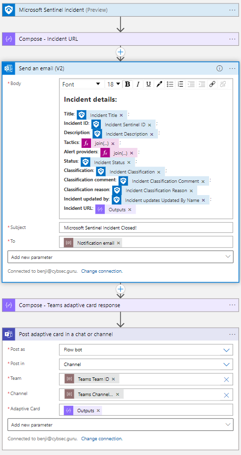

# Notify-IncidentClosed
author: Benjamin Kovacevic

This playbook is utilizing new update trigger to notify person/group on Microsoft Teams/Outlook when incident is closed.

# Prerequisites

1. Email address to where notification will be sent to.
2. Microsoft Teams Team ID and Channel ID (Instructions to get IDs - https://www.linkedin.com/pulse/3-ways-locate-microsoft-team-id-christopher-barber-/) or choose Team and Channel after the deployment

# Quick Deployment

  

# Post-deployment
1. Authorize Microsoft Teams and Microsoft Office 365 Outlook connectors
2. Choose Microsoft Teams Team and Channel where to send the adaptive card (only if Team ID and Channel ID were not added during the deployment)
3. Add playbook as an action to the automation rule 
- Trigger = When incident is updated;  
- Condition = Staus > Changed To > Closed;. 
**Automation rule example** 

4. If you want to receive notifications only on Microsoft Teams or only on Microsoft Office 365 Outlook, please remove unneeded connection. To remove, click on 3 dots on top right side of connector, and choose "Delete".  
**Delete connection example** 

# Screenshots

**Playbook**  
 
  

**Teams**  
  

**Outlook**  
  