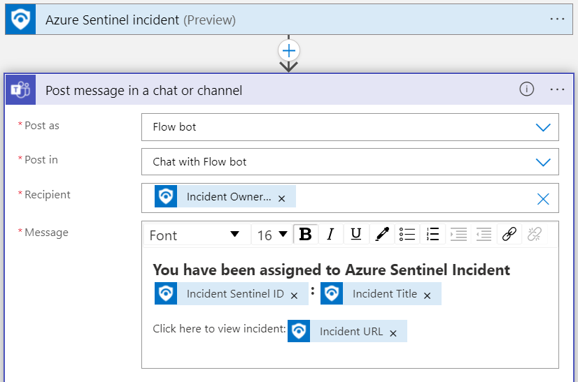
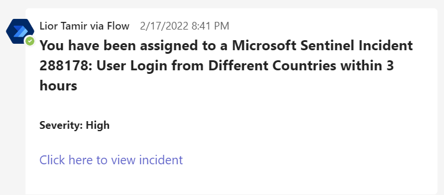

# Notify Incident Owner in Microsoft Teams
author: Lior Tamir

This playbook sends a Teams message to the new incident owner.

# Prerequisites

Microsoft Teams account that allows to send messages.

# Quick Deployment

  

# Post-deployment
Add playbook as an action to the automation rule 
- Trigger = When incident is updated;  
- Condition = Owner changed. 

# Screenshots

**Playbook**  
 

**Teams message**  
  
