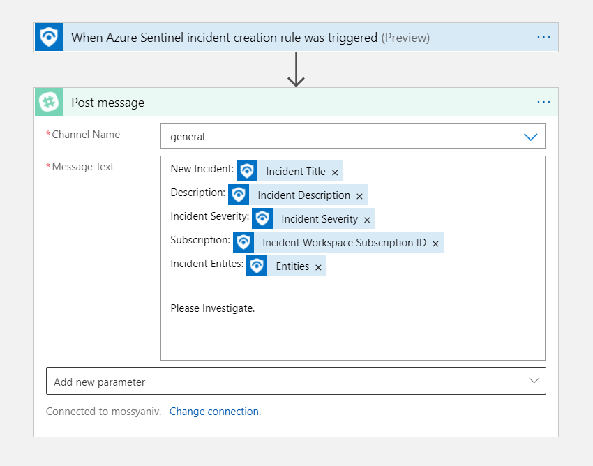
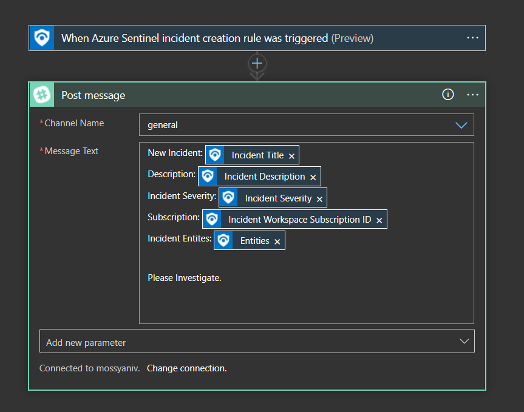

# Post-Message-Slack

Author: Yaniv Shasha

## Summary
This playbook will post a message in a Slack channel when an alert or incident is created in Microsoft Sentinel.

## Prerequisites
- A Slack account and user credentials with permission to post to the target channel.

## Deployment Instructions

### Deploy with Incident Trigger (Recommended)
After deployment, attach this playbook to an **automation rule** so it runs when the incident is created.

[Learn more about automation rules](https://docs.microsoft.com/azure/sentinel/automate-incident-handling-with-automation-rules#creating-and-managing-automation-rules)

### Deploy with Alert Trigger
After deployment, you can run this playbook manually on an alert or attach it to an **analytics rule** so it will run when an alert is created.

## Post-deployment Instructions

1. Open the Logic App in the Azure portal.
2. Click the Slack connector resource.
3. Click Edit API connection.
4. Click Authorize and sign in with your Slack account.
5. Click Save.
6. Repeat for other connections if needed.

> Note: The message will be sent from the user who creates the connection.

## Screenshots

**Incident Trigger** 

**Alert Trigger** 

**Slack** 
