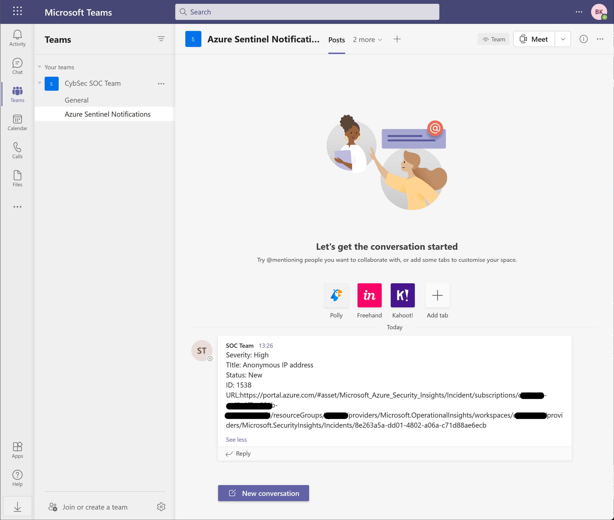

# Post-Message-Teams (Incident Trigger)

author: Yaniv Shasha

## Summary
This playbook posts a message in a Microsoft Teams channel when an incident is created in Microsoft Sentinel. The message includes key incident details such as severity, title, status, ID, and URL.

## Prerequisites
- A Microsoft Teams account with permission to post messages to the target channel.
- Teams Group ID and Channel ID (can be found in the Teams web URL).

## Deployment instructions

1. To deploy the playbook, click the Deploy to Azure button below. This will launch the ARM Template deployment wizard.
2. Fill in the required parameters:
    - Playbook Name
    - Teams Group ID
    - Teams Channel ID

  

## Post-deployment Instructions

### a. Authorize connections
Once deployment is complete, authorize each connection.

1. Open the Logic App in the Azure portal.
2. Click the Teams connector resource.
3. Click Edit API connection.
4. Click Authorize.
5. Sign in.
6. Click Save.
7. Repeat steps for other connections as needed.

> Note: The message will be sent from the user who creates the connection.

### b. Attach the playbook
1. In Microsoft Sentinel, configure an automation rule to trigger this playbook when an incident is created.
   - [Learn more about automation rules](https://docs.microsoft.com/azure/sentinel/automate-incident-handling-with-automation-rules#creating-and-managing-automation-rules)
> Note: Enable the playbook if it is disabled before assigning it to the automation rule.

## Screenshots

**Playbook** 

**Teams Message Example** 

