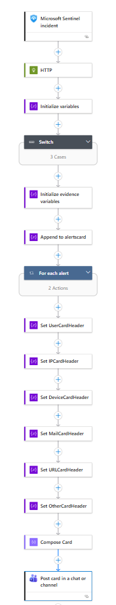
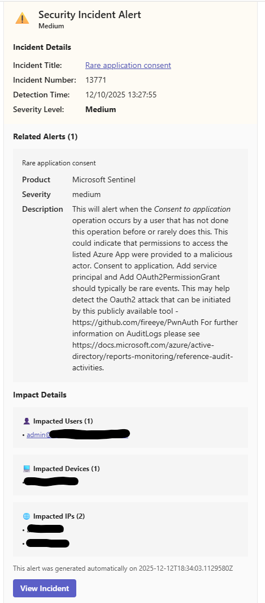

# Send-Incident-Teams-Adaptive-Card-XDRPortal

author: Brian Delaney

## Summary
This playbook sends a Teams adaptive card with an incident report including alert details and entity information. Incident and entity links go to the security.microsoft.com portal.  Sentinel must be connected to the XDR portal for this to work on all incidents.

## Prerequisites
- A Microsoft 365 (M365) account to send Teams cards (the user account will be used in the Microsoft Teams connector for sending emails).
- Sentinel must be connected to the [XDR Portal](https://learn.microsoft.com/en-us/azure/sentinel/move-to-defender)

## Deployment instructions

1. To deploy the playbook, click the Deploy to Azure button below. This will launch the ARM Template deployment wizard.
2. Fill in the required parameters:
    - Playbook Name
    - Microsoft Graph Endpoint (https://graph.microsoft.com)
    - Denfeder Portal Endpoint (https://security.microsoft.com)

[](https://portal.azure.com/#create/Microsoft.Template/uri/https%3A%2F%2Fraw.githubusercontent.com%2FAzure%2FAzure-Sentinel%2Fmaster%2FSolutions%2FSentinelSOARessentials%2FPlaybooks%2FSend-Incident-Teams-Adaptive-Card-XDRPortal%2Fazuredeploy.json)
[](https://portal.azure.us/#create/Microsoft.Template/uri/https%3A%2F%2Fraw.githubusercontent.com%2FAzure%2FAzure-Sentinel%2Fmaster%2FSolutions%2FSentinelSOARessentials%2FPlaybooks%2FSend-Incident-Teams-Adaptive-Card-XDRPortal%2Fazuredeploy.json)
<br><br>

## Post-deployment Instructions

### Authorize connections
Once deployment is complete, authorize the connection.

1. Open the Logic App in the Azure portal.
2. Click Connections
3. Expand *Microsoft Teams*
4. Click the link to Open Connection, or reassign a new one
5. Sign in with the account to be used for sending email
6. Click Save.

### Select a Team & Channel
1. With the Logic App open in the Azure portal locate the 'Post card in a chat or channel' step and click it
2. Select the appropriate team in the *Team* drop down menu
3. Select the appropriate channel in the *Channel* drop down menu
4. Click Save

> Note: If you do not see the desired Team/Channel, ensure that the user that made the connection is a member of the team and has access to the channel.

### Grant Permissions
1. Locate and note the Logic App managed identity id (Logic App -> Settings -> Identity)
2. Locate a note the Entra ID Tenant ID (Entra ID -> Tenant ID)
3. Update the PowerShell Script below with the IDs from above
4. Run the PowerShell script to grant API Permissions. This can be run locally or from Cloud Shell

```powershell
$MIGuid = "<LogicAppManagedIdentityId>"
$TenantId = "<TenantId>"

Connect-MgGraph -TenantId $TenantId -Scopes AppRoleAssignment.ReadWrite.All, Application.Read.All -NoWelcome -ErrorAction Stop
$MSI = Get-MgServicePrincipal -ServicePrincipalId $MIGuid
$AppId = "00000003-0000-0000-c000-000000000000"
$permissions = @("SecurityAlert.Read.All", "SecurityIncident.Read.All")
$GraphServicePrincipal = Get-MgServicePrincipal -Filter "appId eq '$AppId'"

foreach ($PermissionName in $permissions) {
    $AppRole = $GraphServicePrincipal.AppRoles | Where-Object {$_.Value -eq $PermissionName -and $_.AllowedMemberTypes -contains "Application"}
    New-MgServicePrincipalAppRoleAssignment -ServicePrincipalId $MSI.Id -PrincipalId $MSI.Id -ResourceId $GraphServicePrincipal.Id -AppRoleId $AppRole.Id
}

Write-Host "Assigned permissions to Managed Identity Service Principal."

```

### Attach the playbook
1. In Microsoft Sentinel, configure an automation rule to trigger this playbook when an incident is created.
   - [Learn more about automation rules](https://docs.microsoft.com/azure/sentinel/automate-incident-handling-with-automation-rules#creating-and-managing-automation-rules)

## Screenshots

**Playbook**<br>


**Email**<br>

