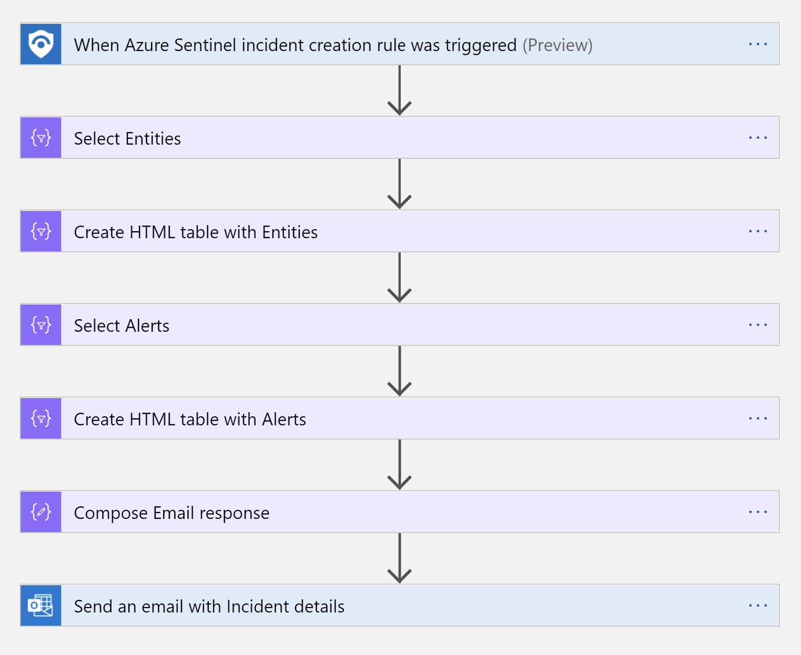
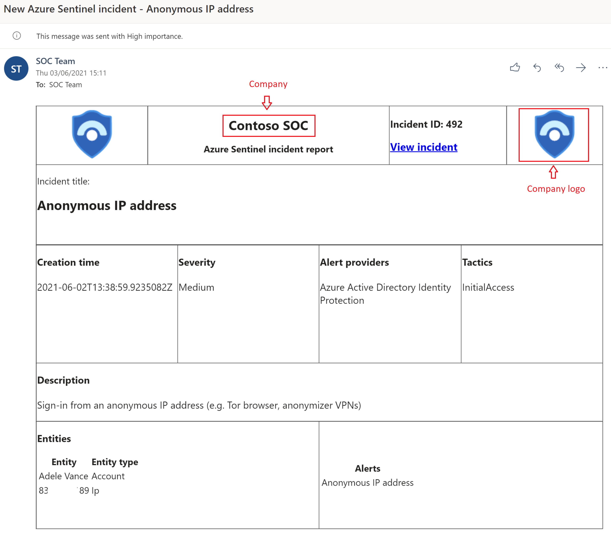
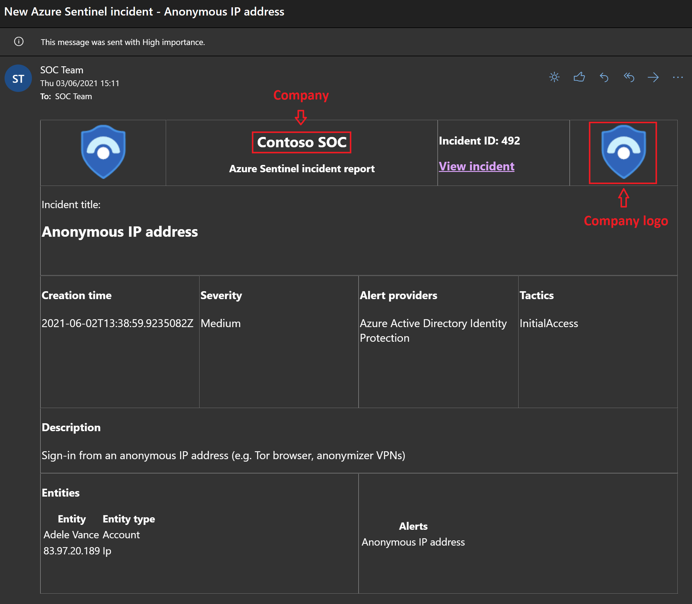

# Send-email-with-formatted-incident-report

author: Benjamin Kovacevic

## Summary
This playbook sends an email with a formatted incident report (including incident title, severity, tactics, link, and more) in HTML format when an incident is created in Microsoft Sentinel.

## Prerequisites
- A Microsoft 365 (M365) account to send email notifications (the user account will be used in the O365 connector for sending emails).
- A link to your company logo (no formatting needed, as size is defined in the playbook). Example: https://azure.microsoft.com/svghandler/azure-sentinel

## Deployment instructions

1. To deploy the playbook, click the Deploy to Azure button below. This will launch the ARM Template deployment wizard.
2. Fill in the required parameters:
    - Playbook Name
    - M365 Email Address
    - Company Logo URL (if available)
    - Company Name

  

## Post-deployment Instructions

### a. Authorize connections
Once deployment is complete, authorize each connection.

1. Open the Logic App in the Azure portal.
2. Click the O365 connector resource.
3. Click Edit API connection.
4. Click Authorize.
5. Sign in.
6. Click Save.
7. Repeat steps for other connections as needed.

> Note: The email will be sent from the user who creates the connection.

### b. Attach the playbook
1. In Microsoft Sentinel, configure an automation rule to trigger this playbook when an incident is created.
   - [Learn more about automation rules](https://docs.microsoft.com/azure/sentinel/automate-incident-handling-with-automation-rules#creating-and-managing-automation-rules)
2. Enable the playbook if it is disabled by default before assigning it to the automation rule.

## Screenshots

**Playbook** 

**Email** 

