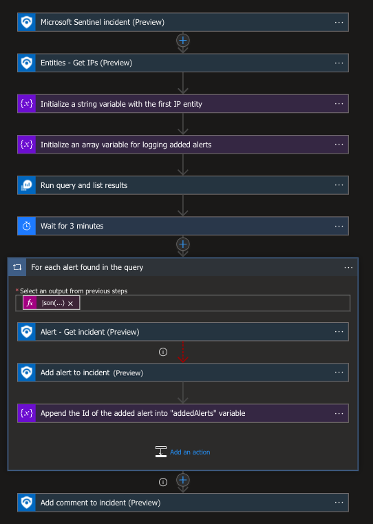
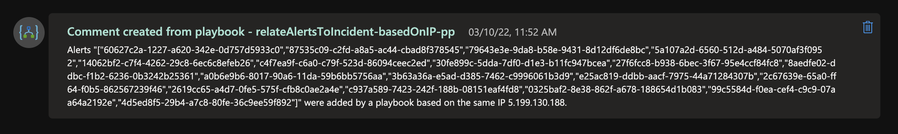
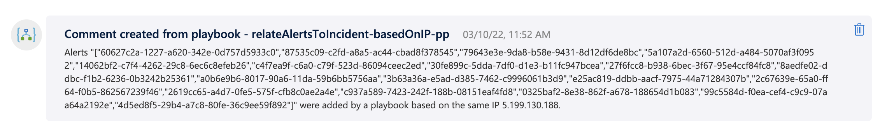

# relateAlertsToIncident-basedOnIP

## Summary
This playbook identifies other alerts sharing the same IP address as the triggered Microsoft Sentinel incident. It adds each alert to the incident if it is not already related to another incident, helping to consolidate related security events for more effective investigation.

### Prerequisites
1. Microsoft Sentinel Workspace Name.

### Deployment instructions

1. To deploy the Playbook, click the Deploy to Azure button. This will launch the ARM Template deployment wizard.
2. Fill in the required parameters:
    * Playbook Name
    * Sentinel Workspace Name

  

### Post-Deployment Instructions

#### a. Authorize connections

Once deployment is complete, authorize each connection.

1. Click the Microsoft Sentinel connection resource
2. Click edit API connection
3. Click Authorize
4. Sign in
5. Click Save
6. Repeat steps for other connections

#### b. Configure Playbook in Microsoft Sentinel
1. In Microsoft sentinel, analytical rules should be configured to trigger an incident that contains IP Addresses or Hostnames. In the *Entity mapping* section of the analytics rule creation workflow, IP Address should be mapped to **Address** identifier of the **IP** entity type. Check the [documentation](https://docs.microsoft.com/azure/sentinel/map-data-fields-to-entities) to learn more about mapping entities.
2. Configure the automation rules to trigger the playbook. Add the playbook as an action to an automation rule. 
   - Trigger: When incident is created
   - Condition: (as needed for your use case)

    Check the [documentation](https://docs.microsoft.com/azure/sentinel/tutorial-respond-threats-playbook) to learn more about automation rules.

#### c. Assign Playbook Microsoft Sentinel Responder Role
1. Select the Playbook (Logic App) resource
2. Click on Identity Blade
3. Choose System assigned tab
4. Click on Azure role assignments
5. Click on Add role assignments
6. Select Scope - Resource group
7. Select Subscription - where Playbook has been created
8. Select Resource group - where Playbook has been created
9. Select Role - Microsoft Sentinel Responder
10. Click Save (It takes 3-5 minutes to show the added role.)

## Screenshots

**Incident Trigger** 

**Comment notification** 
  

