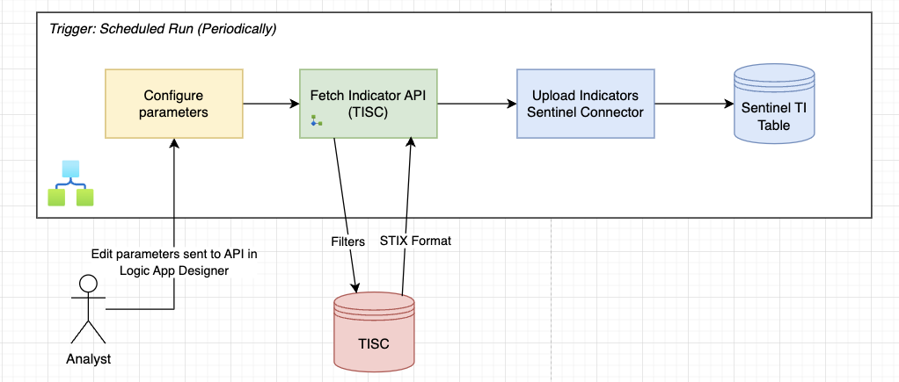
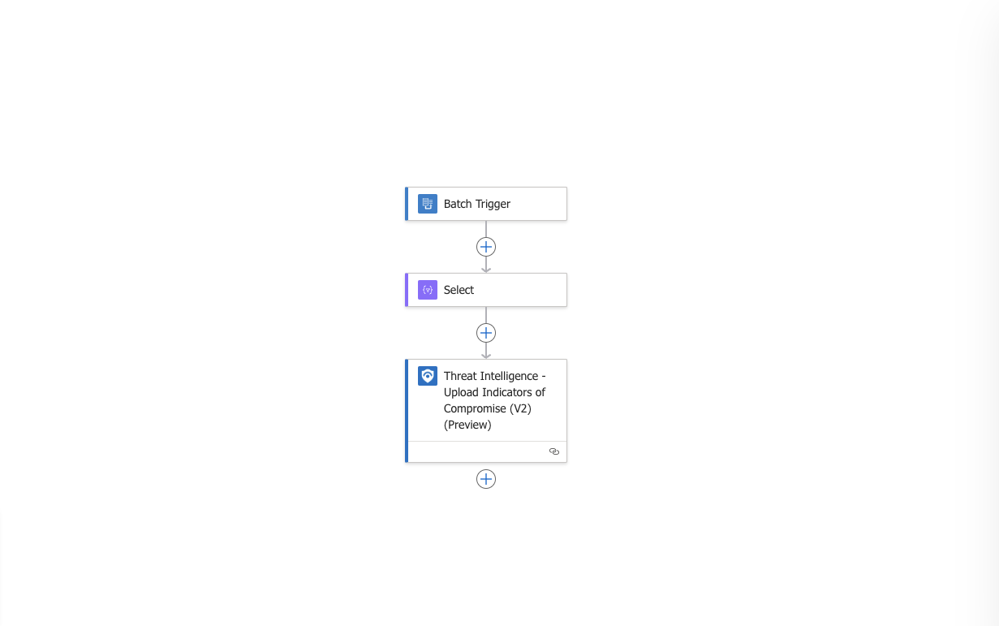
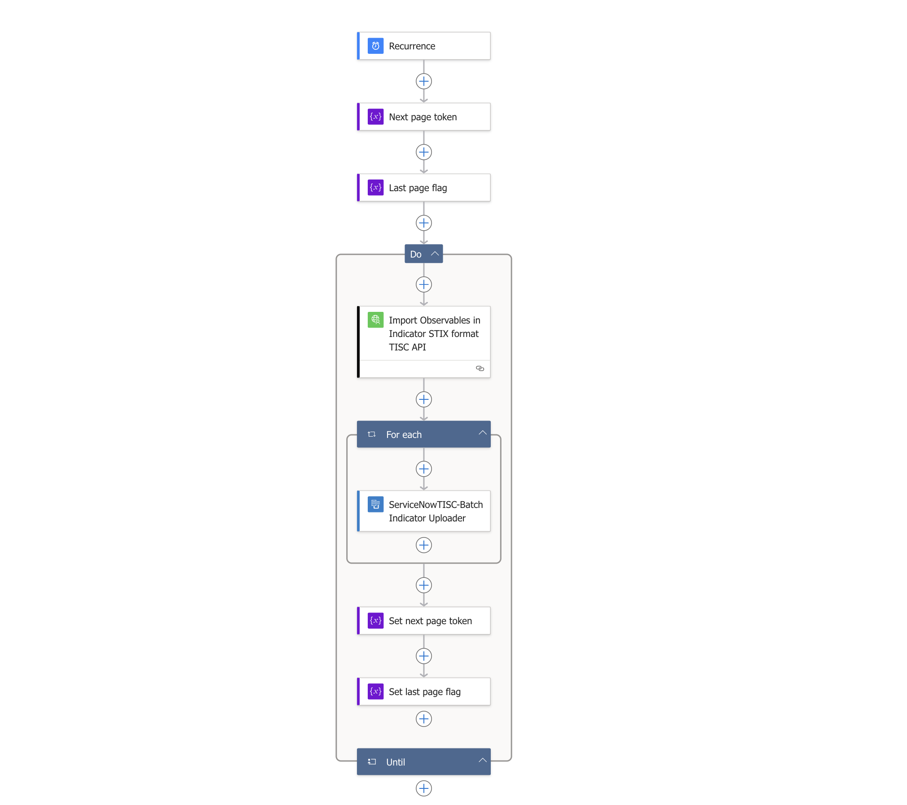
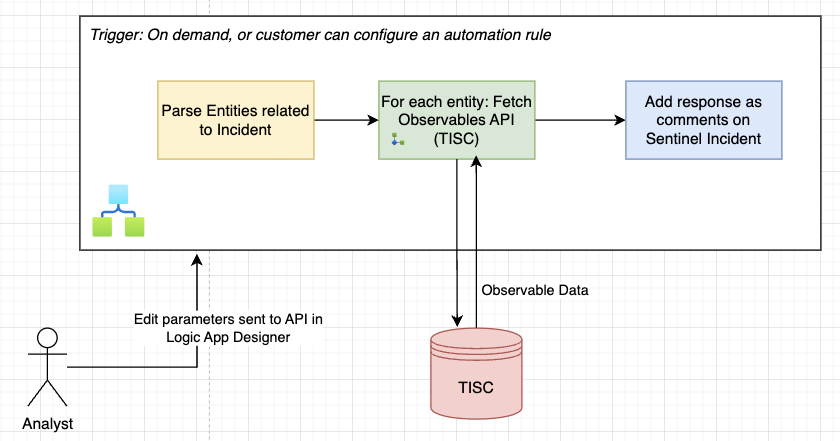
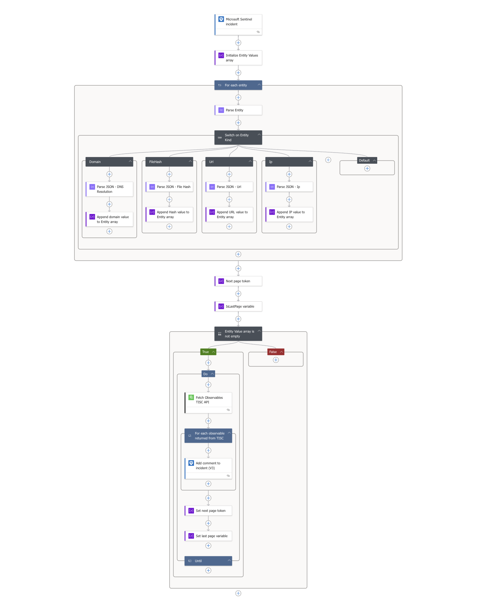
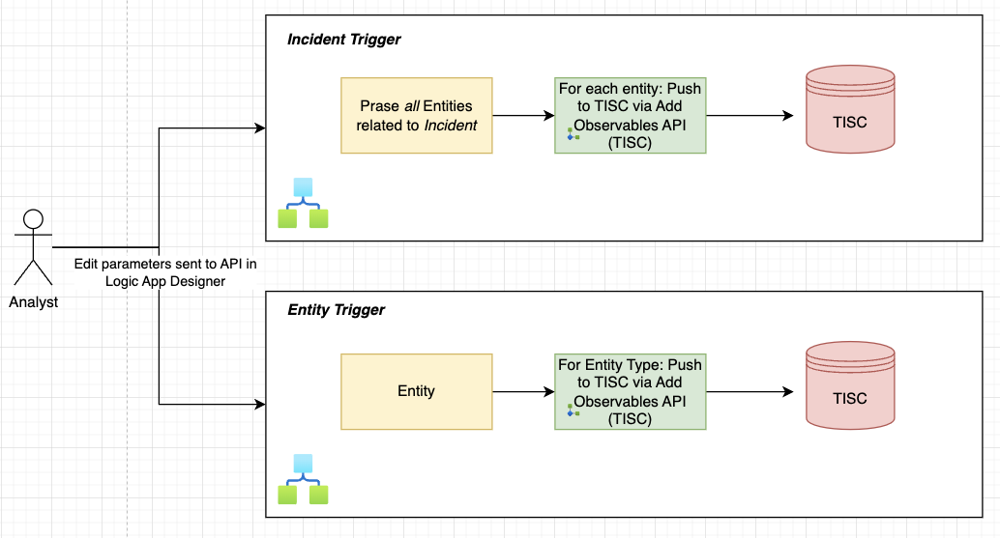
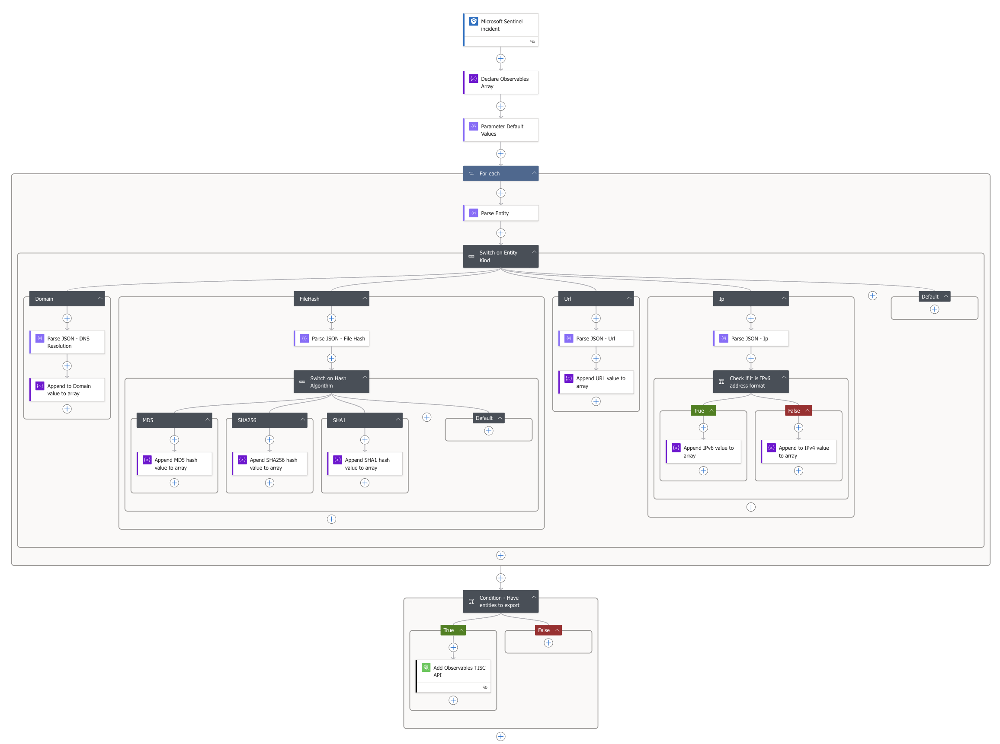

# ServiceNow TISC - Azure Sentinel Solution

## Introduction
 
 ServiceNow's Threat Intelligence Security Center (TISC) is an advanced security intelligence platform, and this solution integrates with Microsoft Sentinel to provide comprehensive threat detection, analysis, and response capabilities. This integration enables organizations to aggregate threat intelligence from multiple sources, automate security workflows, and enhance their overall security posture. The solution facilitates bi-directional data exchange between TISC and Microsoft Sentinel, allowing security teams to seamlessly share threat indicators and observables across both platforms. The integration supports incident enrichment workflows, enabling security analysts to make more informed decisions based on consolidated threat intelligence. Through custom connectors and playbooks, the solution streamlines security operations by automating threat data correlation, reducing manual effort, and accelerating incident response times. 
 
 ServiceNow TISC Azure Sentinel Solution enables a range of capabilities, listed as follows:
 - Import Observables from TISC  to the Sentinel Workspace (into the ThreatIntelligenceIndicator table)
 - Enirchment of Sentinel incidents by fetching all details of entities associated with the incident.
 - Export entities associated to a Sentinel incident to TISC

This solutions provides all the required playbooks, which the customers can deploy into their Sentinel Workspace.

## Prerequisites

### Solution Dependencies
The Threat Intelligence solution from Microsoft Sentinel Content Hub must be installed for indicators to be forwarded to Microsoft Sentinel ThreatIntelligenceIndicator log table.

### Roles and Permissions on Sentinel

Microsoft article that describes roles and permissions in Microsoft Sentinel Roles and permissions in [Microsoft Sentinel](https://learn.microsoft.com/en-us/azure/sentinel/roles)

### ServiceNow TISC API Access
This solution is shipped with a custom connector which connects with TISC APIs for data exchange with Sentinel. The custom connector requires a valid username and password for the ServiceNow instance. And the user that is being used for the custom connector should have the following role:
-  `sn_sec_tisc.api_azure_sentinel_solution`

## Custom Connector for TISC API

When installing the custom connector, make sure to provide valid ServiceNow instance URL in the configuration screen. 

Here are the list of components provided by the logic apps custom connector, which internally calls the TISC API. 

<table>
  <thead>
    <tr>
      <th>Component</th>
      <th>Description</th>
    </tr>
  </thead>
  <tbody>
    <tr>
      <td>
        <strong>Import Observables in Indicator STIX format</strong>
      </td>
      <td>
        Returns list of observables that matches with filtering criteria in format accepted by the <a href="https://learn.microsoft.com/en-us/azure/sentinel/upload-indicators-api">Microsoft Sentinel Upload Indicator connector</a>
      </td>
    </tr>
    <tr>
      <td>
        <strong>Fetch Observables</strong>
      </td>
      <td>
        Returns list of observables that matches with filtering criteria in standard TISC API format. For more details, click <a href="https://www.servicenow.com/docs/bundle/xanadu-api-reference/page/integrate/inbound-rest/concept/tisc-api.html#title_tisc-POST-add-observables">here.</a> 
      </td>
    </tr>
    <tr>
      <td>
        <strong>Add Observables</strong>
      </td>
      <td>
        Create an Observable in TISC. For more details, click <a href="https://www.servicenow.com/docs/bundle/xanadu-api-reference/page/integrate/inbound-rest/concept/tisc-api.html#title_tisc-POST-add-observables">here.</a>
      </td>
    </tr>
  </tbody>
</table>

## Importing Observables from TISC

There are two playbooks which are used to enable the process of importing observables from TISC to `ThreatIntelligenceIndicator` table in Sentinel.

  

#### `ServiceNowTISC-Batch_Indicator_Uploader` playbook
- This playbook provides batching mechanism for [Microsoft Sentinel Upload Indicator connector](https://learn.microsoft.com/en-us/connectors/azuresentinel/#threat-intelligence---upload-indicators-of-compromise-(v2)-(preview)).
- The trigger for this playbook is the batch messages connector, which is activated whenever there are any messages pushed to the batch via `ServiceNowTISC-Import_Observables_Batch` playbook.
- Should be deployed *before* `ServiceNowTISC-Import_Observables_Batch` playbook is deployed.

  

#### `ServiceNowTISC-Import_Observables_Batch` playbook
- This playbook fetches observables from TISC at regular intervals (as configured in the recurrence trigger) with the filters that are configured in the TISC custom connector component of this playbook.
- Should be deployed *after* `ServiceNowTISC-Batch_Indicator_Uploader` playbook is deployed.

  

## Enrichment of Sentinel Incident

Here is the basic flow explaining how enirchment of Sentinel incidents is achieved.

  

The `ServiceNowTISC-IncidentEnrichment` playbook enables the enrichment of Sentinel Incident by fetching essential details related to the entities associated with the incident and posting the information in form of comments on the incident.

This playbook can be triggered as an on-demand action on the Incident in Sentinel Workspace (Incident actions > Run playbook) or, the user can configure an automation rule accordingly.

  

## Export Entities from Sentinel to TISC

Here is the basic flow explaining how entities associated to a Sentinel incident can be exported to TISC.

  

There are two options when it comes to exporting entities of a Sentinel Incident:
- Export all entities of an Incident:
  - The `ServiceNowTISC-Export_Incident_Entities` playbook is the one which performs this operation. This can be accessed as an on-demand action on the incident (Incident actions > Run playbook)

  

- Export individual entities:
  - There are dedicated playbooks for each type of entity as follows:
    - `ServiceNowTISC-Export_Hash_Entity` - Export File hash entities
    - `ServiceNowTISC-Export_Domain_Entity` - Export Domain entities
    - `ServiceNowTISC-Export_IP_Entity` - Export IP entities
    - `ServiceNowTISC-Export_URL_Entity` - Export URL entities

The user can edit the parameters that are sent to API by nagivating to the respective Logic App Designer for the playbook.