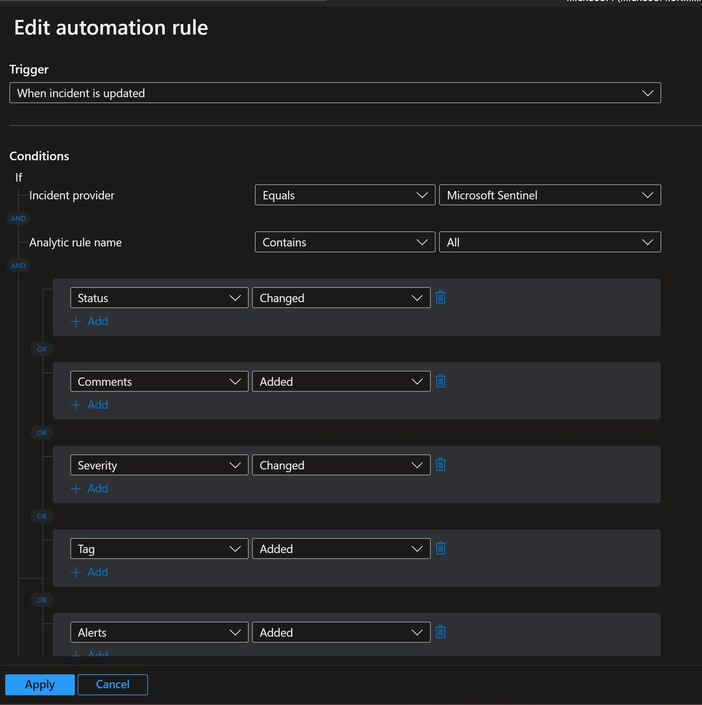
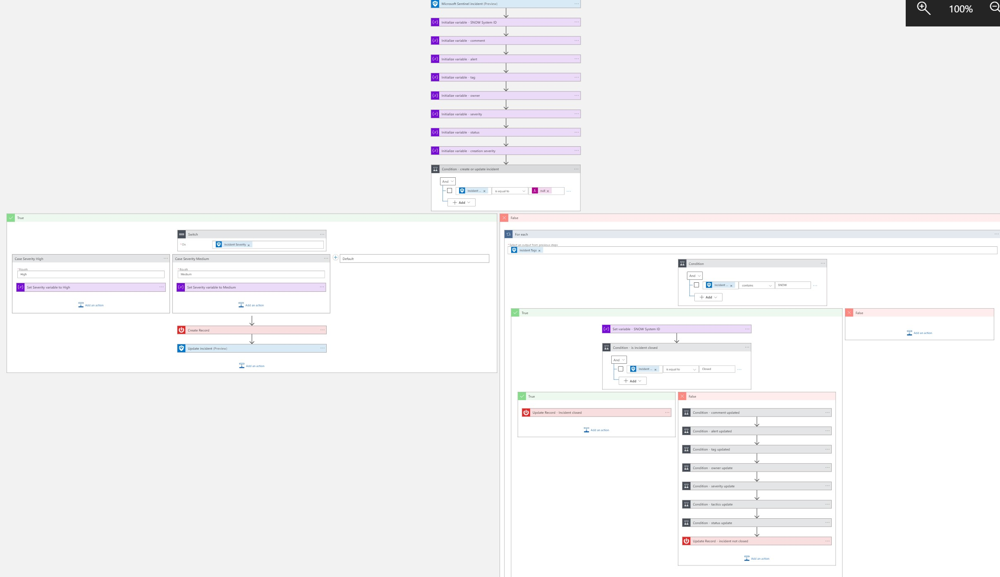
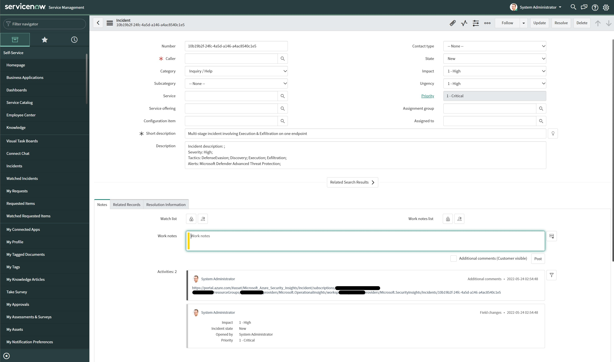
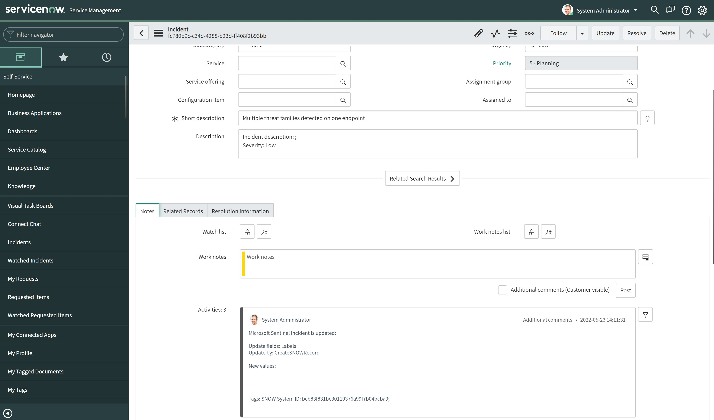
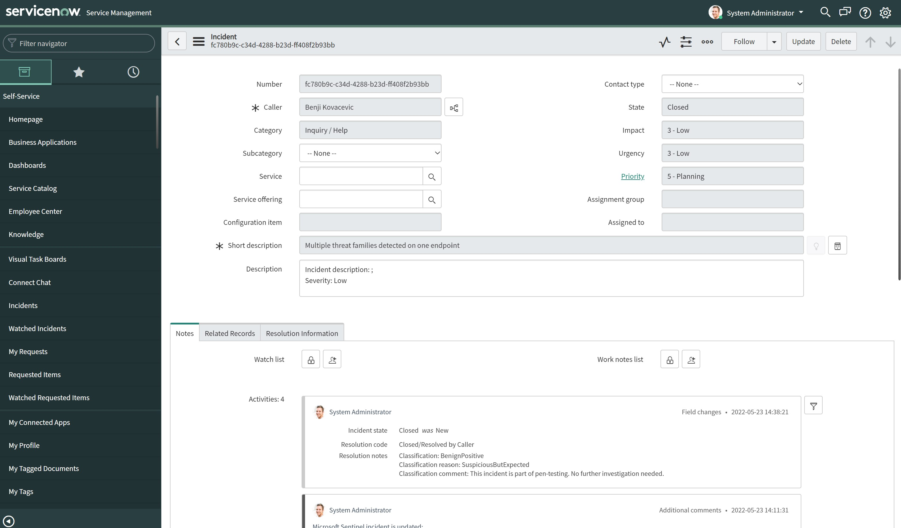

# SNOW-CreateAndUpdateIncident
author: Benjamin Kovacevic

This playbook will create or update incident in ServiceNow (SNOW). When incident is created, playbook will run and create incident in SNOW. When incident is updated, playbook will run and add update to comment section. When incident is closed, playbook will run and close incident in SNOW.

# Prerequisites

We will need following data to make Jira connector: 
1. SNOW instance (ex. xyz.service-now.com)
2. Username
3. Password
 

# Quick Deployment

  

# Post-deployment
1. Authorize SNOW connector
2. Assign Microsoft Sentinel Responder role to playbook's managed identity. To do so, choose Identity blade under Settings of the Logic App.
3. Add playbook as an action to the automation rule, ex.:
- Trigger = When incident is updated;  
- Condition = Staus > Changed To > Closed;. 
**Automation Rule Example** 

**Automation Rule Condition Example** 

# Screenshots

**Playbook**  
 
  

**SNOW New Incident**  
  

**SNOW Update Incident**  
 

**SNOW Incident closed**  
  