# Microsoft Sentinel - ServiceNow integration

## Introduction

This integration is a [ServiceNow application](https://store.servicenow.com/sn_appstore_store.do#!/store/application/407209291b05f850d7644377cc4bcbbc) providing bi-directional synchronization of incidents, between both platforms. It has the following capabilities:

- Incident creation (Microsoft Sentinel to ServiceNow only)
- Incident alerts synchronization
- Incident entities synchronization
- Incident comments synchronization
- Incident status synchronization
- Incident severity synchronization
- Incident owner assignment synchronization
- Incident custom properties support (requires custom code)

 

## Prerequisites

This ServiceNow application fully rely on the Microsoft Sentinel Management API to provide bi-directional sync between both platforms.

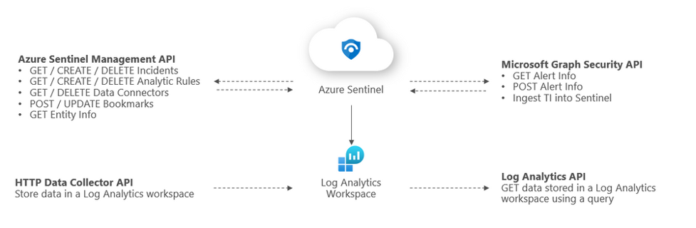

To provide access to our application, we have to create a Service Principal in Azure Active Directory, and assign to it the required permissions.

 

### **Azure**: Create the Service Principal

1. Go to the Azure portal, in Azure AD service, App Registrations:

   [Registered Apps page](https://portal.azure.com/#blade/Microsoft_AAD_IAM/ActiveDirectoryMenuBlade/RegisteredApps)

1. Click on “New registration”

   

1. Provide a name for the app and click “Register”

   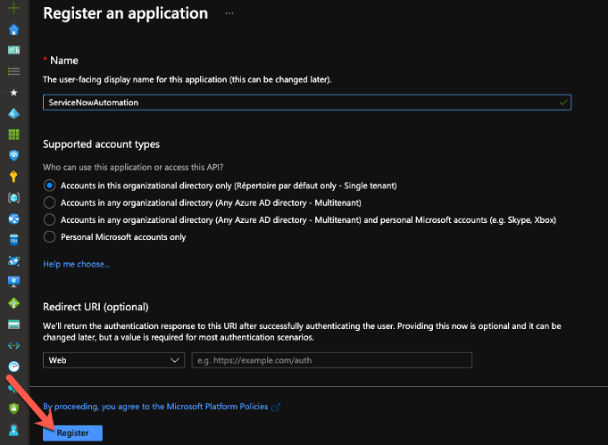

1. Take note of the Application (client) ID and Directory (tenant) ID. We’ll need them during the ServiceNow configuration

   

1. Go to “Certificates & secrets” and click on “New client secret”

   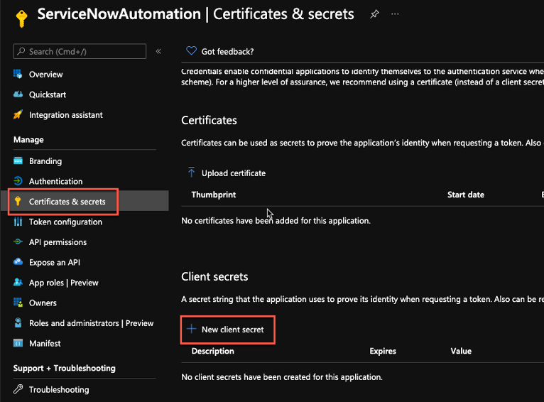

1. Provide a name for the secret and a validity period.  
   **Important**: when the secret will expire, you’ll have to create a new one and update the ServiceNow configuration

   

1. Note the secret and keep it in a safe location for later use

   

 

### **Azure**: Delegate permissions to the Service Principal

1. In the Azure portal, go to the _Resource Group_ containing your Microsoft Sentinel workspace and click on “Access control (IAM)”

   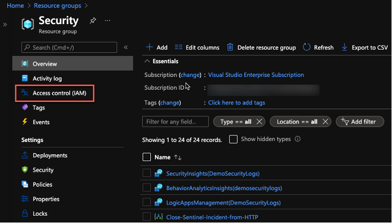

1. Click on “Add role assignments”

   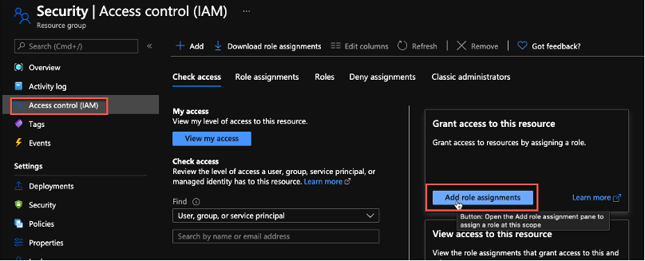

1. In the new blade, select the "_Azure Sentinel Responder_” role, then select the Service Principal we created before, and click on the “Save” button

   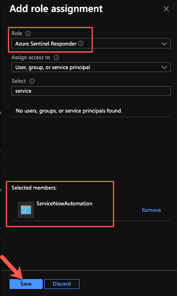

We are now done with the Azure configuration part.

 

### **ServiceNow**: create a user for Microsoft Sentinel

To identify the incidents created from Microsoft Sentinel incidents, we will create a user. This user will be used as the “caller_id” property, when creating new records.

1. In ServiceNow, under “User Administration”, click on “Users”

   

1. Click on the ”New” button

   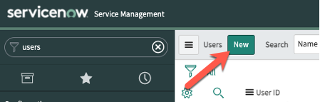

1. Provide the required details, select "**Web service access only**" select and click on “Submit”

   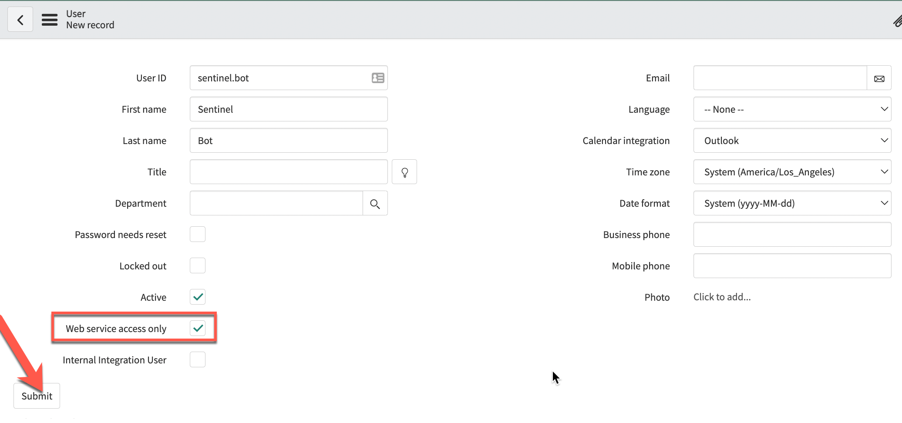

 

## Installation

Install the application in your ServiceNow instance from the ServiceNow store:

1. In the ServiceNow store, search for "Microsoft Sentinel"

   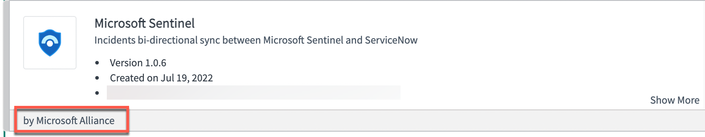

1. Click on the "Get" button and install the app:

   

The application is now imported.

 

## Configure the application

Now that we have installed the application, we must configure the details to connect to the Microsoft Sentinel Management API.  
All configuration steps are accessible through the Microsoft Sentinel menu.

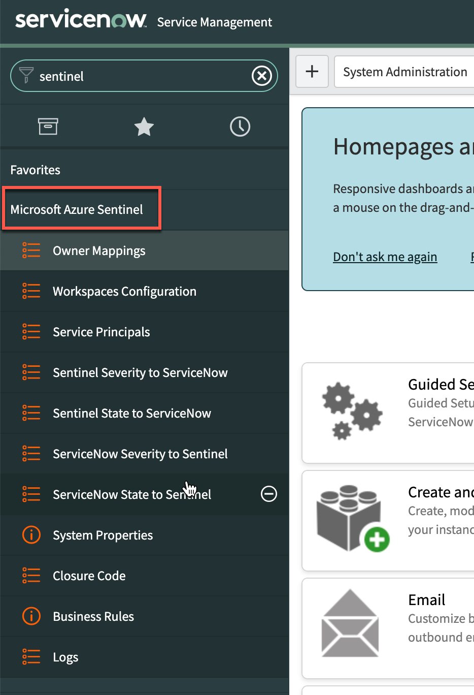

 

### Configure the Microsoft Sentinel workspace(s) details

The “Workspaces Configuration” section table contains the Microsoft Sentinel workspaces configuration.  
You will find in this section a default workspace to configure, or create new configurations to access multiple workspaces.

Open the current row to edit its configuration. You will need the workspace name, its subscription and resource group.

In addition to the workspace values (available in Microsoft Sentinel), provide the _Caller ID_ created before in ServiceNow, review the _OAuth Provider_ (configured at next step) and click on the **Update** button. The incidents synchronization will not start until you enable the workspace:

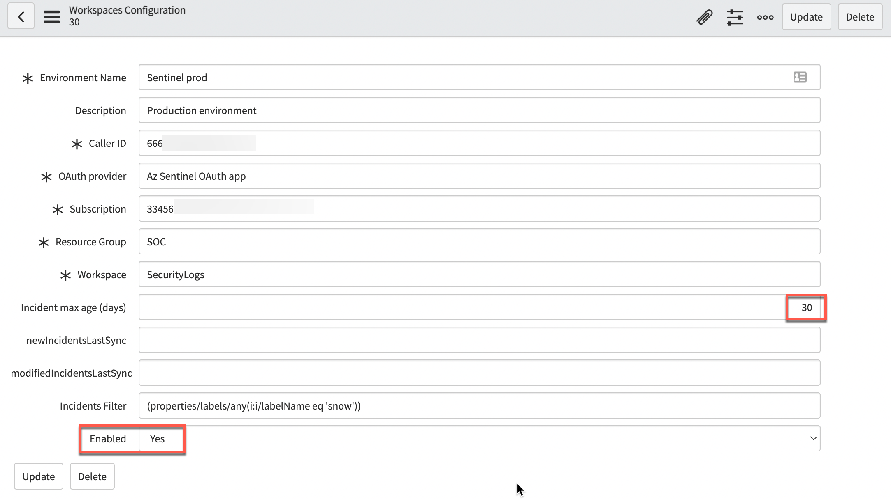

**Note**: In addition to the workspace configuration, you have the following properties:

- **Incident max age (days)**: maximum incident age, in days, for incidents to be created in ServiceNow, based on the incident's creation time

- **newIncidentsLastSync**: timestamp automatically updated once the app successfully contact the Sentinel API to retrieve the new incidents since last update. If needed, you can manually change the value to query incidents older than your specified date

- **modifiedIncidentsLastSync**: timestamp automatically updated once the app successfully contact the Sentinel API to retrieve the updated incidents since last update

- **Incidents filter**: filter used to retrieve only the matching incidents from Sentinel API. By default, it filters the incidents with a tag “snow”. To get all incidents, just delete the content of this field. You can also use another tag name. Please note that the value is case sensitive!

- **Enabled**: boolean value to specify if the workspace is enabled or not. When disabled, the incidents are not retrieved and the timestamps are not updated

 

### Configure the Service Principals/OAuth Provider credentials

To call the Microsoft Sentinel Management API from ServiceNow, we must configure the credentials we created previously in Azure AD. This is done using an “Application Registry”.By default, we’ll use “Az Sentinel OAuth app” but you can use any name you want, as long as it matches the name provided in the workspace configuration.

1. On the credentials configuration page, we must provide the information we collected during the Service Principal creation:

   - Name: Az Sentinel OAuth app (can be different. This is the default name used by the workspace configuration)
   - Client ID (1): Azure AD application/client ID
   - Client secret (2): Azure AD client secret
   - Default Grant type: Client Credentials
   - Token URL (3): add your Azure AD tenant ID in the URL:
     https://login.microsoftonline.com/{AAD_tenant_id}/oauth2/token
   - Token Revocation URL (4): add your ServiceNow instance name in the URL:
     https://{instance_name}.service-now.com/oauth_redirect.do

     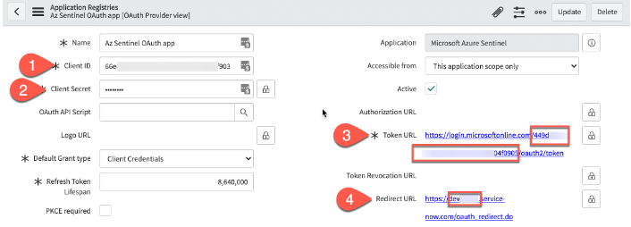

1. Click on the “Submit” button to save your changes

   

 

### Verify the “Sentinel Severity to ServiceNow” table mapping

This table is used to map the Sentinel severity to the ServiceNow value, when creating or updating AzureSentinel incidents.  
Note that in our case, because Sentinel has four different severities values, while we have only three in ServiceNow, both _“Informational”_ and _“Low”_ have been assigned the value **3**:

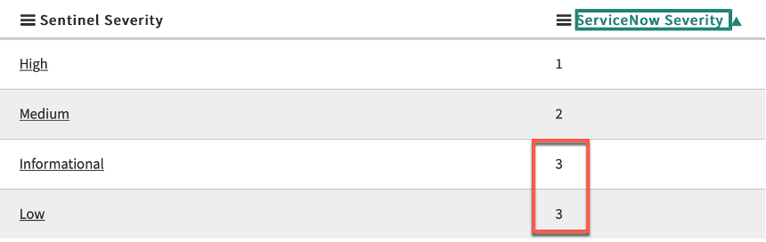

You can view your environment's values using the following technique:

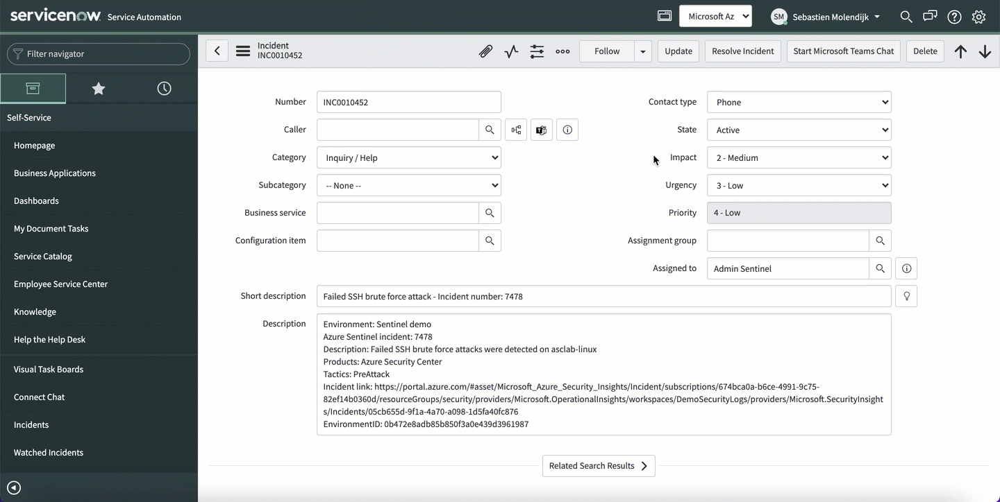

 

### Verify the “Sentinel State to ServiceNow” table mapping

This table is used to map the Sentinel state/status to the ServiceNow value, when creating or updating Microsoft Sentinel incidents.  
Note that Sentinel has probably less states than ServiceNow, so you must select the initial ServiceNow value used by the application.

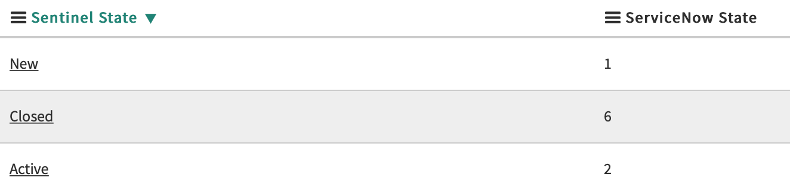

You can view your environment's values using the following technique:

 

### Verify the “ServiceNow Severity to Sentinel” table mapping

This table is used to map the ServiceNow severity to the Sentinel value, when updating ServiceNow incidents and synchronising the changes to Sentinel.  
Review the values to validate that they map your environment's configuration.

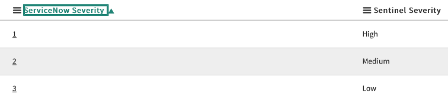

 

### Verify the “ServiceNow State to Sentinel” table mapping

This table is used to map the ServiceNow state to the Sentinel value, when updating ServiceNow incidents and synchronising the changes to Sentinel.  
Review the values to validate that they map your environment's configuration. Note that because Sentinel has less states than ServiceNow, you will have multiple ServiceNow state mapped to the same Sentinel state.

 

## Review and validate the system properties

In addition to the configuration stored in the tables, the app keeps some information in system properties.  
Review the default values and change it to match your environment.

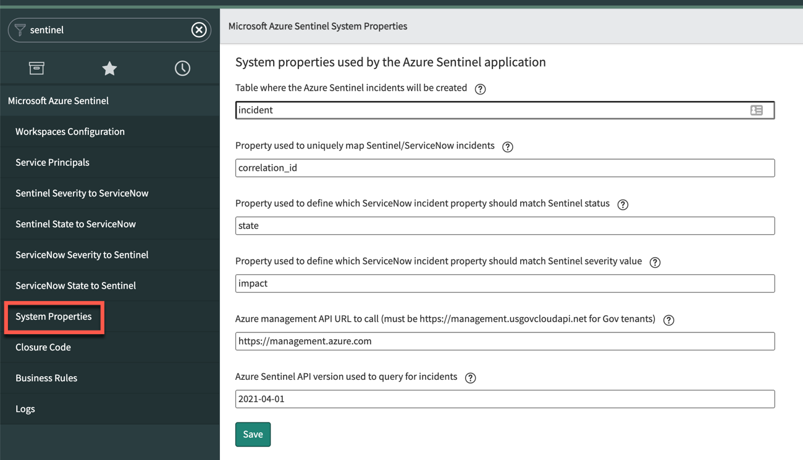

The available properties are:

- **apiUrl**: URL to the Microsoft Sentinel API. If your workspace is in Gov Cloud, you must change it to "_https://management.usgovcloudapi.net_"

- **apiVersion**: Microsoft Sentinel API version (should not be changed, unless new version is available)

- **incidentTableName**: table where the incident are created. The default value is "_incident_", but you can specify any table where you want to create your incidents

- **incidentUniqueKey**: ServiceNow incident property used to uniquely map incidents between Sentinel and ServiceNow. By default, the app uses “_correlation_id_”. If you are already using this property, you should specify or create another one

- **severityField**: incident property to store the incident severity. By default, the app uses _“impact”_. Verify what is used in your environment.

- **statusField**: incident property to store the incident state. By default, the app uses “_state”_. Verify what is used in your environment

 

### Verify the “Closure classification” table entries

This table is used to map Sentinel and ServiceNow closure codes and should match the closure codes you are using when closing your incidents.  
To verify the values, open the "Closure code" section in the Microsoft Sentinel menu.

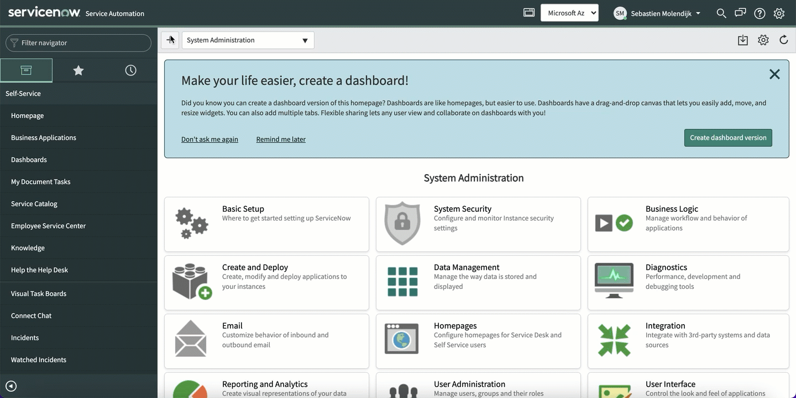

You should update the provided values with your environment ones (the _label_ column is used to describe the value, while the _ServiceNowCode_ column is used to match the system resolution code). You can find your closure code by looking at the "Resolution code" values in your incidents:

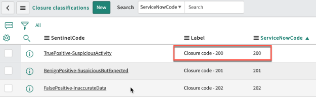

**IMPORTANT**: in this table, the last column, “_SourceIsSentinel_” contains Boolean values to define which values should be used in ServiceNow when a close status has been set in Sentinel incidents.  
You should have only one “true” row per Sentinel possible status:

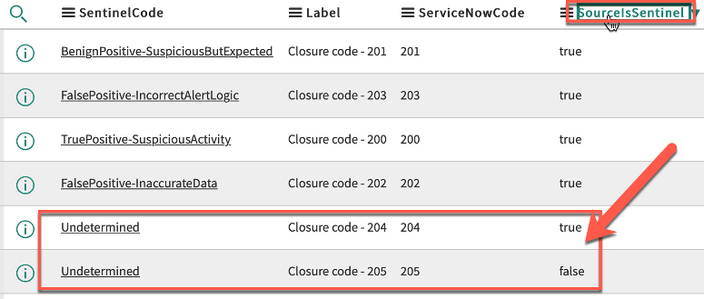

 

### Owner mapping

This table allows custom mapping between the owner's username (userprincipal property) in Azure AD and Microsoft Sentinel, and ServiceNow incidents.
To create such mapping, follow the steps below:

1. Click on the "New" button to create a new mapping

   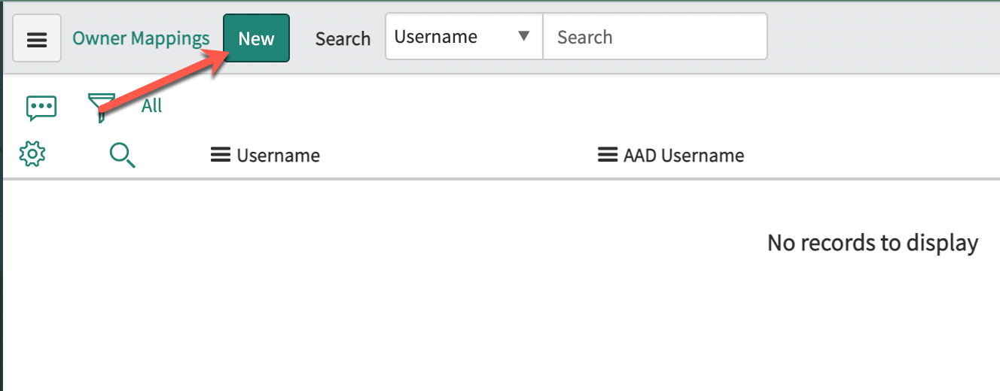

1. Provide the ServiceNow username, Azure AD UPN and optionally the Sentinel workspace and click on the "Submit" button

   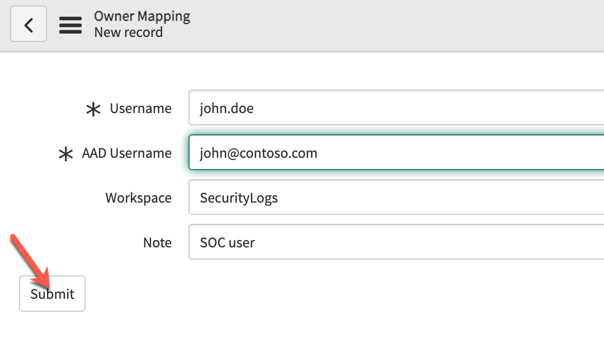

 

### Additional configuration

If you configured another incident table to store your Sentinel incidents, you must reflect this change to the two business rules being triggered by changes. You can also add additional filters if needed.

⚠️ **IMPPORTANT** ⚠️  
If you are running versions older than _Rome_, verify that the "When to run" value is using **async** and not **async_alway**:

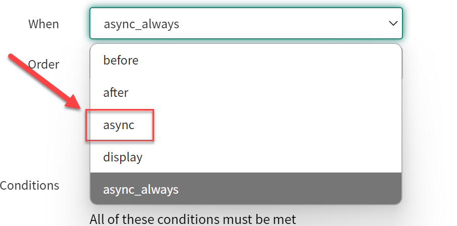

The application uses the following business rules:

- **add_work_note_to_sentinel**: sycnhronizes work notes to sentinel comments

  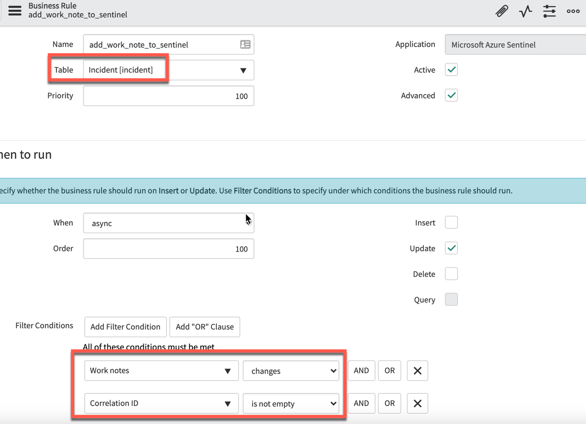

- **update_changes_to_sentinel**: synchronizes severity, status, closure code, owner to Sentinel.  
  If you are using other fields than the default for unique identifier, severity and state, set the correct values in the filters

  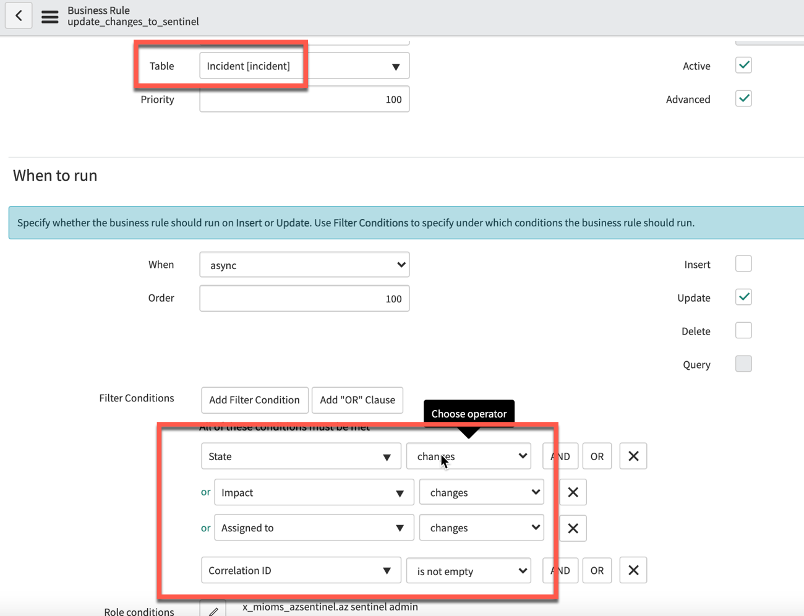

- **custom_mapping**: business rule that can be used to code specific custom mapping during incidents creation or updates. By default, no custom mapping is performed but we provide some examples in the code

  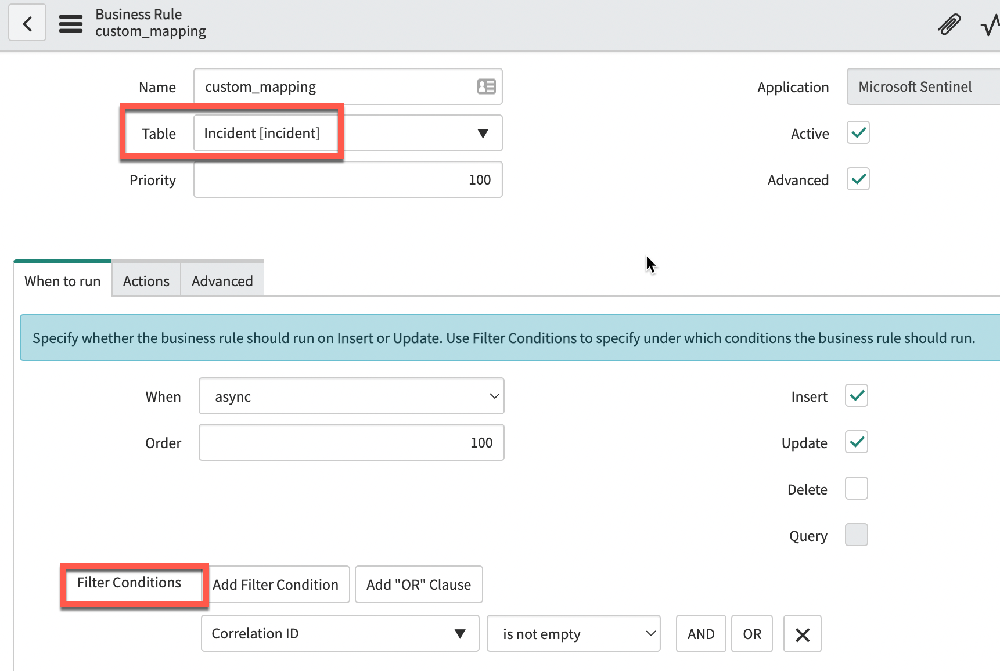
