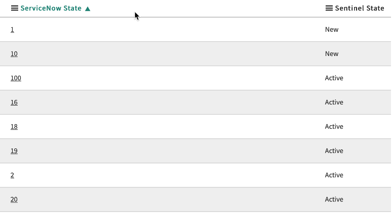
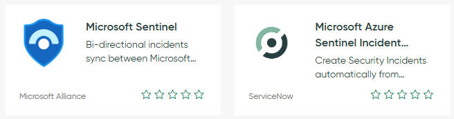
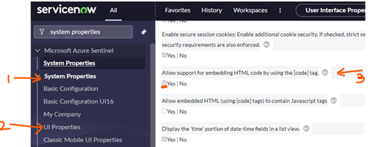
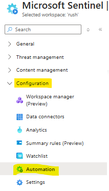
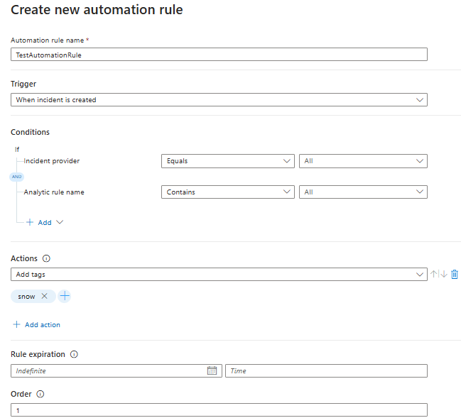
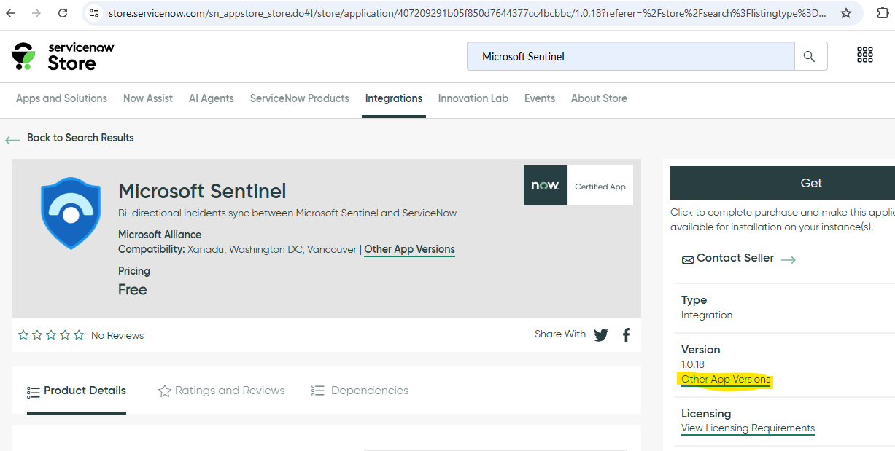
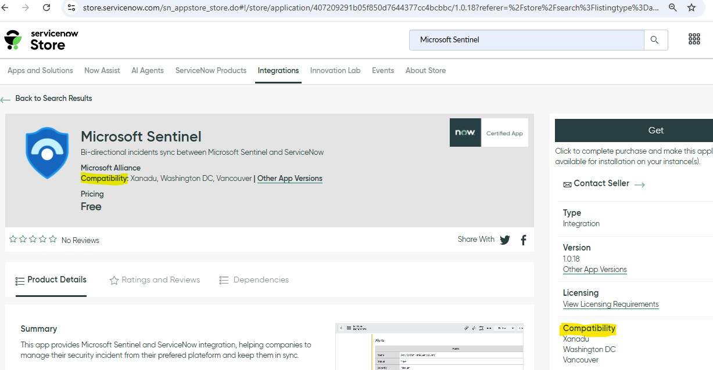
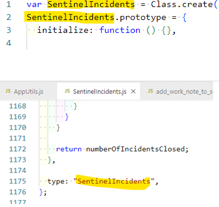
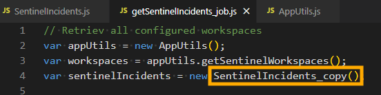
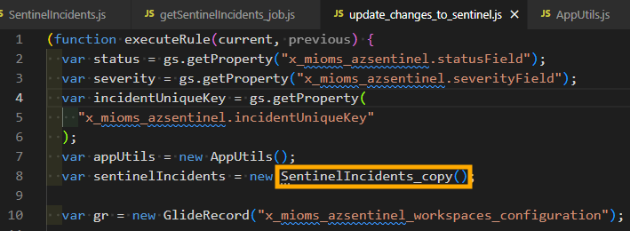

# Microsoft Sentinel - ServiceNow integration

## Introduction

This integration is a [ServiceNow application](https://store.servicenow.com/sn_appstore_store.do#!/store/application/407209291b05f850d7644377cc4bcbbc) providing bi-directional synchronization of incidents, between both platforms. It has the following capabilities:

- Incident creation (Microsoft Sentinel to ServiceNow only)
- Incident alerts synchronization
- Incident entities synchronization
- Incident comments synchronization
- Incident status synchronization
- Incident severity synchronization
- Incident owner assignment synchronization
- Incident custom properties support (requires custom code)

 

**Note:** 
   - Traditional Azure Logic/playbook app integration or the existing solution does not cleanly support bi-directional synchronization. 
   - Bi-directional sync app on ServiceNow store also supports SIR module with some modification on ServiceNow side. Refer Technical FAQ's for more at the bottom of this page.

**Limitations:** 
   - Microsoft Sentinel app works on individual ServiceNow instance and doesn't support domain separation. 

## Prerequisites

This ServiceNow application fully rely on the Microsoft Sentinel Management API to provide bi-directional sync between both platforms.

To provide access to our application, we have to create a Service Principal in Azure Active Directory, and assign to it the required permissions.

 

### **Azure**: Create the Service Principal

1. Go to the Azure portal, in Azure AD service, App Registrations:

   [Registered Apps page](https://portal.azure.com/#blade/Microsoft_AAD_IAM/ActiveDirectoryMenuBlade/RegisteredApps)

1. Click on “New registration”

   

1. Provide a name for the app and click “Register”

   

1. Take note of the Application (client) ID and Directory (tenant) ID. We’ll need them during the ServiceNow configuration

   

1. Go to “Certificates & secrets” and click on “New client secret”

   

1. Provide a name for the secret and a validity period.  
   **Important**: when the secret will expire, you’ll have to create a new one and update the ServiceNow configuration

   

1. Note the secret and keep it in a safe location for later use

   

 

### **Azure**: Delegate permissions to the Service Principal

1. In the Azure portal, go to the _Resource Group_ containing your Microsoft Sentinel workspace and click on “Access control (IAM)”

   

1. Click on “Add role assignments”

   

1. In the new blade, select the "_Microsoft Sentinel Responder_” role, then select the Service Principal we created before, and click on the “Save” button.

We are now done with the Azure configuration part.

 

### **ServiceNow**: create a user for Microsoft Sentinel

To identify the incidents created from Microsoft Sentinel incidents, we will create a user. This user will be used as the “caller_id” property, when creating new records.

1. In ServiceNow, under “User Administration”, click on “Users”

   

1. Click on the ”New” button

   

1. Provide the required details, select "**Web service access only**" select and click on “Submit”

   

 

## Installation

Install the application in your ServiceNow instance from the ServiceNow store:

1. In the ServiceNow store, search for "Microsoft Sentinel"

   

1. Click on the "Get" button and install the app:

   

The application is now imported.

 

## Configure the application

Now that we have installed the application, we must configure the details to connect to the Microsoft Sentinel Management API.  
All configuration steps are accessible through the Microsoft Sentinel menu.

 

### Configure the Microsoft Sentinel workspace(s) details

The “Workspaces Configuration” section table contains the Microsoft Sentinel workspaces configuration.  
You will find in this section a default workspace to configure, or create new configurations to access multiple workspaces.

Open the current row to edit its configuration. You will need the workspace name, its subscription and resource group.

In addition to the workspace values (available in Microsoft Sentinel), provide the _Caller ID_ created before in ServiceNow, review the _OAuth Provider_ (configured at next step) and click on the **Update** button. The incidents synchronization will not start until you enable the workspace:

**Note**: In addition to the workspace configuration, you have the following properties:

- **Incident max age (days)**: maximum incident age, in days, for incidents to be created in ServiceNow, based on the incident's creation time. Default is 30 days. If any of the Sentinel incident created or updated after 30 days of creation then such incidents will not get synced to ServiceNow.

- **newIncidentsLastSync**: timestamp automatically updated once the app successfully contact the Sentinel API to retrieve the new incidents since last update. If needed, you can manually change the value to query incidents older than your specified date

- **modifiedIncidentsLastSync**: timestamp automatically updated once the app successfully contact the Sentinel API to retrieve the updated incidents since last update

- **Incidents filter**: filter used to retrieve only the matching incidents from Sentinel API. By default, it filters the incidents with a tag “snow”. To get all incidents, just delete the content of this field. You can also use another tag name. Please note that the value is case sensitive. When you have multiple instances of "Workspace configurations" in ServiceNow than make sure to have different tag name. Eg: "devsnow" or "testsnow" or "prodsnow" etc.

- **Enabled**: boolean value to specify if the workspace is enabled or not. When disabled, the incidents are not retrieved and the timestamps are not updated.

- **Use workspace name in CorrelationId**: For multiple Sentinel workspaces there can be duplicate incident ids so we have added a new field in ServiceNow workspace configuration page field "Use Workspace name in CorrelationId". By default this field is false. When its enabled then it will check 'Sentinel-<sentinelWorkspaceName>-<guid>' in Servicenow for any update of records. Enable this field only when you have identified duplicate incident issue. Once enabled make sure to update incidents that are in Servicenow to have 'CorrelationId' field value like 'Sentinel-<sentinelWorkspaceName>-<guid>'. Currently old records will be having CorrelationId value as 'Sentinel-<guidValue>' so we are adding workspace name in this field value. Also Sentinel workspace name length should not be more then 50 because CorrelationId field value length is max 100 characters.

 

### Configure the Service Principals/OAuth Provider credentials

To call the Microsoft Sentinel Management API from ServiceNow, we must configure the credentials we created previously in Azure AD. This is done using an “Application Registry”.By default, we’ll use “Az Sentinel OAuth app” but you can use any name you want, as long as it matches the name provided in the workspace configuration.

1. On the credentials configuration page, we must provide the information we collected during the Service Principal creation:

   - Name: Az Sentinel OAuth app (can be different. This is the default name used by the workspace configuration)
   - Client ID (1): Azure AD application/client ID
   - Client secret (2): Azure AD client secret
   - Default Grant type: Client Credentials
   - Token URL (3): add your Azure AD tenant ID in the URL:
     https://login.microsoftonline.com/{AAD_tenant_id}/oauth2/token
   - Token Revocation URL (4): add your ServiceNow instance name in the URL:
     https://{instance_name}.service-now.com/oauth_redirect.do

     

1. Click on the “Submit” button to save your changes

   

 

### Verify the “Sentinel Severity to ServiceNow” table mapping

This table is used to map the Sentinel severity to the ServiceNow value, when creating or updating AzureSentinel incidents.  
Note that in our case, because Sentinel has four different severities values, while we have only three in ServiceNow, both _“Informational”_ and _“Low”_ have been assigned the value **3**:

You can view your environment's values using the following technique:

 

### Verify the “Sentinel State to ServiceNow” table mapping

This table is used to map the Sentinel state/status to the ServiceNow value, when creating or updating Microsoft Sentinel incidents.  
Note that Sentinel has probably less states than ServiceNow, so you must select the initial ServiceNow value used by the application.

You can view your environment's values using the following technique:

 

### Verify the “ServiceNow Severity to Sentinel” table mapping

This table is used to map the ServiceNow severity to the Sentinel value, when updating ServiceNow incidents and synchronizing the changes to Sentinel.  
Review the values to validate that they map your environment's configuration.

 

### Verify the “ServiceNow State to Sentinel” table mapping

This table is used to map the ServiceNow state to the Sentinel value, when updating ServiceNow incidents and synchronizing the changes to Sentinel.  
Review the values to validate that they map your environment's configuration. Note that because Sentinel has less states than ServiceNow, you will have multiple ServiceNow state mapped to the same Sentinel state.

 

## Review and validate the system properties

In addition to the configuration stored in the tables, the app keeps some information in system properties.  
Review the default values and change it to match your environment.

The available properties are:

- **apiUrl**: URL to the Microsoft Sentinel API. If your workspace is in Gov Cloud, you must change it to "_https://management.usgovcloudapi.net_"

- **apiVersion**: Microsoft Sentinel API version (should not be changed, unless new version is available)

- **incidentTableName**: table where the incident are created. The default value is "_incident_", but you can specify any table where you want to create your incidents

- **incidentUniqueKey**: ServiceNow incident property used to uniquely map incidents between Sentinel and ServiceNow. By default, the app uses “_correlation_id_”. If you are already using this property, you should specify or create another one

- **severityField**: incident property to store the incident severity. By default, the app uses _“impact”_. Verify what is used in your environment.

- **statusField**: incident property to store the incident state. By default, the app uses “_state”_. Verify what is used in your environment

 

### Verify the “Closure classification” table entries

This table is used to map Sentinel and ServiceNow closure codes and should match the closure codes you are using when closing your incidents.  
To verify the values, open the "Closure code" section in the Microsoft Sentinel menu.

You should update the provided values with your environment ones (the _label_ column is used to describe the value, while the _ServiceNowCode_ column is used to match the system resolution code). You can find your closure code by looking at the "Resolution code" values in your incidents:

**IMPORTANT**: in this table, the last column, “_SourceIsSentinel_” contains Boolean values to define which values should be used in ServiceNow when a close status has been set in Sentinel incidents.  
You should have only one “true” row per Sentinel possible status:

 

### Owner mapping

This table allows custom mapping between the owner's username (userprincipal property) in Azure AD and Microsoft Sentinel, and ServiceNow incidents.
To create such mapping, follow the steps below:

1. Click on the "New" button to create a new mapping

   

1. Provide the ServiceNow username, Azure AD UPN and optionally the Sentinel workspace and click on the "Submit" button

   

 

### Additional configuration

If you configured another incident table to store your Sentinel incidents, you must reflect this change to the two business rules being triggered by changes. You can also add additional filters if needed.

⚠️ **IMPORTANT** ⚠️  
If you are running versions older than _Rome_, verify that the "When to run" value is using **async** and not **async_alway**:

The application uses the following business rules:

- **add_work_note_to_sentinel**: synchronizes work notes to sentinel comments

  

- **update_changes_to_sentinel**: synchronizes severity, status, closure code, owner to Sentinel.  
  If you are using other fields than the default for unique identifier, severity and state, set the correct values in the filters

  

- **custom_mapping**: business rule that can be used to code specific custom mapping during incidents creation or updates. By default, no custom mapping is performed but we provide some examples in the code

  

### Technical FAQ's:

#### 1. Which app on ServiceNow store is a bi-directional sync app and is owned and managed by Microsoft?

**Answer:** In below screenshot Blue shield icon log app tile is the App on ServiceNow store that is owned and managed by Microsoft. The other tile app is owned and managed by ServiceNow.

   

#### 2. What configurations are needed on "Workspace configuration" page in ServiceNow-->Microsoft Sentinel?
**Answer:** Below are the points that needs to be considered:
   - "Environment Name": Give a meaningful name to distinguish between multiple workspace configurations.
   - "Caller ID": Specify user record "User Id" value example "sentinel.bot" or sys id of the user created in "User Administration". This user record is a integration User for any incidents created from Sentinel to ServiceNow. When a new incident is created in ServiceNow than the "Caller" field on incident record will be set as this user.
   - "Subscription": Specify Microsoft Sentinel subscription Id. Name of the subscription should not be used.
   - "Resource Group": Specify Microsoft Sentinel resource group name.
   - "Workspace": Specify Microsoft Sentinel workspace name.
   - "Incident max age(days)": Default is 30 days which means any Sentinel incident who's created date time falls between 30 days will be eligible for any create or update of incident to ServiceNow. If any of the incident is updated after 30 days will not get updated.
   - "newIncidentsLastSync": When any incident from Sentinel to ServiceNow is created than Sentinel Incident "createdTimeUtc" datetime value will be used. When ServiceNow job runs than the datetime set on this field "newIncidentLastSync" will be used to get new incidents that are created than this datetime field value from Sentinel Rest API.
   - "modifiedIncidentsLastSync": When any incident from Sentinel to ServiceNow is updated than Sentinel Incident "lastModifiedTimeUtc" datetime value will be used. When ServiceNow job runs than the datetime set on this field "newIncidentLastSync" will be used to get updated incidents that are created than this datetime field value from Sentinel Rest API.
   - "Incidents Filter": By-default filter used is "(properties/labels/any(i:i/labelName eq 'snow'))" which will look for any incidents on Sentinel tagged with "snow" tag only. Here tag name is case-sensitive. If you want All of the Sentinel incidents to sync on ServiceNow than keep this field value as blank.
   - "Enabled": When set to "Yes" than a scheduled job file "getSentinelIncidents_job" will get new and modified incidents from Sentinel and sync it to ServiceNow. When set to "No" than there will be no sync of incidents.
   - "Use Workspace Name in CorrelationId": For multiple Sentinel workspaces there can be duplicate incident ids so we have added a new field in ServiceNow workspace configuration page field "Use Workspace name in CorrelationId". By default this field is false. When its enabled then it will check 'Sentinel-<sentinelWorkspaceName>-<guid>' in Servicenow for any update of records. Enable this field only when you have identified duplicate incident issue. Once enabled make sure to update incidents that are in Servicenow to have 'CorrelationId' field value like 'Sentinel-<sentinelWorkspaceName>-<guid>'. You can make use of "Incident max age(days)" field for which ServiceNow incident CorrelationId field value needs to be updated. Currently old records will be having CorrelationId value as 'Sentinel-<guidValue>' so we are adding workspace name in this field value. Also Sentinel workspace name length should not be more then 50 because CorrelationId field value length is max 100 characters.

#### 3. What configurations are needed on "Service Principals" page in ServiceNow-->Microsoft Sentinel?
**Answer:** Below are the points that needs to be considered:
   - "Client Id": Here Client Id is the Sentinel App Registration value. More details on [Create Service Principal In Azure Portal](#azure-create-the-service-principal) section.
   - "Client Secret": Here Client Secret is the Sentinel App Registration value. More details on [Create Service Principal In Azure Portal](#azure-create-the-service-principal) section. After saving Service Principal record make sure that the secret value is correct. It is observed that due to incorrect way of paste value is changed.
   - "Default Grant Type": This should be "Client Credentials".
   - "Application": Scope of the application should be "Microsoft Sentinel".
   - "Accessible from": Use "This application scope only".
   - "Token Url": Default value is "https://login.microsoftonline.com/AAD_tenant_id/oauth2/token". Here replace "AAD_tenant_id" with you Azure Tenant Id.
   - "Redirect URL": Default value is "https://tenant.service-now.com/oauth_redirect.do". Here replace "tenant" with your ServiceNow browser tenant. Example: If your Browser url is "https://dev222103.service-now.com/" then use "dev222103" as your "tenant".

#### 4. What are the changes required for SIR SecOps module?
**Answer:** Microsoft Sentinel app on ServiceNow supports SIR module with few changes as specified below:
   - In "ServiceNow-->Microsoft Sentinel-->System Properties" page, table name should be **"sn_si_incident"**. Default table name specified is "incident".
   - Permissions required for "sn_si_incident": Verify and create records for permission Read, Create and Write if not present in "System Applications-->Application Cross-Scope Access" page. Here the "Target Name" is the table name "sn_si_incident" and "Target Scope" should be "Security Incident Response" and its "Status" should be "Allowed". 

#### 5. How to fix error "ScopeAccessNotGrantedException" when using SIR module?
**Answer:** When permissions for "sn_si_incident" are not present than we get error "Illegal access to getter method getMessage in class com.glide.script.fencing.access.ScopeAccessNotGrantedException". To fix this error refer point 4 i.e. [Changes required for SIR module](#4-what-are-the-changes-required-for-sir-module).

#### 6. How to fix error "InvalidAuthenticationToken"?
**Answer:** When you get error like "401; {"error":{"code":"InvalidAuthenticationToken","message":"The access token is invalid."}}" than it means that the Client Secret specified in "ServiceNow-->Microsoft Sentinel-->Service Principals" is not correct. Validate the client id and client secret with Azure portal App Registration. If still not working after validation than regenerate the client id and client secret in Azure portal App Registration. 

#### 7. Changes from ServiceNow to Sentinel not updating or syncing?
**Answer:** When changes like "Assigned To", "State" or "Severity" etc made on ServiceNow incident record are not reflecting to Sentinel Incident than this can happen due to below:
   - Mapping for State or Severity missing: Filter "ServiceNow-->Microsoft Sentinel-->Logs" by "Message" as "*error" to see if there are errors. It is observed that if the mapping for "Informational" incidents are missing in "Sentinel Severity to ServiceNow Severity", "ServiceNow Severity to Sentinel Incident" then this will give error and will not update Sentinel incident. In the same way if the mapping for "ServiceNow State to Sentinel State", "Sentinel State to ServiceNow State" mapping is not present than this will prevent any update to Sentinel.
   - Remove the "Role" "x_mioms_azsentinel.az sentinel admin" set on the business rules "update changes to Sentinel" and "add worknotes to Sentinel" from "When to run" tab.

#### 8. What is correlation Id?
**Answer:** On Sentinel incident record we have a field "Incident Link". This field is a Url and at the end of this Url we have a guid value. This guid value is used as a correlationId value in ServiceNow incident "Correlation Id" field.

#### 9. Why comments in ServiceNow Worknotes showing as HTML like code?
**Answer:** This is due to setting in ServiceNow. Navigate to ServiceNow, and search for "System Properties" as shown in below screenshot. Now under "System Properties UI Properties" there is a checkbox option you need to update it to "Yes" and click on "Save" button to save the record. Now open any of the incident record and it will now show all "Work Notes" field data in a proper format. If not showing, then please refresh the browser page. 

   

#### 10. How to add automated tag to Sentinel Incident?
**Answer:** When a new incident in Sentinel is created than you can add the tag automatically by making use of "Automation Rule". In Azure portal, open your Sentinel workspace and under "Configuration-->Automation" blade 

   

 

   In above image you can create a new automation rule which get triggered when a new incident is created and than adds a new tag "snow". You can have other conditions.

   

#### 11. Can we have different tag name for different workspace?
**Answer:** Yes, It is recommended to have different tag name for every workspace. Example: You can use "devsnow", "testsnow", "prodsnow", "dev-snow", "prod-snow" etc or any other combination in ServiceNow-->Microsoft Sentinel-->Workspace Configuration page. This tag name is case-sensitive.

#### 12: Does Microsoft Sentinel app supports "Assignment Group" in ServiceNow?
**Answer:** No, currently Microsoft Sentinel app doesn't support "Assignment Group". It currently support single use assignment i.e. "Assigned To" in ServiceNow.

#### 13: Does Microsoft Sentinel app supports "Domain Separation" in ServiceNow?
**Answer:** No, currently Microsoft Sentinel app doesn't support "Domain Separation" in ServiceNow.

#### 14: Can I change the scheduled job run time?
**Answer:** Yes, navigate to Scheduled Jobs in ServiceNow and search for "getSentinelIncidents_job" scheduled job. Bydefault job runs every 1 minute which you can set according to your needs.

#### 15: How to verify changes in each of the version in ServiceNow?
**Answer:** Open ServiceNow Store app in browser and search for "Microsoft Sentinel". On the right hand side of the page we have "Version" section as shown in below screenshot. Click on "Other App Versions" to see what changes were made in each of the version.

   

#### 16: Which region of ServiceNow the Microsoft Sentinel app supports?
**Answer:** Open ServiceNow Store app in browser and search for "Microsoft Sentinel". On the right hand side of the page we have "Compatibility" section as shown in below screenshot. If ServiceNow has new region but is not listed the ServiceNow Store of "Microsoft Sentinel" app then send an email to "SentinelIntegrations@microsoft.com".

   

#### 17: How to modify Microsoft Sentinel App code?
**Answer:** Microsoft Sentinel App code is by default Read-Only. In order to modify this code follow below work around:
   - Create a new Script Include file of "SentinelIncidents" and name it like "SentinelIncidents_copy". Copy paste all code from original file "SentinelIncidents" into this new file and make sure to rename the highlighted name to "SentinelIncidents_copy" as shown below:

   

   - Rename scheduled job reference "SentinelIncidents" to "SentinelIncidents_copy" like below. In below screenshot just update this name only which will then refer the new file "SentinelIncidents_copy" file code.

   

   - Rename in business rules "update Changes to Sentinel Incident" and "add Worknotes to Sentinel" update the class name like below:

   

   **Note:** When there is a new version of the app then it is recommended to take back of all the changes or mapping done and then perform upgrade. Always perform upgrade on the lower instance of ServiceNow like dev/test/uat instance of ServiceNow instead of Prod instance.