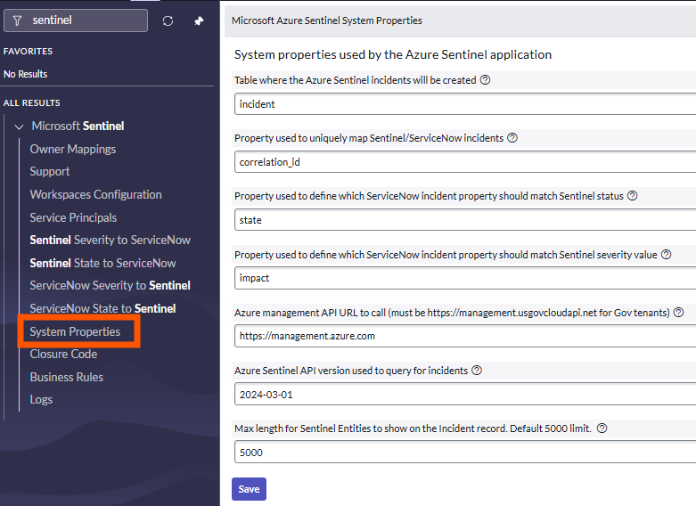

# Microsoft Sentinel - ServiceNow integration

## Introduction

This integration is a [ServiceNow application](https://store.servicenow.com/sn_appstore_store.do#!/store/application/407209291b05f850d7644377cc4bcbbc) providing bi-directional synchronization of incidents, between both platforms. It has the following capabilities:

- Incident creation (Microsoft Sentinel to ServiceNow only)
- Incident alerts synchronization
- Incident entities synchronization
- Incident comments synchronization
- Incident status synchronization
- Incident severity synchronization
- Incident owner assignment synchronization
- Incident custom properties support (requires custom code)

 

**Note:** 
   - Traditional Azure Logic/playbook app integration does not fully enable bidirectional synchronization. 
   - The bidirectional sync app in the ServiceNow store also **supports SIR(Security Incident Response) SecOps module**, with some ServiceNow-specific modifications. For further information, see [Technical FAQs](#technical-faqs) at the bottom of this page.

**Limitations:** 
   - The Microsoft Sentinel app runs on a single ServiceNow instance and **does not support Domain separation**. 

## Prerequisites

This ServiceNow application fully rely on the Microsoft Sentinel Management API to provide bi-directional sync between both platforms.

To provide access to our application, we have to create a Service Principal in Azure Active Directory, and assign to it the required permissions.

 

### **Azure**: Create the Service Principal

1. Go to the Azure portal, in Azure AD service, App Registrations:

   [Registered Apps page](https://portal.azure.com/#blade/Microsoft_AAD_IAM/ActiveDirectoryMenuBlade/RegisteredApps)

1. Click on “New registration”

   

1. Provide a name for the app and click “Register”

   

1. Take note of the Application (client) ID and Directory (tenant) ID. We’ll need them during the ServiceNow configuration

   

1. Go to “Certificates & secrets” and click on “New client secret”

   

1. Provide a name for the secret and a validity period.  
   **Important**: when the secret will expire, you’ll have to create a new one and update the ServiceNow configuration

   

1. Note the secret and keep it in a safe location for later use

   

 

### **Azure**: Delegate permissions to the Service Principal

1. In the Azure portal, go to the _Resource Group_ containing your Microsoft Sentinel workspace and click on “Access control (IAM)”

   

1. Click on “Add role assignments”

   

1. In the new blade, select the "_Microsoft Sentinel Responder_” role, then select the Service Principal we created before, and click on the “Save” button.

We are now done with the Azure configuration part.

 

### **ServiceNow**: create a user for Microsoft Sentinel

To identify the incidents created from Microsoft Sentinel incidents, we will create a user. This user will be used as the “caller_id” property, when creating new records.

1. In ServiceNow, under “User Administration”, click on “Users”

   

1. Click on the ”New” button

   

1. Provide the required details, select "**Web service access only**" select and click on “Submit”

   

 

## Installation

Install the application in your ServiceNow instance from the ServiceNow store:

1. In the ServiceNow store, search for "Microsoft Sentinel"

   

1. Click on the "Get" button and install the app:

   

The application is now imported.

 

## Configure the application

Now that we have installed the application, we must configure the details to connect to the Microsoft Sentinel Management API.  
All configuration steps are accessible through the Microsoft Sentinel menu.

 

### Configure the Microsoft Sentinel workspace(s) details

The “Workspaces Configuration” section table contains the Microsoft Sentinel workspaces configuration.  
You will find in this section a default workspace to configure, or create new configurations to access multiple workspaces.

Open the current row to edit its configuration. You will need the workspace name, its subscription and resource group.

In addition to the workspace values (available in Microsoft Sentinel), provide the _Caller ID_ created before in ServiceNow, review the _OAuth Provider_ (configured at next step) and click on the **Update** button. The incidents synchronization will not start until you enable the workspace:

**Note**: In addition to the workspace configuration, you have the following properties:

- **Incident max age (days)**: maximum incident age, in days, for incidents to be created in ServiceNow, based on the incident's creation time. The default value for this parameter is 30 days. If any Sentinel incidents are generated or altered beyond 30 days, they will not be synchronized to ServiceNow.

- **newIncidentsLastSync**: timestamp automatically updated once the app successfully contact the Sentinel API to retrieve the new incidents since last update. If needed, you can manually change the value to query incidents older than your specified date

- **modifiedIncidentsLastSync**: timestamp automatically updated once the app successfully contact the Sentinel API to retrieve the updated incidents since last update

- **Incidents filter**: Filter used to retrieve only the matching incidents from Sentinel API. By default, it filters the incidents with a tag “snow”. To get all incidents, just delete the content of this field. You can also use different tag name instead of "snow". Please note that the value is case sensitive. When you have multiple instances of "Workspace configurations" in ServiceNow than make sure to have different tag name. Eg: For dev instance you can use "devsnow", for test instance "testsnow" and for prod instance use "prodsnow" etc.

- **Enabled**: boolean value to specify if the workspace is enabled or not. When disabled, the incidents are not retrieved and the timestamps are not updated.

- **Use workspace name in CorrelationId**: For multiple Sentinel workspaces, duplicate incident IDs may occur. To address this, we have introduced a new field on the ServiceNow workspace configuration page titled "Use Workspace name in CorrelationId". This field is set to false by default. When enabled, any incident created in ServiceNow will have 'Sentinel-<workspaceName>-<sentinel guid value>' as correlationId field value. This option should only be enabled when duplicate incident issues are identified. Additionally, the length of the Sentinel workspace name should not exceed 50 characters, as the maximum length for the CorrelationId field value in ServiceNow is 100 characters.

 

### Configure the Service Principals/OAuth Provider credentials

To call the Microsoft Sentinel Management API from ServiceNow, we must configure the credentials we created previously in Azure AD. This is done using an “Application Registry”. By default, we’ll use “Az Sentinel OAuth app” but you can use any name you want, as long as it matches the name provided in the workspace configuration.

1. On the credentials configuration page, we must provide the information we collected during the Service Principal creation:

   - Name: Az Sentinel OAuth app (can be different. This is the default name used by the workspace configuration)
   - Client ID (1): Azure AD application/client ID
   - Client secret (2): Azure AD client secret
   - Default Grant type: Client Credentials
   - Token URL (3): add your Azure AD tenant ID in the URL:
     https://login.microsoftonline.com/{AAD_tenant_id}/oauth2/token
   - Token Revocation URL (4): add your ServiceNow instance name in the URL:
     https://{instance_name}.service-now.com/oauth_redirect.do

     

1. Click on the “Submit” button to save your changes

   

 

### Verify the “Sentinel Severity to ServiceNow” table mapping

This table is used to map the Sentinel severity to the ServiceNow value, when creating or updating AzureSentinel incidents.  
Note that in our case, because Sentinel has four different severities values, while we have only three in ServiceNow, both _“Informational”_ and _“Low”_ have been assigned the value **3**:

You can view your environment's values using the following technique:

 

### Verify the “Sentinel State to ServiceNow” table mapping

This table is used to map the Sentinel state/status to the ServiceNow value, when creating or updating Microsoft Sentinel incidents.  
Note that Sentinel has probably less states than ServiceNow, so you must select the initial ServiceNow value used by the application.

You can view your environment's values using the following technique:

 

### Verify the “ServiceNow Severity to Sentinel” table mapping

This table is used to map the ServiceNow severity to the Sentinel value, when updating ServiceNow incidents and synchronizing the changes to Sentinel.  
Review the values to validate that they map your environment's configuration.

 

### Verify the “ServiceNow State to Sentinel” table mapping

This table is used to map the ServiceNow state to the Sentinel value, when updating ServiceNow incidents and synchronizing the changes to Sentinel.  
Review the values to validate that they map your environment's configuration. Note that because Sentinel has less states than ServiceNow, you will have multiple ServiceNow state mapped to the same Sentinel state.

 

## Review and validate the system properties

In addition to the configuration stored in the tables, the app keeps some information in system properties.  
Review the default values and change it to match your environment.

The available properties are:

- **apiUrl**: URL to the Microsoft Sentinel API. If your workspace is in Gov Cloud, you must change it to "_https://management.usgovcloudapi.net_"

- **apiVersion**: Microsoft Sentinel API version (should not be changed, unless new version is available)

- **incidentTableName**: table where the incident are created. The default value is "_incident_", but you can specify any table where you want to create your incidents. If using SIR SecOps module then specify sn_si_incident or relevant table name.

- **incidentUniqueKey**: ServiceNow incident property used to uniquely map incidents between Sentinel and ServiceNow. By default, the app uses “_correlation_id_”. If you are already using this property, you should specify or create another one.

- **severityField**: incident property to store the incident severity. By default, the app uses _“impact”_. Verify what is used in your environment.

- **statusField**: incident property to store the incident state. By default, the app uses “_state”_. Verify what is used in your environment.

- **Max length length for entities**: The Entities table is displayed in the ServiceNow worknotes, with a default character limit of 5000 for the text within the table. This limit can be modified to a different value. If the specified character limit is exceeded, the message "CONTENT TRUNCATED (max char length) ..." will be displayed.. 
 

### Verify the “Closure classification” table entries

This table is used to map Sentinel and ServiceNow closure codes and should match the closure codes you are using when closing your incidents.  
To verify the values, open the "Closure code" section in the Microsoft Sentinel menu.

You should update the provided values with your environment ones (the _label_ column is used to describe the value, while the _ServiceNowCode_ column is used to match the system resolution code). You can find your closure code by looking at the "Resolution code" values in your incidents:

**IMPORTANT**: in this table, the last column, “_SourceIsSentinel_” contains Boolean values to define which values should be used in ServiceNow when a close status has been set in Sentinel incidents.  
You should have only one “true” row per Sentinel possible status:

 

### Owner mapping

This table allows custom mapping between the owner's username (userprincipal property) in Azure AD and Microsoft Sentinel, and ServiceNow incidents.
To create such mapping, follow the steps below:

1. Click on the "New" button to create a new mapping

   

1. Provide the ServiceNow username, Azure AD UPN and optionally the Sentinel workspace and click on the "Submit" button

   

 

### Additional configuration

If you configured another incident table to store your Sentinel incidents, you must reflect this change to the two business rules being triggered by changes. You can also add additional filters if needed.

⚠️ **IMPORTANT** ⚠️  
If you are running versions older than _Rome_, verify that the "When to run" value is using **async** and not **async_always**:

The application uses the following business rules:

- **add_work_note_to_sentinel**: synchronizes work notes to sentinel comments

  

- **update_changes_to_sentinel**: synchronizes severity, status, closure code, owner to Sentinel.  
  If you are using other fields than the default for unique identifier, severity and state, set the correct values in the filters

  

- **custom_mapping**: business rule that can be used to code specific custom mapping during incidents creation or updates. By default, no custom mapping is performed but we provide some examples in the code

  

### Technical FAQ's:

#### 1. Which app in the ServiceNow store offers bi-directional synchronization of incidents and is owned and managed by Microsoft?

**Answer:** In the screenshot below, the blue shield icon represents the application tile from the ServiceNow store that is owned and managed by Microsoft. The other application tile is owned and managed by ServiceNow.

   

#### 2. What configurations are required on the "Workspace configuration" page in ServiceNow → Microsoft Sentinel?
**Answer:** Below are the points that needs to be considered:
   - **Environment Name**: Give a meaningful name to distinguish between multiple workspace configurations.
   - **Caller ID**: Specify user record "User Id" value example "sentinel.bot" or sys id of the user created in "User Administration". This user record is a integration User for any incidents created from Sentinel to ServiceNow. When a new incident is created in ServiceNow than the "Caller" field on incident record will be set as this user.
   - **Subscription**: Specify Microsoft Sentinel subscription Id. Name of the subscription should not be used.
   - **Resource Group**: Specify Microsoft Sentinel resource group name.
   - **Workspace**: Specify Microsoft Sentinel workspace name.
   - **Incident max age(days)**: The default value for this field is set to 30 days, indicating that any Sentinel incident created within the last 30 days will be eligible for creation or updates in ServiceNow. Incidents that are updated after the 30-day period will not receive updates.
   - **newIncidentsLastSync**: When any incident from Sentinel to ServiceNow is created, the Sentinel Incident "createdTimeUtc" datetime value will be used. When the ServiceNow job runs, the datetime set on this field, "newIncidentLastSync," will be used to get new incidents that are created. This datetime field value comes from the Sentinel Rest API.
   - **modifiedIncidentsLastSync**: When any incident from Sentinel to ServiceNow is updated, the Sentinel Incident "lastModifiedTimeUtc" datetime value will be used. When a ServiceNow job runs, the datetime set on this field, "newIncidentLastSync," will be used to get updated incidents that are created. This datetime field value comes from the Sentinel Rest API.
   - **Incidents Filter**: The default filter used is "(properties/labels/any(i:i/labelName eq 'snow'))", which searches for any incidents in Sentinel labeled with the "snow" tag only. You can change it as per your needs. Note that tag names are case-sensitive. To synchronize all Sentinel incidents with ServiceNow, leave this field value blank. If you are using multiple Workspace Configurations then make sure to use tags so that incidents from one instance don't collide with other instance.
   - **Enabled**: When set to "Yes," the scheduled job file "getSentinelIncidents_job" will retrieve new and modified incidents from Sentinel and synchronize them with ServiceNow. When set to "No," there will be no synchronization of incidents.
   - **Use Workspace Name in CorrelationId**: For multiple Sentinel workspaces, duplicate incident IDs may occur. To address this, we have introduced a new field on the ServiceNow workspace configuration page: "Use Workspace Name in CorrelationId". By default, this field is set to false. When enabled, it will look for 'Sentinel--' in ServiceNow for any record updates. This option should only be activated when duplicate incident issues have been identified. Once activated, any new incident created in ServiceNow will have correlationId suffix as 'Sentinel-<workspaceName>-<guidValue>'. Here workspaceName will be the workspace name from "Workspaces Configuration" page and guidValue is the unique value for the Sentinel incident from "Incident link". The length of the Sentinel workspace name should not exceed 50 characters, as the maximum length for the CorrelationId field value is 100 characters.

#### 3. What configurations are required on the "Service Principals" page in ServiceNow for Microsoft Sentinel?
**Answer:** Below are the points that needs to be considered:
   - **Client Id**: Here Client Id is the Sentinel App Registration value. More details on [Create Service Principal In Azure Portal](#azure-create-the-service-principal) section.
   - **Client Secret**: Here Client Secret is the Sentinel App Registration value. More details on [Create Service Principal In Azure Portal](#azure-create-the-service-principal) section. After saving Service Principal record make sure that the secret value is correct. It is observed that due to incorrect way of paste value is changed.
   - **Default Grant Type**: This should be "Client Credentials".
   - **Application**: Scope of the application should be "Microsoft Sentinel".
   - **Accessible from**: Use "This application scope only".
   - **Token Url**: Default value is "_https://login.microsoftonline.com/AAD_tenant_id/oauth2/token_". Here replace "AAD_tenant_id" with you Azure Tenant Id.
   - **Redirect URL**: Default value is "_https://tenant.service-now.com/oauth_redirect.do_". Here replace "tenant" with your ServiceNow browser tenant. Example: If your Browser url is "_https://dev12345.service-now.com/_" then use "dev12345" as your "tenant".

#### 4. What are the changes required for SIR SecOps module?
**Answer:** The Microsoft Sentinel application on ServiceNow supports the SIR SecOps module with the following specified changes:
   - On the "ServiceNow → Microsoft Sentinel → System Properties" page, the table name should be "sn_si_incident". The default table name provided is "incident".
   - Required permissions for "sn_si_incident": Verify that the permissions for Read, Create, and Write are granted if they are not present on the "System Applications → Application Cross-Scope Access" page. Here, the "Target Name" should be "sn_si_incident," the "Target Scope" must be "Security Incident Response," and the "Status" should be "Allowed".

#### 5. How can the "ScopeAccessNotGrantedException" error be resolved when utilizing the SIR SecOps module?
**Answer:** When permissions for "sn_si_incident" are not present, the error **Illegal access to getter method getMessage in class com.glide.script.fencing.access.ScopeAccessNotGrantedException** occurs. To resolve this error, please refer to point 4 i.e. [Changes required for SIR module](#4-what-are-the-changes-required-for-sir-secops-module).

#### 6. How to fix error "InvalidAuthenticationToken"?
**Answer:** When encountering an error such as **401; {"error":{"code":"InvalidAuthenticationToken","message":"The access token is invalid."}}**, verify below points: 
   - Check if Client Secret specified in "ServiceNow → Microsoft Sentinel → Service Principals" is correct and matches with your client secret from Azure portal App Registration. 
   - If issues persist after this validation, consider regenerating the client ID and client secret in the Azure portal App Registration. 
   - Also make sure to update this in "ServiceNow → Microsoft Sentinel → Service Principle". Verify if Subscription, Resource Group and Workspace name is correct in "ServiceNow → Microsoft Sentinel → Service Principle".

#### 7. Changes from ServiceNow to Sentinel not updating or syncing?
**Answer:** When changes like "Assigned To", "State" or "Severity" etc made on ServiceNow incident record are not reflecting to Sentinel Incident than this can happen due to below:
   - **Mapping for State or Severity missing**: Filter "ServiceNow → Microsoft Sentinel → Logs" by "Message" as "*error" to see if there are errors. It is observed that if the mapping for "Informational" incidents are missing in "Sentinel Severity to ServiceNow Severity", "ServiceNow Severity to Sentinel Incident" then this will give error and will not update Sentinel incident. In the same way if the mapping for "ServiceNow State to Sentinel State", "Sentinel State to ServiceNow State" mapping is not present than this will prevent any update to Sentinel.
   - **Remove Role**: From "When to run" tab, remove the role "x_mioms_azsentinel.az sentinel admin" set on the business rules "update changes to Sentinel" and "add worknotes to Sentinel".

#### 8. What is correlation Id?
**Answer:** On Sentinel incident record we have a field "Incident Link". This field is a Url and at the end of this Url we have a guid value. This guid value is used as a correlationId value in ServiceNow incident "Correlation Id" field.

#### 9. Why are comments in ServiceNow Worknotes displayed in HTML-like code?
**Answer:** This is related to settings in ServiceNow. Navigate to ServiceNow and search for "System Properties" as shown in the screenshot below. Under "System Properties → UI Properties" update the checkbox option to "Yes" and click the "Save" button to save the record. Then open any incident record to view all "Work Notes" field data in a proper format. If it does not display correctly, please refresh the browser page.

   

#### 10. How can an automated tag be added to a Sentinel Incident?
**Answer:** When a new incident in Sentinel is created than you can add the tag automatically by making use of "Automation Rule". In Azure portal, open your Sentinel workspace and under "Configuration → Automation" blade 

   

 

   In above image you can create a new automation rule which get triggered when a new incident is created and than adds a new tag "snow". You can have other conditions.

   

#### 11. Can we have different tag name for different workspace?
**Answer:** Yes, it is advisable to use distinct tag names for each workspace. For instance, you may consider using "devsnow," "testsnow," "prodsnow," "dev-snow," "prod-snow," or any other combination in the ServiceNow → Microsoft Sentinel → Workspace Configuration page. Please note that tag names are case-sensitive.

#### 12: Does Microsoft Sentinel app supports "Assignment Group" in ServiceNow?
**Answer:** No, the Microsoft Sentinel app currently does not support "Assignment Group". It only supports single-use assignment, specifically "Assigned To" in ServiceNow.

#### 13: Does the Microsoft Sentinel app support "Domain Separation" in ServiceNow?
**Answer:** No, the Microsoft Sentinel app currently does not support "Domain Separation" in ServiceNow.

#### 14: Can I change the scheduled job run time?
**Answer:** Yes, go to Scheduled Jobs in ServiceNow and search for "getSentinelIncidents_job". By default, the job runs every minute, which you can adjust as needed.

#### 15: How can changes in each version of ServiceNow be verified?
**Answer:** Open the ServiceNow Store app [link](https://store.servicenow.com/sn_appstore_store.do#!/store/home) in your browser and search for "Microsoft Sentinel". On the right side of the page, you will find the "Version" section, as shown in the screenshot below. Click on "Other App Versions" to view the changes made in each version.

   

#### 16: Which region of ServiceNow is supported by the Microsoft Sentinel app?
**Answer:** Open the ServiceNow Store app in your browser and search for "Microsoft Sentinel". On the right side of the page, you will find the "Compatibility" section, as illustrated in the screenshot below. If ServiceNow has a new region that is not listed in the ServiceNow Store for the "Microsoft Sentinel" app, please send an email to "SentinelIntegrations@microsoft.com".

   

#### 17: How to modify Microsoft Sentinel App code?
**Answer:** Microsoft Sentinel App code is by default Read-Only. In order to modify this code follow below work around:
   - Create a new Script Include file of "SentinelIncidents" and name it like "SentinelIncidents_copy". Copy paste all code from original file "SentinelIncidents" into this new file and make sure to rename the highlighted name to "SentinelIncidents_copy" as shown below:

   

   - Rename scheduled job reference "SentinelIncidents" to "SentinelIncidents_copy" like below. In below screenshot just update this name only which will then refer the new file "SentinelIncidents_copy" file code.

   

   - Rename in business rules "update Changes to Sentinel Incident" and "add Worknotes to Sentinel" update the class name like below:

   

   **Note:** When there is a new version of the app then it is recommended to take back of all the changes or mapping done and then perform upgrade. Always perform upgrade on the lower instance of ServiceNow like dev/test/uat instance of ServiceNow instead of Prod instance.