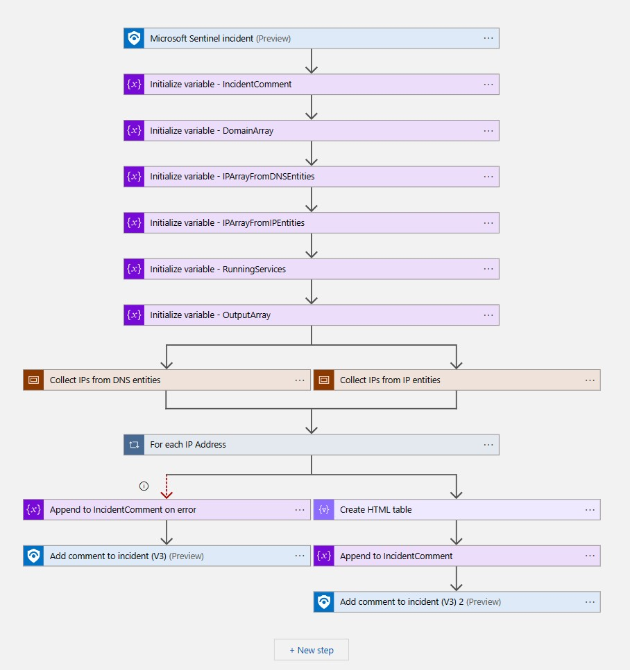
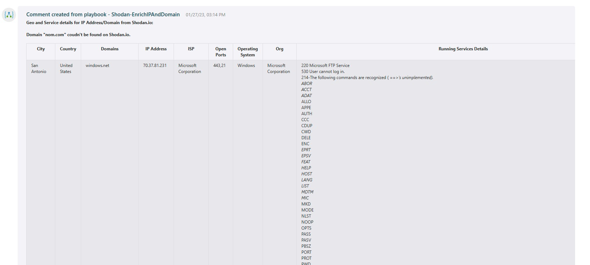

# Shodan-EnrichIPAndDomain

## Summary

The playbook can be triggered manually or automatically from an Incident context to fetch geo location and running services details from Shodan.io of IP addresses and Domain Names. This playbook performs following actions:

1. Get the domain names and IP addresses from incident.
2. Resolve domain names to IP addresses. 
2. Query Shodan.io to fetch geo location and running services details for all the IP addresses.
3. Collect all the details and format as table.
3. Add the collected details as comment to the incident.

 
 

### Prerequisites

1. Prior to the deployment of this playbook, [Shodan Logic App Custom Connector](../../CustomConnector/ShodanCustomConnector/azuredeploy.json) needs to be deployed under the same subscription.
2. Refer to [Shodan Logic App Custom Connector](../../CustomConnector/ShodanCustomConnector/readme.md) documentation for deployment instructions.

### Deployment instructions

1. To deploy the Playbook, click the Deploy to Azure button. This will launch the ARM Template deployment wizard.
2. Fill in the required parameters:
    * Playbook Name
    * Custom Connector Name

 

### Post-Deployment instructions

#### a. Authorize connections

Once deployment is complete, authorize each connection.

1. Select the Microsoft Sentinel connection resource
2. Click Edit API connection blade
3. Click Authorize/Provide credentials
4. Click Save
5. Repeat these steps for other connections

#### b. Configurations in Sentinel

1. In Microsoft Sentinel, analytical rules should be configured to trigger an incident that contains IP Addresses and/or Domain Names. In the *Entity mapping* section of the analytics rule creation workflow, IP Address should be mapped to **Address** identifier of the **IP** entity type, and Domain Name should be mapped to **DomainName** identifier of the **Domain** entity type. 

    Check the [documentation](https://docs.microsoft.com/azure/sentinel/map-data-fields-to-entities) to learn more about mapping entities.
2. Configure the automation rules to trigger the playbook. Check the [documentation](https://docs.microsoft.com/azure/sentinel/tutorial-respond-threats-playbook) to learn more about automation rules.

#### c. Assign Playbook Microsoft Sentinel Responder Role
1. Select the Playbook (Logic App) resource
2. Click on Identity Blade
3. Choose System assigned tab
4. Click on Azure role assignments
5. Click on Add role assignments
6. Select Scope - Resource group
7. Select Subscription - where Playbook has been created
8. Select Resource group - where Playbook has been created
9. Select Role - Microsoft Sentinel Responder
10. Click Save (It takes 3-5 minutes to show the added role.)

#  References
 - [Shodan API Quick Reference](https://developer.shodan.io/api)
 - [Get Shodan API Key](https://developer.shodan.io/api/requirements)