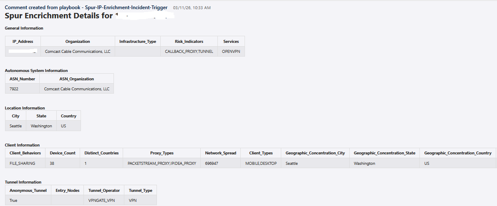
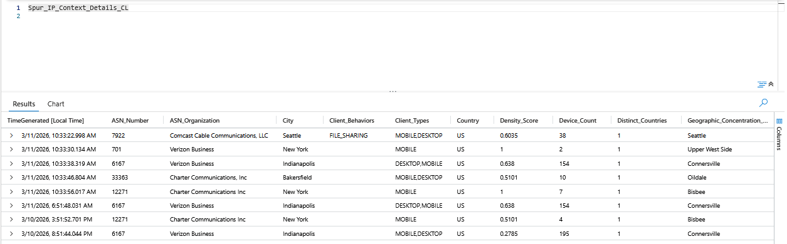
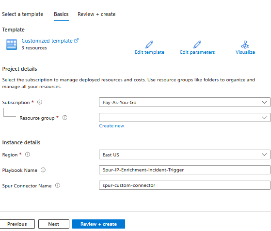
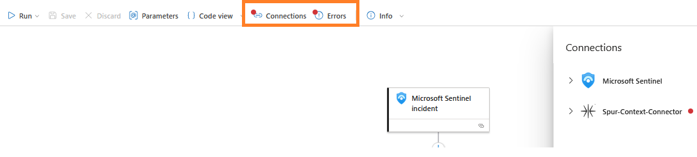

# Spur IP Enrichment Incident Trigger Playbook

## Table of Contents

1. [Overview](#overview)
2. [Deploy Spur IP Enrichment Incident Trigger Playbook](#deployplaybook)
3. [Prerequisites](#prerequisites)
4. [Deployment](#deployment)
5. [Post Deployment Steps](#postdeployment)

<a name="overview">

# Overview
This playbook uses the Spur Context API. It is able to provide hosted high-performance IP enrichment lookups of the highest-fidelity IP intelligence available. With pre-built integrations into the most common threat analysis platforms and services, Spur ensures that security teams can instantly leverage data to protect their environments from the latest evasion and obfuscation methods, such as VPNs, residential proxies, and bot automation.
 

When a new Azure Sentinel Incident is created, this playbook gets triggered and performs the following actions:

- It fetches all the IP address entities in the Incident.
- Iterates through the IP address enities and fetches the results from Spur Context API for each IP Address.
- All the details from Spur Context API will be added as comments in a tabular format.
- Optionally, is saved the Context API data into Log Analytics custom table.

<a name="deployplaybook">

## Links to deploy the DomainTools Iris Enrich Domain Playbook:

 

<a name="prerequisites">

## Prerequisites for using and deploying playbook
- A Spur API Key.
- Spur Custom Connector.

<a name="deployment">

#### Deployment instructions
- Deploy the playbooks by clicking on "Deploy to Azure" button. This will take you to deploying an ARM Template wizard.
- Fill in the required parameters for deploying the playbook.
  
- Click "Review + create". Once the validation is successful, click on "Create".

<a name="postdeployment">

### Post-Deployment instructions
#### a. Authorize connections
Once deployment is complete, you will need to authorize each connection:
- Open the Logic App in the edit mode.
- Logic App prompts any missing connections, please update the connections.
  
- As a best practice, we have used the Sentinel connection in Logic Apps that use "ManagedSecurityIdentity" permissions. Please refer to [this document](https://techcommunity.microsoft.com/t5/microsoft-sentinel-blog/what-s-new-managed-identity-for-azure-sentinel-logic-apps/ba-p/2068204) and provide permissions to the Logic App accordingly.
- Click on 'Parameter' and Enter All Parameters to save data in Custom logs table.
- Set the following parameters:
  - `Save_To_Custom_Table`: Set to `true` to enable saving Spur data to a custom Log Analytics table
  - `DCE_Endpoint_URL`: Data Collection Endpoint URL for your Log Analytics workspace
  - `DCR_Immutable_ID`: Immutable ID of the Data Collection Rule
  - `TenantID`: Azure AD tenant ID for authentication (From Azure App Registration)
  - `ClientID`: Application (client) ID of the service principal (From Azure App Registration)
  - `ClientSecret`: Client secret for the service principal (secure string)(From Azure App Registration)
  - `Auth_LoginEndpoint`: Login endpoint for authentication. Copy and paste this value in the parameter-'https://login.microsoftonline.com'

#### b. Configurations in Sentinel:
- In Azure Sentinel, analytical rules should be configured to trigger an incident with IP indicators.
- Configure the automation rules to trigger the playbook.
