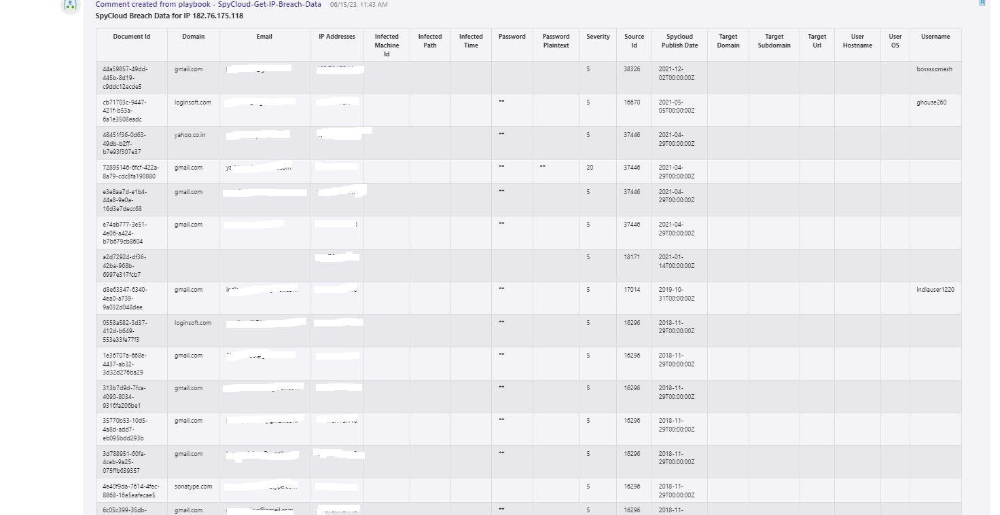
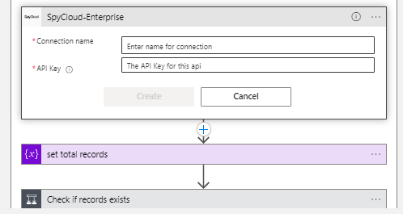

# SpyCloud Enterprise IP Address Breach Data Playbook 

## Table of Contents

1. [Overview](#overview)
2. [Prerequisites](#prerequisites)
3. [Deployment](#deployment)
4. [Post Deployment Steps](#postdeployment)

<a name="overview">

## Overview
The SpyCloud Enterprise API is able to provide breach data for an IP or set of IP addresses associated with an incident. When a new Azure Sentinel Incident is created, this playbook gets triggered and performs the following actions:

- It fetches all the IP entities in the incident.
- Iterates through the IP objects and fetches the breach data from SpyCloud Enterprise for each IP.
- All the breach data from SpyCloud Enterprise will be added as incident comments in a tabular format.

<a name="prerequisites">

## Prerequisites
- A SpyCloud Enterprise API Key.
- SpyCloud Enterprise custom connector needs to be deployed prior to the deployment of this playbook, in the same resource group and region. Relevant instructions can be found on the connector doc page.

<a name="deployment">

## Deployment Instructions
- Deploy the playbooks by clicking on the "Deploy to Azure" button. This will take you to deploy an ARM Template wizard.
- Fill in the required parameters for deploying the playbook.
  
- Click "Review + create". Once the validation is successful, click on "Create".

<a name="postdeployment">

## Post Deployment Instructions
### Authorize connections
Once deployment is complete, you will need to authorize each connection:
- As a best practice, we have used the Sentinel connection in Logic Apps that use "ManagedSecurityIdentity" permissions. Please refer to [this document](https://techcommunity.microsoft.com/t5/microsoft-sentinel-blog/what-s-new-managed-identity-for-azure-sentinel-logic-apps/ba-p/2068204) and provide permissions to the Logic App accordingly.
- Provide connection details for the SpyCloud Enterprise Custom Connector.

- Save the Logic App. If the Logic App prompts any missing connections, please update the connections similarly.

### Configurations in Sentinel:
- In Azure Sentinel, analytical rules should be configured to trigger an incident with an IP entity.
- Configure the automation rules to trigger this playbook.
