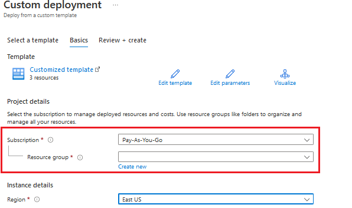
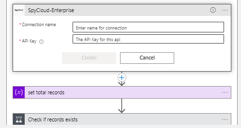

# SpyCloud Enterprise Password Breach Data Playbook 

## Table of Contents

1. [Overview](#overview)
2. [Prerequisites](#prerequisites)
3. [Deployment](#deployment)
4. [Post Deployment Steps](#postdeployment)

<a name="overview">

## Overview
The SpyCloud Enterprise API provides breach data for the provided password.

When this playbook gets triggered, it performs the following actions:
- It takes the password input provided in the "Provide Password to Search" variable of the logic app and gets all the breach data from SpyCloud Enterprise for that password, and the response will be added in a tabular format that can be used for further investigation.

<a name="prerequisites">

## Prerequisites
- A SpyCloud Enterprise API Key
- SpyCloud Enterprise custom connector needs to be deployed prior to the deployment of this playbook in the same resource group and region. Relevant instructions can be found on the connector documentation page.

<a name="deployment">

## Deployment Instructions
- Deploy the playbooks by clicking on the "Deploy to Azure" button. This will take you to deploy an ARM Template wizard.
- Fill in the required parameters for deploying the playbook.
  
- Click "Review + create". Once the validation is successful, click on "Create".
  

<a name="postdeployment">

## Post Deployment Instructions
### Authorize connections
Once deployment is complete, you will need to authorize each connection:
- Provide connection details for the SpyCloud Enterprise Custom Connector.

- Save the Logic App. If the Logic App prompts any missing connections, please update the connections similarly.

