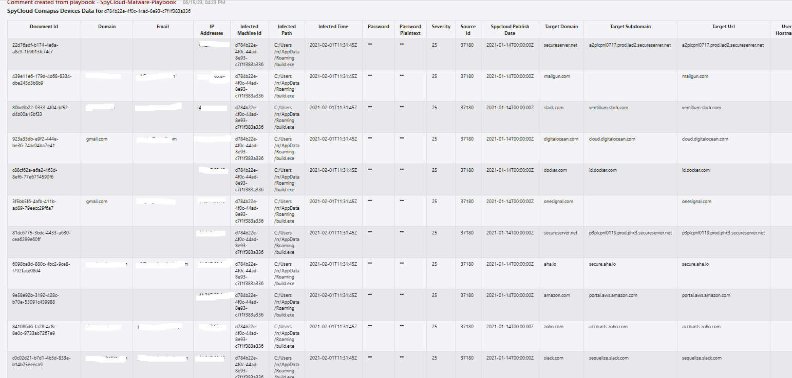

# SpyCloud Enterprise Malware Playbook 

## Table of Contents

1. [Overview](#overview)
2. [Prerequisites](#prerequisites)
3. [Deployment](#deployment)
4. [Post Deployment Steps](#postdeployment)

<a name="overview">

## Overview
This playbook gets triggered when an incident is created from the "SpyCloud Malware Rule" and can perform the following actions

- Check if the hostname is a managed asset. If no hostname exists in the record, skip this check. 
- For the specific machine ID, if the organization has access to compass data, pull all the additional records for the specific machine ID from the appropriate compass endpoint and add them to the incident. 
- Escalate the incident for someone to handle the malware infection. 

<a name="prerequisites">

## Prerequisites
- A SpyCloud Enterprise API Key
- SpyCloud Enterprise custom connector needs to be deployed prior to the deployment of this playbook, in the same resource group and region. Relevant instructions can be found on the connector documentation page.
- SpyCloud-Monitor-Watchlist-Data-Playbook needs to be deployed prior to the deployment of this playbook, in the same resource group and region. Relevant instructions can be found on the playbook document page.

<a name="deployment">

## Deployment Instructions
- Deploy the playbooks by clicking on the "Deploy to Azure" button. This will take you to the Deploy an ARM Template wizard.
- Fill in the required parameters for deploying the playbook.
  
- Click "Review + create". Once the validation is successful, click on "Create".

<a name="postdeployment">

## Post Deployment Instructions
### Authorize connections
Once deployment is complete, you will need to authorize each connection:
- As a best practice, we have used the Sentinel connection in Logic Apps that use "ManagedSecurityIdentity" permissions. Please refer to [this document](https://techcommunity.microsoft.com/t5/microsoft-sentinel-blog/what-s-new-managed-identity-for-azure-sentinel-logic-apps/ba-p/2068204) and provide permissions to the Logic App accordingly.
- Provide connection details for the SpyCloud Enterprise Custom Connector.
- Save the Logic App. If the Logic App prompts any missing connections, please update the connections similarly.
### b.Configurations in Sentinel:
- In Azure Sentinel, configure the SpyCloud Malware rule automation rules to trigger this playbook.
