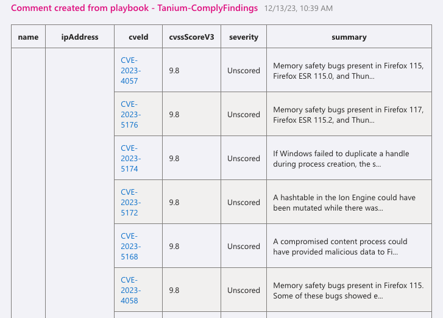

# Tanium-ComplyFindings

## Overview

This playbook will use the Tanium API to retrieve Tanium Comply Findings from hosts associated with a Microsoft Sentinel incident.

The results of the playbook will be added as a comment to the incident.

## Prerequisites

- Sentinel incidents with associated hosts running the Tanium client  
If this playbook it run against and incident with 1 or more hosts that are not running the Tanium client, then Tanium will not be able to provide information for those host(s). If the incident only contains hosts that are not running the Tanium client then a comment will be placed on the incident incidicating that and the playbook will exit early.

> [!TIP]
> Leverage the "Tanium Threat Response Alerts" analytics rule to generate Sentinel incidents for an Threat Response Alert from Tanium.

- An Azure Integration Account  
Required to execute javascript needed to prepare query filters for Tanium API Gateway HTTP requests

## Post-Deployment Instructions

You must authorize the API Connections used by this playbook after deployment. See [Tanium Playbooks](https://help.tanium.com/bundle/ConnectAzureSentinel/page/Integrations/MSFT/ConnectAzureSentinel/Get_to_know_our_Content.htm#_Tanium_Playbooks) for more information about our playbooks and how to create a playbook from this template.

## Get the Template
Use the links below to create the playbook from our template.

 

## Note

With the default deployment and configuration settings of the playbooks, your Tanium API Key is stored in a secure string workflow parameter. To update your Tanium API Key you must redeploy this playbook.

To allow Tanium API Key updates it is advised to use Azure Key Vault to securely store the Tanium API Key and update this playbook to use the Tanium API Key from the Key Vault instead of the secure string parameter.

Key Vault references

* [Key Vault | Microsoft Azure](https://azure.microsoft.com/services/key-vault/)
* [Azure Key Vault Connector reference | Microsoft Docs](https://docs.microsoft.com/connectors/keyvault/)
* [Secure access and data - Azure Logic Apps | Microsoft Docs](https://docs.microsoft.com/azure/logic-apps/logic-apps-securing-a-logic-app?tabs=azure-portal#secure-inputs-and-outputs-in-the-designer).

