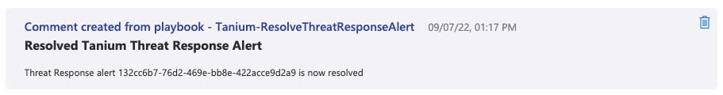

# Tanium-ResolveThreatResponseAlert

## Overview

This playbook will resolve any associated alerts in Tanium Threat Response associated with a Microsoft Sentinel incident. The result of resolving the alert will be added as a comment on the incident.

## Prerequisites
- Sentinel incidents created using the "Tanium Threat Response Alerts" analytic rule  
Only Microsoft Sentinel Incidents created by the "Tanium Threat Response Alerts" analytic rule will have the required metadata to allow resolving the associated Tanium Threat Response alert.

- A [Tanium API Token](https://help.tanium.com/bundle/ug_console_cloud/page/platform_user/console_api_tokens.html)   
A Tanium API token, granting access to your Tanium environment is required to make the necessary queries against the Tanium API.  

- Tanium Threat Response Module  
Tanium Threat Response must be installed and operational in your Tanium environment.

- Permission to Assign Roles to the Resource Group   
For this playbook to successfully run it must have the Microsoft Sentinel Contributor role at the Resource Group scope. This is added as part of this ARM template, and therefore requires the user who is creating the playbook to have `Microsoft.Authorization/roleAssignments/write` on the resource group. Some examples of roles that meet this criteria for the user include:
  - Owner
  - User Access Administrator
  - Role Based Access Control Administrator
  - Global Administrator 

## Post-Deployment Instructions

You must authorize the API Connections used by this playbook after deployment. See [Tanium Playbooks](https://help.tanium.com/bundle/ConnectAzureSentinel/page/Integrations/MSFT/ConnectAzureSentinel/Get_to_know_our_Content.htm#_Tanium_Playbooks) for more information about our playbooks and how to create a playbook from this template.

## Get the Template
Use the links below to create the playbook from our template.

 

## Note

With the default deployment and configuration settings of the playbooks, your Tanium API Key is stored in a secure string workflow parameter. To update your Tanium API Key you must redeploy this playbook.

To allow Tanium API Key updates it is advised to use Azure Key Vault to securely store the Tanium API Key and update this playbook to use the Tanium API Key from the Key Vault instead of the secure string parameter.

Key Vault references

* [Key Vault | Microsoft Azure](https://azure.microsoft.com/services/key-vault/)
* [Azure Key Vault Connector reference | Microsoft Docs](https://docs.microsoft.com/connectors/keyvault/)
* [Secure access and data - Azure Logic Apps | Microsoft Docs](https://docs.microsoft.com/azure/logic-apps/logic-apps-securing-a-logic-app?tabs=azure-portal#secure-inputs-and-outputs-in-the-designer).

