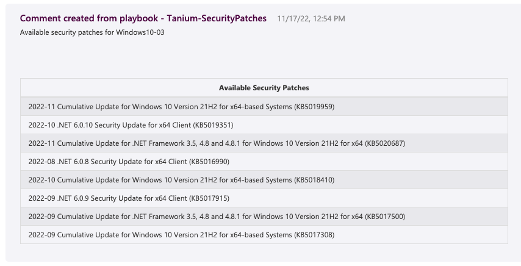

# Tanium-SecurityPatches

## Overview

This playbook will use Tanium to retrieve applicable security patches for the hosts associated with a Microsoft Sentinel incident.

The results of the playbook will be added as a comment to the incident.

## Prerequisites

Sentinel incidents with associated hosts.

Tanium Patch installed and running in the Tanium environment.

## Post-Deployment Instructions

You must authorize the API Connections used by this playbook after deployment.

1. Visit the playbook resource.
2. Under "Development Tools" (located on the sidebar), click "API Connections".
3. Ensure each connection has been authorized.

 

## Note

With the default deployment and configuration settings of the playbooks, your Tanium API Key is stored in a secure string workflow parameter. To update your Tanium API Key you must redeploy this playbook.

To allow Tanium API Key updates it is advised to use Azure Key Vault to securely store the Tanium API Key and update this playbook to use the Tanium API Key from the Key Vault instead of the secure string parameter.

Key Vault references

* [Key Vault | Microsoft Azure](https://azure.microsoft.com/services/key-vault/)
* [Azure Key Vault Connector reference | Microsoft Docs](https://docs.microsoft.com/connectors/keyvault/)
* [Secure access and data - Azure Logic Apps | Microsoft Docs](https://docs.microsoft.com/azure/logic-apps/logic-apps-securing-a-logic-app?tabs=azure-portal#secure-inputs-and-outputs-in-the-designer).

