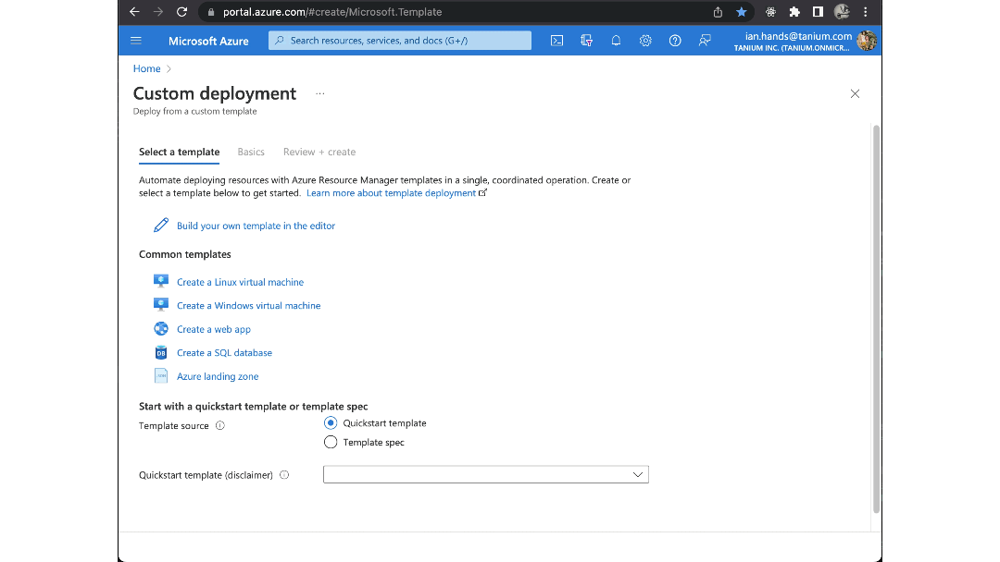

# Tanium Sentinel package

 

## Overview
Tanium Sentinel integration packages help you import / visualize Tanium data and act on these findings from within Sentinel.

## Installation

### Step by step

1. Download the [Tanium mainTemplate.json](https://raw.githubusercontent.com/tanium/AzureSentinelGTO/tanium-wip/Solutions/Tanium/Package/mainTemplate.json) file
2. Surf to the [Azure "Custom deployment" page](https://portal.azure.com/#create/Microsoft.Template)
3. Click `Build your own template in the editor`
4. Click `Load file` and upload the [Tanium mainTemplate.json](https://raw.githubusercontent.com/tanium/AzureSentinelGTO/tanium-wip/Solutions/Tanium/Package/mainTemplate.json) file
5. Click `Save`
6. Set the following settings
- Subscription (picker)
- Resource Group (picker)
- Workspace-location
- Note: this is something like `westus` not `West US`... it must match where your api connection lives [see note below](#help-workspace-location))
- Workspace (the name of your Sentinel workspace)
- Playbook1-Forwarder API Token (the API token for your forwarder)
- Playbook2-Forwarder API Token (the API token for your forwarder)
- Playbook3-Forwarder API Token (the API token for your forwarder)
7. Click `Review + create`
8. After validate click `Create`

### Recording

 

## Help

<a name=help-workspace-location>

### How do I find the correct workspace location?

1. Surf to [Azures Resource groups page](https://portal.azure.com/#blade/HubsExtension/BrowseResourceGroups)
1. Ensure you have the correct `Subscription` selected in the subscription filter
1. Click on your target/desired resource group
1. Use the `Type` filter to filter on `API Connection`
1. Click on the desired `API Connection`
1. Click on `JSON View` (right side)
1. Observe the value of the `location` key (at the bottom)

<a name=help-no-api-connection>

### What if I dont have an API connection?

- TODO: Walk customer through setting up connection in Logic App
- TODO: Automate this

## Developer notes
Prerequisites:

- Install power shell core `brew install --cask powershell`
- Install power shell YAML parser `Install-Module powershell-yaml`
- Install make `brew install make`

Building a solution:
- Start dev server `make dev-server` # separate shell
- Optionally edit `./tanium-scripts/input.json`
- Build Solution `make`
