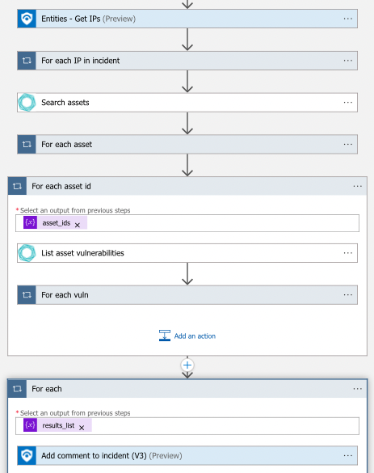

# Tenable-EnrichIncidentWithVulnInfo

## Summary

When a new sentinel incident is created, this playbook gets triggered and performs the following actions:

1. Obtains IPs from the incident.
2. Searches asset ids by the IPs.
2. Searches vulnerability ids by the asset ids.
3. Gets vulnerabilities information.
4. Adds obtained information as a comment to the incident.

 

### Prerequisites

1. Prior to the deployment of this playbook, [Tenable Platform API Connector](../../TenablePlatformConnector/) needs to be deployed under the same subscription.
2. Prior to the deployment of this playbook, [Tenable Vulnerability Management API Connector](../../TenableVulnerabilityManagementConnector/) needs to be deployed under the same subscription.
3. Obtain Tenable API credentials. Follow the instructions in the [documentation](https://developer.tenable.com/docs/authorization).

### Deployment instructions

1. To deploy the Playbook, click the Deploy to Azure button. This will launch the ARM Template deployment wizard.
2. Fill in the required paramteres:
    * Playbook Name: Enter the playbook name here

 

### Post-Deployment instructions

#### a. Authorize connections

Once deployment is complete, authorize each connection.

1. Click the Microsoft Sentinel connection resource
2. Click edit API connection
3. Click Authorize
4. Sign in
5. Click Save
6. Click the Tenable Platform connection resource
7. Click edit API connection
8. Provide API key
9. Click Save
10. Click the Tenable Vulnerability Management connection resource
11. Click edit API connection
12. Provide API key
13. Click Save

#### b. Configurations in Sentinel

1. In Microsoft sentinel, analytical rules should be configured to trigger an incident that contains IPs. In the *Entity maping* section of the analytics rule creation workflow, IP should be mapped to **Address** identitfier of the **IP** entity type. Check the [documentation](https://docs.microsoft.com/azure/sentinel/map-data-fields-to-entities) to learn more about mapping entities.
2. Configure the automation rules to trigger the playbook. Check the [documentation](https://docs.microsoft.com/azure/sentinel/tutorial-respond-threats-playbook) to learn more about automation rules.
