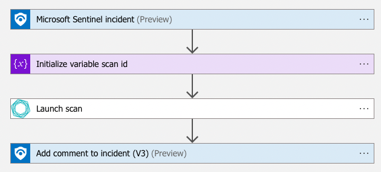

# Tenable-LaunchScan

## Summary

When a new sentinel incident is created, this playbook gets triggered and performs the following actions:

1. Launches scan by scan id provided during the playbook deployment.
2. Adds information about launched scan as a comment to the incident.

 

### Prerequisites

1. Prior to the deployment of this playbook, [Tenable Vulnerability Management API Connector](../../TenableVulnerabilityManagementConnector/) needs to be deployed under the same subscription.
2. Obtain Tenable API credentials. Follow the instructions in the [documentation](https://developer.tenable.com/docs/authorization).

### Deployment instructions

1. To deploy the Playbook, click the Deploy to Azure button. This will launch the ARM Template deployment wizard.
2. Fill in the required paramteres:
    * Playbook Name: Enter the playbook name here
    * Scan Id: Scan Id to be launched
    * Tenable Vulnerability Management Connector Name: name of the custom Logic App connector

 

### Post-Deployment instructions

#### a. Authorize connections

Once deployment is complete, authorize each connection.

1. Click the Microsoft Sentinel connection resource
2. Click edit API connection
3. Click Authorize
4. Sign in
5. Click Save
6. Click the Tenable Vulnerability Management connection resource
7. Click edit API connection
8. Provide API key
9. Click Save
