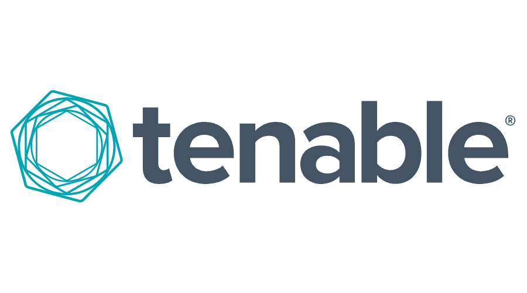

# Tenable Logic Apps connector and playbook templates

 

## Table of Contents

1. [Overview](#overview)
1. [Custom Connectors + 3 Playbook templates deployment](#deployall)
1. [Authentication](#authentication)
1. [Prerequisites](#prerequisites)
1. [Deployment](#deployment)
1. [Post-Deployment Steps](#postdeployment)

<a name="overview">

# Overview

Tenable.io provides actionable insight into your entire infrastructure's security risks, allowing you to quickly and accurately identify, investigate, and prioritize vulnerabilities and misconfigurations in your modern IT environment.

<a name="deployall">

## Custom Connectors + 3 Playbook templates deployment

This package includes:

* [Logic Apps custom connector for Tenable Platform API](./TenablePlatformConnector/)
* [Logic Apps custom connector for Tenable Vulnerability Management API](./TenableVulnerabilityManagementConnector/)

* These three playbook templates leverage Tenable custom connectors:
  * [Tenable-EnrichIncidentWithAssetsInfo](./Playbooks/Tenable-EnrichIncidentWithAssetsInfo/)
  * [Tenable-EnrichIncidentWithVulnInfo](./Playbooks/Tenable-EnrichIncidentWithVulnInfo/)
  * [Tenable-LaunchScan](./Playbooks/Tenable-LaunchScan/)

You can choose to deploy the whole package: connectors + all three playbook templates, or each one seperately from its specific folder.

 

# Tenable connectors documentation 

<a name="authentication">

## Authentication

* API Key authentication

<a name="prerequisites">

### Prerequisites in Tenable

To get Tenable API key, follow the instructions in the [documentation](https://developer.tenable.com/docs/authorization).

<a name="deployment">

### Deployment instructions 

1. To deploy Custom Connectors and Playbooks, click the Deploy to Azure button. This will launch the ARM Template deployment wizard.
2. Fill in the required parameters for deploying Custom Connectors and Playbooks

| Parameters | Description |
|----------------|--------------|
|**For Connectors**|
|**TenablePlatformConnectorName**| Name of Tenable Platform Connector|
|**TenableVulnerabilityManagementConnectorName**| Name of Tenable Vulnerability Management Connector|
|**For Playbooks**|
|**Tenable-EnrichIncidentWithAssetsInfo Playbook Name** | Name of the Playbook |
|**Tenable-EnrichIncidentWithVulnInfo Playbook Name** | Name of the Playbook |
|**Tenable-LaunchScan Playbook Name** | Name of the Playbook |
|**Scan Id** | Scan ID that will be used in Tenable-LaunchScan playbook |

 
<a name="postdeployment">

### Post-Deployment instructions

#### a. Authorize connections

Once deployment is complete, authorize each connection. Check documentation for each Playbook.

#### b. Configurations in Sentinel

Each Playbook requires a different type of configuration. Check documentation for each Playbook.
