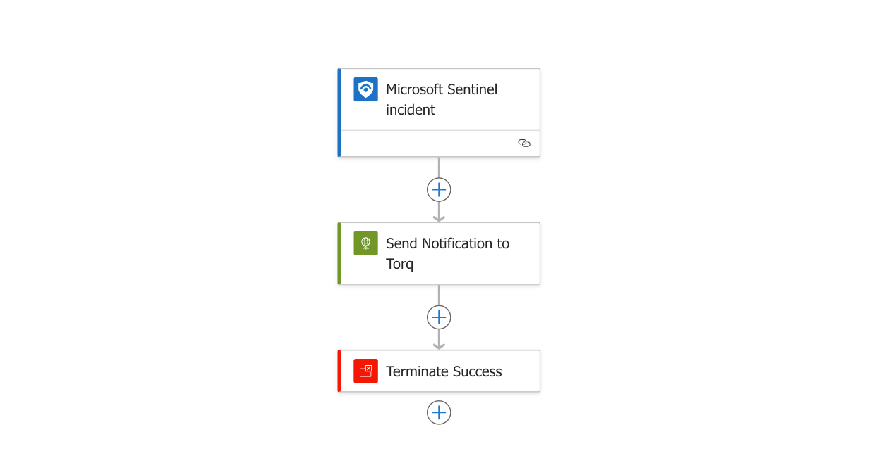

# Torq-Sentinel-Incident-Trigger

## Summary

When a new Sentinel Incident is created or updated, this playbook gets triggered and sends a notification (HTTPS POST Request) to a Microsoft Sentinel Webhook in Torq

 

### Prerequisites

1. Prior to the deployment of this playbook, create a new Microsoft Sentinel Trigger integration in Torq.
2. Take note of the endpoint URL, the authentication header name, and the authentication header secret configured in the Microsoft Sentinel Trigger integration.

### Deployment instructions

1. To deploy the Playbook, click the Deploy to Azure button. This will launch the ARM Template deployment wizard.
2. Fill in the required paramteres:
    * Playbook Name: Enter the playbook name here
    * Torq_Webhook_Enpoint_URL: Enter the endpoint URL for the Microsoft Sentinel Trigger integration previously created in Torq.
    * Torq_Webhook_Auth_Header_Name: Enter the authentication header name for the Microsoft Sentinel Trigger integration previously created in Torq.
    * Torq_Webhook_Auth_Header_Secret: Enter the authentication header secret for the Microsoft Sentinel Trigger integration previously created in Torq.

 

### Post-Deployment instructions

1. Browse to your Microsoft Sentinel workspace > Configuration > Automation
2. Click "+ Create" and select "Automation rule" to create a new automation rule meant to send a notification to Torq when a new Sentinel Incident is **created**.
3. Give the automation rule a meaningful name, like "Notify Torq when new Sentinel Incident is created".
4. From the "Trigger" drop-down menu, select **"When incident is created"**.
5. Leve "Conditions" to its default values.
6. From the "Actions" drop-down menu, select "Run playbook".
7. From the playbook selection drop-down, select the playbook "Sentinel_Incident_Sync_to_Torq"
8. Click the "Apply" button.
9. Click "+ Create" again and select "Automation rule" to create a new automation rule meant to send a notification to Torq when an existing Sentinel Incident is **updated**.
10. Give the automation rule a meaningful name, like "Notify Torq when a Sentinel Incident is updated".
11. From the "Trigger" drop-down menu, select **"When incident is updated"**
12. Leve "Conditions" to its default values.
13. From the "Actions" drop-down menu, select "Run playbook".
14. From the playbook selection drop-down, select the playbook "Sentinel_Incident_Sync_to_Torq"
15. Click the "Apply" button.

