# Module 3 - Analytics Rules

#### 🎓 Level: 200 (Intermediate)
#### ⌛ Estimated time to complete this lab: 30 minutes

## Objectives

This module guides you through Analytics Rules in Microsoft Sentinel, and shows you how to create different types of rules for security detections.

#### Prerequisites

This module assumes that you have completed [Module 1](Module-1-Setting-up-the-environment.md), as the data and the artifacts that we will be using in this module need to be deployed on your Microsoft Sentinel instance.

### Exercise 1: Enable an Azure Activity rule

As we've already installed the Azure Activity content solution in Module 1, we'll enable one of the included rules.

1. In your Microsoft Sentinel instance, go to **Analytics**.

2. Click the Rule Templates tab if not selected. Rule templates are installed here by content hub solutions. We can create active rules based on the templates supplied here, or create them from scratch.

3. Click the **Add Filter** button, and select *Source name* as the filter, then *Azure Activity* and click **Apply**.
 
	

4. Find and click the template *Suspicious Resource deployment* and look at the short summary description in the panel on the right:
  
   - The default *Severity* is specified as Low
   - The *Description* describes the intent of the rule
   - It uses the **Azure Activity** data source, and there's a green "connected" icon showing that the `AzureActivity` table is available
   - The template specifies the *tactic* of *Impact* for threat categorization and reporting
   - A preview of the *KQL query* which runs the detection is shown in the *Rule query* area for quick inspection

	We're going to create this rule with the default parameters in place. Click **Create rule**.
   
	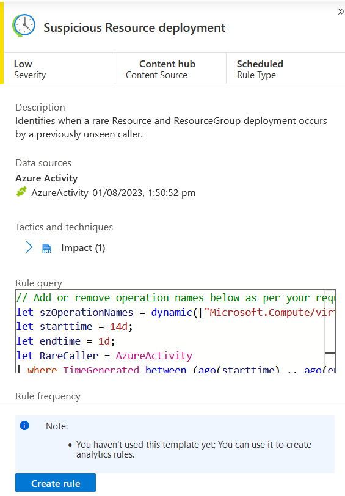

5. In the Analytics Rule Wizard, check the rule is **Enabled** on the first page, then click **Set rule logic**.
   **Note:** you can click either the tab at the top, or the button at the bottom to continue.

	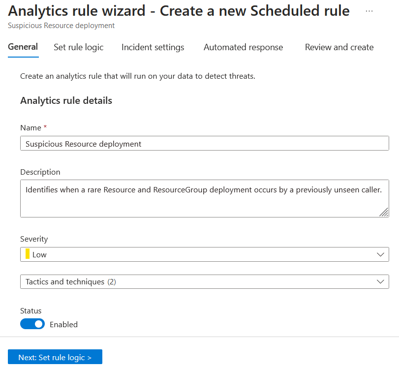

6. On the *Set rule logic* screen, you have the ability to create or modify the KQL query, control entity mapping, enable and adjust alert grouping, and define the scheduling and lookback time range.

	Some highlights:
	- Expand the query panel using the **arrows** above the query (top right)
	- Pop the query open, review the output and edit the KQL using **View query results**
	- Simulate alert volume from the rule by using the **Results simulation** area's **Test with current data** button

	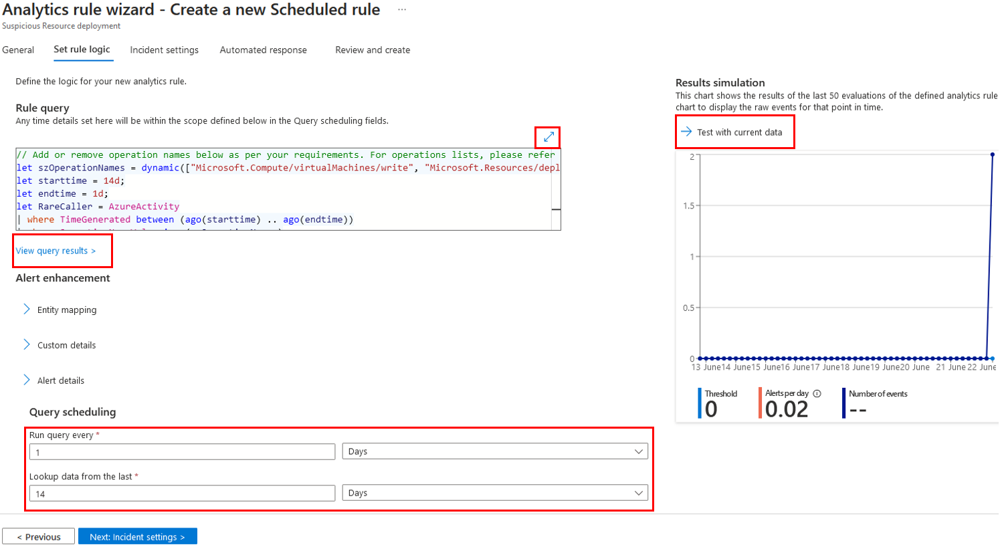

	Click **Next: Incident settings** at the bottom (or the Incident settings tab at the top) to continue the wizard.

7. On the *Incident settings* tab, note that *Incident creation* is enabled, and *Alert grouping* is disabled. Not every Alert detected by Sentinel must be promoted into an Incident - particularly noisy alerts! These settings can always be modified later if desired.
   
	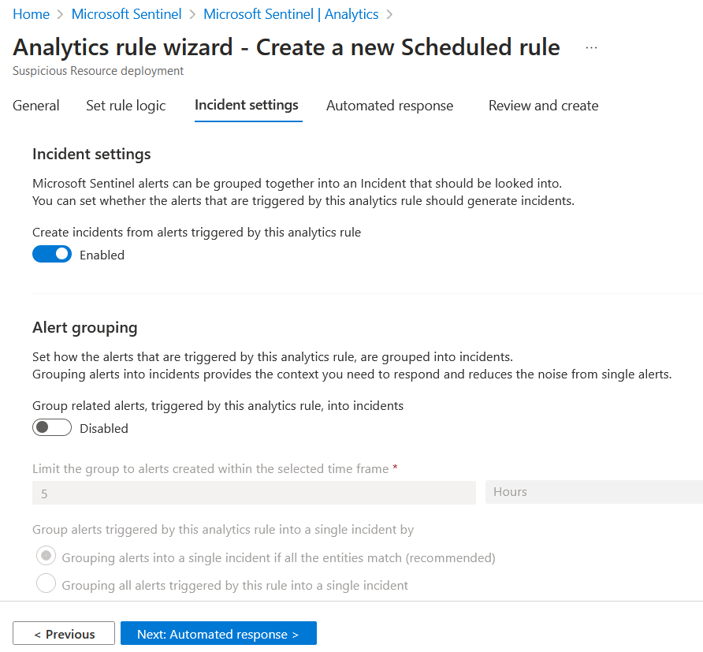


8. This rule looks good so far, and we're going to accept the current state and skip to rule creation, so click the **Review and Create** tab.
   
   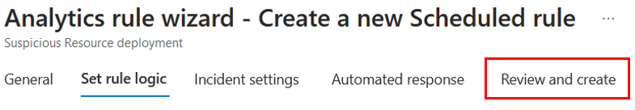

9. On the *Review and create* tab, review the rule configuration, and then click **Save** to deploy your new rule to the Active rule set.

### Exercise 2: Enable a Microsoft incident creation rule for Microsoft Defender for Cloud

Microsoft Sentinel is a cloud-native SIEM and as such, it acts as single pane of glass for alert and event correlation. 
For this purpose, and to be able to ingest and surface alerts from Microsoft Security products, we can create a **Microsoft incident creation rule**.
In this exercise, we will review this feature and create one example rule with a filtering option enabled to only promote *Medium* and *High* severity Defender for Cloud alerts to Sentinel incidents, to help reduce alert fatigue for analysts.

**Note:** In Module 1, we added the **Microsoft Defender for Cloud connector**, which synchronizes Microsoft Defender for Cloud security alerts with Sentinel. While creating the rule (as described below) can be done without enabling the connector, no alerts will be ingested or promoted without it.

1. From the Microsoft Sentinel main page, click **Analytics**.
   
2. From the action bar at the top, click on **Create** and then **Microsoft incident creation rule**.

	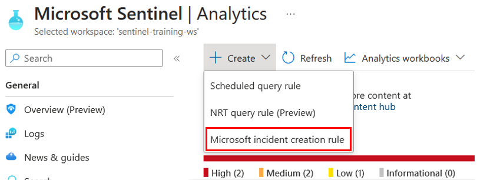

3. For the rule name, enter "**Defender for Cloud - only Medium and High Alerts**"
   
4. From the **Microsoft security service** dropdown, select **Microsoft Defender for Cloud**
   
5. In the **Filter by severity** select **custom** and mark **High** and **Medium**

	

6. Click the button **Next: Automated response**
   
7. On the *Automated response* page you can attach *automation rules* which can assist your SOC with repetitive tasks, incident enrichment, and security remediation. More on that topic in the SOAR module.
   
8. Press **Next: Review and create** and then **Save** to enable the rule.

	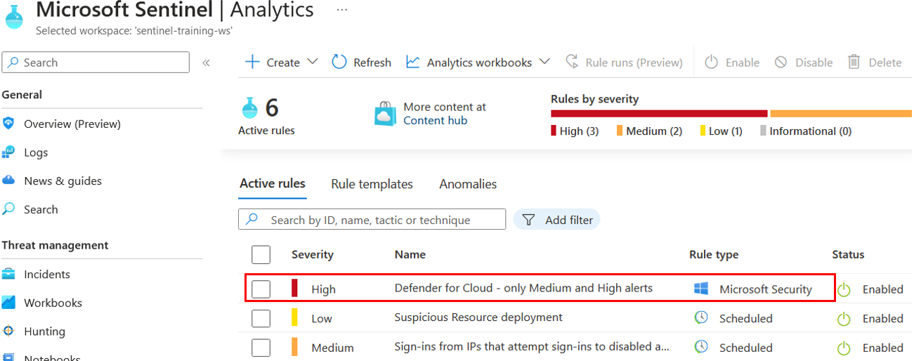

### Exercise 3: Review Fusion Rule (Advanced Multistage Attack Detection)

The *Fusion* rule is a unique kind of detection rule: Using the Fusion rule, Microsoft Sentinel can automatically detect multistage attacks by identifying combinations of anomalous behaviors and suspicious activities/alerts that are observed at various stages across a kill-chain.

In this exercise we will review the **Fusion** rule in Microsoft Sentinel.

1. In the **Analytics** page's **Rule templates** tab, use the **Rule Type** filter and select **Fusion**

	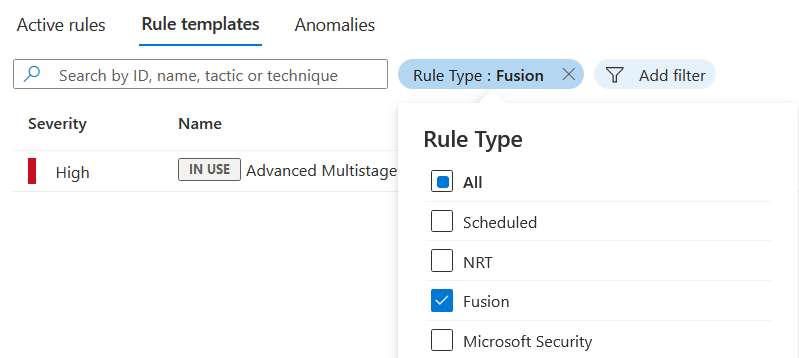

2. On the *templates* tab, notice the tag **IN USE**, as the Fusion rule is enabled by default.

	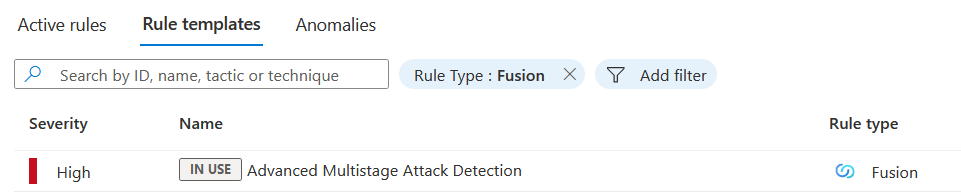
   
3. Click the template and review the data sources in the rule pane on the right:

	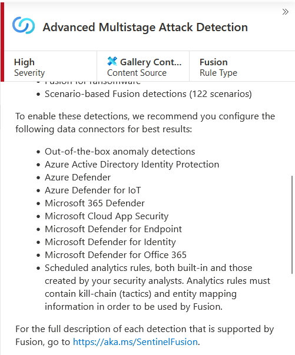

As Fusion rules produce security incidents with high fidelity and simulation can be challenging, we've included an example of an incident that was created from fusion detection. In the below example we are seeing 2 low severity alerts from **Azure Active Directory Identity Protection** and **Microsoft Cloud App Security** that stitch together into a high severity incidence:

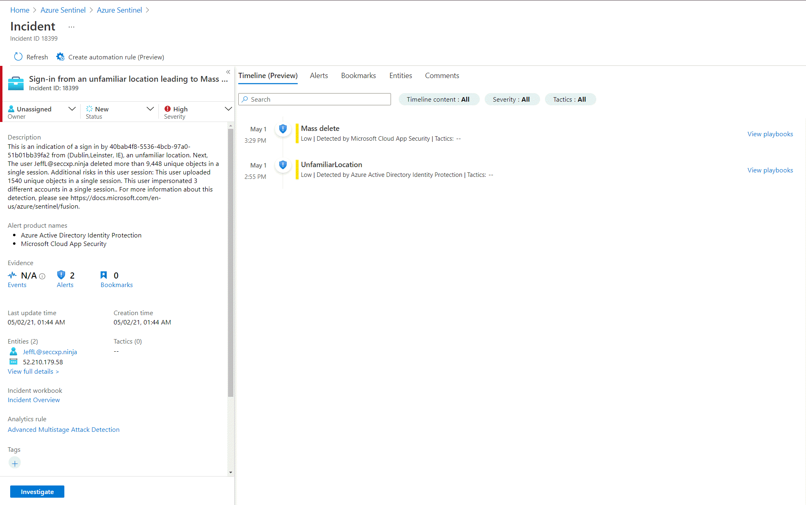


### Exercise 4: Create a Microsoft Sentinel custom analytics rule

#### Scenario
A security consultant notifies you about some intelligence they came across, around malicious inbox rule manipulation, based on some threads they read online (like https://www.reddit.com/r/sysadmin/comments/7kyp0a/recent_phishing_attempts_my_experience_and_what/). The attack vector they've described seems to be:
- Office activity
- Creation of new inbox rules
- Certain keywords being included in the rules being created

Based on the attack vector and your organizational risk, he recommends you create a detection rule for this malicious activity.
In this exercise you will use the Microsoft Sentinel analytics rule wizard to create a new detection rule.

**Important note:** in this lab we will use the **custom logs** we onboarded as part of the training lab installation, and we'll replace the usual table names and data types with our custom data sources. The Sentinel Training Lab content package also adds a custom rule as described below for reference.

#### Set up the detection

1. Review the article at the above link and consider what data source(s) would need to be part of a detection.
   
2. Check whether the operations you're interested in are already captured as part of your collection strategy:
   - Open the Sentinel **Logs** area and navigate to a query tab
   - Run the search query below to see a list of activities Sentinel ingested
     - Note: you may need to adjust the *Time range* to more than the last 24h if the training lab content was installed longer ago
	
    ```KQL
	OfficeActivity_CL
	| distinct Operation_s
    ```

   - As you can see, a **New-InboxRule** operation is indeed captured in your logs:

	

3. Click into **Analytics**, click the **Create** button in the action bar at the top, and pick **Scheduled query rule**.

4. For the **Name**, type *Malicious Inbox Rule - student* 
   
   Tip: You can use your name if you're sharing a workspace.
   
5. In the rule **Description**, state the intent of the rule: *This rule detects creation of inbox rules which attempt to Delete or Junk warnings about compromised emails sent to user mailboxes*.
   
6. Under **Tactics** tick *Persistence* and *Defense Evasion*.
   
7.  For rule **severity** select *Medium*.
   
8.  Press **Next: SET rule logic**.
    
9.  In the **Rule logic** page, review and copy the query below:

	```KQL
	let Keywords = dynamic(["helpdesk", " alert", " suspicious", "fake", "malicious", "phishing", "spam", "do not click", "do not open", "hijacked", "Fatal"]);
	OfficeActivity_CL
	| where Operation_s =~ "New-InboxRule"
	| where Parameters_s has "Deleted Items" or Parameters_s has "Junk Email" 
	| extend Events=todynamic(Parameters_s)
	| parse Events with * "SubjectContainsWords" SubjectContainsWords '}'*
	| parse Events with * "BodyContainsWords" BodyContainsWords '}'*
	| parse Events with * "SubjectOrBodyContainsWords" SubjectOrBodyContainsWords '}'*
	| where SubjectContainsWords has_any (Keywords)
	or BodyContainsWords has_any (Keywords)
	or SubjectOrBodyContainsWords has_any (Keywords)
	| extend ClientIPAddress = case( ClientIP_s has ".", tostring(split(ClientIP_s,":")[0]), ClientIP_s has "[", tostring(trim_start(@'[[]',tostring(split(ClientIP_s,"]")[0]))), ClientIP_s )
	| extend Keyword = iff(isnotempty(SubjectContainsWords), SubjectContainsWords, (iff(isnotempty(BodyContainsWords),BodyContainsWords,SubjectOrBodyContainsWords )))
	| extend RuleDetail = case(OfficeObjectId_s contains '/' , tostring(split(OfficeObjectId_s, '/')[-1]) , tostring(split(OfficeObjectId_s, '\\')[-1]))
	| summarize count(), StartTimeUtc = min(TimeGenerated), EndTimeUtc = max(TimeGenerated) by  Operation_s, UserId__s, ClientIPAddress, ResultStatus_s, Keyword, OriginatingServer_s, OfficeObjectId_s, RuleDetail
	```

10.  We can check how many hits the query finds using the **Test with current data** button on the right side, which helps with Alert modelling and tuning.

11.   Under **Alert enhancement**, expand the **Entity mapping** section, which allows us to map fields to well-known categories (entity types):

      - Click **Add new entity**, and then pick **Account** as our first type. Fill out the identifiers as follows:
        - In the left-hand selector, pick **FullName** as the type, and set the right-hand column identifier to **UserId__s**
          - This tells Sentinel that we have some sort of *Account*, specified by its *full name*, in the column *UserId_s*
      - Press **Add new entity** and this time select **Host** 
        - In the left-hand selector, select **FullName**, and map it to **OriginatingServer_s** in the right column
      - Press **Add new entity**, and pick the **IP** entity type
        - In the left-hand selector, pick **Address**, and map it to the **ClientIPAddress** value
	
  - Your mapping should look like the below:
  
    

#### Add a customized Alert title

Off to a great start! Now, to make your SOC more productive, save analyst time, and help quickly and effectively triage newly-created incidents, a SOC analyst asks you to provide the affected user from the search results as part of the alert title.

1. To achieve this, we'll use the **Alert details** feature and use a custom Alert Name Format.

   - As we know the username is available in the UserId_s column, under the **Alert Details** heading, in the **Alert Name Format** section, provide the dynamic title **"Malicious Inbox Rule - {{UserId__s}}"**

2. Under **Query scheduling**, set the **run query every** to **5 minutes** and the **Lookup data to last 12 Hours**. 
   - If you deployed the lab more than 12 hours ago, you will need to change the lookback period in order to cover that period.
   - (This scheduling might not be ideal for production environment and should be tuned appropriately)

3. Leave the other values at defaults.

4. Click the **Incident settings** button or the tab at the top.

5. As your SOC is under stress, we want to *reduce the number of alerts* and be sure that when analyst handle a specific incident, he/she will see all related events or other incidents related to the same attack story. For that we will implement the **Alert grouping** feature. To do so, follow the steps below: 

- On the **Incident settings** tab under **Alert grouping**: 
  - Set *Group related alerts into incidents* to **Enabled**.
  - Set *Limit the group to alerts created within the selected time frame* to **12 hours**.
  - Set the *Group alerts triggered by*... setting to *Grouping alerts into a single incident if the selected entity types and details matches*, then pick only the Account.

6. Skip to **Review and create** and **Save** your new Analytics rule.

The next time the rule is scheduled - *as long as the training data was onboarded within its lookback period* - it should find the logs from the OfficeActivity_CL custom log table and raise grouped Alerts as Incidents. 

**Tip:** You should already be able to see the sample Incident with a similar outcome from the rule installed when the Training Lab content was onboarded (if it was onboarded recently).
 	
### Exercise 5: Review resulting security incident
	
Now we've created a custom Analytics rule to detect malicious inbox rule creation, let's quickly review an Incident produced by a similar Analytics rule which was installed and run when this training lab content was onboarded. 

**Note:** The next module provides more detail on incident investigation.

#### Find the Incident

1. From your Microsoft Sentinel instance, select **Incidents** and review the incident page.
   
2. Find the incident with the title **"Malicious Inbox Rule, affected user AdeleV@contoso.OnMicrosoft.com"** or similar - notice that the title adapted to the user affected by the detection.

3. In the right pane we can review the incident preview, this view will gave us high level overview on the incident and the entity that related to it.

	There's a lot of information in this quick view panel!
	
	- At the top: Title, ID, assignment to a user, status (New/Active/Closed) and Severity
	- The Description provided by the rule (providing good descriptions helps analyst understand detections)
	- Any Alert products involved (here, just Sentinel)
	- A count and quick links to Events, Alerts and any Bookmarks added to the incident
	- Incident update and creation times
	- Quick links to entity pages for Accounts (here Adele's account - but also potentially Hosts, IPs, and more)
	- Tactics noted by the rule definition
	- A link to the Incident Overview workbook, which provides a live report on the Incident state
	- A direct link to edit the rule producing the detection, in case you need to edit the rule/detection logic quickly
	- Quick tagging and tag display
	- A direct link to the incident
	- The most recent comment, if present

	... so you can see a snapshot of the most critical information and perform basic incident management directly from the summary panel.

4. Click **View full details** at the bottom

	

5. On the full **Incident page** (Preview), you can find:
   - The same quick panel (now on the left)
   - The **Incident Actions** button at the top right
   - The **Overview tab** which includes:
     - An **Incident timeline panel**, which shows any Alerts and Bookmarks associated with that incident in a timeline view
     - An **Entities panel** allowing a quick pivot to an entity on the Entities tab
   - The **Entities tab** allowing exploration of Entity insights and timelines directly
   - A list of **Similar incidents** at the bottom of the page for added context, if available
   - A set of **Incident insights** in the right-hand panel, if available
  
  
6. After looking over the Incident, click the **Entities** tab to list all the mapped entities related to this incident.
 
	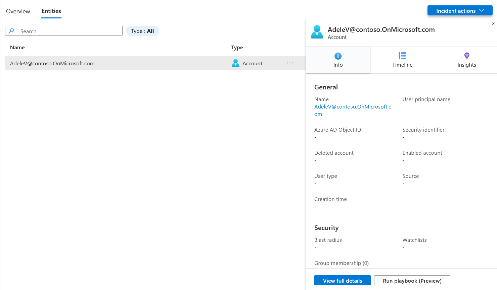

7. Click the entity **"AdeleV@contoso.OnMicrosoft.com"** from the incident Entities list
   - This action will navigate to the **Entities tab**, a list of entities with 3 sub-tabs on the right.
   - Clicking each tab will show different information about the Entity and its state
     - Note: State information is pulled from various sources: Some may be pulled directly from Azure services (like Microsoft Entra ID or Azure Virtual Machine host information), some from onboarded data sources, and some from UEBA (if enabled). Note that for *AdeleV*, our fake user, there's no information available in your user directory, but for production environments much more information is typically available!
   
   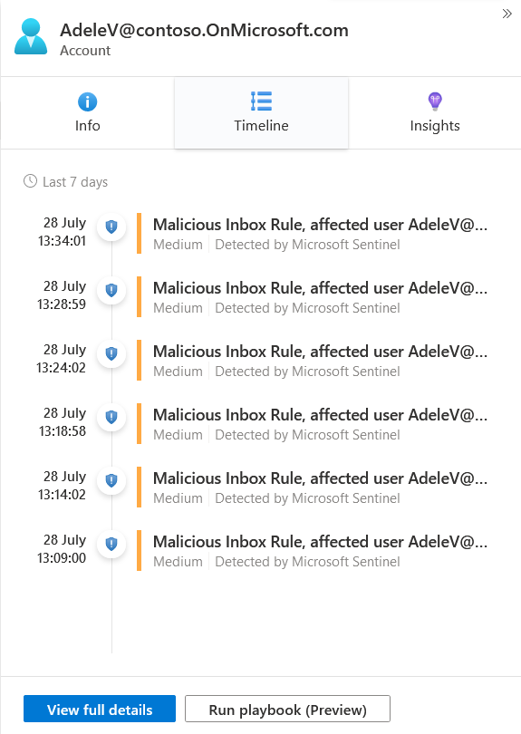 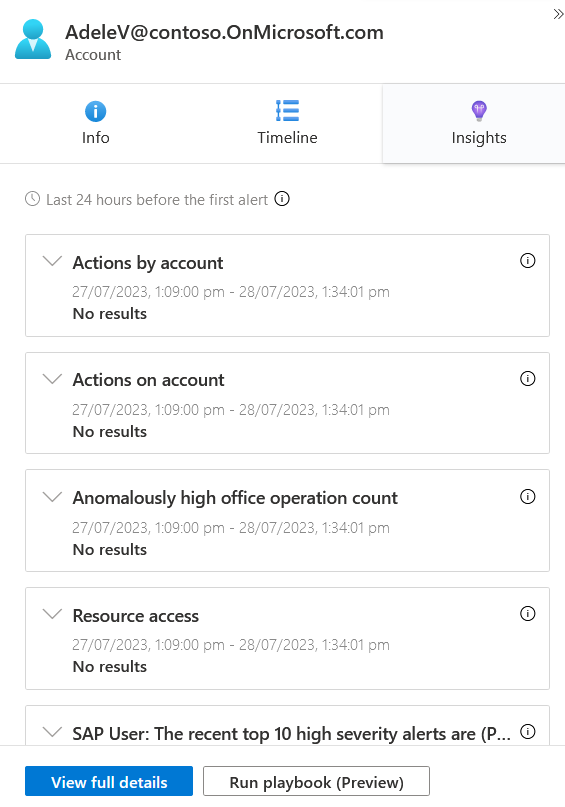
   
- Clicking the **View Full Details** button at the bottom will take you to the full Entity page


**Congratulations, you have completed Module 3!**

You can now continue to **[Module 4 - Incident Management](./Module-4-Incident-Management.md)**

## Further reading
- Create incidents from Microsoft security alerts: https://learn.microsoft.com/en-us/azure/sentinel/create-incidents-from-alerts
- Create query rules: https://learn.microsoft.com/en-us/azure/sentinel/detect-threats-custom
- Map data fields to entities: https://learn.microsoft.com/en-us/azure/sentinel/map-data-fields-to-entities
- Investigate incidents: https://learn.microsoft.com/en-us/azure/sentinel/investigate-incidents


