# Module 4 - Incident Management

#### 🎓 Level: 300 (Intermediate)
#### ⌛ Estimated time to complete this lab: 60 minutes

This module guides you through the SOC Analyst experience using Microsoft Sentinel's incident management capabilities.

#### Prerequisites

This module assumes that you have completed [Module 1](Module-1-Setting-up-the-environment.md), as the data and the artifacts that we will be using in this module need to be deployed to your Microsoft Sentinel instance.

### Exercise 1: Reviewing Microsoft Sentinel incident tools and capabilities

As a SOC Analyst, your entry point to work on Security incidents (i.e. tickets/jobs/cases) in Sentinel is the **Incidents** page.

1. From the Sentinel workspace, click **Incidents** to open the incidents page. This page will show all the open incidents in the last 24 hours by default (configurable).

2. We can **filter** our view of incidents. When we want to:
   - change the time window
   - see incidents of a specific severity
   - see *Closed* incidents as well as *New* and *Active* incidents
  
    we can use the **filters bar**:
    

3. **Find** and **click** the incident titled *Sign-ins from IPs that attempt sign-ins to disabled accounts*. In the right-hand pane you can see the incident preview with high-level information shown.
   
4. As you are the SME SOC analyst investigating incidents, you need to *take ownership* of this incident. In the right pane, change the **Owner** from *Unassigned* to *Assign to me*, and click **Apply**.
   
5. Also change the **Status** from *New* to *Active* while you're working on the incident and click **Apply**.
 
    

6. Another way to review incidents - and also to get a high-level view on general SOC health - is through the *Security efficiency workbook*. We have 2 options to open this workbook:

- Through the **link in the top action bar** in the Incidents page - this will open the workbook's general view, where we see overall statistics for incidents:
- 

- Through the **link in the incident**, which opens the same workbook to a different tab, presenting the information and lifecycle for the selected incident.
- 

7. Review the workbook views.

### Exercise 2: Handling the incident **"Sign-ins from IPs that attempt sign-ins to disabled accounts"**

We're going to walk through an example incident handling procedure, demonstrating a few things a SOC analyst might accomplish using Sentinel.

#### Initial incident handling

1. Open your Sentinel instance.
   
2. Navigate to the **Incidents** page.

3. Locate the incident **"Sign-ins from IPs that attempt sign-ins to disabled accounts"**.

4. **Click the incident** and look at the preview pane (on the right). Note that Sentinel displays entities surfaced by this incident here.

5. **Take ownership of the incident** and **change its status to Active** (don't forget to press **Apply** after each step.)

6. Click **View full details** in the preview pane.

7. In the left-hand pane, the number of *Events* may not be directly clickable if multiple Alerts are consolidated. However, you can see the raw Events for each Alert by **clicking on that Alert** in the Incident Timeline, and then clicking **Link to LA**. This pops open the Logs pane, which allows you to investigate the evidence without navigating away from the Incident.

    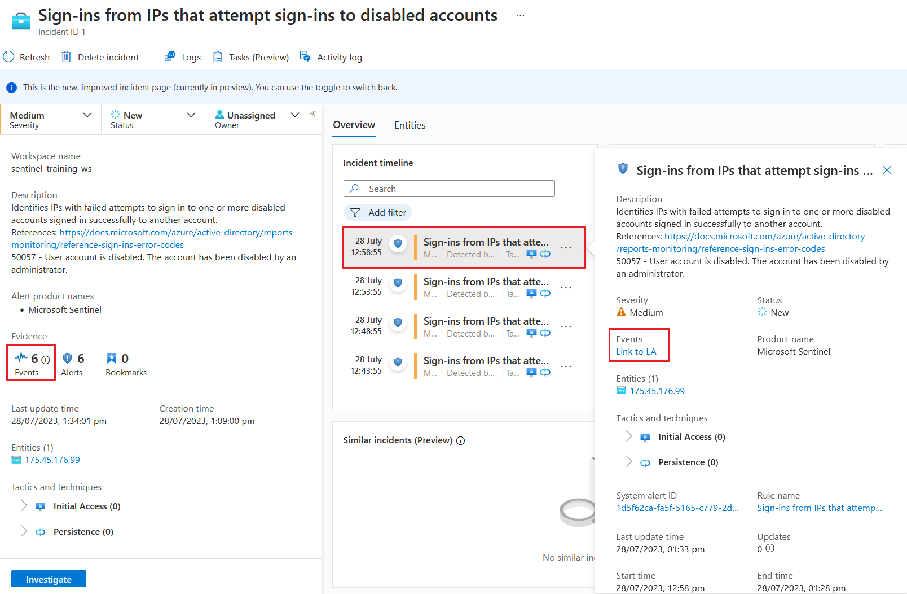

8. In the **Logs** panel, expand the event and review the columns and data we received. These properties may help us to decide whether this incident is correlated with other events.

    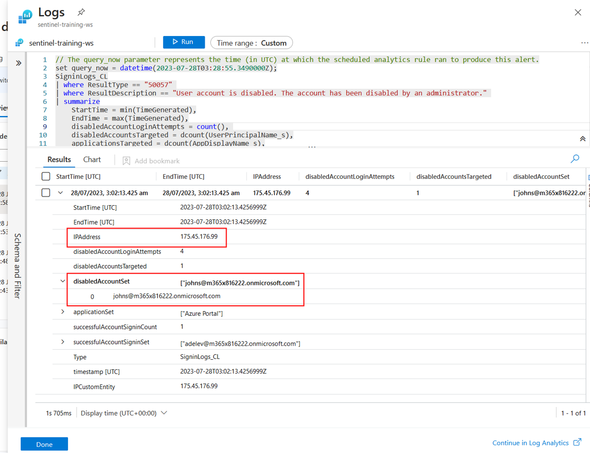

9.  To get more context for this IP address, we want to add Geographic IP information - one type of *incident enrichment*. In a real SOC, this operation would typically be set to run automatically, but for this lab, we want you to run it manually.

    - **Close the Logs panel** to go back to the full Incident page
    - **Click the three dots (...)** to the right of the most recent Alert
    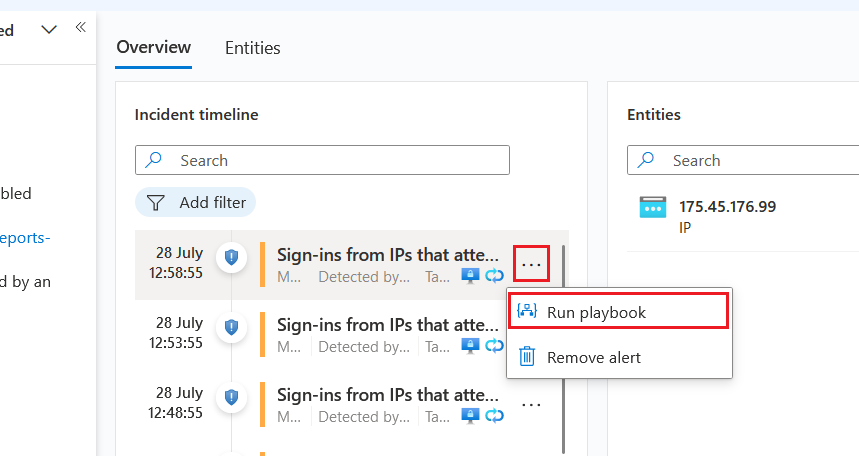
    - Click **Run playbook**
    - From the **Alert playbooks** list, find the *Get-GeoFromIpAndTagIncident* playbook and click **Run**, all the way on the right (you may need to scroll right!)
    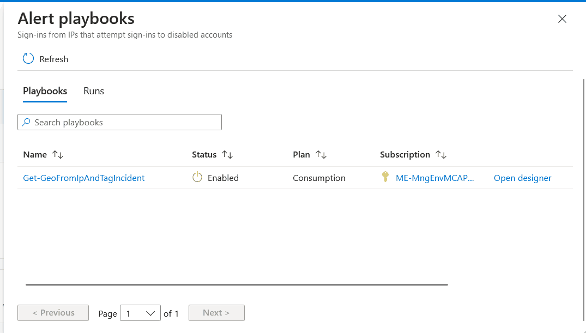
    - It should take only a few moments to run, if successful.

    **Note:** Sentinel provides automatic geo-IP lookup when viewing IP entities, but these are not recorded with the entity or detection, so using a Playbook to capture current 3rd-party geolocation information in an incident tag or comment can still be useful.
    
10. Close the *Alert playbooks* panel to get back to the Incident page, and hit **Refresh** in the action bar. Notice that new **tags** have been added to the incident (you may need to scroll the preview panel down).
    
    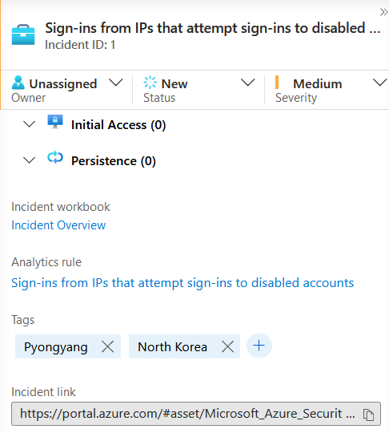

#### Continuing the investigation with a Workbook

As the SOC Analyst, this enrichment information increases your concern! You want to check for other traces of this IP in your network. For this investigation you want to use the *Investigation Insights* workbook. (The training lab has saved a copy to your workspace already.)
    
11.   In the left navigation pane, click the **Workbooks** blade, then select **My workbooks**
        
    
12. Click the **Investigation Insights - (date)** saved Workbook, then in the right pane, press **View saved workbook**

13. Check that in the properties selector at the top that the **Subscription** selector is set to the subscription that hosts your Sentinel Lab, and also that the workspace selector is set to your lab workspace's name (e.g. **sentinel-training-ws**).
    - if not, you can set these properties and hit the Save icon so they're remembered for next time.

    

14.  As the subject of our investigation is the suspicious IP address from North Korea, we want to see all the activity related to that IP. So, in the properties selector, switch **investigate by** to **Entity**. This should (near-)instantly switch the Workbook to the Entity Insights view.

15. On the **Investigate IP Address** tab, add the suspicious IP. (175.45.176.99)
    
    
16.  Scrolling down, under *Activity Detail* we can see many successful logins from this IP from the user Adele, and also some failed logins to disabled accounts from the last few day/hours.

17.  We copy the user ID *adelev@m365x816222.onmicrosoft.com* and validate it in our internal HR system, and from the information we collect it seems that Adele is part of the Security Red Team, and this suspicious behaviour is part of an exercise they are running for 48 hours.
- **Note**: If this were a *real* account, we could also more thoroughly investigate the account on the Investigate Account tab of this workbook, or (even more easily) through the account **Entity page** in Sentinel - but this training data set doesn't allow for that. For Microsoft Entra ID (AAD) identities mapped to an Account entity, directory information is provided as part of the Entity view, which can include job title, location, manager, group membership and other useful information.

18.  As the Red Team exercise was discovered by us, the SOC Manager asks us to kindly allow-list this IP for this detection type, so that we don't spend time investigating incidents from it while the test runs. Rather than edit the rule definition itself, we'll use an incident *Automation Rule* for this.

19.  On the main Incident page, select the relevant incident and click **Actions -> Create automation Rule**
    

20.  In the *new automation rule* screen, we see the current incident identifiers (the IP, and the specific Analytics rule name) pre-populated as *conditions*. As the Red Team exercise will finish in roughly 48 hours, we can set the rule expiration to the end of that timeframe, and press **Apply**.
    

21. As we now understand the incident was benign, we'll go back to the main incident page, and close the incident selecting that classification.
    - Change the **incident status** from **Active** to **Closed**, and pick **Benign**.
    

### Exercise 3: Handling the incident **"Solorigate Network Beacon"**

1. Navigate to the **Incidents** view of your Sentinel instance.

2. From the list of active incidents, select the "*Solorigate Network Beacon*" incident. 
   - If you can't find it, use the search bar or adjust the time filter at the top. Don't worry if you see more than one. 
  
    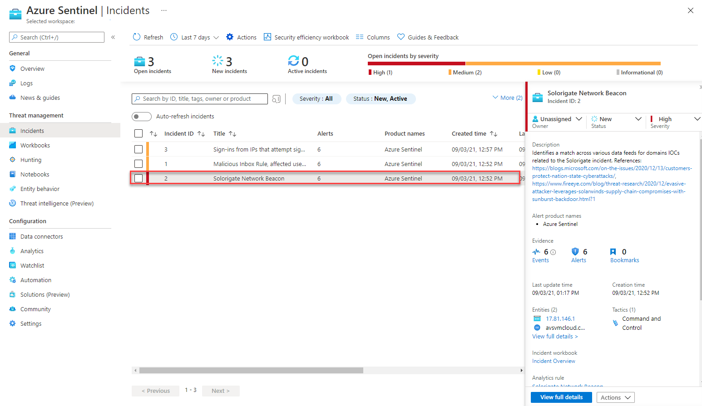

3. Assign the incident to yourself and click **Apply**.
    

4. Read the description of the incident. As you can see, one of the domain IOCs related to Solorigate attack has been found. In this case, domain **avsvmcloud.com** is involved. 

5. Optionally, you can click on **View full details** to drill down to inspect the raw events that triggered this alert. For that, click an Alert in the timeline, and click on **Link to LA**.

    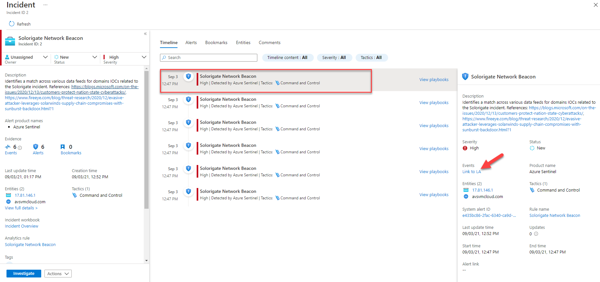

6. As you can see, the events originated in Cisco Umbrella DNS, and the analytic rule uses *Advanced Security Information Model* (ASIM) to normalize these events from any DNS source. Read more about [ASIM](https://docs.microsoft.com/azure/sentinel/normalization) and the [DNS schema](https://docs.microsoft.com/azure/sentinel/dns-normalization-schema).

    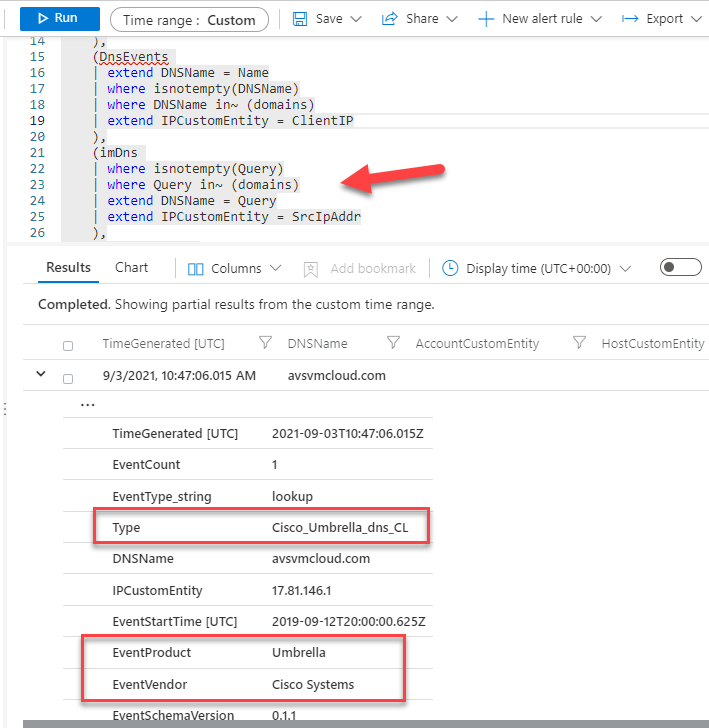

#### Hunting for more evidence

As your next step, you would like to identify the hosts that might have been compromised. As part of your research, you find the following [guidance from Microsoft](https://techcommunity.microsoft.com/t5/azure-sentinel/solarwinds-post-compromise-hunting-with-azure-sentinel/ba-p/1995095). In this article, you can find a query that runs a SolarWinds inventory check. We will use this query to find any other affected hosts.

7. Click on the **Hunting** blade in the Microsoft Sentinel menu, and the **Queries** tab if not selected.
    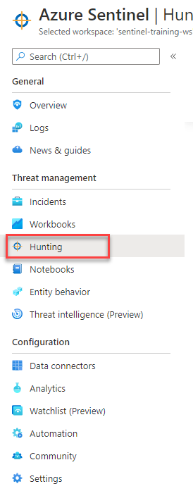

8. In the search box, type "solorigate". Select the *Solorigate Inventory check* query and click on *Run Query*.

    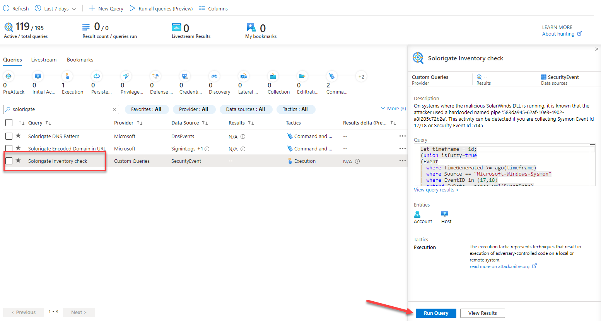

9.  You should see a total of three results. Click on **View Results**

    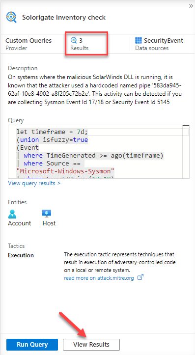

10. As you can see, besides **ClientPC**, there are two additional computers where the malicious DLL and named pipe have been found. Bookmark all three records, by selecting them with the tickboxes on the left, and clicking on **Add bookmark**.

    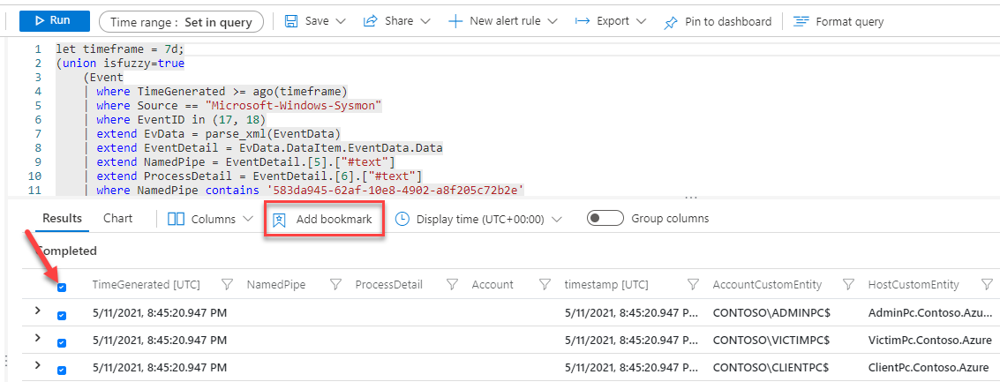

11. In the *Add bookmarks* window that appears, click on **Create** to create the bookmarks. As you can see entity mapping is already done for you.

    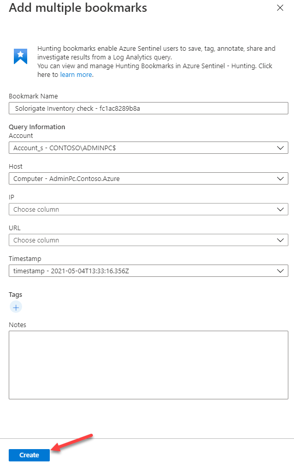

12. Wait until the operation finishes, then close the log search using the ✖ at the top right corner. This will land you in the Bookmarks tab inside the Hunting menu (navigate there if not), where you should see your two new bookmarks created. Select both of them and click on **Incident actions** at the top and then **Add to existing incident**.

    

13. From the list, pick the Solorigate incident that is assigned to you, and click *Add*.

    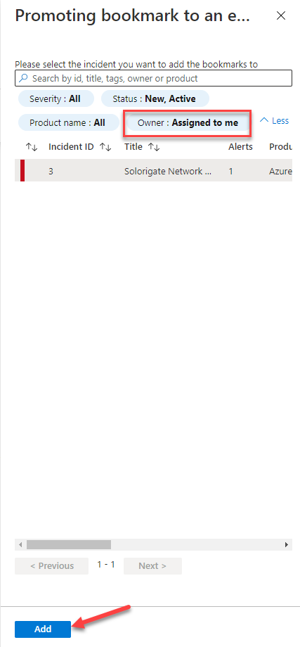

At this point you can ask the Operations team to isolate the hosts affected by this incident. **Note:** In a real SOC, this step could potentially be automated using a Playbook.

#### Add the IP to Threat Intelligence IOCs
Now, we will add the IP address related to the incident to our list of *Indicators of Compromise* (IOC) in our Sentinel workspace Threat Intelligence store, so we can capture any new occurrences of this IOC across our logs.

14. Go back to the **Incidents** view. 

15. Select the *Solorigate* incident and **copy the IP address** involved. Notice that you now have more computer entities available for selection, as they were added to the incident from the bookmarks' entities.

    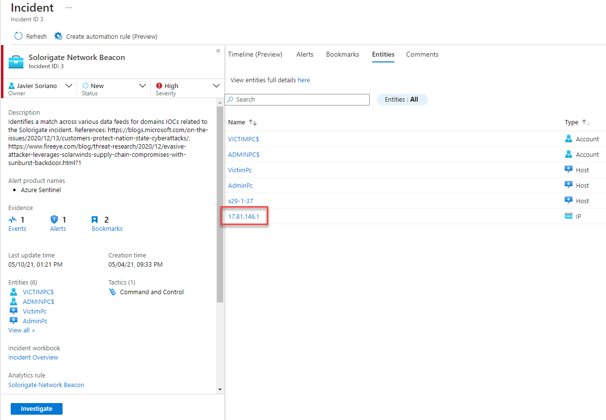

16. Go to the **Threat Intelligence** blade in Microsoft Sentinel and click **Add new** at the top.

    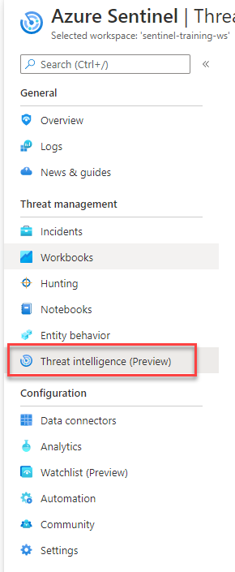

17. Enter the following details in the *New indicator* dialog, with *Valid from* being today's date and *Valid until* being two months after. Then click **Apply**.

    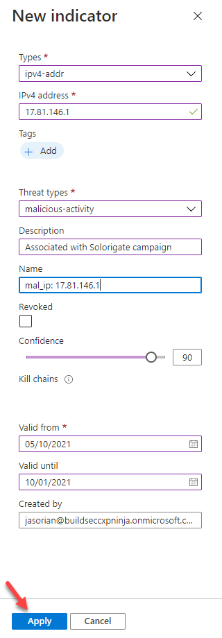

#### Hand over the incident
We will now prepare the incident for handover to another team (maybe Operations or Forensics) by ensuring what we've done is documented.

1.  Go to **Incidents** and select the *Solorigate* incident assigned to you. Click on **View full details**.

2.  Move to the **Comments** tab.

    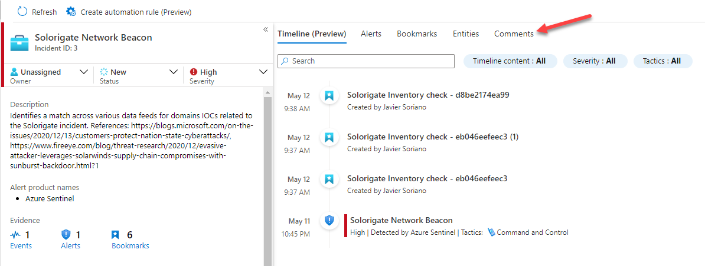

3.  Enter information about all the steps performed. 
    As an example:

    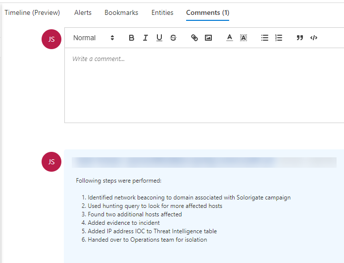

At this point you would hand over the incident to the appropriate team. You could: 
- copy the link directly from the bottom of the incident preview if communicating out-of-band
- or assign the incident directly to the person or team alias

**Congratulations, you have completed Module 4!**. You can now continue to **[Module 5 - Hunting](./Module-5-Hunting.md)**
