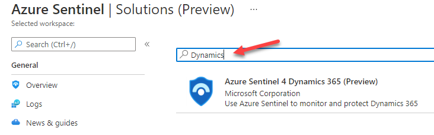

# Microsoft Sentinel Content Hub

#### 🎓 Level: 100 (Beginner)
#### ⌛ Estimated time to complete this lab: 20 minutes

## Objectives

In this module you will learn how to use the Microsoft Sentinel Content Hub to discover and deploy new content. Our official documentation on this topic is available here: [Microsoft Sentinel Content hub catalog](https://docs.microsoft.com/azure/sentinel/sentinel-solutions-catalog).

#### Prerequisites

This module assumes that you have completed [Module 1](Module-1-Setting-up-the-environment.md), as you will need a Microsoft Sentinel workspace provisioned.

### Exercise 1: Explore Microsoft Sentinel Content hub

This exercise guides you through the Content Hub catalog.

1. From the Microsoft Sentinel portal, navigate to **Content hub (Preview)** under **Content Management**.

2. In the search bar, type **Cloudflare**. You will see a single result corresponding to Cloudflare solution. You could also search using the filtering options at the top.

3. Select the Cloudflare solution. As you can see on the right pane, here we have information about this solution, like category, pricing, content types included, solution provider, version and also who supports it. Click **Install**.

4. Notice the different artifacts that are included in this solution: Data Connector, Parser, Workbook, Analytics Rules and Hunting Queries. Each Solution can contain a different set of artifacts.

5. Feel free to navigate to other solutions. In the next exercise, we will install one of them.

### Exercise 2: Deploy a new solution

This exercise explains how to install a new solution into your Microsoft Sentinel workspace.

1. From the Microsoft Sentinel portal, navigate to **Content hub (preview)** under **Content Management**

2. In the search bar, type **Dynamics**. Select on the **Continuous Threat Monitoring for Dynamics 365** solution and click **Install**

3. Notice the content being added by this solution (Data Connector, Analytics Rules, Workbook and Hunting Queries). Also notice the disclaimer, saying that the Data Connector is already in the data connectors gallery, so the solution won't deploy this data connector. Click on **Create**.

4. Select your subscription, resource group and Microsoft Sentinel workspace. Click on **Next: Workbook**.

5. In the Workbooks tab, type the name for your Workbook. Click on **Next: Analytics**.

6. Notice the different Analytics Rules that will be added to your workspace. Click **Next: Hunting Queries**.

7. Notice the Hunting Queries included in the solution. Click **Next: Review + create**.

8. A final validation will run. If everything is ok, click on **Create** button. The deployment will kick off and finish in a few seconds.

### Exercise 3: Review and enable deployed artifacts

1. Return to Microsoft Sentinel home page and navigate to **Analytics Rules**.

2. Type **Dynamics** in the search box. You should see 6 different analytics rules that look at Dynamics 365 data.

3. Notice that these rules are created in **Disabled** state. In a real-world environment, you would need to enable them.

4. Navigate to **Workbooks** under Threat Management. Switch to **My Workbooks** tab and search for Dynamics. You can see the newly deployed workbook. This should be empty unless you have enabled the Dynamics 365 connector.

5. Navigate to **Hunting** and search for dynamics. You should see 2 new queries that use data coming from Dynamics 365.

## Summary

In this module your learned how to use the Microsoft Sentinel content hub to bring new content into your workspace.

