# Microsoft Sentinel Content Hub

#### 🎓 Level: 100 (Beginner)
#### ⌛ Estimated time to complete this lab: 20 minutes

## Objectives

In this module you will learn how to use the Microsoft Sentinel Content Hub to discover and deploy new content. Our official documentation on this topic is available here: [Microsoft Sentinel Content hub catalog](https://docs.microsoft.com/azure/sentinel/sentinel-solutions-catalog).

#### Prerequisites

This module assumes that you have completed [Module 1](Module-1-Setting-up-the-environment.md), as you will need a Microsoft Sentinel workspace provisioned.

### Exercise 1: Explore the Microsoft Sentinel Content hub

This exercise guides you through the Content Hub catalog.

1. From the Microsoft Sentinel portal, navigate to **Content hub** (under **Content Management**).

    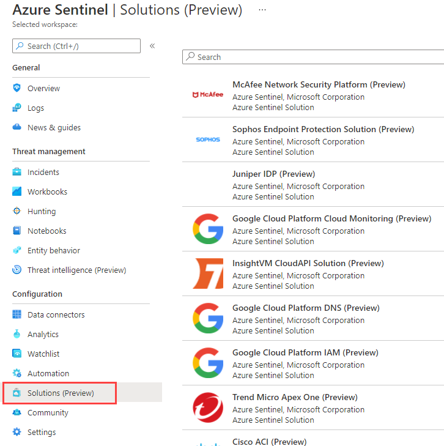

2. In the search bar, type **Cloudflare**. You will see a single result corresponding to Cloudflare solution. You could also search using the filtering options at the top.

    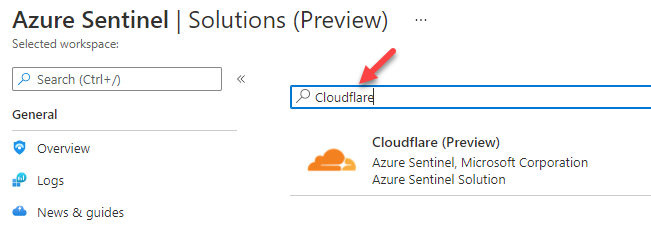

3. Select the Cloudflare solution. As you can see on the right pane, here we have information about this solution, like category, pricing, content types included, solution provider, version and also who supports it. Click **Install**.

    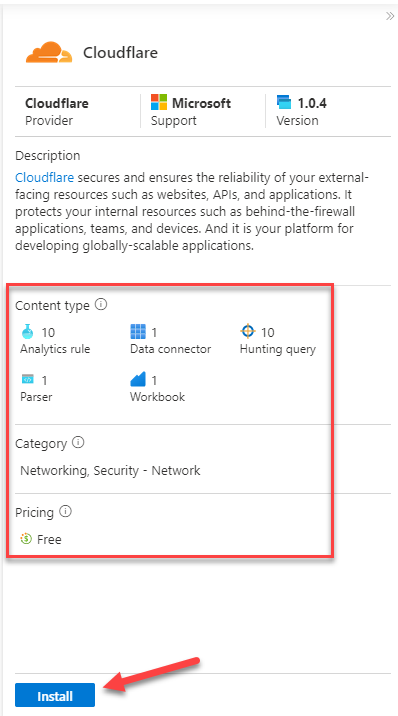

4. Notice the different artifacts that are included in this solution: Data Connector, Parser, Workbook, Analytics Rules and Hunting Queries. Each Solution can contain a different set of artifacts.

    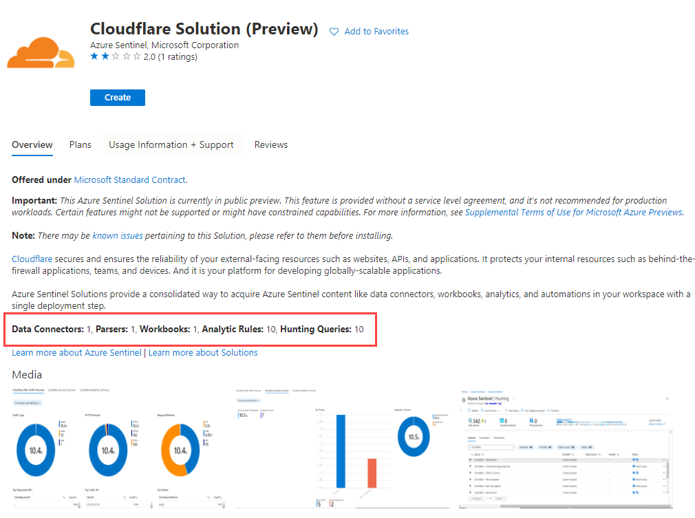

5. Feel free to navigate to other solutions. In the next exercise, we will install one of them.

### Exercise 2: Deploy content from Content Hub Catalog.

This exercice guides you through installing Standalone content and Solutions from the Content Hub catalog.

#### Task 1: Deploy standalone content items

We're going to look at a few items available standalone in the Content hub.

#### Workspace Usage Report Workbook

Find the Workspace Usage Report workbook.

#### Other useful standalone Workbooks

You can optionally search for, explore and Save these workbooks:
  
| Title                         | Description                                           |
| ------                        | ------                                                |
| **Analytics Health & Audit**  | Displays Sentinel rule execution and health 
| **AMA migration tracker**     | Helps understand how clients are connecting to the workspace
| **Insecure Protocols**        | If monitoring SecurityEvent from Windows hosts, identifies usage of poorly-secured protocols
| **SOC Handbook**              | A structured workbook you can edit to reflect your SOC processes

#### Task 2: Deploy a new Solution

This exercise explains how to install a new solution into your Microsoft Sentinel workspace.

1. From the Microsoft Sentinel portal, navigate to **Content hub** under **Content Management**

2. In the search bar, type **dynamics 365 CE**. Select the **Dynamics 365 CE Apps** solution and click **Install**

    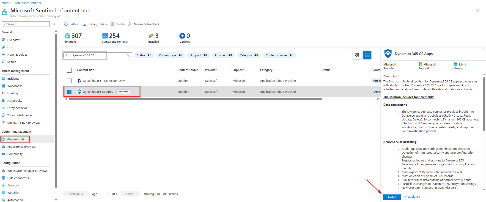

3. Click on **View Details**. Notice the content being added by this solution (Data Connector, Analytics Rules, Workbook, Hunting Queries and Watchlists). Click on **Create**.

    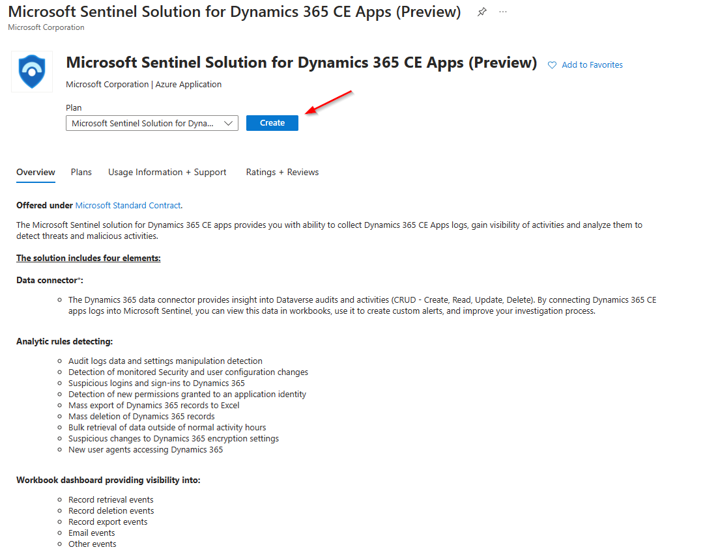

4. Select your subscription, resource group and Microsoft Sentinel workspace. Click on **Next**

    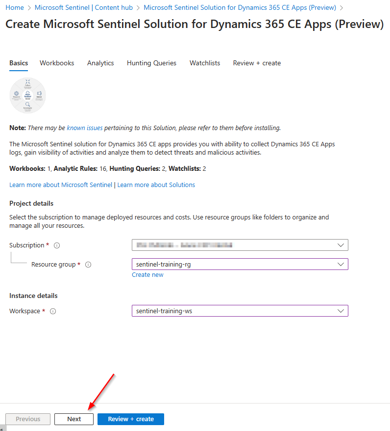

5. In the Workbooks tab, type the name for your Workbook. Click on **Next**

    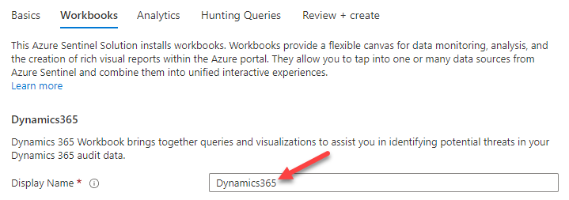

6. Notice the different Analytics Rules that will be added to your workspace. Click **Next**

7. Notice the Hunting Queries included in the solution. Click **Next**

8. Notice the Watchlists included in the solution. Click **Next**

9. A final validation will run. If everything is ok, click on **Create** button. The deployment will kick off and finish in a few seconds.

    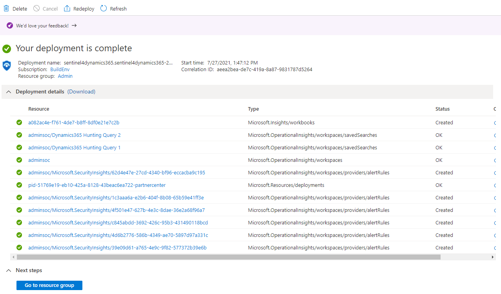

### Exercise 3: Review and enable deployed artifacts

1. Return to Microsoft Sentinel home page and navigate to **Analytics**, and go the **Rule Templates** tab.

2. Type **Dynamics** in the search box. You should see 16 different analytics rules that look at Dynamics 365 data.

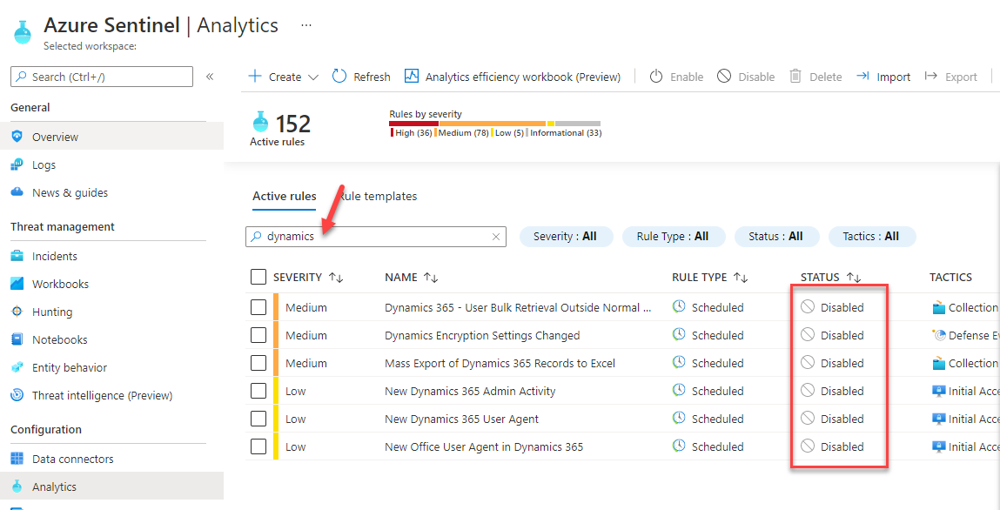

3. Notice that these rules are available as **templates**. In a real-world environment, you would need to create them in order to use them.

4. Navigate to **Workbooks** under Threat Management. Search for Dynamics. Like the analytics rules the workbook exists as a template,. This should be empty unless you have enabled the Dynamics 365 connector.

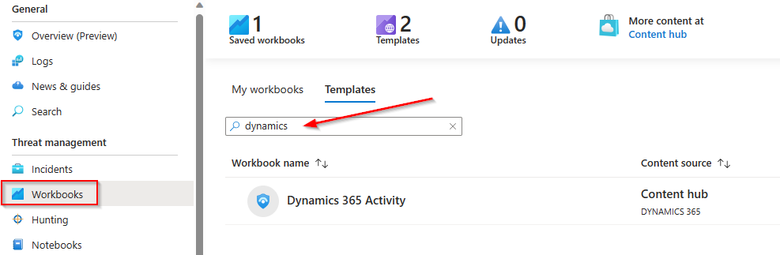

5. Navigate to **Hunting**,  go to **Queries** tab and search for **dynamics 365**. You should see 2 new queries that use data coming from Dynamics 365.

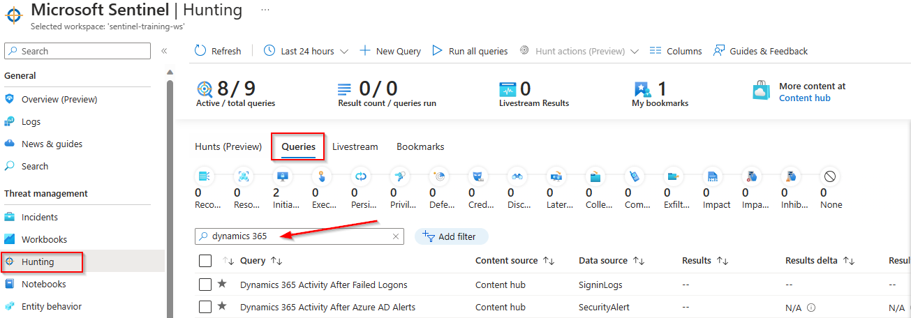

6. Navigate to **Watchlist** under Configuration. Search for **d365**. Notice you have two new watchlists.

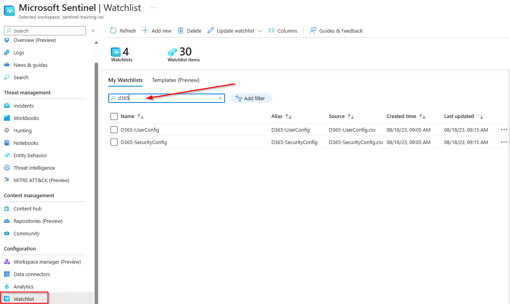
   
## Summary

In this module your learned how to use the Microsoft Sentinel content hub to bring new content into your workspace.

