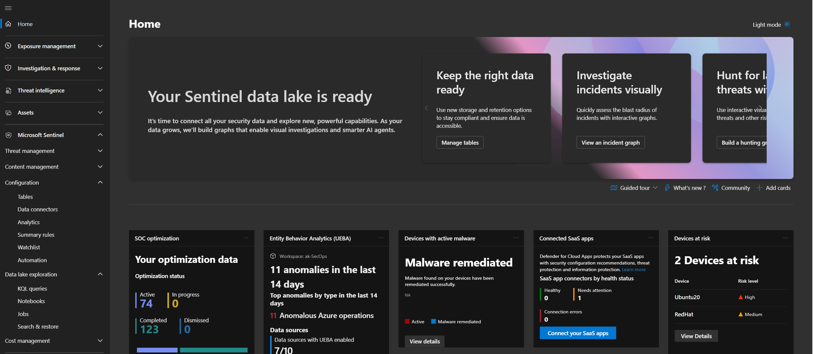
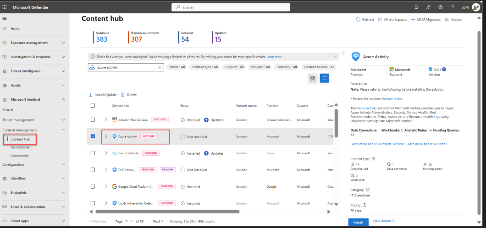
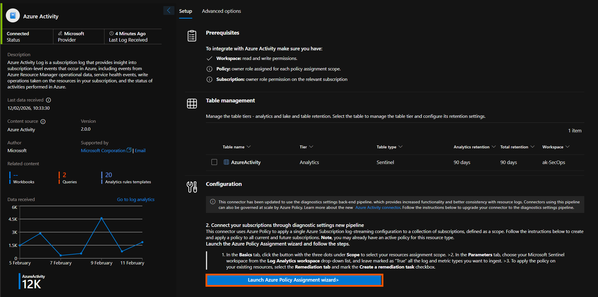
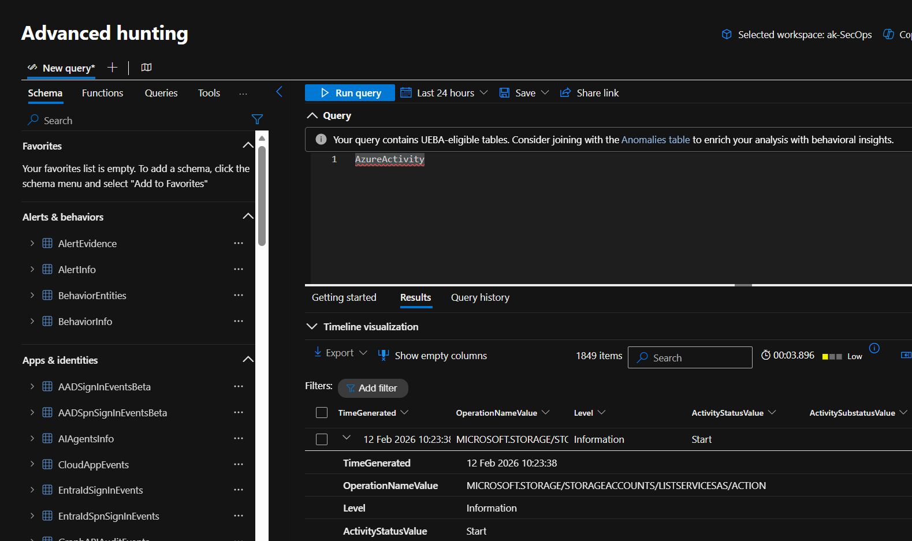

# Onboarding — Setting up the environment

#### 🎓 Level: 100 (Beginner)
#### ⌛ Estimated time to complete this lab: 30 minutes

## Objectives

In this exercise you will onboard Microsoft Sentinel, install a solution from the content hub, set up a data connector, and deploy the Training Lab solution that is used in all subsequent exercises.

## Prerequisites

Make sure you have completed the [Prerequisites](../README.md#prerequisites) and [Custom Detection Rules Setup](../README.md#custom-detection-rules-setup) sections in the README before starting.

> For Microsoft's full predeployment checklist, see [Prerequisites for deploying Microsoft Sentinel](https://learn.microsoft.com/en-us/azure/sentinel/prerequisites).

---

## Exercise 1: Create a Log Analytics workspace

Microsoft Sentinel runs on top of a Log Analytics workspace. If you already have one you'd like to use, skip to [Exercise 2](#exercise-2-add-microsoft-sentinel-to-your-workspace).

1. Sign in to the [Azure portal](https://portal.azure.com/).
2. In the top search bar, type **Sentinel** and select **Microsoft Sentinel**.
3. Select **Create**.
4. Select **Create a new workspace**.
5. Fill out the form:
   - **Subscription** — choose the Azure subscription for the lab.
   - **Resource Group** — select an existing group or create a new one (recommended).
   - **Workspace Name** — provide a name (4-63 letters, digits, or `-`; the `-` must not be the first or last character). Example: `sentinel-training-ws`.
   - **Region** — select the Azure region where the lab will run. See [supported regions](https://azure.microsoft.com/regions/services/).
6. Select **Review + Create**, then **Create** after validation passes.

> **Tip:** You may have a default 30-day retention on the Log Analytics workspace. To use all Microsoft Sentinel features, raise the retention to at least 90 days. See [Configure data retention and archive policies](https://learn.microsoft.com/en-us/azure/azure-monitor/logs/data-retention-configure).

---

## Exercise 2: Add Microsoft Sentinel to your workspace

1. From the [Azure portal](https://portal.azure.com/), search for and select **Microsoft Sentinel**.


2. Select **Create**.


3. Select the workspace you created in Exercise 1 and select **Add**.

> **Note:** Default workspaces created by Microsoft Defender for Cloud are not shown in the list. Once deployed on a workspace, Microsoft Sentinel does not support moving that workspace to another resource group or subscription.

> If your workspace is automatically onboarded to the Defender portal, you can continue the remaining exercises from the Defender portal. If this is your first time, there may be a delay of a few minutes while provisioning completes.

---

## Exercise 3: Access Microsoft Sentinel in the Defender portal

1. Sign in to the [Microsoft Defender portal](https://security.microsoft.com/).
2. Once provisioned, you'll see **Microsoft Sentinel** in the navigation pane with its nodes nested within.


3. Scroll down and select **Settings > Microsoft Sentinel > Workspaces** to verify your workspace is onboarded and available. Click **Connect**


> The Defender portal supports multiple workspaces with one acting as the primary per tenant. For more information, see [Multiple workspaces in the Defender portal](https://learn.microsoft.com/en-us/azure/sentinel/workspaces-defender-portal).

---

## Exercise 4: Install a solution from the Content Hub

The Content Hub is the centralized location to discover and manage out-of-the-box content including data connectors. For this exercise, install the solution for **Azure Activity**.

1. In Microsoft Sentinel, browse to the **Content hub** page.
2. Search for and select the **Azure Activity** solution.
3. In the solution details pane, select **Install**.



---

## Exercise 5: Set up the data connector

Microsoft Sentinel ingests data from services and apps by connecting to them and forwarding events and logs. For this exercise, configure the **Azure Activity** data connector.

1. In Microsoft Sentinel, select **Configuration > Data connectors**.
2. Search for and select the **Azure Activity** data connector.


3. In the connector details pane, select **Open connector page** and follow the instructions:
   1. Select **Launch Azure Policy Assignment Wizard**.
   2. On the **Basics** tab, set the **Scope** to the subscription and resource group that has activity to send to Microsoft Sentinel.
   3. On the **Parameters** tab, set the **Primary Log Analytics workspace** to the workspace where Microsoft Sentinel is installed.
   4. Select **Review + create**, then **Create**.

---

## Exercise 6: Generate activity data

Enable an analytics rule included in the Azure Activity solution to generate some activity data.

1. In Microsoft Sentinel, select **Content hub** and search for the **Suspicious Resource deployment** rule template in the Azure Activity solution.
2. In the details pane, select **Create rule**.
3. In the Analytics rule wizard, change the **Status** to **Enabled**. Leave all other defaults.
4. On the **Review and create** tab, select **Create**.

---

## Exercise 7: View data ingested into Microsoft Sentinel

1. In Microsoft Sentinel, select **Configuration > Data connectors** and open the **Azure Activity** connector page.
2. Verify the **Status** is **Connected**.
3. From the Defender portal, go to **Advanced hunting**, add a new query tab, and run:

```kql
AzureActivity
```

You should see Azure Activity events flowing into the workspace.



---

## Exercise 8: Deploy the Microsoft Sentinel Training Lab Solution

Now that your workspace is ready, deploy the Training Lab solution. This will ingest pre-recorded telemetry (~20 MB) and create several artifacts (analytics rules, workbooks, watchlists, playbooks) used in the subsequent exercises.

Make sure you have completed all the setup from the [README](../README.md) — including the **Custom Detection Rules Setup** (either Option A — UAMI or Option B — Service Principal with `CustomDetection.ReadWrite.All` permission). You will need the credentials from your chosen option during deployment.

Click the button below to deploy directly into your Azure subscription:

[](https://portal.azure.com/#create/Microsoft.Template/uri/https%3A%2F%2Fraw.githubusercontent.com%2FAzure%2FAzure-Sentinel%2Fmaster%2FSolutions%2FTraining%2FMicrosoft-Sentinel-Training-Lab%2FPackage%2FmainTemplate.json)

1. In the deployment form, select the **Subscription**, **Resource Group**, and **Workspace** from the previous exercises.
2. Under **Detection Rules Auth Method**, choose your preferred option:
   - **User-Assigned Managed Identity** — paste the UAMI's full resource ID.
   - **Service Principal (App Registration)** — enter the Tenant ID, Client ID, and Client Secret.
   - **None** — skip custom detection rules deployment.
3. Optionally review the different tabs (Workbooks, Analytics, Hunting Queries, Watchlists, Playbooks).
4. Select **Review + create**, then **Create**.

> **Note:** The deployment takes approximately **15 minutes**. This includes ingesting all the pre-recorded data so it's ready when deployment finishes.

4. Once the deployment completes, go back to Microsoft Sentinel and select your workspace. On the home page you should see ingested data and several recent incidents. If incidents don't appear immediately, wait a few minutes for them to be raised.

> **⚠️ Playbook Permissions:** The deployment creates a Logic App playbook with a **System-Assigned Managed Identity**. For the playbook to run automatically on incidents, you must grant this Managed Identity the **Microsoft Sentinel Contributor** role on the resource group (or workspace). Without this, the playbook will fail to execute.
>
> To assign the role:
> 1. Go to the **Resource Group** → **Access control (IAM)** → **Add role assignment**.
> 2. Select **Microsoft Sentinel Contributor**.
> 3. Under **Assign access to**, choose **Managed identity** → select the Logic App's managed identity.
> 4. Click **Save**.


## Next steps

Congratulations, you have completed the onboarding exercise! You can now continue to the next exercise:

- **[Exercise 1 — Exploration: Hunting Across Your Data](./E01_exploration.md)**

### Learn more

- [Quickstart: Onboard Microsoft Sentinel](https://learn.microsoft.com/en-us/azure/sentinel/quickstart-onboard?tabs=defender-portal)
- [Visualize collected data](https://learn.microsoft.com/en-us/azure/sentinel/get-visibility)
- [Detect threats using analytics rules](https://learn.microsoft.com/en-us/azure/sentinel/tutorial-log4j-detection)
- [Connect data using data connectors (Training module)](https://learn.microsoft.com/en-us/training/modules/connect-data-to-azure-sentinel-with-data-connectors/)
