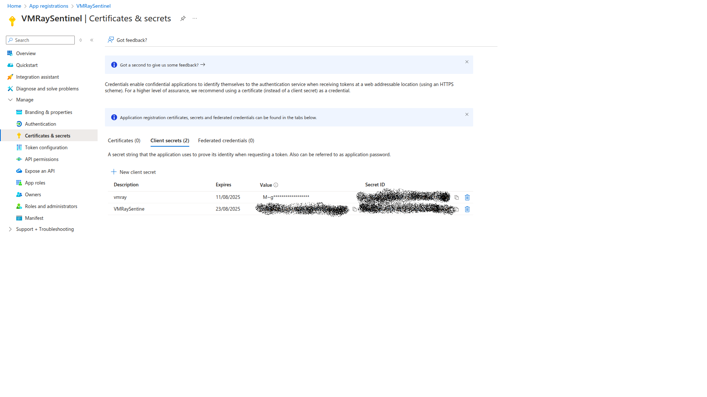
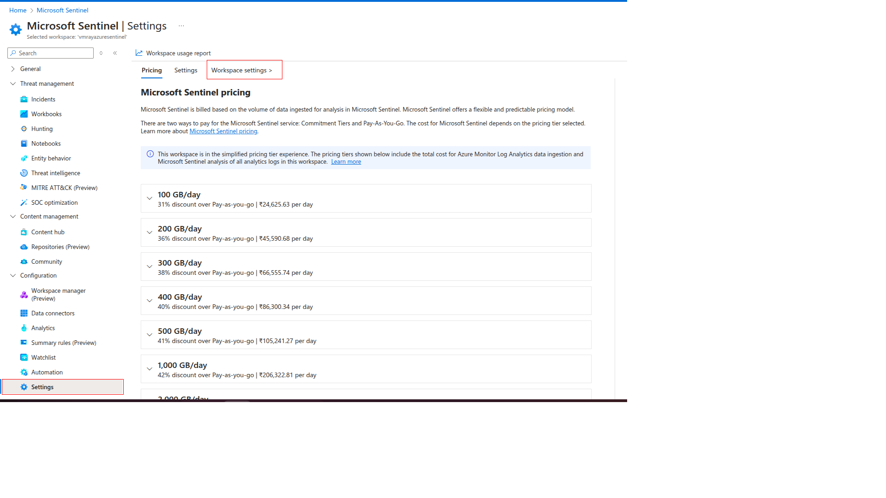
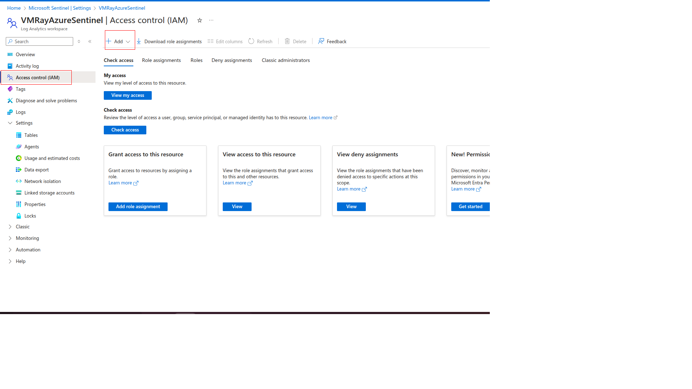
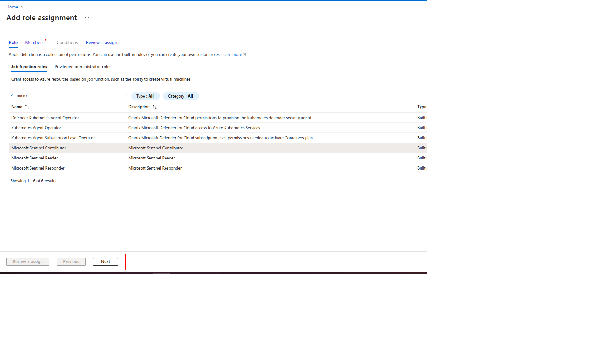
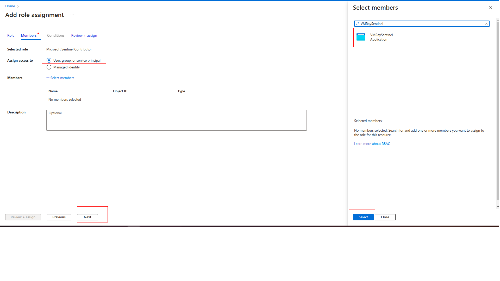
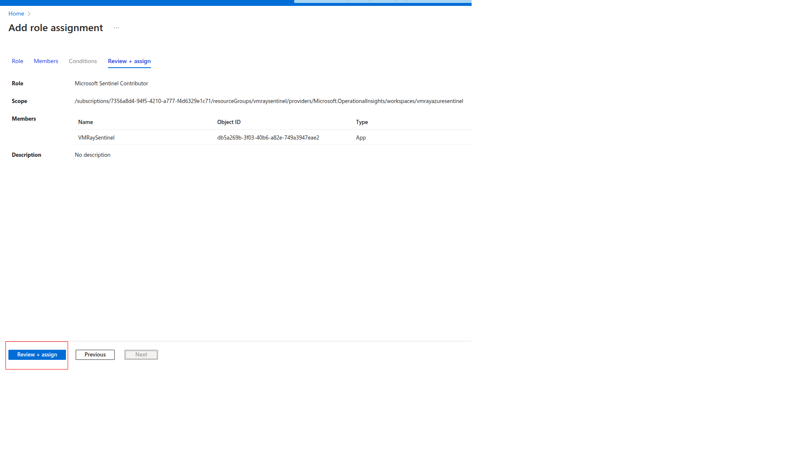
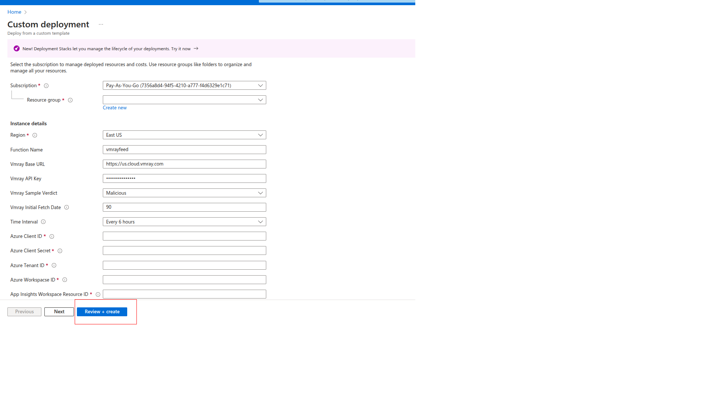
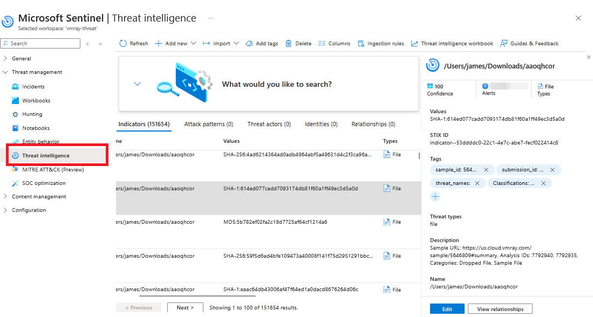
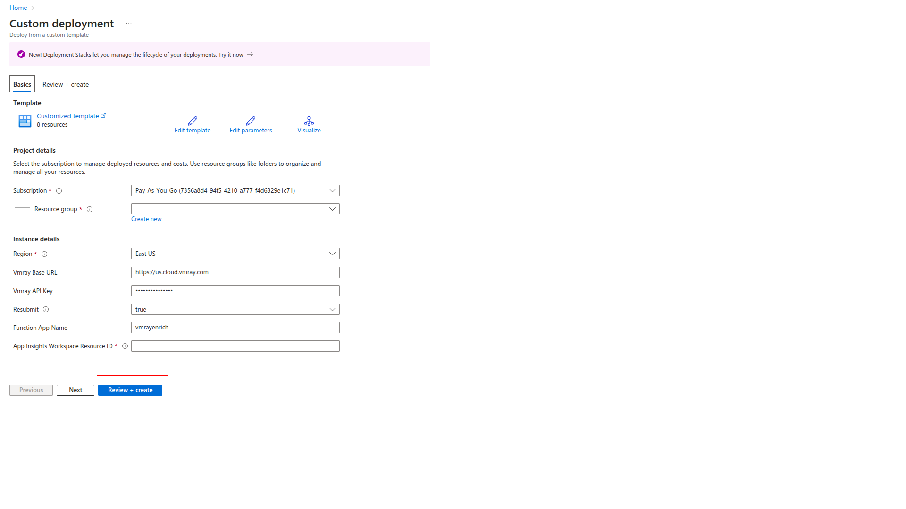
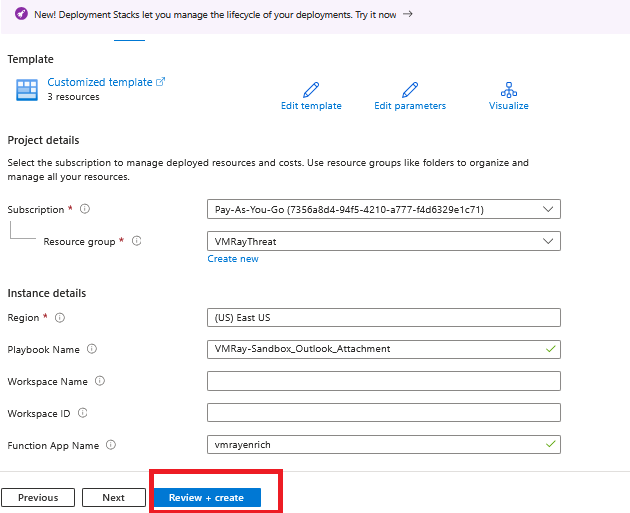

# VMRay Threat Intelligence Feed and Enrichment Integration - Microsoft Sentinel

**Latest Version:** **3.0.2** - **Release Date:** **2026-08-13**

## Overview

## Requirements
- Microsoft Sentinel.
- VMRay Analyzer, VMRay FinalVerdict, VMRay TotalInsight.
- Microsoft Azure
  1. Azure functions with Flex Consumption plan.
     Reference: https://learn.microsoft.com/en-us/azure/azure-functions/flex-consumption-plan
     
	 **Note:** Flex Consumption plans are not available in all regions, please check if the region your are deploying the function is supported, if not we suggest you to deploy the function app with premium plan.
	 Reference: https://learn.microsoft.com/en-us/azure/azure-functions/flex-consumption-how-to?tabs=azure-cli%2Cvs-code-publish&pivots=programming-language-python#view-currently-supported-regions
  3. Azure functions Premium plan.
	 Reference: https://learn.microsoft.com/en-us/azure/azure-functions/functions-premium-plan
  4. Azure Logic App with Consumption plan.
     Reference: https://learn.microsoft.com/en-us/azure/logic-apps/logic-apps-pricing#consumption-multitenant
  5. Azure storage with Standard general-purpose v2.

## VMRay Configurations

- In VMRay Console, you must create a Connector API key.Create it by following the steps below:
  
  1. Create a user dedicated for this API key (to avoid that the API key is deleted if an employee leaves)
  2. Create a role that allows to "View shared submission, analysis and sample" and "Submit sample, manage own jobs, reanalyse old analyses and regenerate analysis reports".
  3. Assign this role to the created user
  4. Login as this user and create an API key by opening Settings > Analysis > API Keys.
  5. Please save the keys, which will be used in configuring the Azure Function.

     
## Microsoft Sentinel

### Creating Application for API Access

- Open [https://portal.azure.com/](https://portal.azure.com) and search `Microsoft Entra ID` service.

- Click `Add->App registration`.

- Enter the name of application and select supported account types and click on `Register`.

- In the application overview you can see `Application Name`, `Application ID` and `Tenant ID`.
 

- After creating the application, we need to set API permissions for connector. For this purpose,
  - Click `Manage->API permissions` tab
  - Click `Microsoft Graph` button
  - Search `indicator` and click on the `ThreatIndicators.ReadWrite.OwnedBy`, click `Add permissions` button below.
  - Click on `Grant admin consent`

  

- We need secrets to access programmatically. For creating secrets
  - Click `Manage->Certificates & secrets` tab
  - Click `Client secrets` tab
  - Click `New client secret` button
  - Enter description and set expiration date for secret

- Use Secret `Value` to configure connector.
  
 

## Provide Permission To App Created Above

- Open [https://portal.azure.com/](https://portal.azure.com) and search `Microsoft Sentinel` service.
- Goto `Settings` -> `Workspace Setting`

- Goto `Access Control(IAM)` -> `Add`

- Search for `Microsoft Sentinel Contributor` and click `Next`

- Select `User,group or service principle` and click on `select members`.
- Search for the app name created above and click on `select`.
- Click on `Next`

- Click on `Review + assign`

# Deploy VMRay Threat Intelligence Feed Function App Connector

### Flex Consumption Plan 
- Click on below button to deploy with Flex Consumption plan:

  

### Premium Plan
- Click on below button to deploy with Premium plan:

  

- It will redirect to feed Configuration page.
  
- Please provide the values accordingly.
  
|       Fields       |   Description |
|:---------------------|:--------------------
| Subscription		| Select the appropriate Azure Subscription    | 
| Resource Group 	| Select the appropriate Resource Group |
| Region			| Based on Resource Group this will be uto populated |
| Function Name		| Please provide a function name if needed to change the default value|
| Vmray Base URL | VMRay Base URL |
| Vmray API Key | VMRay API Key |
| Azure Client ID   | Enter the Azure Client ID created in the App Registration Step |
| Azure Client Secret | Enter the Azure Client Secret created in the App Registration Step |
|Azure Tenant ID | Enter the Azure Tenant ID of the App Registration |
| Azure Workspace ID   | Enter the Azure Workspace ID. Go to  `Log Analytics workspace -> Overview`, Copy `Workspace ID`, refer below image.|
| App Insights Workspace Resource ID | Go to `Log Analytics workspace` -> `Settings` -> `Properties`, Copy `Resource ID` and paste here |

- Once you provide the above values, please click on `Review + create` button.

- Once the threat intelligence function app connector is succussefully deployed, the connector saves the IOCS into the Microsoft Sentinel Threat Intelligence.

## Deploy VMRay Enrichment Function App Connector

- Click on below button to deploy 

  
  
- It will redirect to feed Configuration page.

- Please provide the values accordingly
  
|       Fields       |   Description |
|:---------------------|:--------------------
| Subscription		| Select the appropriate Azure Subscription    | 
| Resource Group 	| Select the appropriate Resource Group |
| Region			| Based on Resource Group this will be uto populated |
| Function Name		| Please provide a function name if needed to change the default value|
| Vmray Base URL | VMRay Base URL |
| Vmray API Key | VMRay API Key |
| Resubmit   | If true file will be resubmitted to VMRay |
| App Insights Workspace Resource ID | Go to `Log Analytics workspace` -> `Settings` -> `Properties`, Copy `Resource ID` and paste here |

- Once you provide the above values, please click on `Review + create` button.

## Deploy VMRay Enrichment Logic Apps

### `Submit-URL-VMRay-Analyzer` Logic App

- This playbook can be used to enrich sentinel incidents, this playbook when configured to trigger on seninel incidents, the playbook will collect all the `URL` entities from the Incident and submits them to VMRay analyzer, once the submission is completed, it will add the VMRay Analysis report to the Incident and creates the IOCs in the microsoft seninel threat intelligence.

- Click on below button to deploy
  

- It will redirect to configuration page

- Please provide the values accordingly

|       Fields       |   Description |
|:---------------------|:--------------------
| Subscription		| Select the appropriate Azure Subscription    | 
| Resource Group 	| Select the appropriate Resource Group |
| Region			| Based on Resource Group this will be uto populated |
| Playbook Name		| Please provide a playbook name, if needed |
| Workspace ID		| Please provide Log Analytics Workspace ID |
| Function App Name		| Please provide the VMRay enrichment function app name |
| Whitelisted URL Domains	| Optional. Comma-separated list of domains whose URLs are never submitted to VMRay, e.g. `microsoft.com,google.com`. Matching is case-insensitive and also skips subdomains of a listed domain (up to four labels deep, e.g. `a.b.example.com` matches `example.com`). Leave empty to submit every URL. |

- Once you provide the above values, please click on `Review + create` button.

### `VMRay-Sandbox_Outlook_Attachment` Logic App

- This playbook can be used to enrich outlook attachments. When configured, it collects all the `attachments` from the email and submits them to VMRay analyzer. Once a submission is completed, the playbook writes the VMRay analysis result to a Log Analytics custom table (`VMRaySubmissions_CL`) through the Logs Ingestion API, creates the IOCs in the Microsoft Sentinel threat intelligence, and emails the analysis report.

- **How the incident is created.** The playbook no longer creates the incident itself. The same template also deploys a scheduled analytics rule, `VMRay - Malicious or suspicious email attachment`, which runs every 5 minutes over `VMRaySubmissions_CL` and raises an alert for every row whose verdict is `malicious` or `suspicious`. Because the incident now originates from an analytics rule that carries `File` and `FileHash` entity mappings, it is correlated by Microsoft and surfaces in **both** the Microsoft Sentinel and the Microsoft Defender portal incident queues - a playbook-created incident only ever appeared in Microsoft Sentinel. Alerts are grouped by `FileHash` over a 5 hour lookback, so repeated submissions of the same attachment fold into a single incident.

- A single deployment of this template creates the custom table, the Data Collection Endpoint, the Data Collection Rule, the two API connections, the playbook and the analytics rule.

> **Note:** The playbook's managed identity must be granted the `Monitoring Metrics Publisher` role on the Data Collection Rule before any result can reach the custom table. Without it the ingestion call fails with `403` and no incident is ever created - see [Provide Permission to Logic app](#provide-permission-to-logic-app).

- Click on below button to deploy
  

- It will redirect to configuration page

- Please provide the values accordingly

|       Fields       |   Description |
|:---------------------|:--------------------
| Subscription		| Select the appropriate Azure Subscription    | 
| Resource Group 	| Select the appropriate Resource Group |
| Region			| Based on Resource Group this will be uto populated |
| Playbook Name		| Please provide a playbook name, if needed |
| Workspace Name		| Please provide Log Analytics Workspace Name. The workspace must be in the same Resource Group, since the custom table, the Data Collection Rule and the analytics rule are created against it |
| Workspace ID		| Please provide Log Analytics Workspace ID |
| Function App Name		| Please provide the VMRay enrichment function app name |
| Table Name		| Log Analytics custom table the analysis results are written to. Must end with `_CL`. Default `VMRaySubmissions_CL` |
| Data Collection Endpoint Name	| Name of the Data Collection Endpoint created by this template. Default `vmray-dce` |
| Data Collection Rule Name	| Name of the Data Collection Rule created by this template. Default `vmray-submissions-dcr` |
| Retention In Days		| Interactive retention for the custom table, in days. Default `30` |
| Analytic Rule Guid		| Stable GUID for the analytics rule. **Keep this value unchanged across redeployments** - if it changes, a redeployment creates a duplicate rule instead of updating the existing one |
| Analytic Rule Severity	| Severity assigned to the generated alerts and incidents. One of `Informational`, `Low`, `Medium`, `High`. Default `Medium` |
| Analytic Rule Enabled		| Whether the analytics rule is enabled on deployment. Default `true`. Set to `false` to deploy the rule without turning it on |

- Once you provide the above values, please click on `Review + create` button.

## Provide Permission to Logic app

The playbook's system-assigned managed identity needs the role assignments below. The `Submit-URL-VMRay-Analyzer` playbook needs only the first one; the `VMRay-Sandbox_Outlook_Attachment` playbook needs **both**.

### 1. `Microsoft Sentinel Contributor` on the Log Analytics workspace

This allows the playbook to upload the VMRay IOCs to the Microsoft Sentinel threat intelligence.

- Open [https://portal.azure.com/](https://portal.azure.com) and search `Microsoft Sentinel` service.
- Goto `Settings` -> `Workspace Setting`

- Goto `Access Control(IAM)` -> `Add`

- Search for `Microsoft Sentinel Contributor` and click `Next`

- Select `Managed Identity` and click on `select members` .
- Search for the Logic app name deployed above and click on `select`.
- Click on `Next` 

- Click on `Review + assign`

### 2. `Monitoring Metrics Publisher` on the Data Collection Rule

**Required for the `VMRay-Sandbox_Outlook_Attachment` playbook.** This allows the playbook to write its analysis results to the `VMRaySubmissions_CL` custom table through the Logs Ingestion API, which is what the analytics rule reads to create the incident.

- Open [https://portal.azure.com/](https://portal.azure.com) and search `Data collection rules`.
- Open the rule created by the playbook template - `vmray-submissions-dcr` by default, or the value you entered in the `Data Collection Rule Name` field.
- Goto `Access control (IAM)` -> `Add` -> `Add role assignment`
- Search for `Monitoring Metrics Publisher` and click `Next`
- Select `Managed Identity` and click on `select members`.
- Select `Logic app` as the managed identity type, search for the Logic app name deployed above and click on `select`.
- Click on `Next`, then click on `Review + assign`

> **Note:** Without this role the playbook's `Send Result To Log Analytics` action fails with `403 (Forbidden)`, nothing is written to `VMRaySubmissions_CL`, and the analytics rule therefore never fires - **no incident is created**. If submissions succeed in VMRay but no incident appears in Microsoft Sentinel or the Microsoft Defender portal, verify this role assignment first.

