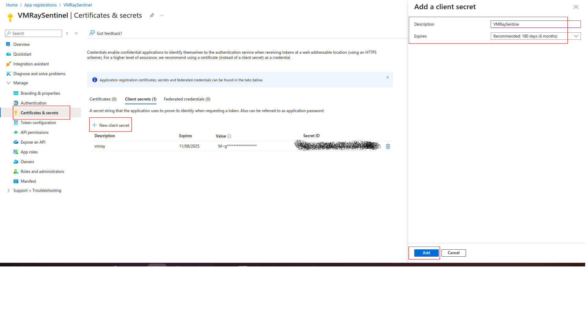
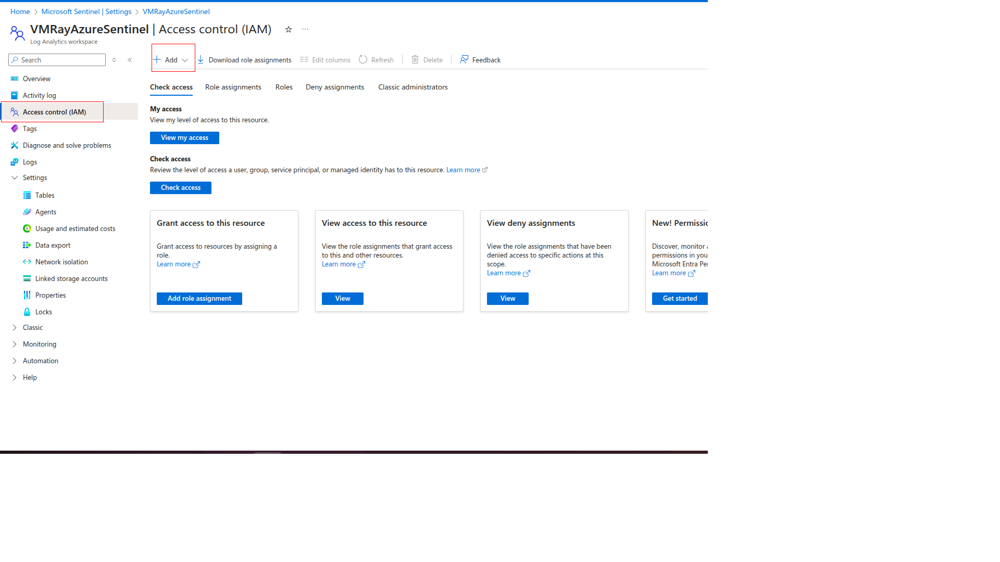
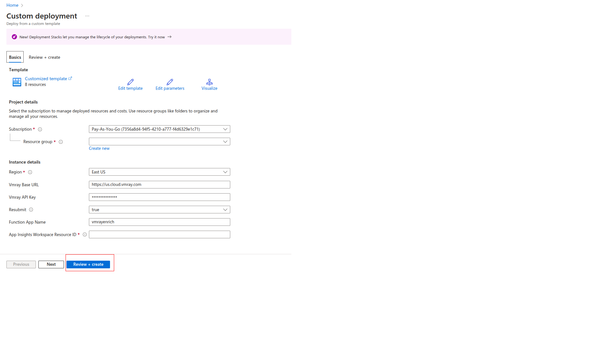

# VMRay Threat Intelligence Feed and Enrichment Integration - Microsoft Sentinel

**Latest Version:** **3.0.1** - **Release Date:** **2025-11-07**

## Overview

## Requirements
- Microsoft Sentinel.
- VMRay Analyzer, VMRay FinalVerdict, VMRay TotalInsight.
- Microsoft Azure
  1. Azure functions with Flex Consumption plan.
     Reference: https://learn.microsoft.com/en-us/azure/azure-functions/flex-consumption-plan
     
	 **Note:** Flex Consumption plans are not available in all regions, please check if the region your are deploying the function is supported, if not we suggest you to deploy the function app with premium plan.
	 Reference: https://learn.microsoft.com/en-us/azure/azure-functions/flex-consumption-how-to?tabs=azure-cli%2Cvs-code-publish&pivots=programming-language-python#view-currently-supported-regions
  3. Azure functions Premium plan.
	 Reference: https://learn.microsoft.com/en-us/azure/azure-functions/functions-premium-plan
  4. Azure Logic App with Consumption plan.
     Reference: https://learn.microsoft.com/en-us/azure/logic-apps/logic-apps-pricing#consumption-multitenant
  5. Azure storage with Standard general-purpose v2.

## VMRay Configurations

- In VMRay Console, you must create a Connector API key.Create it by following the steps below:
  
  1. Create a user dedicated for this API key (to avoid that the API key is deleted if an employee leaves)
  2. Create a role that allows to "View shared submission, analysis and sample" and "Submit sample, manage own jobs, reanalyse old analyses and regenerate analysis reports".
  3. Assign this role to the created user
  4. Login as this user and create an API key by opening Settings > Analysis > API Keys.
  5. Please save the keys, which will be used in configuring the Azure Function.

     
## Microsoft Sentinel

### Creating Application for API Access

- Open [https://portal.azure.com/](https://portal.azure.com) and search `Microsoft Entra ID` service.

- Click `Add->App registration`.

- Enter the name of application and select supported account types and click on `Register`.

- In the application overview you can see `Application Name`, `Application ID` and `Tenant ID`.
 

- After creating the application, we need to set API permissions for connector. For this purpose,
  - Click `Manage->API permissions` tab
  - Click `Microsoft Graph` button
  - Search `indicator` and click on the `ThreatIndicators.ReadWrite.OwnedBy`, click `Add permissions` button below.
  - Click on `Grant admin consent`

  

- We need secrets to access programmatically. For creating secrets
  - Click `Manage->Certificates & secrets` tab
  - Click `Client secrets` tab
  - Click `New client secret` button
  - Enter description and set expiration date for secret

- Use Secret `Value` to configure connector.
  
 

## Provide Permission To App Created Above

- Open [https://portal.azure.com/](https://portal.azure.com) and search `Microsoft Sentinel` service.
- Goto `Settings` -> `Workspace Setting`

- Goto `Access Control(IAM)` -> `Add`

- Search for `Microsoft Sentinel Contributor` and click `Next`

- Select `User,group or service principle` and click on `select members`.
- Search for the app name created above and click on `select`.
- Click on `Next`

- Click on `Review + assign`

# Deploy VMRay Threat Intelligence Feed Function App Connector

### Flex Consumption Plan 
- Click on below button to deploy with Flex Consumption plan:

  

### Premium Plan
- Click on below button to deploy with Premium plan:

  

- It will redirect to feed Configuration page.
  
- Please provide the values accordingly.
  
|       Fields       |   Description |
|:---------------------|:--------------------
| Subscription		| Select the appropriate Azure Subscription    | 
| Resource Group 	| Select the appropriate Resource Group |
| Region			| Based on Resource Group this will be uto populated |
| Function Name		| Please provide a function name if needed to change the default value|
| Vmray Base URL | VMRay Base URL |
| Vmray API Key | VMRay API Key |
| Azure Client ID   | Enter the Azure Client ID created in the App Registration Step |
| Azure Client Secret | Enter the Azure Client Secret created in the App Registration Step |
|Azure Tenant ID | Enter the Azure Tenant ID of the App Registration |
| Azure Workspace ID   | Enter the Azure Workspace ID. Go to  `Log Analytics workspace -> Overview`, Copy `Workspace ID`, refer below image.|
| App Insights Workspace Resource ID | Go to `Log Analytics workspace` -> `Settings` -> `Properties`, Copy `Resource ID` and paste here |

- Once you provide the above values, please click on `Review + create` button.

- Once the threat intelligence function app connector is succussefully deployed, the connector saves the IOCS into the Microsoft Sentinel Threat Intelligence.

## Deploy VMRay Enrichment Function App Connector

- Click on below button to deploy 

  
  
- It will redirect to feed Configuration page.

- Please provide the values accordingly
  
|       Fields       |   Description |
|:---------------------|:--------------------
| Subscription		| Select the appropriate Azure Subscription    | 
| Resource Group 	| Select the appropriate Resource Group |
| Region			| Based on Resource Group this will be uto populated |
| Function Name		| Please provide a function name if needed to change the default value|
| Vmray Base URL | VMRay Base URL |
| Vmray API Key | VMRay API Key |
| Resubmit   | If true file will be resubmitted to VMRay |
| App Insights Workspace Resource ID | Go to `Log Analytics workspace` -> `Settings` -> `Properties`, Copy `Resource ID` and paste here |

- Once you provide the above values, please click on `Review + create` button.

## Deploy VMRay Enrichment Logic Apps

### `Submit-URL-VMRay-Analyzer` Logic App

- This playbook can be used to enrich sentinel incidents, this playbook when configured to trigger on seninel incidents, the playbook will collect all the `URL` entities from the Incident and submits them to VMRay analyzer, once the submission is completed, it will add the VMRay Analysis report to the Incident and creates the IOCs in the microsoft seninel threat intelligence.

- Click on below button to deploy
  

- It will redirect to configuration page

- Please provide the values accordingly

|       Fields       |   Description |
|:---------------------|:--------------------
| Subscription		| Select the appropriate Azure Subscription    | 
| Resource Group 	| Select the appropriate Resource Group |
| Region			| Based on Resource Group this will be uto populated |
| Playbook Name		| Please provide a playbook name, if needed |
| Workspace ID		| Please provide Log Analytics Workspace ID |
| Function App Name		| Please provide the VMRay enrichment function app name |

- Once you provide the above values, please click on `Review + create` button.

### `VMRay-Sandbox_Outlook_Attachment` Logic App

- This playbook can be used to enrich outlook attachements, this playbook when configured will collect all the `attachements` from the email and submits them to VMRay analyzer, once the submission is completed, it will add the VMRay Analysis report by creating an Incident and creates the IOCs in the microsoft seninel threat intelligence.

- Click on below button to deploy
  

- It will redirect to configuration page

- Please provide the values accordingly

|       Fields       |   Description |
|:---------------------|:--------------------
| Subscription		| Select the appropriate Azure Subscription    | 
| Resource Group 	| Select the appropriate Resource Group |
| Region			| Based on Resource Group this will be uto populated |
| Playbook Name		| Please provide a playbook name, if needed |
| Workspace Name		| Please provide Log Analytics Workspace Name |
| Workspace ID		| Please provide Log Analytics Workspace ID |
| Function App Name		| Please provide the VMRay enrichment function app name |

- Once you provide the above values, please click on `Review + create` button.

## Provide Permission to Logic app

- Open [https://portal.azure.com/](https://portal.azure.com) and search `Microsoft Sentinel` service.
- Goto `Settings` -> `Workspace Setting`

- Goto `Access Control(IAM)` -> `Add`

- Search for `Microsoft Sentinel Contributor` and click `Next`

- Select `Managed Identity` and click on `select members` .
- Search for the Logic app name deployed above and click on `select`.
- Click on `Next` 

- Click on `Review + assign`

