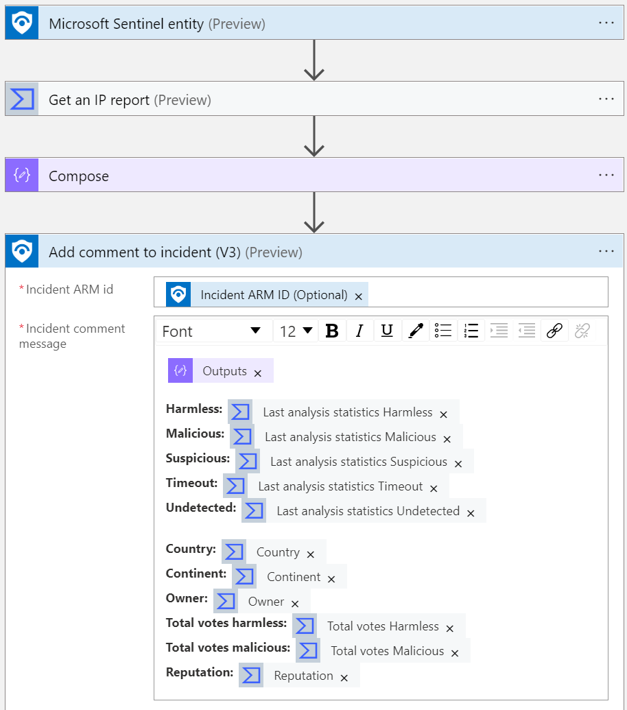
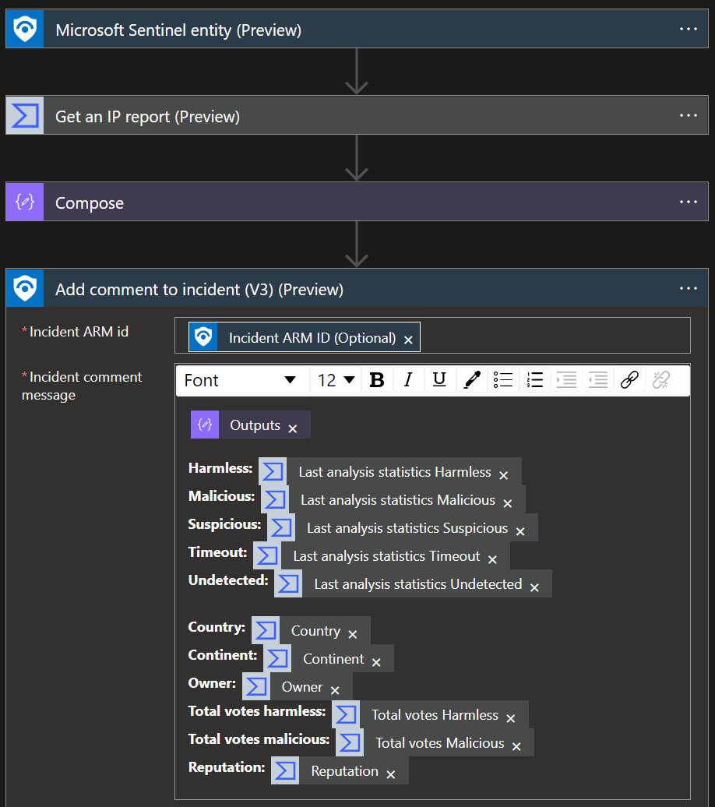

# Get-VirusTotalIPReport
author: Nicholas DiCola, Microsoft

This playbook will take each IP entity and query VirusTotal for IP Address Report (https://developers.virustotal.com/v3.0/reference#ip-info). It will write the results to Log Analytics and add a comment to the incident.

## Prerequisites

- You will need to register to Virus Total community for an API key

## Quick Deployment
**Deploy with incident trigger** (recommended)

After deployment, attach this playbook to an **automation rule** so it runs when the incident is created.

[Learn more about automation rules](https://docs.microsoft.com/azure/sentinel/automate-incident-handling-with-automation-rules#creating-and-managing-automation-rules)

 

**Deploy with alert trigger**

After deployment, you can run this playbook manually on an alert or attach it to an **analytics rule** so it will run when an alert is created.

 

**Deploy with entity trigger**

After deployment, you can run this playbook manually from an entity context in the incident.

 

## Post Deployment Instructions

**Assign Microsoft Sentinel Responder role to the playbook**

The playbook uses a managed identity, which require to have Microsoft Sentinel Responder role in Sentinel instances in order to add comments.

1. Select the Playbook resource.
2. In the left menu, click Identity.
3. Under Permissions, click Azure role assignments.
4. Click Add role assignment (Preview).
5. Use the drop-down lists to select the resource group that your *Sentinel Workspace* is in. If multiple workspaces are used in different resource groups consider selecting subscription as a scope instead.
6. In the Role drop-down list, select the role 'Microsoft Sentinel Responder'.
7. Click Save to assign the role.

## Screenshots
**Incident Trigger** 
 

**Alert Trigger** 
 

**Entity Trigger** 
 
 