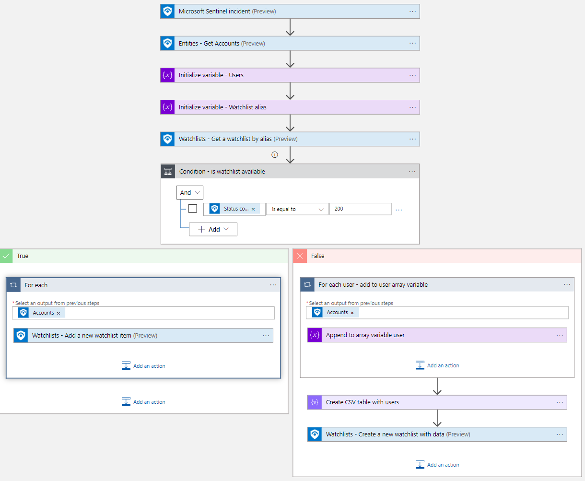
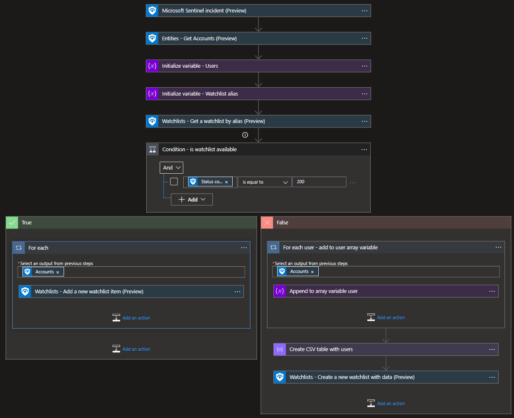
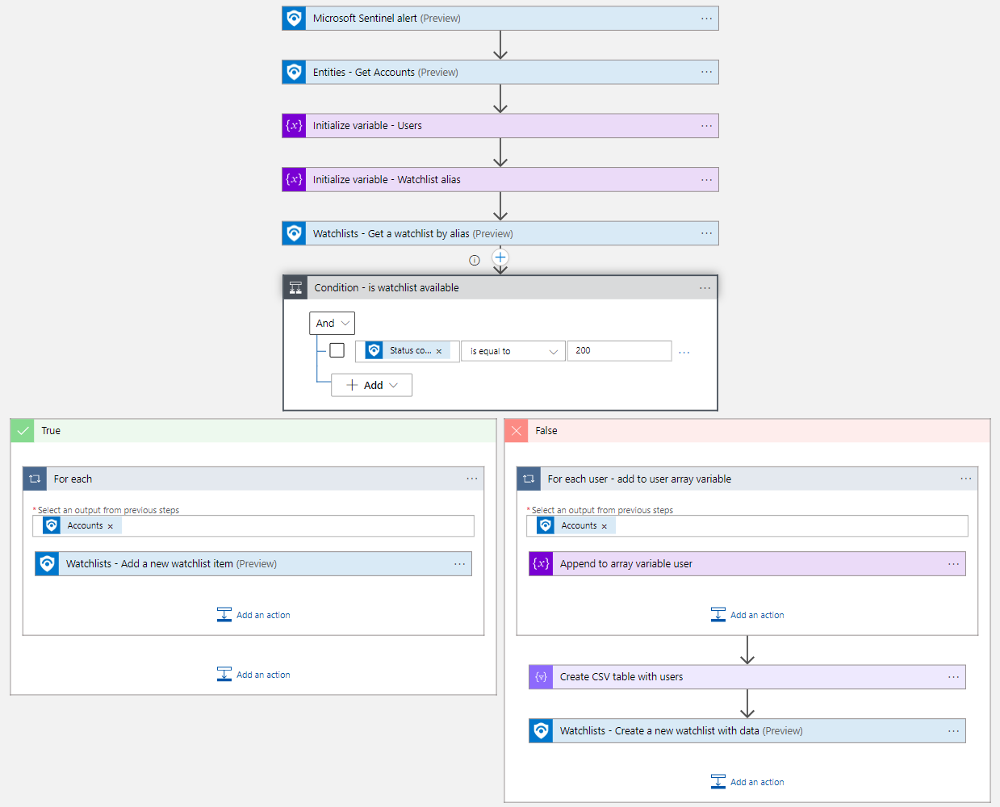
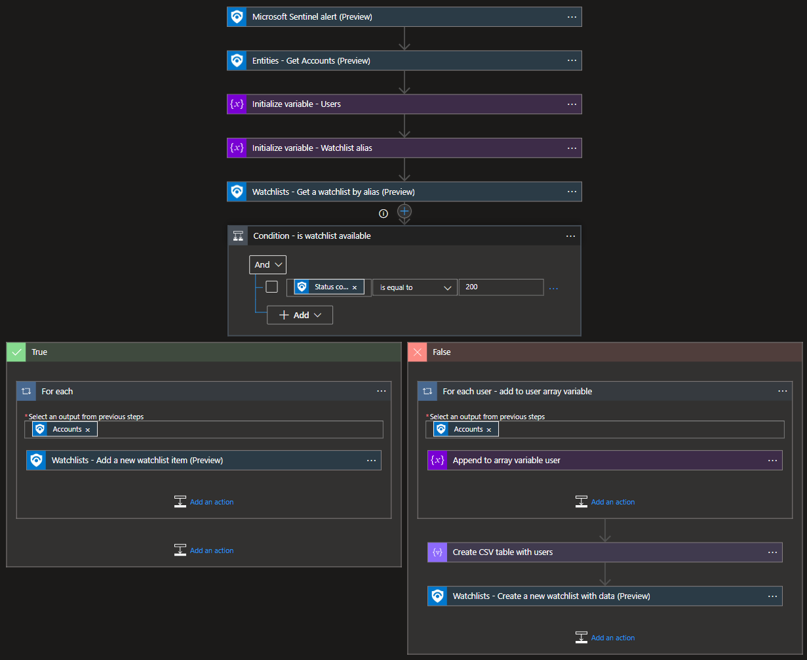

#  Watchlist-Add-UserToWatchList

Author: Yaniv Shasha
  

This playbook will add a User entity to a new or existing watchlist.
   

## Logical flow to use this playbook

	1. The analyst finished investigating an incident and one of its findings is a suspicious user entity.
	2. The analyst wants to enter this entity into a watchlist (can be from block list type or allowed list).
	3. This playbook will run as a manual trigger from the full incident blade or the investigation graph blade, or automatically, and will add host to the selected watchlist.

# Prerequisites

None.  

# Quick Deployment
**Deploy with incident trigger** (recommended)

After deployment, attach this playbook to an **automation rule** so it runs when the incident is created.

[Learn more about automation rules](https://docs.microsoft.com/azure/sentinel/automate-incident-handling-with-automation-rules#creating-and-managing-automation-rules)

**Deploy with alert trigger**

After deployment, you can run this playbook manually on an alert or attach it to an **analytics rule** so it will rune when an alert is created.

  

# Post-deployment
1. Assign Microsoft Sentinel Contributor role to the Playbook's Managed Identity

  

## Screenshots
**Incident Trigger** 
 
   
**Alert Trigger** 
 
 