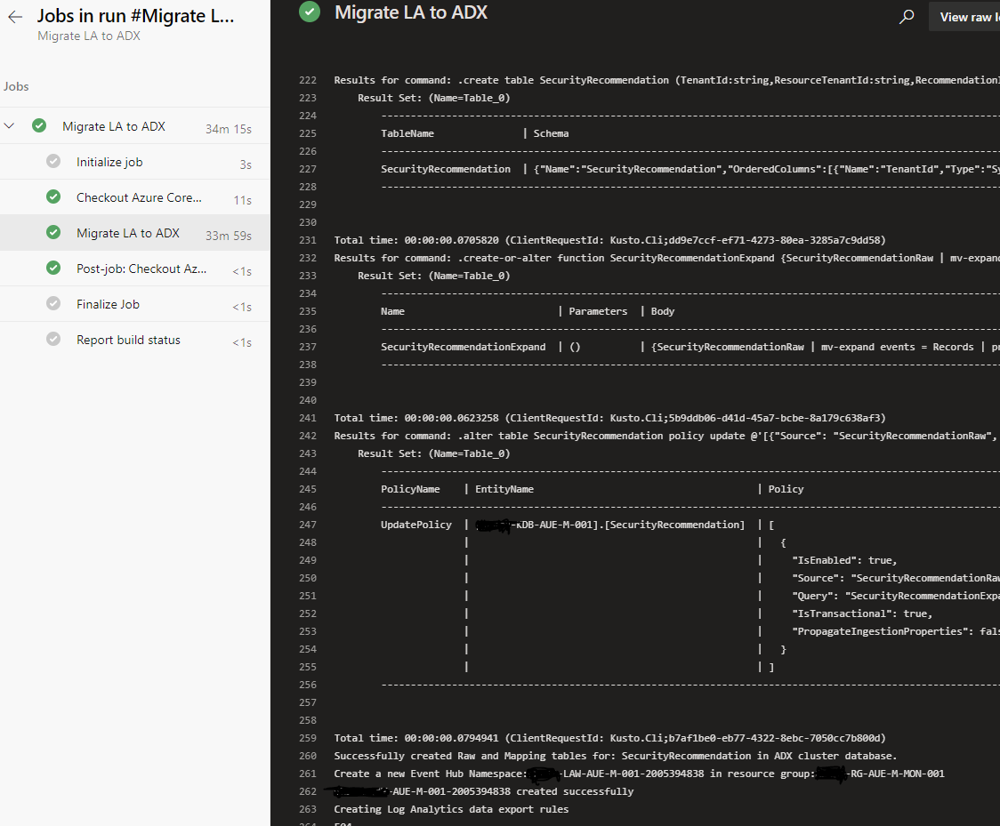

# Integrate Azure Data Explorer (ADX) for long-term log retention with a Azure DevOps Pipeline

**Author: Alexandre Verkinderen**

As part of our Azure Enterprise Scale deployment <https://github.com/Azure/Enterprise-Scale/> we also provision Log Analytics and Sentinel and have a need to export this data for archviving purpose. The excellent script provided by **Sreedhar Ande** <https://github.com/Azure/Azure-Sentinel/blob/master/Tools/AzureDataExplorer/Migrate-LA-to-ADX.ps1> was the missing piece to be able automate the export of the Log Analtyics logs.

Our Enterprise Scale deployment is fully automated and repeatable across different environments using Azure DevOps Pipelines. This script is slightly modified from the original one and is intented to be executed from within an Azure DevOps Pipeline to configure Log Analtyics workspace to an Eventhubs and setup ADX connectors for ingestion. The provided yaml pipeline is just an example and can be modified to your requirements.

## Prerequisites

- Make sure you have all the prerequisites in place as described here <https://github.com/Azure/Azure-Sentinel/tree/master/Tools/AzureDataExplorer#prerequisites>.
- Make sure that the SPN you use for the Service Connection within your Pipeline has permissions as mentioned above
- Get the SPN secret from your SPN
- Create a variable group (we call it ES-General) with the following variables and fill in the values with your Azure Resources
    - ARM_CLIENT_SECRET (secret of the appID)
    - LogAnalyticsSubscriptionId
    - LogAnalyticsWorkSpaceName
    - LogAnalyticsResourceGroup
    - AdxResourceGroup
    - AdxClusterURL
    - AdxDBName
    - LAExportTablesToADX (specify tables you want to export like AzureActivity,SecurityRecommendation)

  

## Script

The script requires one extra parameter compared to the original script: "SecretKey". This is because the kustocli.exe is prompting for authentication. <https://docs.microsoft.com/azure/data-explorer/kusto/api/connection-strings/kusto#aad-based-authentication-examples>. As we are using an SPN to connect to Azure we have to pass the ApplicationClientId and ApplicationKey.

`$KustoConnectionString = $KustoConnectionString + ";Authority Id=$($Context.tenant.id);AppClientId=$($Context.Account.id);AppKey=$SecretKey"`

## Pipeline

Import the provided yaml pipeline in your Azur DevOps environment and change the ScriptPath parameter to match the location where you stored the script in your repository. Once done execute the script.

The script will take roughly 30 minutes to execute.
