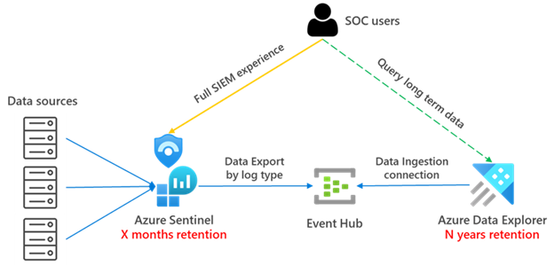

## Integrate Azure Data Explorer for long-term log retention
**Author : Sreedhar Ande**

Azure Data Explorer is a big data analytics platform that is highly optimized for log and data analytics. Since Azure Data Explorer uses Kusto Query Language (KQL) as its query language, it's a good alternative for Azure Sentinel data storage. Using Azure Data Explorer for your data storage enables you to run cross-platform queries and visualize data across both Azure Data Explorer and Azure Sentinel.
For more information, see the Azure Data Explorer [documentation](https://docs.microsoft.com/azure/sentinel/store-logs-in-azure-data-explorer)

To learn all the available Architectural option please refer my Collegue's [Javier Soriano](https://github.com/javiersoriano) excellent [Blog](https://techcommunity.microsoft.com/t5/azure-sentinel/using-azure-data-explorer-for-long-term-retention-of-azure/ba-p/1883947)  

## Prerequisites
1. **Create an Azure Data Explorer Cluster in the same region as your Log Analytics Workspace**  
	https://docs.microsoft.com/azure/data-explorer/create-cluster-database-portal

2. Create Database

## Azure Data Explorer Architecture

Combining the Data Export feature and ADX, you can choose to stream logs to Event Hub and then ingest them into ADX. 

The high-level architecture would look like this:

  

## Challenges
1. Use the Azure Data Explorer Web UI to create the target tables in the Azure Data Explorer database. For each table you need to get the schema and run the following commands which consumes lot of time for production workloads  
  
	A. **Create target table** Table that will have the same schema as the original one in Log Analytics/Sentinel
	
	B. **Create table raw** The data coming from EventHub is ingested first to an intermediate table where the raw data is stored. At that time, the data will be manipulated and expanded. Using an update policy (think of this as a function that will be applied to all new data), the expanded data will then be ingested into the final table that will have the same schema as the original one in Log Analytics/Sentinel. We will set the retention on the raw table to 0 days, because we want the data to be stored only in the properly formatted table and deleted in the raw data table as soon as it’s transformed. Detailed steps for this step can be found [here](https://docs.microsoft.com/azure/data-explorer/ingest-data-no-code?tabs=diagnostic-metrics#create-the-target-tables).    
	
	C. **Create table mapping** Because the data format is json, data mapping is required. This defines how records will land in the raw events table as they come from Event Hub. Details for this step can be found [here](https://docs.microsoft.com/azure/data-explorer/ingest-data-no-code?tabs=diagnostic-metrics#create-table-mappings).    
	
	D. **Create update policy** and attach it to raw records table. In this step we create a function (update policy) and we attach it to the destination table so the data is transformed at ingestion time. See details [here](https://docs.microsoft.com/azure/data-explorer/ingest-data-no-code?tabs=diagnostic-metrics#create-the-update-policy-for-metric-and-log-data). This step is only needed if you want to have the tables with the same schema and format as in Log Analytics  
	
	E.  **Modify retention for target table** The default retention policy is 100 years, which might be too much in most cases. With the following command we will modify the retention policy to be 1 year:    
	```.alter-merge table <tableName> policy retention softdelete = 365d recoverability = disabled  ```  

2.	To stream Log Analytics logs to Event Hub and then ingest them into ADX, you need to create EventHub Namespaces, if you have more than 10 tables, you need to create more EventHub Namespaces for every 10 tables.  
 
	A.	Standard EventHub Namespace supports only 10 EventHub Topics  
	
	B.	Log Analytics Data Export rule also support 10 tables per each rule  
	
	C.	You can create 10 Data Export rules targeting 10 different EventHub Namespaces  
	
	**Note**  
	If Data Export rule is created today, only the data from the time of Data Export rule creation will be moved to ADX. Data in tables before Data Export rule 	    creation date will not be moved.

3.	Once Raw & Mappings tables and EventHub Namespaces are in place, you need to create “Data Export” rule using Azure CLI or REST API manually  
	**Note:**  
	A. Azure portal or PowerShell are not supported yet    
	B. Data Export rules creates “EventHubTopics” in EventHub Namespaces - ~20 min    
	C. You will see EventHub Topics for active stream of logs in those tables – tables which don’t have logs, EventHub Topic will not create – It will be created as soon as it has fresh data    

4.	Once EventHub Topics (```am-<<tablename>>```) are available – you need to create “Data Ingestion or Data Connection” rules in ADX Cluster for each table by selecting appropriate EventHub Topic, TableRaw and TableMappings    

5.	Once Data Connection is success – you will see the data flowing from Log Analytics to ADX ~ 15 min    


## Download the Tool Running PowerShell Script

1. Download the Tool 
  
   [](https://aka.ms/Sentinel-AzureDataExplorer-Automation)
 
2. Extract the folder and open "Migrate-LA-to-ADX.ps1" either in Visual Studio Code or PowerShell  

   **Note**  
   Currently this script will work from the client's machine, To continue executing this script, run the following command
   ```
   Set-ExecutionPolicy -Scope Process -ExecutionPolicy Bypass  
   ```  

3. Script prompts user to input values for the following parameters  
	a.	Log Analytics Workspace Name  
	b.	Log Analytics Resource Group  
	c.	ADX Cluster URL    
	    Ex: `https://<<ADXClusterName>>.<<region>>.kusto.windows.net`  
	d.	ADX Resource Group   
	e.	ADX DB Name  

4. Script prompts the user to authenticate with his credentials, once the user is authenticated it prompts the following optios  
	a. Retrieve all the Tables from the given Workspace and create Raw, Mappings table in ADX (or)  
	b. Enter selected tables from the given Workspace  
	
5.  Installs the required modules
	```
	Az.Resources
	Az.OperationalInsights
	Kusto.CLI
	```
6. Script verifies whether tables from Log Analytics or User Input is supported by “Data Export” feature, for all the un-supported tables it will skip  and continue with the next table. To see all the supported tables navigate to [here](https://docs.microsoft.com/azure/azure-monitor/logs/logs-data-export?tabs=portal#supported-tables). For all the supported tables, script will create the following   
	A. **Create target table** ```<<TableName>>```
		
	B.	**Create raw table** ```<<TableName>>Raw```
	
	C. **Create table mapping** ```<<TableName>>RawMapping```
	
	D. **Create update policy** 
	
	E.  **Modify retention for target table**
	
7. Creates EventHub Namespaces. In this step, script will create EventHub Namespaces by dividing the total number of tables by 10  
   **Note:** Event Hub Standard tier has limitation of having 10 EventHub Topics  
	
8. Creates Data Export Rule on Azure Log Analytics Workspace. In this step, script will create Data Export rules for each EventHub Namespace with 10 Tables each  

	**Note:**
	a.	Based on the output from Step #4, script will create “Data Export” rules for each 10 Tables  
	b.	LA supports 10 Data Export rules targeting 10 different EventHub Namespaces i.e., you can export 100 tables using 10 Data Export rules  
	
9. After successful creation of "Data Export" rule - Script again prompts asking user whether he can wait 30 min until EventHub Topics for all the selected tables gets created in EventHub Namespace  
	a. If Yes, Script will proceed to continue to create "Data connection" rules after 30 min sleep time by specifying the target raw table ```<<TableName>>Raw```, mapping table ```<<TableName>>RawMapping``` and EventHub Topic ```am-<<TableName>>```  
	b. If No, script will exit, user has to create "Data Connection" for each table in Azure Data Explorer by selecting appropriate Raw, Mapping Tables and EventHub Topic  

10. At the end of the script, it will generate a log file ```ADXMigration_<<TimeStamp>>``` with every action that script has performed to identify performance or configuration issues and to gain insights to perform root cause analysis when failures occur.  


