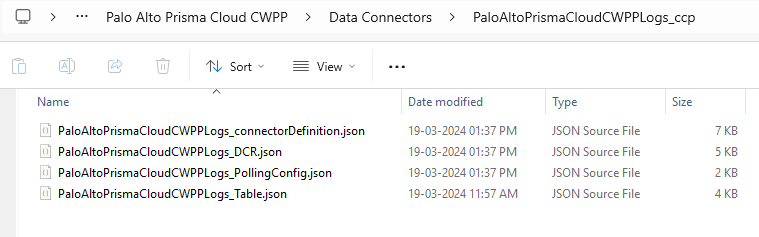
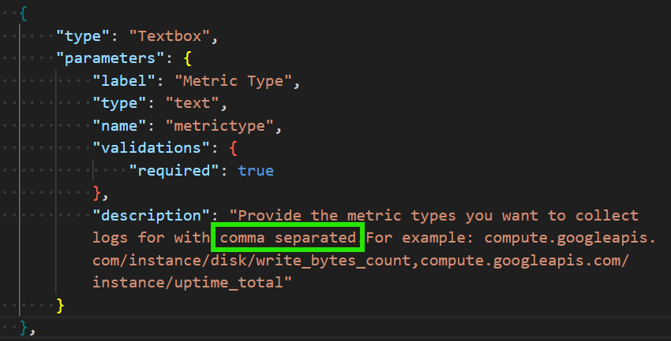
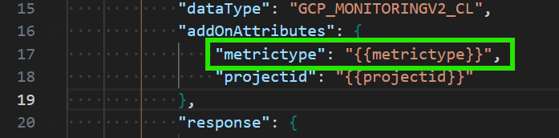
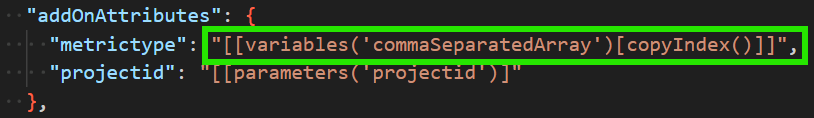
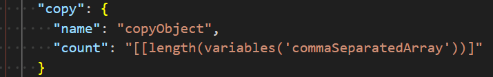
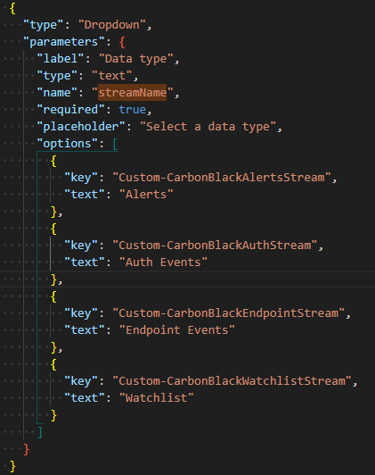
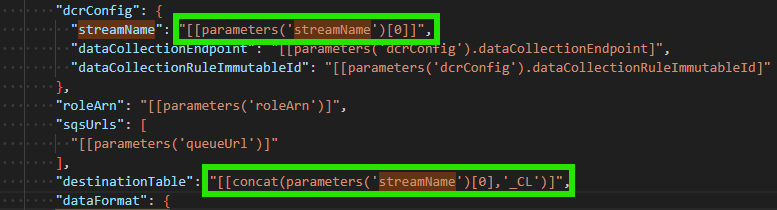

# Microsoft Sentinel Solutions Packaging Tool Guidance For CCP Connector

To create a package using V3 packaging tool refer [Link to V3](https://github.com/Azure/Azure-Sentinel/blob/master/Tools/Create-Azure-Sentinel-Solution/V3/README.md)

## CCP connector Building Blocks:
Every CCP connector will have 4 building blocks and should be specified in sequence given below:
1. `Data Connector Definition` - This file will contain details on how UI page look and contains instruction steps and connectorUiConfig section.
2. `Data Connectors (Poller)` - This file will contain details on how data will be pulled. For this you can use any of the `kind` type `RestApiPoller`, `WebSocket`, `GCP`, `AmazonWebServicesS3`, `Push` and `StorageAccountBlobContainer`.
3. `Data Collection Rule(DCR)` - This file will contain details on what data should be collected, how to transform that data, and where to send it.
4. `Tables (Optional)` - This file will contain schema of your data logs where the actual data will be stored.

For more details refer [link](https://learn.microsoft.com/en-us/azure/sentinel/create-codeless-connector).

## How to Use ?
1. In Data input file under Azure-Sentinel/Solutions, open the solution you want to add a CCP connector.
2. In data input file, under `Data Connectors` array object add a path to new Data Connector Definition file. Data Connector Definition file is the starting point for any CCP connector and this file path should only be specified in data folder input file under `Data Connectors` array. There is no need to specify other file paths for Poller, DCR or Tables in data input file. 
3. **Folder & File Naming Convention**: Connector Definition, Poller, DCR, and Table files (the Table file is optional). These files should follow the naming conventions provided below:
    - The folder name format should be "**_{CompanyName}{ProductName}{LogType}Logs_ccp_**". For example, if the solution name is `Palo Alto Prisma Cloud CWPP` then `PaloAlto` is the CompanyName and `PrismaCloudCWPP` is the ProductName. Determine the type of logs you are pulling, such as SysLogs, CustomLogs, or others, and use the appropriate log type or simply use `Logs`. Therefore, the final folder name would be `PaloAltoPrismaCloudCWPPLogs_ccp`. The files inside this folder will follow the naming conventions shown in the screenshot below, with suffixes like `_connectorDefinition`, `_PollerConfig`, `_DCR`, or `_Table`. Below is an example of the folder and file structure for CCP.

      

4. There can be only 1 data definition file per CCP connector. If you have multiple CCP connectors then create multiple data connector definition files and specify the file paths in the data folder input file under `Data Connectors` array. 

    

5. Mapping between Data Connector Definition and Data Connector Poller file should present. Data Connector Poller file mapping with Data Collection Rules(DCR) should be present. If table file is present then you can specify the mapping from Data Collection Rules(DCR) with Table file. If mapping is not present and if present but mapping values are not correct between Data Connector Definition and Data Connector Poller or Data Connector Poller with Data Collection Rules(DCR) then packaging will fail. If there is no mapping for table file with Data Collection Rules(DCR) file than also its fine as it will create a table independent of mapping. 

6. Table file is optional and so, if there is no mapping from Data Collection Rules(DCR) with table then remove the `outputStream` property from Data Collection Rules(DCR) file. You can skip removing property `outputStream` from Data Collection Rules(DCR) file, if it is a Standard table eg: `"outputStream"="Microsoft-ASimNetworkSessionLogs"` in DCR is a Standard table and there is no need to add table file.

7. Details for each of the file information is specified below:</br>
  - If you have single Data Connector Definition, single Data Connector Poller, single Data Collection Rule(DCR) and/or table file where each of this files are sharing a one-to-one mapping then follow below.

  **a. Data Connector Definition File:**
  - The `type` property value should be `Microsoft.SecurityInsights/dataConnectorDefinitions`.

    

  - Below is a sample Data Connector Definition file and will show field and details on UI package in data connector page.
  - Curly braces placeholder eg: {{location}} value will be replaced with parameters after packaging using V3 tool.
  - In this file, `connectorUiConfig` section should always have a `id` field with a name without space.

    
    
  - This `id` value is important to have a mapping between Data Connector Definition and Data Connector Poller file.
  - The field `name` and `id` should be kept same.
  - To generate multiple instances of a single ARM template resource, you can use a `comma separated` string in the `description` field, as shown below. This approach allows the packaging tool to automatically insert a `copy` object with the appropriate `name` and `count` properties. It also adds a `variable` named `commaSeparatedArray`, which uses the expression `[[split(parameters('<your parameter name here>'), ',')]]` to split the input string into an array.

    - The following is part of the Data connector definition:<br/>
        <br/>

    - The following is part of the Data Connector poller:<br/>

        <br/>

    - The following content is automatically updated by the packaging tool into the mainTemplate poller section. This helps showing separate record into gridview after connect of connector:<br/>

        <br/>

    - The following content is automatically inserted by the packaging tool into the mainTemplate poller section:<br/>

        <br/>

  - If you have a `dropdown` field like below for which you want to dynamically use its respective data collection rule and table then follow below. This is applicable for `"kind": "AmazonWebServicesS3"` only.<br/>
    - In `Data connector definition` file:<br/>

      <br/>

    - In `Data connector poller` file use any of the `streamName` as a default from your `data collection rule` file which will be replaced by packaging tool like below:<br/>
        - In `data collection poller`, streamName should have a default value `"streamName": "Custom-CarbonBlackAlertsStream"`:<br/>

        - In `mainTemplate` file:<br/>
        <br/>

  - InstructionSteps can be basic/oauth or of other types and keep rest of the key value pairs as is.
  - Keep rest all properties of the file as is.
  - To add an asterisk to the label, use the validations object as shown below. For the `textbox` type, if the data connector definition file specifies that a field is not required (i.e. `"required": false`), the packaging tool will generate a parameter with a `defaultValue` set to an empty string (`""`). In this case, the `minLength` property will not be included.
    ```json
    {
        "parameters": {
            "label": "Your Text label",
            "type": "text",
            "name": "fieldName",
            "validations": {
                "required": true
            }
        },
        "type": "Textbox"
    }
    ```
  - For more details on Data Connector Definitions fields, please [refer](https://learn.microsoft.com/en-us/azure/sentinel/data-connector-ui-definitions-reference#example-data-connector-definition).

```json
{
  "type": "Microsoft.SecurityInsights/dataConnectorDefinitions",
  "apiVersion": "2022-09-01-preview",
  "name": "<NameofYourDefinition>",
  "location": "{{location}}",
  "kind": "Customizable",
  "properties": {
    "connectorUiConfig": {
      "id": "<NameofYourDefinitionWithoutSpace>",
      "title": "<Title for the CCP Connector>",
      "publisher": "<Publisher Name>",
      "descriptionMarkdown": "<Enter the description>",
      "graphQueriesTableName": "<Enter the table Name>",
      "graphQueries": [
        {
          "metricName": "Total events received",
          "legend": "<Name of your Events>",
          "baseQuery": "{{graphQueriesTableName}}"
        }
      ],
      "sampleQueries": [
        {
          "description": "Get Sample Events",
          "query": "{{graphQueriesTableName}}\n | take 10"
        }
      ],
      "dataTypes": [
        {
          "name": "{{graphQueriesTableName}}",
          "lastDataReceivedQuery": "{{graphQueriesTableName}}\n | where TimeGenerated > ago(12h) | where name_s == \"no data test\" | summarize Time = max(TimeGenerated)\n | where isnotempty(Time)"
        }
      ],
      "connectivityCriteria": [
        {
          "type": "HasDataConnectors"
        }
      ],
      "availability": {
        "isPreview": false
      },
      "permissions": {
        "resourceProvider": [
          <specify resources and permission here>
        ]
      },
      "instructionSteps": [
        {
          "description": "Connect using OAuth2 credentials",
          "instructions": [
            {
              "type": "OAuthForm",
              "parameters": {
                "clientIdLabel": "Client ID",
                "clientSecretLabel": "Client Secret",
                "connectButtonLabel": "Connect",
                "disconnectButtonLabel": "Disconnect"
              }
            }
          ],
          "title": "Connect <Solution Name> to Microsoft Sentinel"
        }
      ]
    }
  }
}
```

  - Below is example data connector definition for **`StorageAccountBlobContainer`**. Make sure that you don't change the `name` property value from `instructionsteps--> instruction-->parameters` of the fields given below. Eg: principalId, blobContainerUri, StorageAccountLocation, StorageAccountResourceGroupName, StorageAccountSubscription and EGSystemTopicName. As this fields names are used in packaging tool to create ARM template resources for Storage Account queues, event grip topic etc.
```json
{
    "name": "<NameofYourDefinition>",
    "apiVersion": "2022-09-01-preview",
    "type": "Microsoft.SecurityInsights/dataConnectorDefinitions",
    "location": "{{location}}",
    "kind": "Customizable",
    "properties": {
        "connectorUiConfig": {
            "id": "<NameofYourDefinitionWithoutSpace>",
            "title": "<Title for the CCP Connector>",
            "publisher": "<Publisher Name>",
            "descriptionMarkdown": "<Enter the description>",
            "graphQueriesTableName": "<Enter the table Name>",
            "graphQueries": [
                {
                    "metricName": "Total events received",
                    "legend": "<Name of your Events>",
                    "baseQuery": "{{graphQueriesTableName}}"
                }
            ],
            "sampleQueries": [
                {
                    "description": "Get Sample Events",
                    "query": "{{graphQueriesTableName}}\n | take 10"
                }
            ],
            "dataTypes": [
                {
                    "name": "{{graphQueriesTableName}}",
                    "lastDataReceivedQuery": "{{graphQueriesTableName}}\n|summarize Time = max(TimeGenerated)\n|where isnotempty(Time)"
                }
            ],
            "connectivityCriteria": [
                {
                    "type": "HasDataConnectors"
                }
            ],
            "availability": {
                "status": 1,
                "isPreview": false
            },
            "permissions": {
                "resourceProvider": [
                    {
                        "provider": "Microsoft.OperationalInsights/workspaces",
                        "permissionsDisplayText": "Read and Write permissions are required.",
                        "providerDisplayName": "Workspace",
                        "scope": "Workspace",
                        "requiredPermissions": {
                            "read": true,
                            "write": true,
                            "delete": true,
                            "action": false
                        }
                    }
                ],
                "customs": [
                    {
                        "name": "Subscription permissions",
                        "description": "You need permissions to create the data flow resources: \n- storage queues (notification queue and dead-letter queue) \n- event grid topic and subscription (to send 'blob created event' notifications to the notification queue) \n- role assignments (to grant access for sentinel app to the blob container and the storage queues.)"
                    },
                    {
                        "name": "Create a storage account and a container",
                        "description": "Before setting up a stream in GitHub, first create a storage account and a container in Microsoft Azure. Use [this guide](https://learn.microsoft.com/en-us/azure/storage/blobs/storage-blobs-introduction) to know more about Container and Blob. Follow the steps in the [documentation](https://learn.microsoft.com/en-us/azure/storage/common/storage-account-create?tabs=azure-portal) to create an Azure Storage account."
                    },
                    {
                        "name": "Generate a Blob SAS URL",
                        "description": "Create and Write permissions are required. Refer the [documentation](https://learn.microsoft.com/en-us/azure/ai-services/translator/document-translation/how-to-guides/create-sas-tokens?tabs=Containers) to know more about Blob SAS token and url."
                    },
                    {
                        "name": "Collecting logs from <your source> to your Blob container",
                        "description": "Follow the steps in the [documentation](https://docs.github.com/en/enterprise-cloud@latest/admin/monitoring-activity-in-your-enterprise/reviewing-audit-logs-for-your-enterprise/streaming-the-audit-log-for-your-enterprise#setting-up-streaming-to-azure-blob-storage) for collecting logs from <your source> to your Blob container."
                    },
                    {
                        "name": "<your source> Enterprise type",
                        "description": "This connector will only function with <your source> Enterprise Cloud; it will not support <your source> Enterprise Server."
                    }
                ]
            },
            "instructionSteps": [
                {
                    "title": "Connect <your source> Blob Container Logs to Microsoft Sentinel",
                    "description": "To enable the <your source> logs for Microsoft Sentinel, provide the required information below and click on Connect.\n>",
                    "instructions": [
                        {
                            "parameters": {
                                "tenantId": "[subscription().tenantId]",
                                "name": "principalId",
                                "appId": "4f05ce56-95b6-4612-9d98-a45c8cc33f9f"
                            },
                            "type": "ServicePrincipalIDTextBox_test"
                        },
                        {
                            "parameters": {
                                "label": "The Blob container's URL you want to collect data from",
                                "type": "text",
                                "name": "blobContainerUri",
                                "validations": {
                                    "required": true
                                }
                            },
                            "type": "Textbox"
                        },
                        {
                            "parameters": {
                                "label": "The Blob container's storage account location",
                                "type": "text",
                                "name": "StorageAccountLocation",
                                "validations": {
                                    "required": true
                                }
                            },
                            "type": "Textbox"
                        },
                        {
                            "parameters": {
                                "label": "The Blob container's storage account resource group name",
                                "type": "text",
                                "name": "StorageAccountResourceGroupName",
                                "validations": {
                                    "required": true
                                }
                            },
                            "type": "Textbox"
                        },
                        {
                            "parameters": {
                                "label": "The Blob container's storage account subscription id",
                                "type": "text",
                                "name": "StorageAccountSubscription",
                                "validations": {
                                    "required": true
                                }
                            },
                            "type": "Textbox"
                        },
                        {
                            "parameters": {
                                "label": "The event grid topic name of the blob container's storage account if exist else keep it empty.",
                                "description": "The data flow using event grid to send 'blob-created event' notifications. There could be only one event grid topic for each storage account.\nGo to your blob container's storage account and look in the 'Events' section. If you already have a topic, please provide it's name else keep the textbox empty.",
                                "type": "text",
                                "name": "EGSystemTopicName",
                                "validations": {
                                    "required": false
                                }
                            },
                            "type": "Textbox"
                        },
                        {
                            "parameters": {
                                "label": "toggle",
                                "name": "toggle"
                            },
                            "type": "ConnectionToggleButton"
                        }
                    ]
                }
            ],
            "isConnectivityCriteriasMatchSome": false
        }
    }
}
```

  **b. Data Connector Poller File:**
  - The `type` property value should be `Microsoft.SecurityInsights/dataConnectors`.
  - If a file contains `connectorUiConfig` and a `pollerConfig` sections in a json file then its a clv1 type of CCP connector and is a legacy connector. It is recommended to switch to clv2 type of CCP connectors.
  - Here `properties --> connectorDefinitionName` value should be same as that of this data definition file `id` property.
  
    

  - In below json file, `streamName` should contain a suffix at the start `Custom-<namevalue>`.

    

  - Property dataCollectionEndpoint and dataCollectionRuleImmutableId are optional parameters in dcrConfig object. 
  - To configure `authentication` object properties refer [Authentication configuration](https://learn.microsoft.com/en-us/azure/sentinel/data-connector-connection-rules-reference#authentication-configuration) link.
  - To configure `response` object properties refer [Response configuration](https://learn.microsoft.com/en-us/azure/sentinel/data-connector-connection-rules-reference#response-configuration) link.
  - To configure `paging` object properties refer [Paging configuration](https://learn.microsoft.com/en-us/azure/sentinel/data-connector-connection-rules-reference#paging-configuration) link.
  - For kind **`AmazonWebServicesS3`**, please refer [Link](https://learn.microsoft.com/en-us/rest/api/securityinsights/data-connectors/create-or-update?view=rest-securityinsights-2024-01-01-preview&tabs=HTTP#awscloudtraildataconnector).
  - Example for AmazonWebServicesS3 kind, [Amazon Web Services](https://github.com/Azure/Azure-Sentinel/blob/master/Solutions/Amazon%20Web%20Services/Data%20Connectors/AWS_WAF_CCP/AwsS3_WAF_PollingConfig.json), [VMware Carbon Black Cloud](https://github.com/Azure/Azure-Sentinel/blob/master/Solutions/VMware%20Carbon%20Black%20Cloud/Data%20Connectors/VMwareCarbonBlackCloud_ccp/CarbonBlack_PollingConfig.json).
  - For kind **`GCP`**, please refer [Link](https://learn.microsoft.com/en-us/rest/api/securityinsights/data-connectors/create-or-update?view=rest-securityinsights-2024-01-01-preview&tabs=HTTP#gcpdataconnector).
  - Example for `GCP` kind, [Google Cloud Platform Audit Logs](https://github.com/Azure/Azure-Sentinel/blob/master/Solutions/Google%20Cloud%20Platform%20Audit%20Logs/Data%20Connectors/GCPAuditLogs_ccp/data_connector_poller.json).
  - The **`WebSocket`** connector type shares the same properties as `RestApiPoller`, with the exception that the `ApiEndpoint` must begin with `wss://`.
  - Example for `WebSocket` kind, [Proofpoint On demand(POD) Email Security](https://github.com/Azure/Azure-Sentinel/blob/master/Solutions/Proofpoint%20On%20demand(POD)%20Email%20Security/Data%20Connectors/ProofPointEmailSecurity_CCP/ProofpointPOD_PollingConfig.json).
  - Below is an example for **`RestApiPoller`** kind of CCP collector that is used to pole details from the API.  :

```json
[{
  "type": "Microsoft.SecurityInsights/dataConnectors",
  "apiVersion": "2022-10-01-preview",
  "name": "<NameYourPollerFile>",
  "kind": "RestApiPoller",
  "properties": {
    "connectorDefinitionName": "<Use same value from data connector definition connectorUiConfig-->id value>",
    "dataType": "<Enter table name here>",
    "dcrConfig": {
      "streamName": "Custom-<enter stream name without space>"
    },
    "auth": {
      "type": "OAuth2",
      "ClientSecret": "{{clientSecret}}",
      "ClientId": "{{clientId}}",
      "GrantType": "client_credentials",
      "TokenEndpoint": "<Enter your tokenendpoint url>",
      "TokenEndpointHeaders": {
        "Content-Type": "application/x-www-form-urlencoded"
      },
      "TokenEndpointQueryParameters": {
        "grant_type": "client_credentials"
      }
    },
    "request": {
      "apiEndpoint": "<Enter your api url>",
      "httpMethod": "GET",
      "queryParameters": {
        "max_results": 100
      },
      "queryWindowInMin": 5,
      "queryTimeFormat": "yyyy-MM-ddTHH:mm:ss.000000+00:00",
      "startTimeAttributeName": "since",
      "endTimeAttributeName": "until",
      "rateLimitQps": 10,
      "retryCount": 3,
      "timeoutInSeconds": 60,
      "headers": {
        "Accept": "application/json",
        "User-Agent": "Scuba"
      }
    },
    "response": {
      "eventsJsonPaths": ["$"],
      "format": "json"
    },
    "paging": {
      "pagingType": "LinkHeader",
      "linkHeaderTokenJsonPath" : "$.metadata.links.next"
    }
  }
}]
```

  - Below is an example for *`StorageAccountBlobContainer`* kind of CCP collector that is used to pole details Storage Account Blob Container using Event Grid System Topic.

```json
    [
        {
            "name": "<NameForYourPoller>",
            "apiVersion": "2022-12-01-preview",
            "type": "Microsoft.SecurityInsights/dataConnectors",
            "location": "{{location}}",
            "kind": "StorageAccountBlobContainer",
            "properties": {
                "connectorDefinitionName": "<Use same value from data connector definition connectorUiConfig-->id value>",
                "dataType": "<Enter table name here>",
                "dcrConfig": {
                    "streamName": "Custom-<enter_stream_name_without_space>"
                },
                "auth": {
                    "type": "ServicePrincipal"
                },
                "response": {
                    "eventsJsonPaths": [
                        "$"
                    ],
                    "format": "json",
                    "isGzipCompressed": true
                }
            }
        }
    ]
```

  **c. Data Collection Rules(DCR):**
  - The `type` property value should be `Microsoft.Insights/dataCollectionRules`.
  - DCR, `name` property should be very short and without space. Total length of `name` field is 65 which on deployment adds `Microsoft-Sentinel-{DCR-file-name-property-value}-{workspaceName}-{random-unique-value}`. Here, `Microsoft-Sentinel` suffix is attached to the name property from DCR file and then attached with workspace name on which it is deployed along with a random number. When total length of this value exceeds then DCR will not get created and will fail in deployment.

    

  - Once deployment is done it is recommended to verify if DCR is created in Azure portal, global search by searching for `Data Collection Rules` and then in `Data Collection Rules` search with the name that you specified in the source file on DCR `name` property. If search result shows a record in deployed resource group. If you don't see a result for the `name` property value specified in DCR file then its possibly a problem in DCR source file which failed in DCR creation. The first possible thing to verify if the length of DCR name exceed 65 characters.
  - In DCR file, `dataFlows` property has `streams` array property. Currently streams doesn't support multiple streams in an array. If you are using custom stream then name it like `Custom-<yourStreamName>`. This name should match with that of your Poller file `streamName` field value.
  - In case of Standard table, DCR file "streams" should be from the given list in the file [StandardLogStreams](https://github.com/Azure/Azure-Sentinel/blob/master/Tools/Create-Azure-Sentinel-Solution/common/standardLogStreams.ps1). Here `Key` is the `streamName` for Poller file while `Value` is your DCR `streams` value. If you are using standard table and mappings from this file doesn't match then it will fail while packaging with an error like there is a mismatch in DCR and Poller files streams.
  - In `dataFlows` array, if you have a custom table as a file then specify the `outputSteam` property. If you are using standard table then there is no need to specify the `outputSteam` property in DCR file i.e. `outputSteam` property is optional here and should be used if you have custom table and a table file for it. If `Microsoft-ASimAuditEventLogs` is a standard table and is suffixed with `Microsoft-` you can skip adding `outputStream` property for such standard tables.
  - To verify length of DCR name, when we open data connector and click on `Connect` button, make sure to open browser `Developer tools` or right click on browser and do `Ctrl+F12` which will open up `Developer tools` and navigate to `Network` tab as shown below:
  - Property `workspaceResourceId` is optional and is not required to be specified. If not specified then it replaces this property with value `[resourceId('microsoft.OperationalInsights/Workspaces', parameters('workspace'))]` in mainTemplate as a variables.
  - Placeholder `{{location}}` will get replaced and will be specified in `parameters` section on "mainTemplate.json" file.
  - Keep rest all properties of the file as is.
  - Below is the sample file for DCR:

```json
[{
  "name": "<Name of your DCR File Without Space>",
  "apiVersion": "2021-09-01-preview",
  "type": "Microsoft.Insights/dataCollectionRules",
  "location": "{{location}}",
  "properties": {
    "dataCollectionEndpointId": "{{dataCollectionEndpointId}}",
    "streamDeclarations": {
      "Custom-<streamNameFromPollerFile>": {
        "columns": [
          {
            "name": "columnName1",
            "type": "column_dataType",
            "description": "description if any"
          },
          {
            "name": "columnName1",
            "type": "column_dataType",
            "description": "description if any"
          }
          ...
        ]
      }
    },
    "destinations": {
      "logAnalytics": [
        {
          "workspaceResourceId": "{{workspaceResourceId}}",
          "name": "clv2ws1"
        }
      ]
    },
    "dataFlows": [
      {
        "streams": [
          "Custom-<streamNameFromPollerFile>"
        ],
        "destinations": [
          "clv2ws1"
        ],
        "transformKql": "<your transformKql query>",
        "outputStream": "Custom-<table name from table.json file without space if present else no need to specify property>"
      }
    ]
  }
}]
```
  **d. Tables:**
  - Skip this step if your data is only ingested to standard Log Analytics tables. Examples of standard tables include CommonSecurityLog and ASimDnsActivityLogs.
  - For list of all standard tables refer to [StandardLogStreams](https://github.com/Azure/Azure-Sentinel/blob/master/Tools/Create-Azure-Sentinel-Solution/common/standardLogStreams.ps1) where "Value" attribute is the standard table name. 
  - If your data source doesn't conform to the schema of a standard table, you have two options:<br/>
        a) Create a custom table for all the data. <br/>
        b) Create a custom table for some data and split conforming data out to a standard table.<br/>
  - If you create the custom table using the Tables API or another programmatic method, add the `_CL` suffix manually to the table name. For more information, see Create a custom table.
  - The `type` property of the file should be `Microsoft.OperationalInsights/workspaces/tables`.
  - The `name` and `properties-->schema-->name` properties values should be same.
  - This `name` property value should be same as that in DCR file `outputStream` and should contain `Custom-<tableName>` in DCR File.
  
    

  - This file should not contain `name` value `Custom-`. If present then please remove as it will not work for parsers.
  - Specify all columns for your table in `columns` array.

```json
[
  {
    "name": "<tableNameShouldBeMeaningful>",
    "type": "Microsoft.OperationalInsights/workspaces/tables",
    "apiVersion": "2021-03-01-privatepreview",
    "properties": {
      "schema": {
        "name": "<tableNameShouldBeMeaningful>",
        "columns": [
          {
              "name": "columnName1",
              "type": "column_DataType",
              "isDefaultDisplay": true,
              "description": "column description"
          },
          {
              "name": "columnName2",
              "type": "column_DataType",
              "description": "column description"
          }
          ...
        ]
      }
    }
  }
]
```

<h4><u>High level structure and file details for one to one mapping:</u></h4>
  


### Working with Single Data Definition having multiple Data Connector Poller in single file and multiple DCR in single file:

  If you have only 1 data definition file which uses same endpoint domain and secrets and want to use it with multiple Data Connector Poller's, DCR's files then create only 1 data definition file. Keep the single data definition file at the root of the `Data Connectors` folder i.e. keep data definition file inside of "Data Connectors" folder and keep each of the Poller, DCR and/or Table files in a separate folders as shown in below screenshot.

  <h4><u>High level structure and file details for one to many mapping:</u></h4>
    

  <h4><span> Folder and file structure for Single data definition file with multiple Data Connector Poller objects in a array and single Data Collection Rules(DCR) file with multiple object in a array: </span> </h4>

  


  <h4><span> Below is the single data definition file which is similar to that of normal CCP connector which contains only one data definition file, Data Connector Poller file, DCR file and/or table file. </span></h4> 

  

  <h4><span> This Data Connector Poller file differs with normal CCP connector by having multiple JSON object in an array as shown below i.e. multiple Data Connector Poller's are specified in a single file. </span></h4> 

  

  <h4><span> Below is the content for multiple Data Connector Poller object specified in a single file inside of an array. For single data definition having multiple Data Connector Poller, green color highlighted property value should be unique i.e `name` property should be unique and should not match this name value with other Data Connector Poller name property in this file i.e. `"name" = "CiscoMerakiAPIRequest"` should be unique. But `connectorDefinitionName` value for all of the Data Connector Poller files should be SAME as shown below as we are using only 1 data definition file.</span></h4> 

  

  <h4><span>  Each of the Data Connector Poller files in previous step should have a corresponding DCR file object as shown below. In Data Connector Poller file, `streamName` property value should match with that of DCR file object `streams` property under `dataFlows` array as shown below. Under `dataFlows` specify different objects for your streams. </span></h4> 

  

</br>

# Testing after Deployment either from Custom Deployment or from Partner Center:
- If deployment is done from either Custom deployment or Partner Center to your specific resource group workspace, deployment should succeed.
- Navigate to deployed workspace and navigate to `Data Connectors` blade in Azure portal.
- Search for the deployed CCP connector and click on `Open connector page`. Provide the inputs required for the connection and before click of `Connect` button open `Developers tools` or do `Ctrl+12` to open developers tool and then navigate to "Network" tab. This is required in order to verify if DCR has succeeded or not. Refer for more from `How to use ?` section, "c" point on "Data Collection Rules(DCR)".


- On click on `Connect` button, first table will be created if present then data collection rules(DCR) will be created.
- To verify if table is created go to your Log analytic workspace under table blade, search for your table name i.e. either Custom table. If using standard Microsoft Sentinel table then no need to verify it. If the custom table is not created than verify the properties in table file and mapping in DCR file.
- To verify if data collection rules(DCR) is created, in the global search in Azure portal search for `Data collection Rules`. Open it and search with then name given in your DCR file name property. A record with your DCR should be created. If not then open browser `Developer Tools` and go to `Network` tab and check for `batch` request with `HTTPMethod` as `Put` as shown in above image. 
- On click of `Connect` button `Connect Connected` notification will popup as shown in below screenshot which is a successful connection  and everything is properly configured and deployed.


## References For CCP Connectors:
- [Create a codeless connector for Microsoft Sentinel (Public preview)](https://learn.microsoft.com/en-us/azure/sentinel/create-codeless-connector)
- [Codeless Connector](https://learn.microsoft.com/en-us/azure/sentinel/create-codeless-connector?tabs=deploy-via-arm-template%2Cconnect-via-the-azure-portal)
- [Data Connectors](https://learn.microsoft.com/en-us/azure/templates/microsoft.securityinsights/dataconnectors?pivots=deployment-language-arm-template)
- [Data Collection Rule](https://learn.microsoft.com/en-us/azure/azure-monitor/essentials/data-collection-rule-overview?tabs=portal)
- [Tables](https://learn.microsoft.com/en-us/azure/azure-monitor/logs/manage-logs-tables?tabs=azure-portal)
