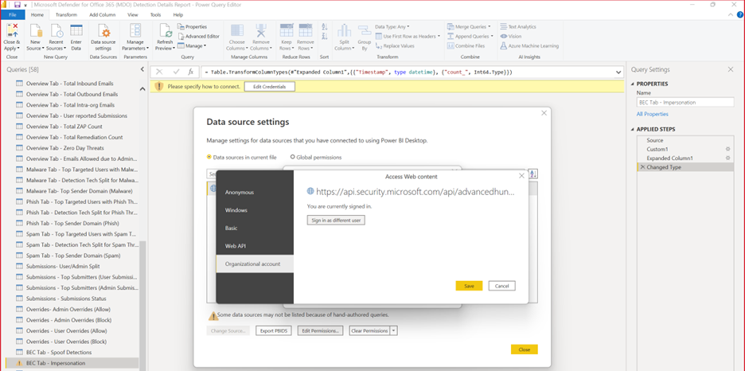
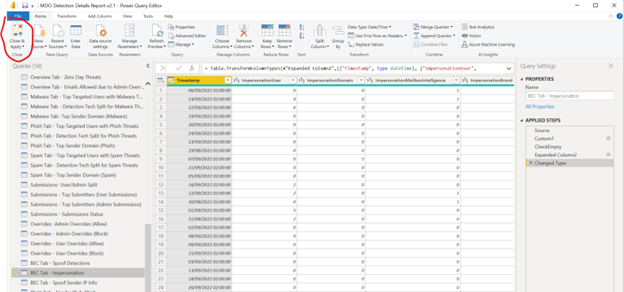
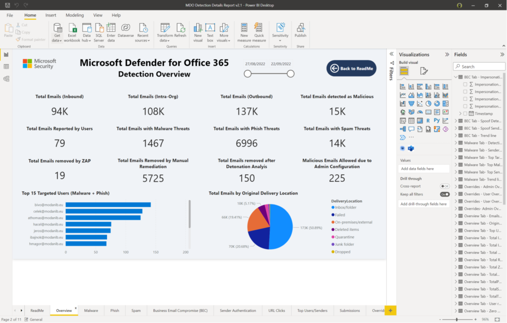

# Microsoft Defender for Office 365 Detection Details Report – Configuration Guide 

## Contents

[Overview](#overview) 
[Example View of Microsoft Defender for Office 365 (MDO) Detection Details Report](#example-view-of-microsoft-defender-for-office-365-mdo-detection-details-report) 
[How to use the .pbit file](#how-to-use-the-pbit-file) 
[How to use the .pbix file](#how-to-use-the-pbix-file) 
[How to publish to Power BI online and configure scheduled auto-refresh](#how-to-publish-to-power-bi-online-and-configure-scheduled-auto-refresh) 

## Overview

This report template will give you an example how to use Microsoft 365 Defender Hunting API to built a custom report using Power BI. This way you can visualise Microsoft Defender for Office 365 (MDO) data based on your organisation needs. 

* It is using Delegated model to connect to the M365D Hunting API. No need for app regirstartion simply need an admin account which can run the underlying Hunting queries using the API. 
* The built-in Security Reader or Security Administrator role is enough to have the report working for example. 
* This is inteneded to be a template, we encourage everybody to modify queries, visualisations, bring in more data sets based on organisation needs. 
* The “ReadMe” tab of the template files has more information about terminology used in the template.  
* This not intended to be a permanent or complete solution rather show an example how to create custom Microsoft Defender for Office 365 (MDO) reports unsing the hunting API and Power BI. 

## Example View of Microsoft Defender for Office 365 (MDO) Detection Details Report 

**Example view opening the .pbit template in Power BI Desktop**

## How to use the .pbit file

Using the .pbit file will load the template with no data and ask for Authentication at first run.
Power BI will ask for connect/Authenticate to the data source (Hunting API in M365D)   
Change the settings to “Organization account” and Sign in with an account which has access to the M365D hunting tables. Minimum Azure AD built-in role/permission required to run the queries behind the report is “Security Reader” or “Security Operator”   
Follow the Authentication flow for the account after you clicked “Sign in”   
After you signed in click “Connect” and the data should load. It can take few minutes to load the data at the first time. It depends on the size if the environment Queries may run longer in a larger tenant. 

## How to use the .pbix file
When the .pbix file opens, it loads with data from a sample demo environment.

To update the file with your organization tenant data:
* Expand on the fields side pane, and then right click on any table entry and open the Edit query option.   
* In the Power Query Editor window click on data source settings in the top   
* Select “Data sources in this file” and the entry for M365D API connection. Click “Edit permission”   
* On the ”Edit Permissions” window click on “Edit…”   
* On the Access Web Content page select “Organizational Account” and “Sign in”. Use your admin account for your organization to Authenticate.  
* Click “Save”   
* Click “OK” and “Close”   
* Click on “Close and Apply”   
* The data should load from your tenant now.  
**Note:** It can take quite a few minutes to load the data in a live environment. The dashboard using separate Advance Hunting queries to get the data from the M365D Hunting API.   

## How to publish to Power BI online and configure scheduled auto-refresh
You can publish the report to Power BI online when you finished making changes to visuals. In Power BI there is an easy way to share only the report with others without the need to have admin access to the underlying data set. It is also possible to configure scheduled auto-refresh so the report data kept up-to date.

To Publish the report:
* Use Power BI Desktop “Publish” action and click “Save”   
* Select a Power BI online workspace where you want to publish the report to. For example “My workspace”   
* Wait until the publishing process finishes   
* Open the published report and Share from Power BI based on needs.   
* Make sure the credentials used to update the data sets are correct. You can define it in the Data set Settings page. This used to update the data set during auto refresh.      
* You can also set up regular schedule for Auto refresh on the data set settings page:   
