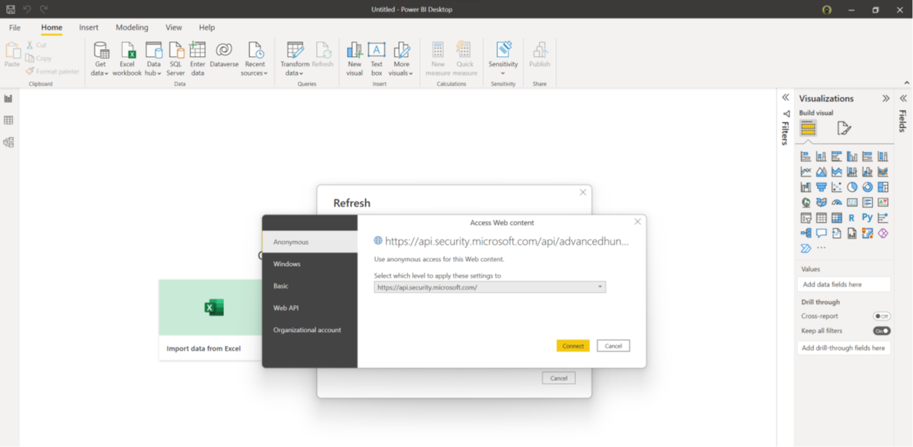
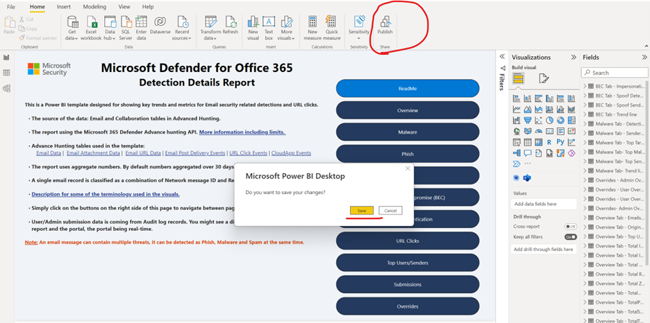
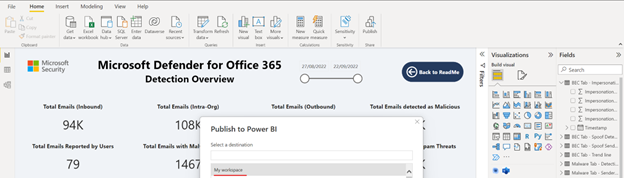
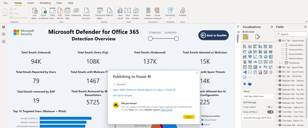
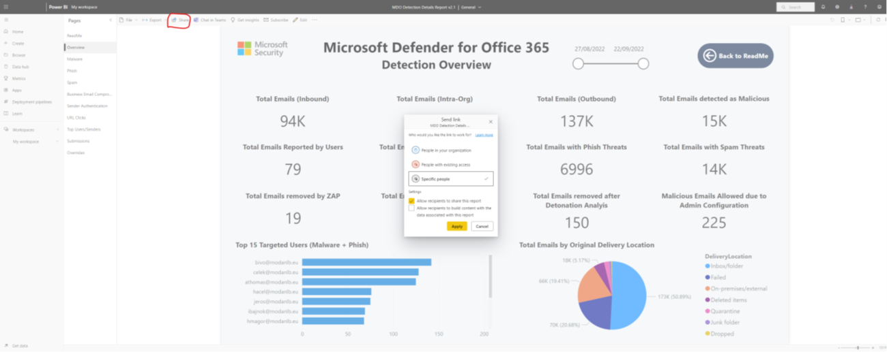

# Microsoft Defender for Office 365 Detection Details Report – Configuration Guide 

## Contents

[Overview](#overview) 
[Example View of Microsoft Defender for Office 365 (MDO) Detection Details Report](#example-view-of-microsoft-defender-for-office-365-mdo-detection-details-report) 
[How to use the .pbit file](#how-to-use-the-pbit-file) 
[How to publish to Power BI online and configure scheduled auto-refresh](#how-to-publish-to-power-bi-online-and-configure-scheduled-auto-refresh) 

## Overview

This report template will give you an example how to use Microsoft 365 Defender Hunting API to build a custom report using Power BI. This way you can visualise Microsoft Defender for Office 365 (MDO) data based on your organisation needs. 

* It is using Delegated model to connect to the M365D Hunting API. No need for app registration simply need an admin account which can run the underlying Hunting queries using the API. 
* Access to the Advanced hunting feature in the M365 Defender portal is needed through appropriate permission and license. 
  * The built-in Security Reader or Security Administrator role is enough to have the report working for example. 
  * Defender for Office 365 Plan 2 standalone or included in Microsoft 365 A5/E5/F5/G5 Security
* This is intended to be a template, we encourage everybody to modify queries, visualisations, bring in more data sets based on organisation needs. 
* The “ReadMe” tab of the template files has more information about terminology used in the template.  
* This not intended to be a permanent or complete solution rather show an example how to create custom Microsoft Defender for Office 365 (MDO) reports using the hunting API and Power BI. 

## Example View of Microsoft Defender for Office 365 (MDO) Detection Details Report 

## How to use the .pbit file

Using the .pbit file will load the template with no data and ask for Authentication at first run. 
Power BI will ask for connect/Authenticate to the data source (Hunting API in M365D)          
Change the settings to “Organization account” and Sign in with an account which has access to the M365D hunting tables. Minimum Azure AD built-in role/permission required to run the queries behind the report is “Security Reader” or “Security Operator”         
Follow the Authentication flow for the account after you clicked “Sign in”         
After you signed in click “Connect” and the data should load. It can take few minutes to load the data at the first time. It depends on the size if the environment Queries may run longer in a larger tenant. 

## How to publish to Power BI online and configure scheduled auto-refresh
You can publish the report to Power BI online when you finished making changes to visuals. In Power BI there is an easy way to share only the report with others without the need to have admin access to the underlying data set. It is also possible to configure scheduled auto-refresh so the report data kept up-to date.

To Publish the report:
* Use Power BI Desktop “Publish” action and click “Save”         
* Select a Power BI online workspace where you want to publish the report to. For example “My workspace”         
* Wait until the publishing process finishes         
* Open the published report and Share from Power BI based on needs.         
* Make sure the credentials used to update the data sets are correct. You can define it in the Data set Settings page. This used to update the data set during auto refresh.           
* You can also set up regular schedule for Auto refresh on the data set settings page:         
