# Microsoft Defender for Office 365 Detections and Insights

## Overview

This template enables Defender for Office 365 reporting in Power BI for customers without Microsoft Sentinel, using the same visuals as the Sentinel workbook experience.

- What you get: MDO detections and insights visuals aligned with the Sentinel dashboard.
- Data scope: Up to 30 days, via Microsoft Graph Advanced Hunting.
- How it works: Power BI calls the Graph Security API (Advanced Hunting) using Web.Contents with application permissions. The app secret is stored and retrieved from Azure Key Vault via a custom connector.

If you need >30 days of data and have Sentinel, use the Sentinel workbook directly:
[Build custom email security reports and dashboards with workbooks in Microsoft Sentinel](https://techcommunity.microsoft.com/blog/microsoftdefenderforoffice365blog/part-2-build-custom-email-security-reports-and-dashboards-with-workbooks-in-micr/4411303)

Note: Power BI has no native Microsoft Graph connector; Web.Contents requires application permissions (delegated auth is not supported for this flow).

### Quick Architecture Summary

**For manual Desktop refresh:** 📱 Power BI Desktop → 🔌 Custom Connector → 🔑 Azure Key Vault → 🔐 App Secret → 📊 Graph API (Advanced Hunting) → 📈 MDO Data

**For scheduled refresh:** ☁️ Power BI Service → 🌐 On-premises Gateway → (same flow)

## 🔒 Security
*   **No Hardcoded Secrets**: Client Secrets stay in Key Vault.
*   **Least Privilege**: The account used to configure/refresh the report only needs `Get` permission on the specific Key Vault Secret. And the application only needs `ThreatHunting.Read.All` permission on the Graph API.

## 📁 Repository Contents

| File | Description |
|------|-------------|
| `KeyVaultConnector.mez` | Custom Power BI connector for Azure Key Vault authentication |
| `Microsoft Defender for Office 365 Detection and Insights_v3.pbit` | Power BI template report |
| `GatewayDeployment.md` | Step-by-step guide for gateway deployment and scheduled refresh |
| `readme.md` | This file |
| `Images/` | Screenshots referenced in this documentation |

## Before you begin (values you’ll need)

- Application (client) ID - (`GUID`)
- Directory (tenant) ID - (`GUID`)
- Azure Key Vault Url - (e.g. `https://myvault.vault.azure.net`)
- Key Vault secret name (that contains the app secret) - (e.g. `myappsecret`)

## 📦 Prerequisites

1) Register an app with application permission
- [Set up an application](https://learn.microsoft.com/en-us/entra/identity-platform/quickstart-register-app) and note the `Application ID` and `Directory (tenant) ID`.  
  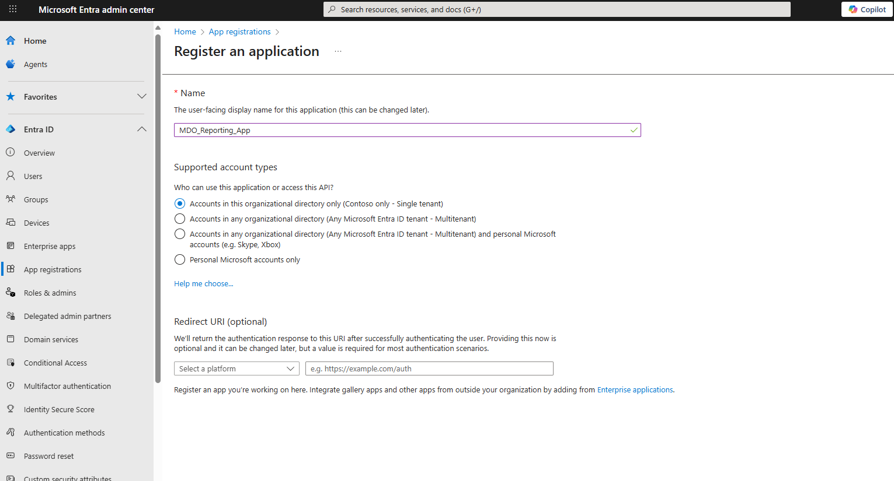
  
- Add Graph application permission ThreatHunting.Read.All and grant admin consent.  
  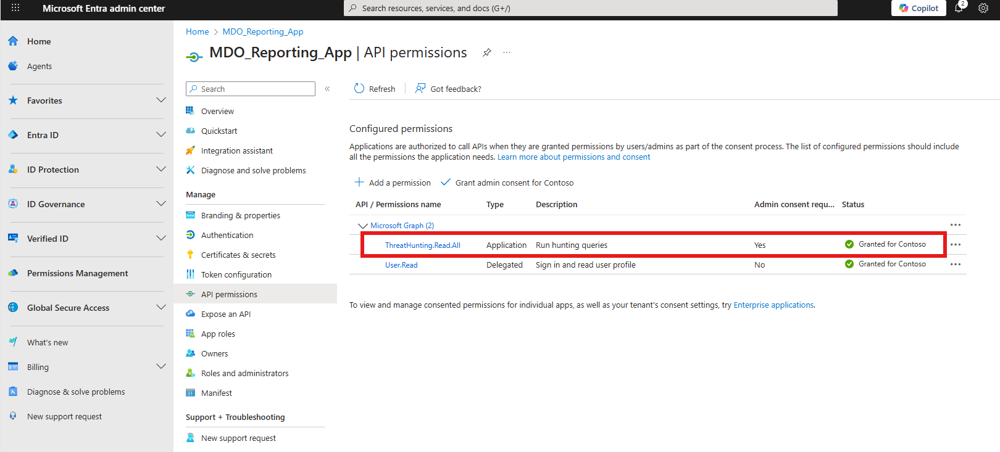
- Create a client secret (be careful with the value as you’ll store this in Azure Key Vault).  
  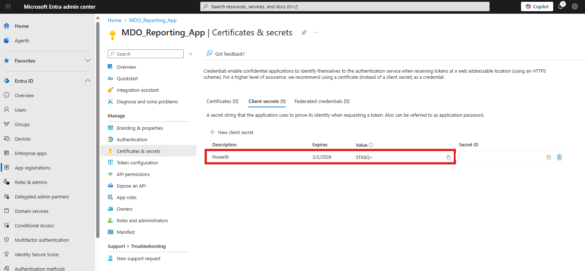

2) Prepare Azure Key Vault
- [Create](https://learn.microsoft.com/en-us/azure/key-vault/general/quick-create-portal) or use an existing Key Vault; note the Key Vault Url.
  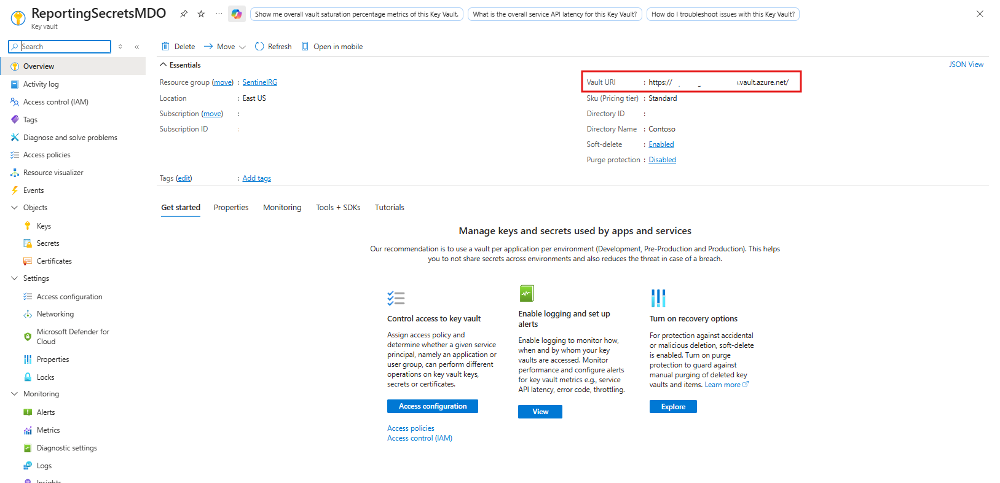
- Ensure Key Vault firewall/network settings allow your access to create/read the secret.  (Notice the 2 options, with the second being the more secure but requiring the specific IP where the Secret will be read from and created in the first instance)
  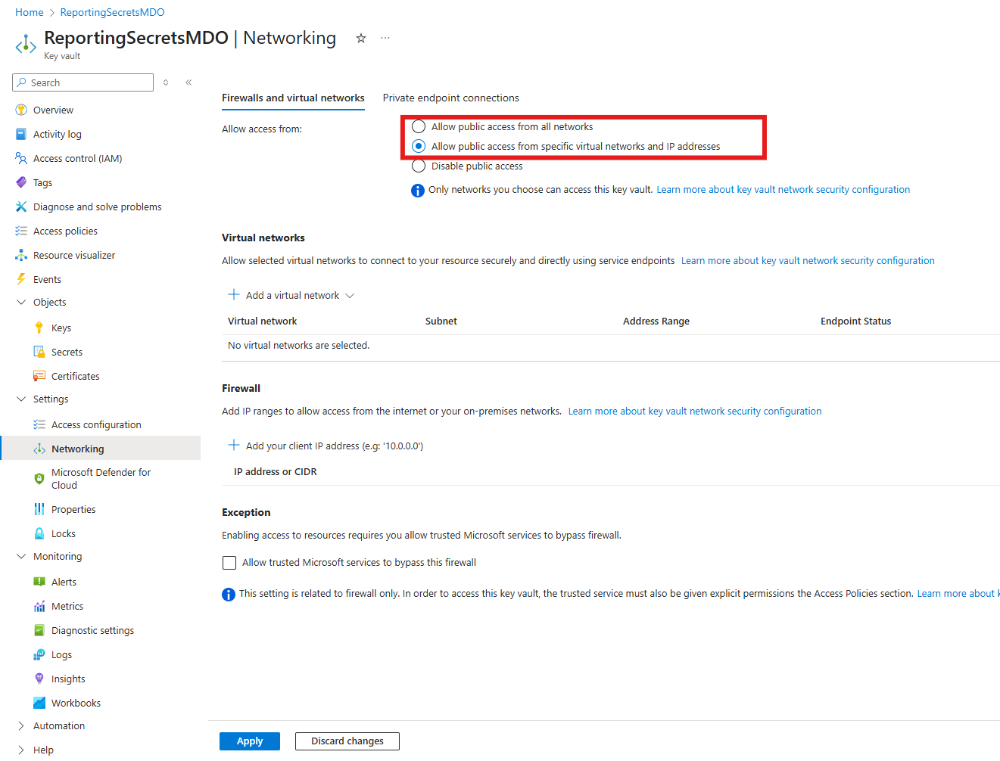
- [Click 'Generate/Import' to add a secret.](https://learn.microsoft.com/en-us/azure/key-vault/secrets/quick-create-portal) Special permissions to create a secret are [required.](https://learn.microsoft.com/en-us/azure/key-vault/general/rbac-guide?tabs=azure-cli#azure-built-in-roles-for-key-vault-data-plane-operations)  
  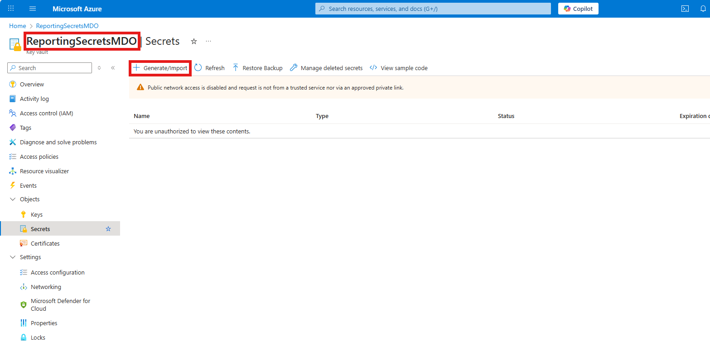
- Add a new secret: choose a secret name (record it as it will be used in Power BI) and paste the app secret value.  
  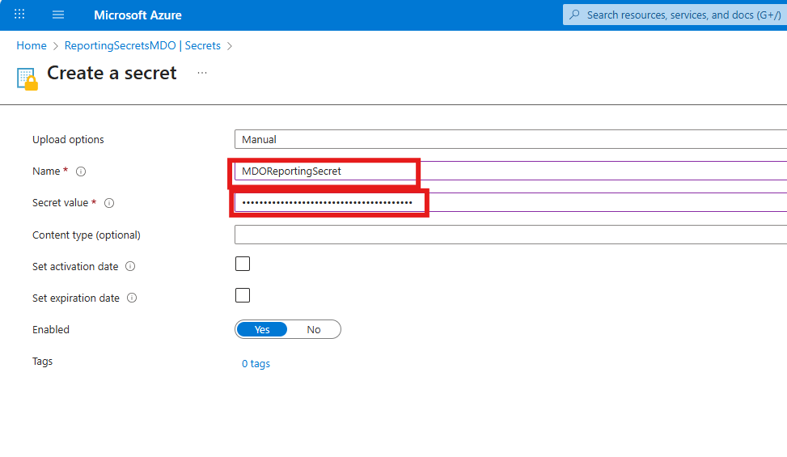

3) [Grant access to the secret](https://learn.microsoft.com/en-us/azure/key-vault/general/rbac-guide?tabs=azure-portal)
- In the secret’s Access control, grant users who will open/refresh the report at least `Key Vault Secrets User`.  
  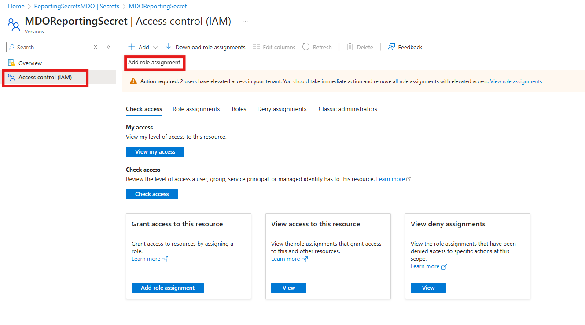  
  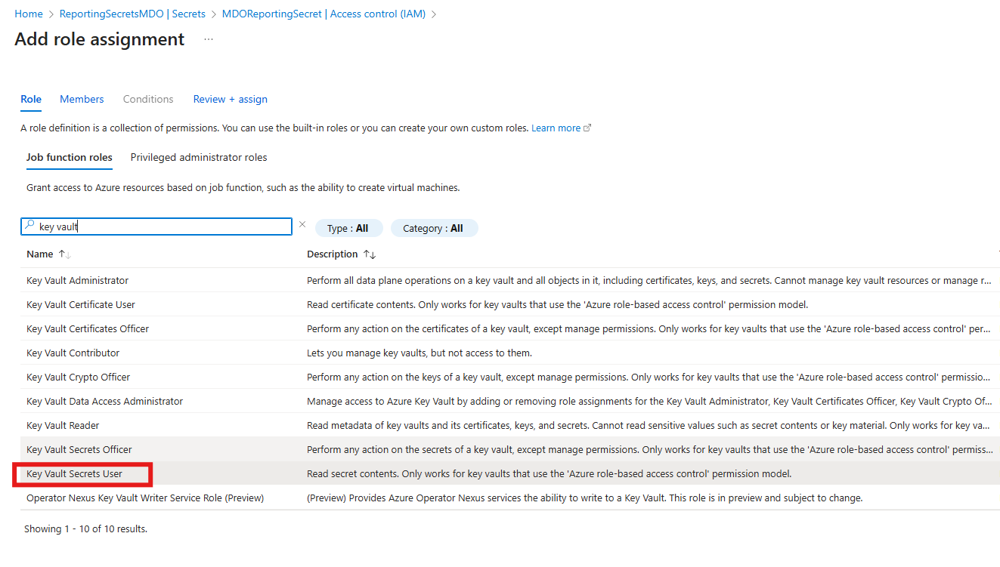

4) Download the files in this repository. The connector (`KeyVaultConnector.mez`) and PowerBI template (`Microsoft Defender for Office 365 Detection and Insights_v3.pbit`). 

5) Enable custom connector support in Power BI Desktop
- Follow: [Connector extensibility in Power BI](https://learn.microsoft.com/en-us/power-bi/connect-data/desktop-connector-extensibility#custom-connectors) to deploy the connector:
    *   Copy `KeyVaultConnector.mez` to `Documents\Power BI Desktop\Custom Connectors`.
    *   ⚠️Enable "Allow any extension..." in Power BI Options -> Security.
    
    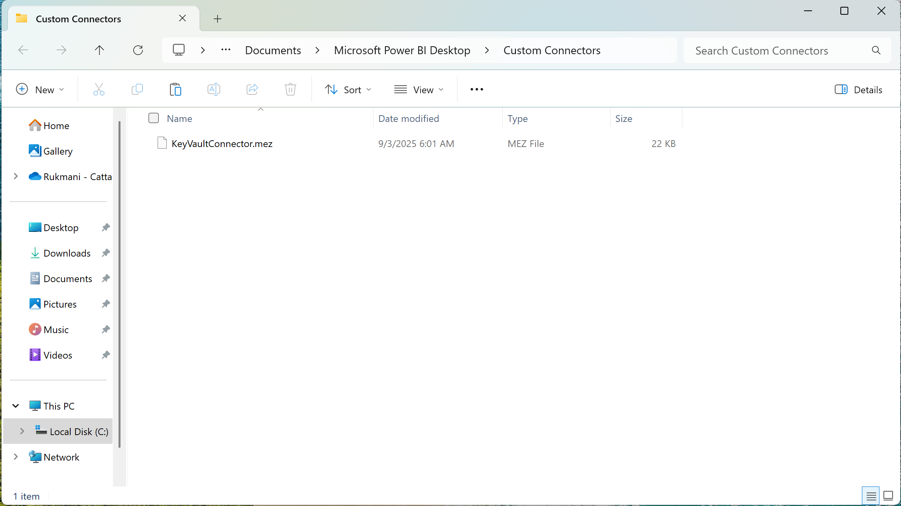

## 📊 Setup (Power BI Desktop)

1) Open the “Microsoft Defender for Office 365 Detections and Insights” template (.pbit).
2) Enter variables and Load:
   - Directory (tenant) ID
   - Application (client) ID
   - Key Vault Url
   - Secret name (that holds the app secret)
   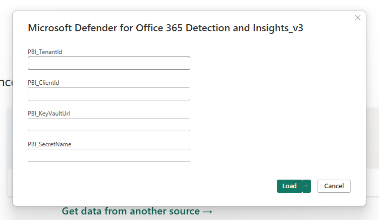
3) When prompted by the Azure Key Vault connector, sign in with a user that has access to the secret.  
   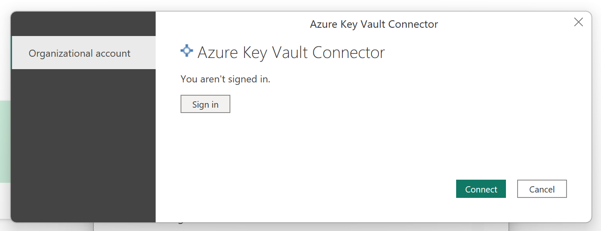
4. If a `login.microsoftonline.com` or `graph.microsoft.com` dialog appears, select **"Anonymous"** connection to proceed.  
   *(This is expected behavior: the custom connector handles OAuth internally; Power BI's Web.Contents step doesn't need additional auth here.)*
   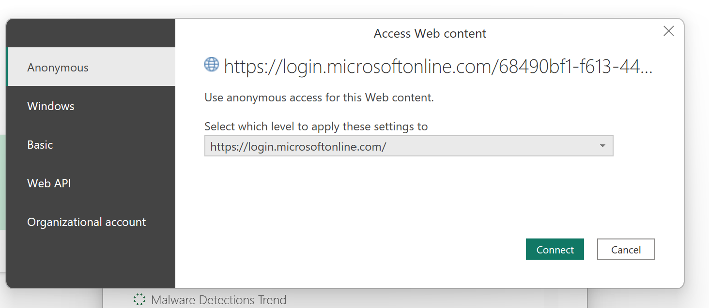

    You can also manually set the credentials in Power BI, in the Data Source Settings:
   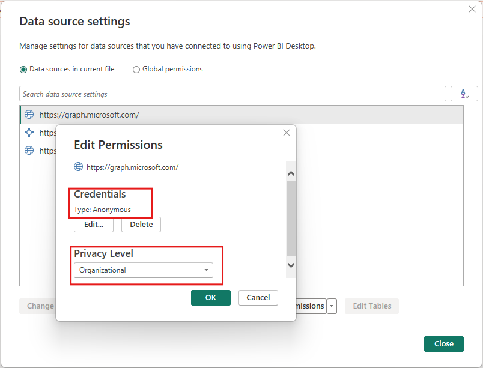
5) After loading completes, you’ll see the report:  
   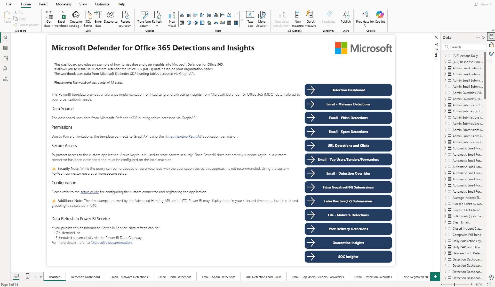
   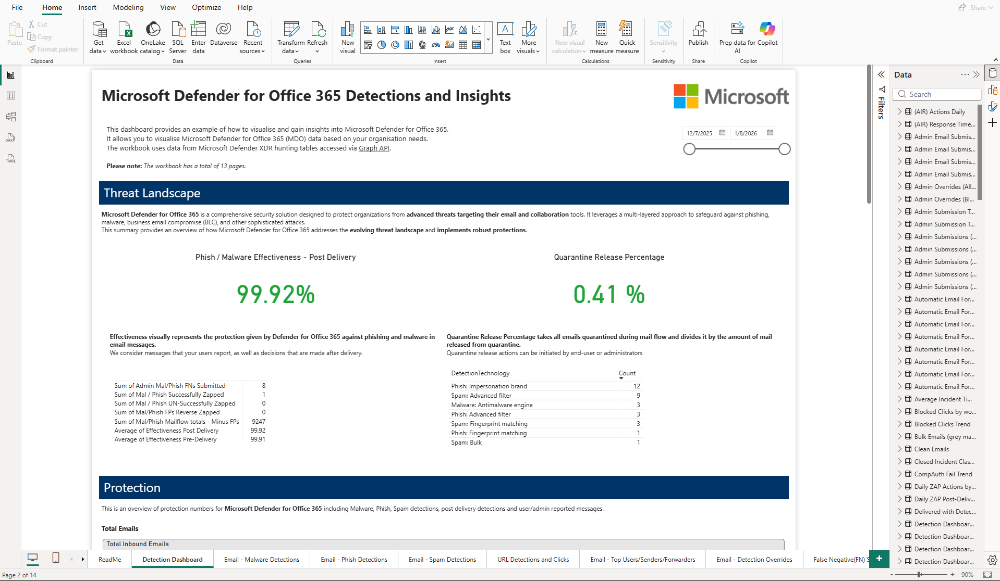

## 🌐 Publish and scheduled refresh

You can publish the report to the Power BI Service to share it.

> **⚠️ Important for Scheduled Refresh:**  
> This template requires an **On-premises Data Gateway** for scheduled refresh because it uses a custom connector.  
> 
> 📘 **See the complete guide:** [Gateway Deployment Guide](./GatewayDeployment.md)

For general information on Power BI data refresh: [Data refresh in Power BI](https://learn.microsoft.com/en-us/power-bi/connect-data/refresh-data#connecting-to-on-premises-data-sources)

## 🔧 Troubleshooting (quick checks)

- 403/401 on refresh: Confirm ThreatHunting.Read.All has admin consent and the app/secret are correct.
- Key Vault access denied: Verify firewall/network and that your user has Key Vault Secrets User.
- Connector not found: Re-check custom connector setup and security settings in Power BI Desktop.
- Extra auth prompt: Choosing Anonymous for login.microsoftonline.com is expected for Web.Contents.

---
**Last Updated:** January 2026  
**Tested with:** Power BI Desktop (January 2026), On-premises Data Gateway (Standard Mode)  
**Author:** [Iustin Irimia/Security CSA] [Daniel Mozes/CxE MDO PM]
