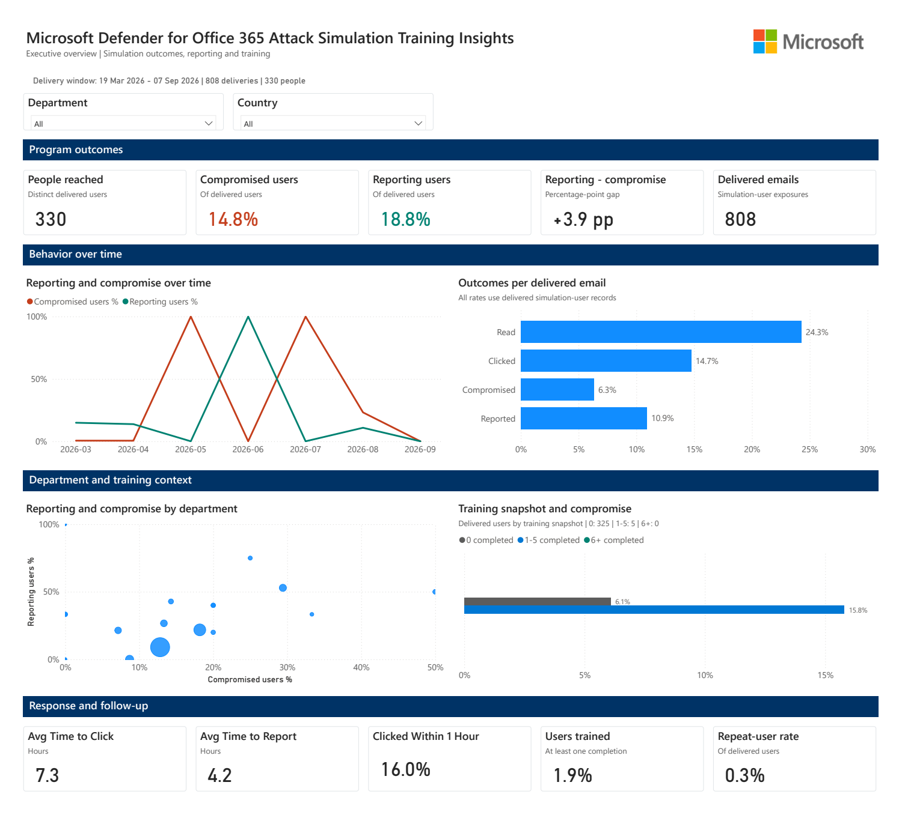
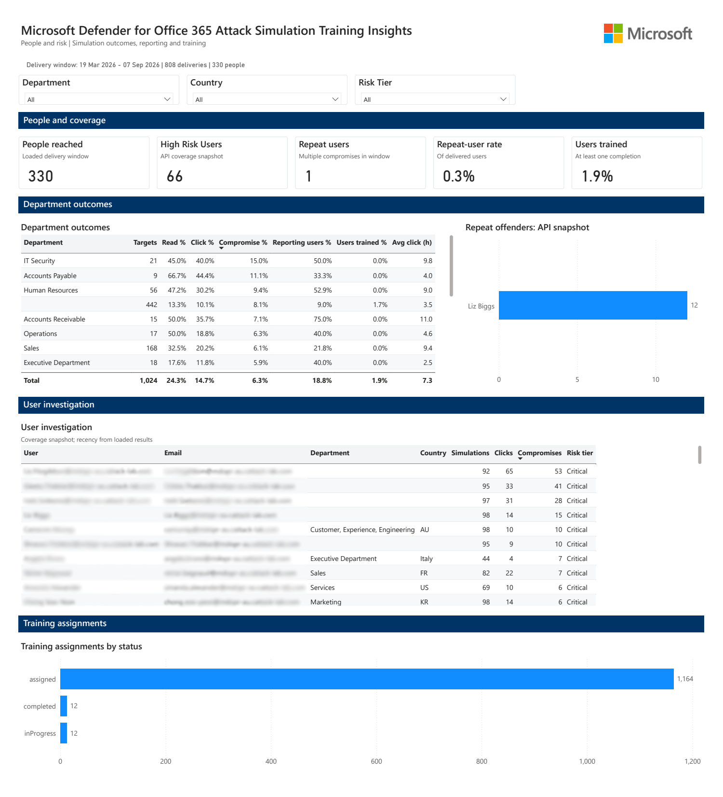
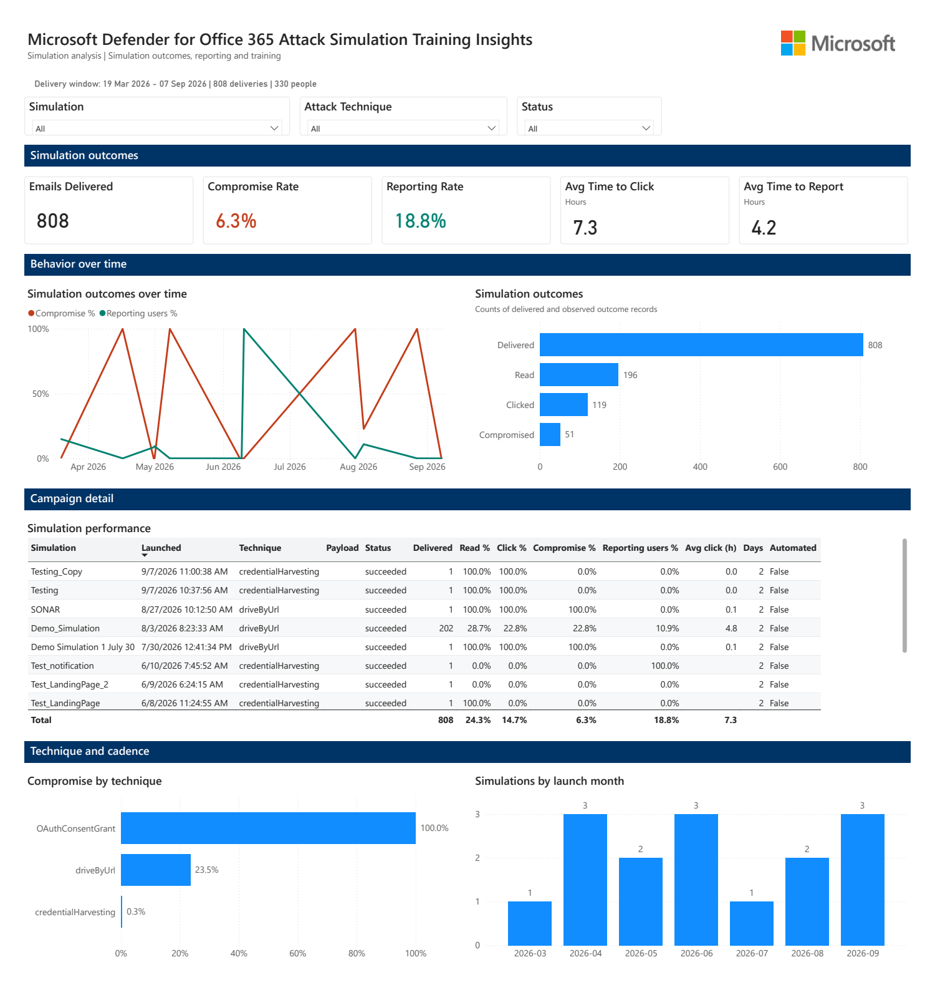
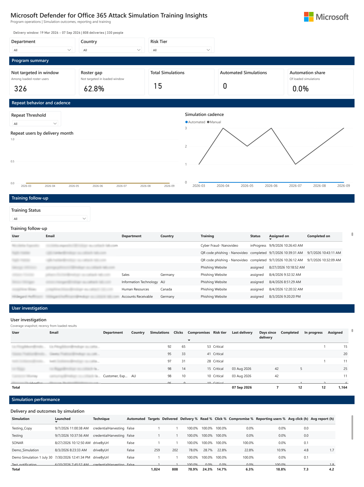

# Microsoft Defender for Office 365 Attack Simulation Training Insights

## Overview

This Power BI template provides insights into your organization's Attack Simulation Training data from Microsoft Defender for Office 365. It helps tenant administrators identify security knowledge gaps and track user training progress.

- **What you get:** Executive outcomes, department and user investigation, simulation performance, and operational follow-up across four report pages.
- **Data sources:** Microsoft Graph Attack Simulation APIs and security reports, with identity enrichment from either Graph advanced hunting or the Graph users API.
- **How it works:** Power BI calls Microsoft Graph using application permissions. The application secret is retrieved from Azure Key Vault through the same custom connector used by the companion MDO Detections and Insights report.

### Report Pages

| Page | Main questions |
|------|----------------|
| **Executive Dashboard** | How many people were reached? How do reporting and compromise compare? How quickly do users respond? |
| **People & Risk** | Which departments and users need follow-up, and what is their training status? |
| **Simulation Drilldown** | How did each simulation and attack technique perform? |
| **Program Ops** | Which loaded-roster users were not targeted in the loaded window? What needs training follow-up, and how much of the program is automated? |

### What is Attack Simulation Training?

Attack simulation training is part of [Microsoft Defender for Office 365](https://learn.microsoft.com/en-us/microsoft-365/security/office-365-security/defender-for-office-365) which sets up benign cyberattack simulations to train users in the tenant to increase their awareness and help identify vulnerable users.

For more information, see: [Reports API overview for attack simulation training](https://learn.microsoft.com/en-us/graph/api/resources/report-m365defender-reports-overview?view=graph-rest-1.0)

### Data Available

| Report Type | Description |
|-------------|-------------|
| **Simulations and per-user results** | Campaign metadata and delivery, read, click, compromise, and reporting outcomes for simulation-user records |
| **Simulation events** | Event-level information associated with the loaded simulations |
| **Simulation User Coverage** | API snapshot of user-level simulation, click, and compromise counts |
| **Training User Coverage and details** | Training assignments, statuses, assignment dates, and completion dates |
| **Repeat Offenders** | API repeat-offender snapshot, shown separately from repeat users calculated within the loaded results window |
| **IdentityInfo** | Department, country, and other user attributes from the selected identity source; completeness depends on that source and its refresh |

### Quick Architecture Summary

**For manual Desktop refresh:** 📱 Power BI Desktop → 🔌 Custom Connector → 🔑 Azure Key Vault → 🔐 App Secret → 📊 Graph API → 📈 Attack Simulation Data

**For scheduled refresh:** ☁️ Power BI Service → 🌐 On-premises Gateway → (same flow)

## 🔒 Security

- **Secret storage:** Store the application secret in Key Vault, not in the report parameters. The connector retrieves it at refresh time; the secret is necessarily used in memory to obtain an access token.
- **Least privilege:** Grant the identity signing in to the Key Vault connector secret-read access, such as `Key Vault Secrets User` at an appropriate scope. Separately, grant the Entra application the Graph application permissions required by the selected identity mode below.
- **Report access:** Refreshed reports contain user identities and security-training outcomes. Share them only with authorized audiences. This template does not provide department-based row-level security; slicers are not an access-control boundary. Do not use **Publish to web** for tenant data.

## 📁 Repository Contents

| File | Description |
|------|-------------|
| `Microsoft Defender for Office 365 Attack Simulation Training Insights_v1.pbit` | Power BI template report |
| `README.md` | This file |
| `Images/` | Report preview images |

## 📜 Report Sample

## 📦 Prerequisites & Setup

> **This template uses the same custom connector as the [Microsoft Defender for Office 365 Detections and Insights](<../1. Microsoft Defender for Office 365 Detections and Insights/README.md>) template.**
>
> Follow the complete setup guide in that folder for:
> - Entra Application
> - Custom connector installation (`KeyVaultConnector.mez`)
> - Azure Key Vault configuration
> - Power BI Desktop configuration

Use a tenant licensed for Attack Simulation Training, such as Microsoft Defender for Office 365 Plan 2 or a subscription that includes it. See the [Attack Simulation Training prerequisites](https://learn.microsoft.com/en-us/defender-office-365/attack-simulation-training-get-started). 

### Application Permissions

These are **Microsoft Graph application permissions**, used with the client-credentials flow, not delegated permissions.

| Permission | Required when | Purpose |
|------------|---------------|---------|
| `AttackSimulation.Read.All` | All identity modes | Read Attack Simulation data and security reports |
| `ThreatHunting.Read.All` | `Tenant` or `Scoped` identity mode | Run Graph advanced hunting queries for identity enrichment |
| `User.Read.All` | `Graph` identity mode | Read directory users and selected profile attributes |

**Steps:**
1. In your app registration, go to **API Permissions** → **Add a permission** → **Microsoft Graph** → **Application permissions**
2. Add `AttackSimulation.Read.All` and the additional permission for the identity mode you will use.
3. Click **Grant admin consent** and verify consent was granted.

> **Note:** You can use the same app registration and Key Vault secret as the MDO Detections and Insights template if you add all required permissions (`ThreatHunting.Read.All`, `AttackSimulation.Read.All`, `User.Read.All`) to the same application.

## 📊 Setup (Power BI Desktop)

1. Ensure you have completed the prerequisites from the [Detections and Insights README](<../1. Microsoft Defender for Office 365 Detections and Insights/README.md>).
2. Open the PBIT in a current version of Power BI Desktop.
3. Enter all six parameters in the table below. The exported template leaves values unset, including the lookback and identity mode; select them explicitly.
4. When prompted by the Azure Key Vault connector, sign in with a user that has access to the secret.
5. If prompted for `login.microsoftonline.com` or `graph.microsoft.com`, select **Anonymous** as described in the shared setup guide. The queries acquire and send their own application token; Graph calls are not unauthenticated.
6. Load the data and explicitly refresh `IdentityInfo` as described below. Verify the delivery-window banner and department/country information before interpreting coverage metrics.
7. Save the refreshed report as a PBIX in your own environment.

### Parameters

| Parameter | Value to supply |
|-----------|-----------------|
| `PBI_TenantId` | Your Entra directory tenant ID |
| `PBI_ClientId` | Your app registration's application/client ID |
| `PBI_KeyVaultUrl` | Your vault URL, for example `https://your-vault.vault.azure.net` |
| `PBI_SecretName` | The name of the Key Vault secret storing the application secret, not the secret value |
| `PBI_SimulationLookbackDays` | Enter `180` for the recommended initial window. `0` or a negative number disables the simulation launch-date cutoff and can substantially increase refresh time. |
| `PBI_IdentityScopeMode` | Explicitly select `Scoped`, `Tenant`, or `Graph` using the guidance below. |

### Identity Mode and Refresh

| Mode | Source and scope | Use and limitations |
|------|------------------|---------------------|
| `Scoped` | Advanced hunting `IdentityInfo`, restricted to users found in the loaded simulation results | Limits enrichment to observed participants. It cannot establish how many tenant users have never been targeted. |
| `Tenant` | Advanced hunting `IdentityInfo`, without the simulation-participant restriction | Broader hunting identity data, but not a guaranteed complete eligible-user directory. Availability and completeness depend on the tenant's data sources. |
| `Graph` | Paginated Microsoft Graph `/users` | Directory-based roster. The current query does not exclude disabled users, guests, or service accounts; define the eligible population before interpreting organization-wide gaps. |

**`IdentityInfo` is excluded from normal model refresh in this template.** In Power BI Desktop, right-click `IdentityInfo` in the Data pane and select **Refresh data**. Do this after first setup, after changing identity mode, and when roster or department information needs updating. A refresh of the other tables does not prove the identity roster is current.

For recurring roster refreshes, either enable **Include in report refresh** for `IdentityInfo` in Power Query Editor and republish, or maintain an explicit table-refresh procedure. Choose a cadence appropriate to your tenant size and validate it in your target environment.

## Reading the Metrics

| Metric | Interpretation |
|--------|----------------|
| **People reached** | Distinct people with at least one delivered simulation in the current selection |
| **Executive compromised users / reporting users** | Distinct users with that outcome divided by distinct delivered users. The groups can overlap. |
| **Reporting - compromise** | The difference between those two user rates, in percentage points, not a relative percentage improvement |
| **Delivered emails and simulation outcome rates** | Counts and rates at simulation-user grain; the same person can contribute a record in several simulations. These differ from cross-simulation distinct-user rates. |
| **Users trained** | Users with at least one completed assignment divided by users with assignments in the assigned-date context; not the percentage of all assignments completed |
| **Clicked within 1 hour** | Clicked simulation-user records with a valid elapsed interval from zero through 60 minutes, divided by clicked records with valid delivery/click timestamps; negative or missing intervals are excluded |
| **Repeat users / repeat-user trend** | Repeat compromises in the current delivery context, using the configured threshold where applicable. A per-month trend counts within each month, not cumulatively across the entire window. |
| **Not targeted in window / roster gap** | Loaded-roster users without a simulation participation record in the loaded results window. This does not mean never historically, and it is not necessarily full-tenant coverage. |

- **Blank is not zero:** Main outcome rates are blank when there are no denominator observations. An observed cohort with no matching events can have a genuine 0% rate.
- **Small cohorts:** Large percentage swings can reflect only one or a few users. Check cohort sizes in the trend tooltip before drawing conclusions.
- **Training comparison:** The 0, 1-5, and 6+ completed-training groups are snapshots. Training may have occurred after the simulation; the chart describes an association, not proof that training caused a change. Empty delivery cohorts are blank.
- **Snapshot versus window:** API risk tiers and repeat-offender snapshots can differ from results-window calculations. The report labels these separately; do not expect their counts to be identical.

## 🌐 Publish and Scheduled Refresh

To enable scheduled refresh in Power BI Service, an **On-premises Data Gateway** is required because this template uses a custom connector.

📘 **See the complete gateway guide:** [Gateway Deployment Guide](<../1. Microsoft Defender for Office 365 Detections and Insights/GatewayDeployment.md>)

## 🔧 Troubleshooting

| Issue | Solution |
|-------|----------|
| **403/401 on refresh** | Check the app/secret and admin consent for AST plus the additional permission required by your selected identity mode. The Key Vault connector identity and Graph application have separate permissions. |
| **Key Vault access denied** | Verify firewall/network settings and that your user has `Key Vault Secrets User` role |
| **Connector not found** | Re-check custom connector setup in `Documents\Power BI Desktop\Custom Connectors` |
| **Blank simulation charts or no-deliveries banner** | Check selected filters, the launch-date lookback, and whether simulations have delivery results. New, draft, or scheduled simulations may have no outcomes yet. |
| **Missing departments or unexpected roster gap** | Check the selected identity mode, its Graph permission/data availability, and explicitly refresh `IdentityInfo`. A scoped or incomplete roster is not a full-tenant denominator. |
| **Service refresh fails or is unavailable** | Check the shared gateway guide, connector installation/credentials, and any dynamic-data-source warning. Inspect Service refresh history; do not assume Desktop success guarantees scheduled refresh. |

Some current queries convert source errors into empty results. A successful-looking refresh or blank visual is therefore not proof of complete collection; investigate unexpected count drops using source reports and refresh/query diagnostics.

## 📚 Additional Resources

- [Attack simulation training in Microsoft Defender for Office 365](https://learn.microsoft.com/en-us/microsoft-365/security/office-365-security/attack-simulation-training-get-started)
- [Microsoft Graph Attack Simulation Reports API](https://learn.microsoft.com/en-us/graph/api/resources/report-m365defender-reports-overview?view=graph-rest-1.0)
- [Graph advanced hunting permissions](https://learn.microsoft.com/en-us/graph/api/security-security-runhuntingquery?view=graph-rest-1.0)
- [Graph users API permissions](https://learn.microsoft.com/en-us/graph/api/user-list?view=graph-rest-1.0)
- [Microsoft 365 Defender Portal](https://security.microsoft.com/)

---
**Last Updated:** September 2026  
**Desktop validation:** Power BI Desktop 2.157.1354.0
**Author:** [Iustin Irimia/Security CSA]