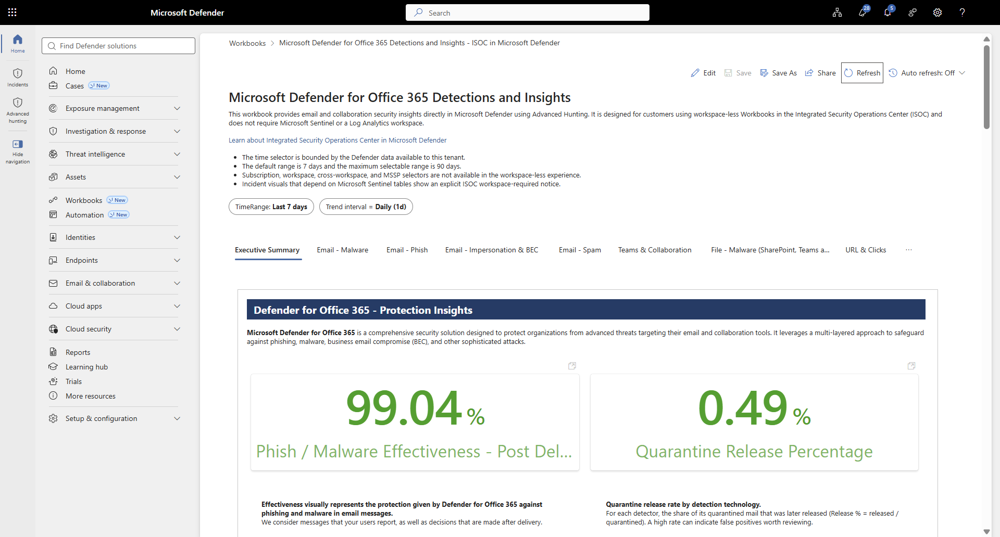
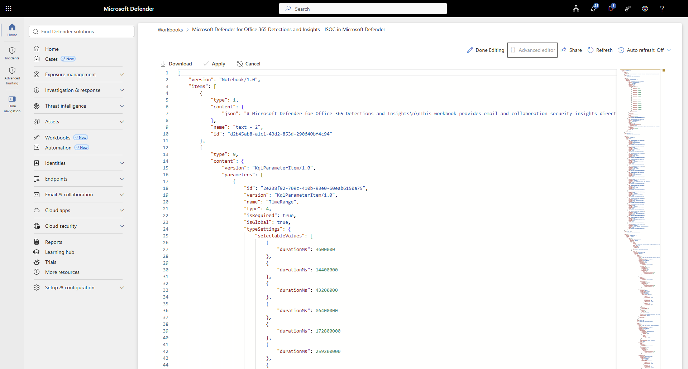

# Microsoft Defender for Office 365 Detections and Insights - ISOC in Microsoft Defender

## Overview

This folder provides raw workbook JSON for manual import into workspace-less Workbooks in the Microsoft Defender integrated security operations center (ISOC) public preview.

The workbook brings the shipped Microsoft Sentinel MDO Detections and Insights V4 experience to eligible Defender-only tenants. It preserves all 14 tabs and runs 237 portable visual queries through Advanced Hunting. Six visuals that depend on Microsoft Sentinel incident and alert tables are replaced with notices explaining that an ISOC workspace is required.

Learn more in the [ISOC public-preview announcement](https://techcommunity.microsoft.com/blog/microsoftthreatprotectionblog/integrated-security-operations-center-in-microsoft-defender/4559097) and the [Workbooks in Microsoft Defender documentation](https://learn.microsoft.com/defender-xdr/siem-defender-workbooks).

## When to use this workbook

- Use it when your eligible Defender tenant exposes workspace-less **Workbooks** in Microsoft Defender and does not use Microsoft Sentinel or Log Analytics.
- Do not use it as a replacement for the Sentinel workbook. Microsoft Sentinel customers should install the shipped workbook from the Microsoft Defender XDR solution in Content Hub.

## Prerequisites and limitations

- The default time range is 7 days. The maximum selectable range is 90 days.
- Six Microsoft Sentinel incident and alert visuals require an ISOC workspace and appear as explicit notices.

## Import the workbook

1. Download [MicrosoftDefenderForOffice365DetectionsAndInsights.json](MicrosoftDefenderForOffice365DetectionsAndInsights.json) and open it in a text editor.
2. Copy the entire contents of the JSON file.
3. In the Microsoft Defender portal, go to **Workbooks**.
4. Select **Add workbook**.
5. Select **Edit**, then **Advanced Editor**.
6. Select all existing template JSON in Advanced Editor and paste the copied JSON content over it.
7. Select **Apply**.
8. Select **Save** and provide a name.

## Troubleshooting

Workbook queries consume the tenant's shared Advanced Hunting resources. If a query returns HTTP 429 `TenantQuotaExceeded`, stop and wait before continuing. Do not press **Retry** repeatedly.
