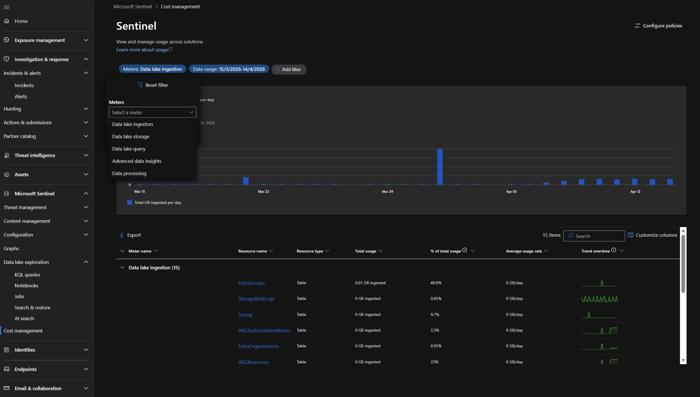
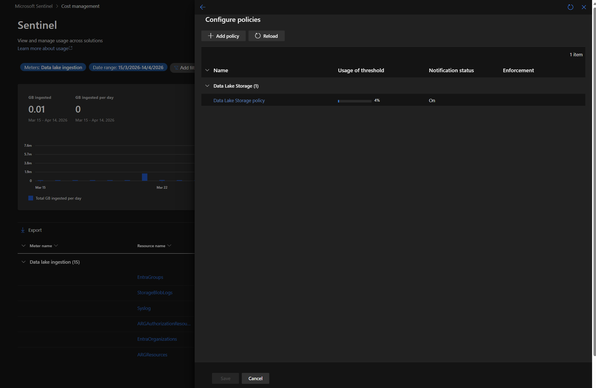
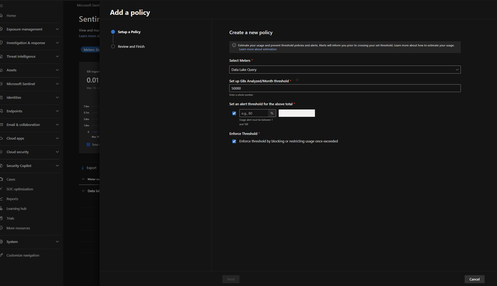
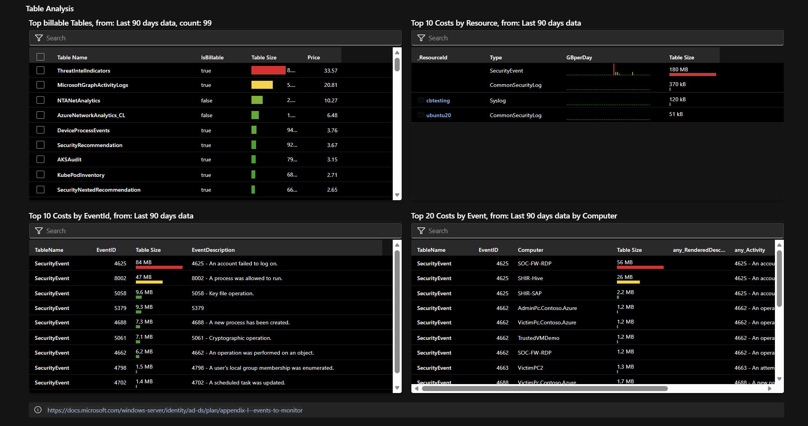
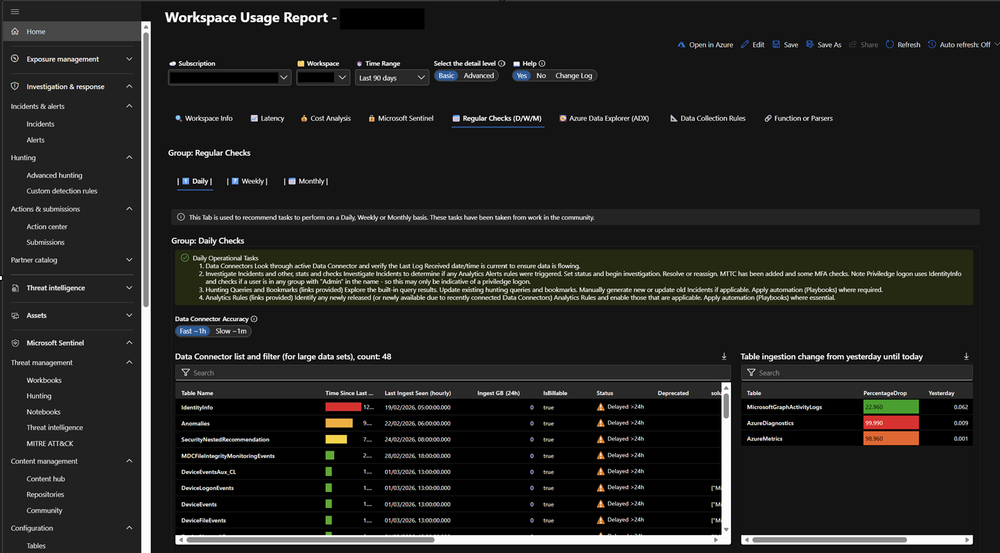

# Exercise 9 — Cost Management & Ingestion Analysis

**Topic:** Monitor Sentinel costs using Usage tables and the ingestion dashboard  
**Difficulty:** Intermediate  
**Prerequisites:** None

---

## Objective

Understand how Microsoft Sentinel billing works, query the **Usage** and **LAIngestionStatus** tables to analyse ingestion volume per table, and learn strategies to control costs.

### Background

Microsoft Sentinel costs are primarily driven by **data ingestion volume** (GB/day). Understanding which tables contribute the most to ingestion is critical for cost optimisation.

Key billing concepts:

| Concept | Description |
|---|---|
| **Analytics logs** | Full-featured tier with 90-day interactive retention. Pay per GB ingested. |
| **Basic logs** | Lower cost, limited to 8-day interactive queries. Good for high-volume, low-value data. |
| **Auxiliary logs** | Lowest cost tier for compliance/audit data. 30-day interactive retention. |
| **Free data sources** | Some tables (e.g., `AzureActivity`, `SecurityAlert`) are free to ingest. |
| **Commitment tiers** | Pre-purchase a daily GB commitment at a discount (100, 200, 400 GB/day tiers). |

> **Reference:** [Plan costs and understand Microsoft Sentinel pricing](https://learn.microsoft.com/en-us/azure/sentinel/billing)

---

### Steps

#### Step 1 — Query Ingestion Volume by Table

Open **Advanced Hunting** in the Microsoft Defender portal and run:

```kusto
Usage
| where TimeGenerated > ago(30d)
| where IsBillable == true
| summarize
    TotalGB = round(sum(Quantity) / 1024, 2)
    by DataType
| sort by TotalGB desc
```

This shows every table's billable ingestion over the last 30 days, in GB.

Now break it down by day to spot ingestion trends:

```kusto
Usage
| where TimeGenerated > ago(30d)
| where IsBillable == true
| summarize
    DailyGB = round(sum(Quantity) / 1024, 2)
    by bin(TimeGenerated, 1d), DataType
| sort by TimeGenerated desc, DailyGB desc
```

> **Key insight:** Look for tables with unusually high ingestion on specific days. This often indicates a misconfigured data connector or a spike in activity (e.g., a noisy scanning rule).

#### Step 2 — Identify the Top Cost Drivers

Find your top 5 most expensive tables:

```kusto
Usage
| where TimeGenerated > ago(30d)
| where IsBillable == true
| summarize
    TotalGB = round(sum(Quantity) / 1024, 2),
    DailyAvgGB = round(sum(Quantity) / 1024 / 30, 3)
    by DataType
| top 5 by TotalGB
| extend EstMonthlyCostUSD = round(TotalGB * 4.30, 2) // Approximate pay-as-you-go rate — check link below for current pricing
```

> **Note:** The cost estimate above uses an approximate rate. Your actual rate depends on your pricing tier, commitment tier, and region. Check the [Microsoft Sentinel pricing page](https://azure.microsoft.com/pricing/details/microsoft-sentinel/) for current rates.

In a lab environment, your ingestion is likely small. In production, `CommonSecurityLog` (firewall) and `SecurityEvent` (Windows) are typically the largest tables.

#### Step 3 — Analyse Ingestion Latency

The `_IngestedDate` column (available on most tables via `ingestion_time()`) tells you when data arrived in the workspace — useful for identifying ingestion delays:

```kusto
CommonSecurityLog
| where TimeGenerated > ago(7d)
| extend IngestionDelay = ingestion_time() - TimeGenerated
| summarize
    AvgDelayMinutes = round(avg(IngestionDelay / 1m), 1),
    MaxDelayMinutes = round(max(IngestionDelay / 1m), 1),
    P95DelayMinutes = round(percentile(IngestionDelay / 1m, 95), 1)
    by bin(TimeGenerated, 1d)
| sort by TimeGenerated desc
```

High ingestion latency can delay alert firing. If you see delays above 15 minutes, investigate the data connector or source system.

#### Step 4 — Monitor Ingestion with the Usage Dashboard

##### Option A — Cost Management page (Defender portal)

The Defender portal includes a dedicated **Cost management** page for monitoring data lake tier usage and configuring spending controls:

1. In the Microsoft Defender portal, navigate to **Settings** → **Microsoft Sentinel** → **Cost management**

> **Note:** You need both **Billing Administrator** and **Security Administrator** roles to access this page.



**Usage summary**

The **Usage** section lets you visualise usage by capability over time:

- Select a meter from the **Meters** dropdown (e.g., Data lake ingestion, Data lake query, Advanced data insights)
- Daily usage is displayed for the chosen time range (default: one month)
- The summary card shows the total usage for the selected period
- For **Data lake query** and **Advanced data insights**, usage is split between interactive analysis and scheduled analysis
- A resource table below the chart shows which resources contribute to the selected meter's usage

**Threshold Policies (Notifications & Enforcement)**

The **Configure Policies** feature lets you set threshold-based alerts and optionally enforce spending limits on data lake capabilities:

1. Click **Configure Policies** in the top right corner of the Cost management page



2. Select the policy you want to edit (e.g., Data Lake Query, Advanced Data Insights)
3. In the **Edit policy** panel:
   - Set a **Total threshold** — the usage limit for the capability
   - Set an **Alert percentage** — when email notifications are sent relative to the threshold (e.g., at 80%)
   - Optionally enable **Enforcement** — blocks usage after the threshold is exceeded



| Setting | What it does |
|---|---|
| **Total threshold** | The usage cap for the capability |
| **Alert percentage** | Triggers an email notification to the billing administrator when usage reaches this % of the threshold |
| **Enforcement** | When enabled, future queries, jobs, or sessions **fail** after the limit is exceeded (users see a "Limit exceeded" error) |

> **Note:** Enforcement is supported for **Data Lake Query** (interactive KQL queries and jobs) and **Advanced Data Insights** (notebook runs and jobs). After a limit is reached, it can take up to 4 hours for enforcement to take effect.

> **Reference:** [Microsoft Sentinel cost management in the Defender portal](https://learn.microsoft.com/en-us/azure/sentinel/billing-monitor-costs#microsoft-sentinel-cost-management-in-the-microsoft-defender-portal)

##### Option B — Workspace Usage Report workbook

The **Workspace Usage Report** is a community-driven workbook (created by Clive Watson) that gives you deep visibility into ingestion costs, latency, and operational health — all from within the Defender portal.

**Opening the workbook in the Defender portal:**

1. In the Microsoft Defender portal, navigate to **Microsoft Sentinel** → **Threat management** → **Workbooks**
2. Search for **Workspace Usage Report** in the templates
3. Click **Save** (if not yet saved), then **View saved workbook**

> **Tip:** If the workbook is not available in templates, install it from **Content Hub** → search for "Workspace Usage Report".

Once open, you can select your **Subscription**, **Workspace**, and **Time Range** at the top. Toggle **Help** to **Yes** for additional troubleshooting queries and guidance.

The workbook is organised into several tabs:

| Tab | What it shows |
|---|---|
| **Workspace Info** | Table inventory, daily ingestion averages, table size trends, LA query audit data |
| **Latency** | Average, minimum, and maximum ingestion latency per table; agent heartbeat health |
| **Cost Analysis** | Table pricing estimates, capacity trend projections, top costs by table/resource/EventID |
| **Microsoft Sentinel** | Sentinel-specific usage, watchlists, threat intelligence metrics, enabled connectors |
| **Regular Checks (D/W/M)** | Daily, weekly, and monthly operational checklists with data connector health monitoring |

**Cost Analysis — Table Analysis view**

The **Cost Analysis** tab breaks down costs across multiple dimensions. The **Table Analysis** sub-tab shows:

- **Top billable tables** — ranked by estimated price, with table size and billable status
- **Top 10 costs by resource** — which data sources (VMs, appliances) contribute the most data
- **Top 10 costs by EventID** — pinpoints individual Windows event types driving ingestion (e.g., Event 4625 failed logons, Event 8002 process execution)
- **Top 20 costs by Event and Computer** — correlates specific events to specific machines, so you can identify a noisy computer + event combination



> **Key insight:** If a single EventID dominates the cost chart (e.g., Event 4625 at 84 MB), consider filtering it at the DCR level or moving that table to Basic logs.

**Regular Checks — Data Connector Health**

The **Regular Checks (D/W/M)** tab provides daily, weekly, and monthly operational checklists based on community best practices. The **Daily** checks include:

- **Data Connector Accuracy** — toggle between fast (~1 hour) and slow (~1 minute) accuracy to check connector freshness
- **Data Connector list** — shows each table's last ingest time, GB ingested in the last 24 hours, billable status, and whether the connector is delayed (> 24 hours since last data)
- **Table ingestion change** — highlights tables with a significant percentage drop compared to the previous day (e.g., a 99.99% drop in `AzureDiagnostics` signals a broken connector)



> **Tip:** Check the **Regular Checks** tab as part of your daily SOC routine. A connector showing "Delayed > 24h" with 0 GB ingested means you have a blind spot — investigate the source system immediately.

> **Reference:** [Usage reporting for Azure Sentinel — Clive Watson](https://techcommunity.microsoft.com/blog/microsoftsentinelblog/usage-reporting-for-azure-sentinel/1267383)

#### Step 5 — Cost Optimisation Strategies

Based on your analysis, consider these optimisation strategies:

| Strategy | Action | Savings |
|---|---|---|
| **Filter at ingestion** | Use Data Collection Rules (DCR) to drop unnecessary columns or rows before ingestion | Reduces volume directly |
| **Use commitment tiers** | If you ingest 100+ GB/day consistently, switch from pay-as-you-go to a commitment tier | Up to 50% discount |
| **Archive to long-term storage** | Data beyond interactive retention moves to archive tier at ~$0.02/GB/month | 90%+ savings on old data |

> **Tip:** For hands-on practice with table tiers (Analytics, Basic, Data Lake) and retention settings, see Exercise 10 (Table Management).

#### Step 6 — Set Up an Ingestion Alert (Optional)

Create an alert rule that fires when daily ingestion exceeds a threshold:

```kusto
Usage
| where TimeGenerated > ago(1d)
| where IsBillable == true
| summarize DailyGB = round(sum(Quantity) / 1024, 2)
| where DailyGB > 5 // Adjust threshold to your environment
```

To create this as a Sentinel analytics rule:

1. Run the query in Advanced Hunting
2. Click **Create detection rule**
3. Set the schedule to run **every 24 hours** with a **1-day lookback**
4. Name it `[Cost] Daily ingestion exceeds threshold`
5. Set severity to **Informational**

> **Tip:** In production, set the threshold to 10-20% above your normal daily average. This catches unexpected ingestion spikes before they impact your bill.

---

### Key Takeaways

- The **`Usage`** table is your primary source for understanding ingestion costs — always filter on `IsBillable == true`
- **Top cost drivers** in most environments are firewall logs (`CommonSecurityLog`), Windows events (`SecurityEvent`), and identity logs
- **`ingestion_time()`** helps diagnose ingestion delays that can affect alert freshness
- The **Workspace Usage Report** workbook provides a visual overview of ingestion trends
- **Commitment tiers** provide significant discounts for consistent daily ingestion above 100 GB
- Set up **ingestion alerts** to catch unexpected cost spikes early

### Microsoft Learn References

- [Plan costs and understand Microsoft Sentinel pricing](https://learn.microsoft.com/en-us/azure/sentinel/billing)
- [Monitor costs for Microsoft Sentinel](https://learn.microsoft.com/en-us/azure/sentinel/billing-monitor-costs)
- [Reduce costs for Microsoft Sentinel](https://learn.microsoft.com/en-us/azure/sentinel/billing-reduce-costs)
- [Usage table schema reference](https://learn.microsoft.com/en-us/azure/azure-monitor/reference/tables/usage)

---

## Next Steps

Continue to **[Exercise 10 — Table Management: Tiers & Retention](./E10_table_management.md)**
