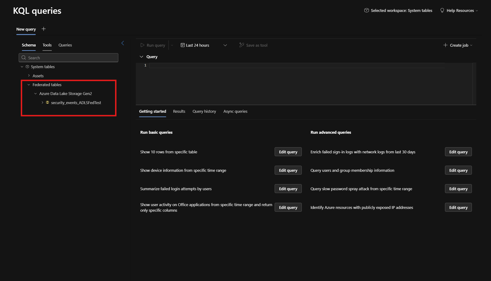

# Exercise 15 — Data Federation with ADLS Gen2

**Topic:** Federate external data from Azure Data Lake Storage Gen2 into the Sentinel data lake  
**Difficulty:** Intermediate  
**Prerequisites:** Data lake enabled on your workspace, an Azure Storage Account with Hierarchical Namespace enabled

---

## Objective

Set up a **federated data connection** to Azure Data Lake Storage Gen2 (ADLS Gen2) and query external data alongside native Sentinel tables — without ingesting or duplicating the data.

## Background

Data federation lets you query external data sources directly from the Microsoft Sentinel data lake using KQL or Jupyter notebooks. Instead of ingesting data into Sentinel, federation creates a connection to the external store and makes its tables queryable as if they were native.

This is useful for:

- **Historical data** that's too large or costly to ingest but is needed for investigations
- **Business context data** (HR records, asset inventories, compliance logs) that enriches security analysis
- **Cross-team data** maintained by other teams that you don't want to duplicate

In this exercise, you'll federate an ADLS Gen2 storage account containing sample security event data. Once federated, you can query this data alongside native Sentinel tables to build cross-source investigations.

> **Important:** Files in your ADLS Gen2 storage must be in **delta parquet** format for the Sentinel data lake to read them.

### What You'll Need

| Component | Purpose |
|---|---|
| **ADLS Gen2 Storage Account** | Hosts the delta parquet files (hierarchical namespace enabled) |
| **Service Principal** | Authenticates Sentinel to the storage account |
| **Azure Key Vault** | Stores the service principal's client secret |
| **Sample data** | Two datasets in `Artifacts/Federation/` — one with TimeGenerated, one without |

---

## Step 1 — Upload the Sample Data

The lab provides **two versions** of the same security events dataset in delta parquet format. Both are ready to upload to your ADLS Gen2 storage account. The difference is whether the data includes a `TimeGenerated` column — this has a significant impact on how the data appears in the Sentinel data lake.

| Dataset | Location | TimeGenerated? | Records |
|---|---|---|---|
| **With TimeGenerated** | `Artifacts/Federation/security_events/` | Yes | 100 |
| **Without TimeGenerated** | `Artifacts/Federation/security_events_no_timegen/` | No | 100 |

**Dataset with TimeGenerated — schema:**

| Column | Description |
|---|---|
| `TimeGenerated` | Event timestamp (April 2026) |
| `EventType` | Type of security event |
| `SourceIP` | Source IP address |
| `DestinationIP` | Destination IP address |
| `UserName` | Associated user |
| `Action` | Action taken (Allow, Deny, etc.) |
| `Severity` | Event severity |
| `DeviceName` | Source device |
| `Message` | Event description |

The **without TimeGenerated** version has the same columns minus `TimeGenerated`. When a federated table lacks a `TimeGenerated` column, Sentinel assigns the query execution time as the timestamp — meaning all rows appear as "now" rather than at their original event time.

**Upload both delta tables to your ADLS Gen2 storage account:**

1. In the Azure portal, navigate to your ADLS Gen2 storage account
2. Create two containers (e.g., `federation-with-timegen` and `federation-no-timegen`)
3. Upload the `security_events/` folder to the first container and `security_events_no_timegen/` folder to the second
4. Each folder must include the `_delta_log/` subfolder and the `.snappy.parquet` file:

```
security_events/                          security_events_no_timegen/
├── _delta_log/                           ├── _delta_log/
│   └── 00000000000000000000.json         │   └── 00000000000000000000.json
└── part-00000-xxxxx.snappy.parquet       └── part-00000-xxxxx.snappy.parquet
```

> **Important:** The `_delta_log/` folder and its JSON file are required — this is what makes it a delta table rather than just a parquet file.

> **Note on timestamps:** The `security_events` dataset has `TimeGenerated` values from early April 2026. Since federation preserves original timestamps, avoid using `ago()` filters in your queries. Use an explicit date range instead.

---

## Step 2 — Follow the Setup Guide

The full setup process — creating a service principal, configuring Key Vault, and creating the connector instance — is documented in Microsoft Learn. Follow the guide step by step:

> **[Set up federated data connectors — ADLS Gen2](https://learn.microsoft.com/en-us/azure/sentinel/datalake/data-federation-setup?tabs=adls)**

The key steps are:

1. **Create a service principal** with `Storage Blob Data Reader` on the storage account
2. **Store the client secret** in Azure Key Vault
3. **Grant Key Vault access** to the Sentinel managed identity (`msg-resources-*`)
4. **Create the connector instance** in **Microsoft Sentinel → Data connectors → Data federation → Catalog → Azure Data Lake Storage**

When configuring the connector instances, create **two** — one per container:

| Field | Instance 1 (with TimeGenerated) | Instance 2 (without TimeGenerated) |
|---|---|---|
| **Instance name** | `WithTimeGen` | `NoTimeGen` |
| **Application (client) ID** | From your service principal | Same |
| **Azure Key Vault URI** | Your Key Vault URI | Same |
| **Secret name** | Your secret name | Same |
| **ADLS Storage URL** | `https://<account>.dfs.core.windows.net` | Same |

> **Tip:** Both instances can use the same service principal and Key Vault — only the ADLS container/path differs.

---

## Step 3 — Verify and Compare the Federated Tables

After creating both connector instances:

1. Navigate to **Microsoft Sentinel → Configuration → Tables**
2. Filter by **Type: Federated**
3. You should see two tables:
   - `security_events_WithTimeGen`
   - `security_events_no_timegen_NoTimeGen`

**Query the table WITH TimeGenerated:**

```kusto
security_events_WithTimeGen
| where TimeGenerated between (datetime(2026-04-01) .. datetime(2026-04-06))
```

Notice that `TimeGenerated` shows the original event timestamps from April 2026.

**Query the table WITHOUT TimeGenerated:**

```kusto
security_events_no_timegen_NoTimeGen
```

Notice that `TimeGenerated` is automatically populated with the **query execution time** — all rows show the current timestamp rather than the original event time.

**Key difference:** When your source data includes `TimeGenerated`, federation preserves the original timestamps. When it doesn't, Sentinel assigns the current time — which means you lose the ability to correlate events by time or build accurate timelines.



---

## Key Takeaways

- Data federation queries external data **in place** — no ingestion or duplication
- ADLS Gen2 files must be in **delta parquet** format
- Federated tables appear in the Tables management page and are queryable with KQL
- Federation is **read-only** and **one-directional** (Sentinel → external source)
- If your source data includes a `TimeGenerated` column, federation preserves original timestamps; without it, all rows appear with the current query time
- Use federation to enrich security investigations with external data (historical logs, business context, cross-team datasets)

---

## References

- [Data federation overview](https://learn.microsoft.com/en-us/azure/sentinel/datalake/data-federation-overview)
- [Set up federated data connectors](https://learn.microsoft.com/en-us/azure/sentinel/datalake/data-federation-setup?tabs=adls)
- [Query federated tables with KQL](https://learn.microsoft.com/en-us/azure/sentinel/datalake/kql-jobs-summary-rules-search-jobs)

---

## Next Steps

Continue to **[Exercise 16 — Data Transformation: Split Ingestion by Tier](./E16_split_transformation.md)**
