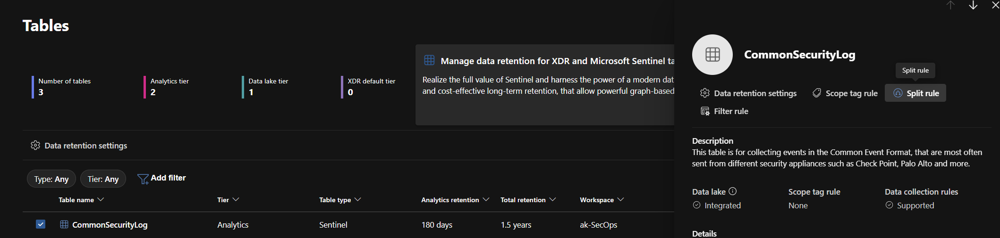
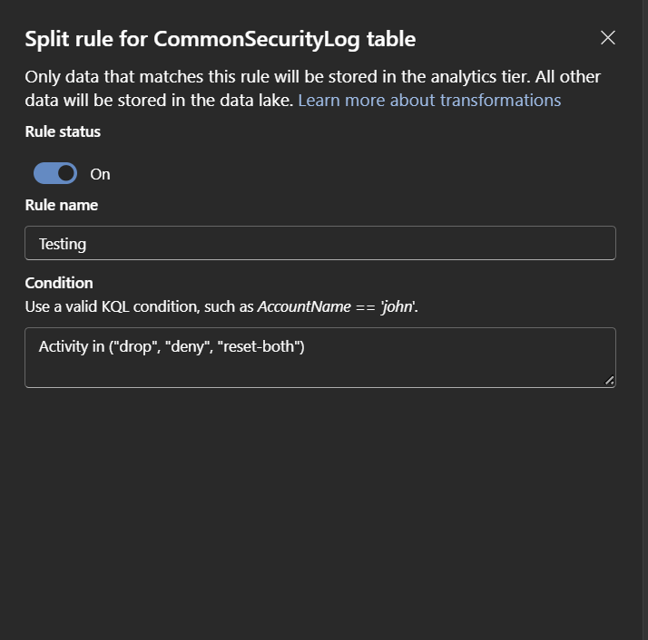
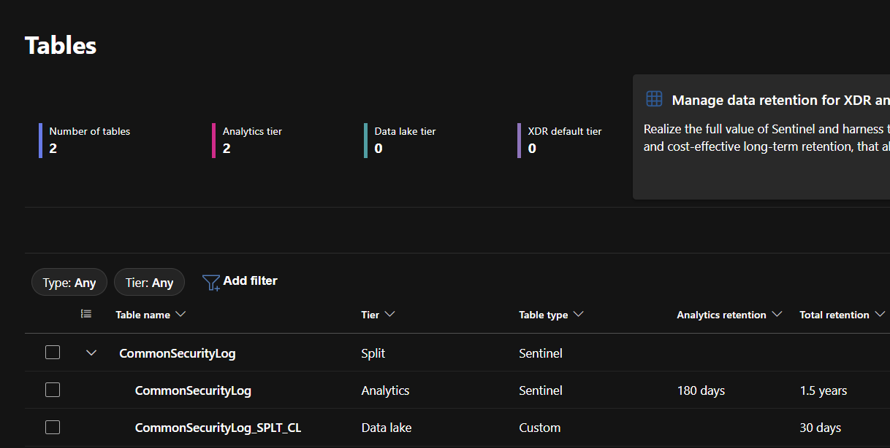

# Exercise 16 — Data Transformation: Split Ingestion by Tier

**Topic:** Use split transformations to route data between Analytics and Data lake tiers  
**Difficulty:** Beginner  
**Prerequisites:** Data lake enabled on your workspace

---

## Objective

Create a **split transformation rule** on a table to route high-value security events to the Analytics tier while sending lower-priority events to the Data lake tier. This reduces Analytics costs while keeping all data available for compliance and long-term investigations.

## Background

As data volumes grow, not all ingested logs need real-time query performance. Microsoft Sentinel's **split transformations** let you define a KQL condition that determines which data stays in the Analytics tier (fast, more expensive) and which goes to the Data lake tier (slower, cost-effective).

When you apply a split rule:
- Data matching the KQL expression → **Analytics tier** (also mirrored to Data lake)
- Data not matching → **Data lake tier only** (stored in a `_SPLT` suffix table)

This is ideal for high-volume tables like firewall logs, where only blocked/denied traffic is relevant for real-time detections, but all traffic should be retained for investigations.

In this exercise, you'll split the `CommonSecurityLog` table so that only **denied or dropped** Palo Alto firewall events go to the Analytics tier, while routine **allow** traffic goes to the Data lake only.

> **Reference:** [Transform data using filter and split in Microsoft Sentinel](https://learn.microsoft.com/en-us/azure/sentinel/transformation-filter-split)

---

## Step 1 — Review the Current Data

Before creating the split rule, check the data distribution in the `CommonSecurityLog` table to understand the volume of each activity type:

```kusto
CommonSecurityLog
| where DeviceVendor == "Palo Alto Networks"
| summarize Count = count() by Activity
| sort by Count desc
```

You should see a mix of `allow`, `drop`, `deny`, `end`, and `reset-both` actions. In production environments, `allow` events typically account for the majority of the volume — this is the data we'll route to the Data lake only.

---

## Step 2 — Create the Split Rule

1. In the Microsoft Defender portal, navigate to **Microsoft Sentinel** → **Configuration** → **Tables**
2. Find and select the **CommonSecurityLog** table
3. In the side panel, select **Split rule**



4. Enter the following:
   - **Rule name:** `Route denied traffic to Analytics`
   - **KQL expression:**

```kusto
Activity in ("drop", "deny", "reset-both")
```

This expression defines what goes to the **Analytics tier**. Events with `Activity` = "drop", "deny", or "reset-both" stay in Analytics for real-time detection. All other events (including "allow" and "end") are routed to the Data lake only.

5. Set the **Rule status** to **On**
6. Select **Save**



> **Note:** It can take up to one hour for the transformation to take effect.

---

## Step 3 — Verify the Split

After the rule takes effect:

1. Go back to **Tables** and check the **Transformation Rules** column for `CommonSecurityLog` — it should show **Split**
2. You should also see a new table: `CommonSecurityLog_SPLT_CL` — this is where the Data lake-only data is routed



> **Important:** Split rules only apply to **newly ingested data**. Data that was already ingested before the rule was created remains in the Analytics tier and is not retroactively split. To see the split in action, you'll need to wait for new data to arrive after the rule takes effect.

Once new data arrives, verify by querying both tables:

**Analytics tier (denied/dropped traffic only):**

```kusto
CommonSecurityLog
| where DeviceVendor == "Palo Alto Networks"
| summarize Count = count() by Activity
```

**Data lake tier (all traffic including allows):**

```kusto
CommonSecurityLog_SPLT_CL
| summarize Count = count() by Activity
```

---

## Key Takeaways

- **Split transformations** route data between Analytics and Data lake tiers at ingestion time
- Data matching the KQL expression goes to **Analytics** (and is mirrored to Data lake)
- Data not matching goes to **Data lake only** (stored in a `_SPLT_CL` suffix table)
- Split rules only apply to **newly ingested data** — existing data is not retroactively split
- This is a powerful cost optimisation tool for high-volume tables — keep only actionable data in the expensive Analytics tier
- Split rules can take up to **one hour** to take effect
- You can manage or delete split rules from the table's side panel at any time

> **Important:** Ensure your detection rules only query data that remains in the Analytics tier. For example, `Lab Stage 3.5 - Internal Port Scan Detected (Palo Alto)` queries `CommonSecurityLog` for `drop` and `deny` events — these are preserved in Analytics by our split rule.

---

## References

- [Transform data using filter and split in Microsoft Sentinel](https://learn.microsoft.com/en-us/azure/sentinel/transformation-filter-split)
- [Custom data ingestion and transformation in Microsoft Sentinel](https://learn.microsoft.com/en-us/azure/sentinel/data-transformation)

---

## Next Steps

Return to the [README](../README.md) for additional exercises.
