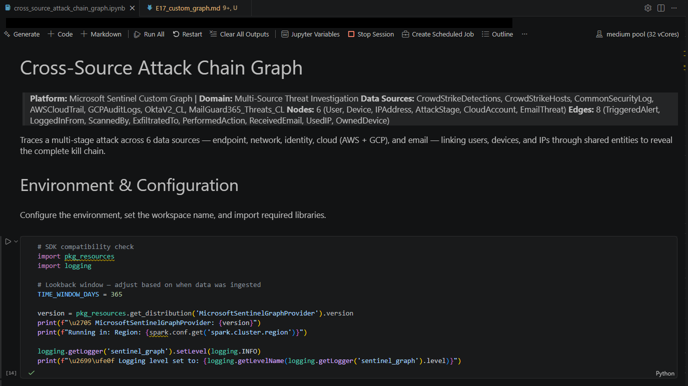
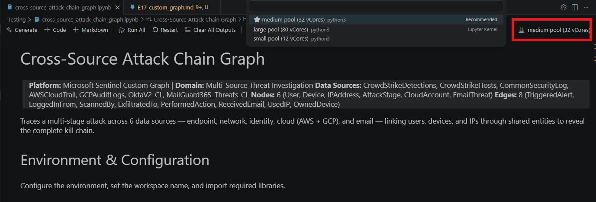
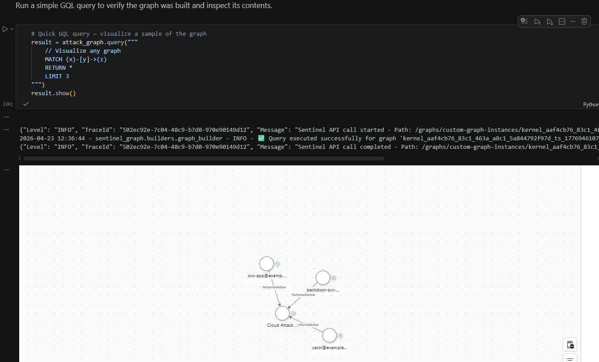
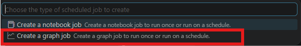
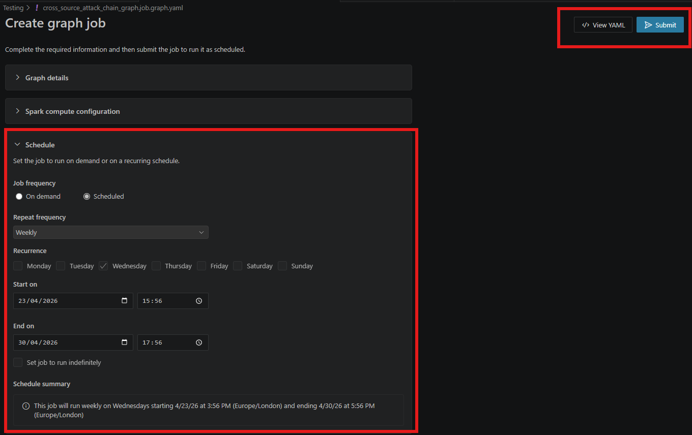
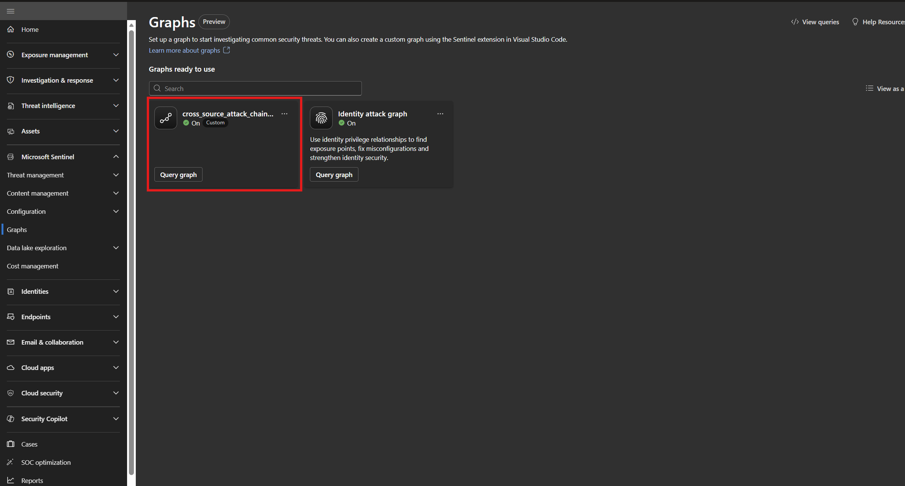

# Exercise 17 — Custom Graph: Cross-Source Attack Chain

**Topic:** Build a custom Sentinel graph that links entities across 6 data sources to visualize the complete attack chain  
**Difficulty:** Advanced  
**Prerequisites:** Data lake enabled, VS Code with the Microsoft Sentinel extension, lab data ingested (E01 completed)

---

## Objective

Build and materialize a **custom graph** that correlates users, devices, IPs, cloud accounts, and email threats across CrowdStrike, Palo Alto, Okta, AWS CloudTrail, GCP Audit Logs, and MailGuard data. This exercise demonstrates how custom graphs let you go beyond the built-in XDR graph to model relationships specific to your environment.

## Background

Microsoft Sentinel's **custom graphs** let you define your own node and edge types from any data in the data lake. Unlike the built-in XDR graph (which models Microsoft-centric entities like Devices, Users, and Mailboxes), custom graphs can model any relationship — third-party detections, cloud API activity, firewall flows, and more.

The graph you'll build in this exercise defines:
- **6 node types:** User, Device, IPAddress, AttackStage, CloudAccount, EmailThreat
- **8 edge types:** TriggeredAlert, LoggedInFrom, NetworkActivity, PerformedAction, ReceivedEmail, UsedIP, OwnedDevice, CloudIdentity

Once built, you can query the graph with **GQL** (Graph Query Language) and visualize it directly in the notebook or the Defender portal.

> **Reference:** [Custom graphs in Microsoft Sentinel — Microsoft Learn](https://learn.microsoft.com/en-us/azure/sentinel/datalake/custom-graphs)

---

## Step 1 — Download the Graph Notebook

The training lab includes a ready-made graph notebook in the `GraphNotebook/` folder.

1. In this training repo, navigate to **GraphNotebook/**
2. Download `cross_source_attack_chain_graph.ipynb` to your local machine
3. Open it in **VS Code**

> **Tip:** For details on the graph schema (nodes, edges, data sources), see [GraphNotebookReadme.md](../GraphNotebook/GraphNotebookReadme.md) in the same folder.



---

## Step 2 — Update the Workspace Name

In the notebook's **cell 5** (the data ingestion cell), update the `WORKSPACE_NAME` variable to match your Sentinel workspace:

```python
WORKSPACE_NAME = "<YOUR_WORKSPACE_NAME>"
```

Replace `<YOUR_WORKSPACE_NAME>` with the name of your Sentinel workspace (the one you created during onboarding).

---

## Step 3 — Connect a Spark Kernel

1. Click the **kernel selector** in the top-right corner of the notebook
2. Select **Microsoft Sentinel Spark** as the kernel type
3. Choose your Sentinel workspace
4. Select a compute pool — **Medium (32 vCores)** is recommended for this exercise

> **Note:** The first session start takes **3–5 minutes** while Spark provisions the cluster. Subsequent cells run much faster within the same session.



---

## Step 4 — Run the Notebook

Execute the cells in order. The notebook has 5 main sections:

| Section | Cells | What It Does |
|---------|-------|--------------|
| **Environment & Configuration** | Cell 3 | SDK version check, logging setup |
| **Data Ingestion** | Cell 5 | Reads all 7 tables, prints row counts |
| **Nodes & Edges** | Cell 7 | Transforms raw data into 6 node types and 8 edge types |
| **Graph Assembly** | Cells 9–10 | Wires everything with `GraphSpecBuilder`, validates schema |
| **Build & Query** | Cells 12, 14 | Builds the graph via API, runs a sample GQL query |

After cell 5 runs, you should see row counts for all 7 tables (your counts may vary depending on when data was ingested):

```
[DATA] CrowdStrike Detections: 159
[DATA] CrowdStrike Hosts: 8
[DATA] CommonSecurityLog (Palo Alto): 1156
[DATA] AWSCloudTrail: 197
[DATA] GCPAuditLogs: 107
[DATA] OktaV2_CL: 468
[DATA] MailGuard365_Threats_CL: 23
```

> **Tip:** If you see 0 rows for any table, increase `TIME_WINDOW_DAYS` in cell 3 (e.g. to 90 or 365) to widen the lookback window.

After the final cell, the graph is built and queryable. The sample GQL query visualizes 3 edges from the graph:

```gql
// Visualize any graph
MATCH (x)-[y]->(z)
RETURN *
LIMIT 3
```



---

## Step 5 — Materialize the Graph as a Scheduled Job

Running the notebook interactively builds a **session graph** — it exists only while the Spark session is active. To make the graph persistent and available in the Defender portal, you need to materialize it as a **graph job**.

1. In the Microsoft Defender portal, navigate to **Microsoft Sentinel** → **Graphs**
2. Click **Create Scheduled Job**



3. Click **Create a Graph Job**
4. Fill in the graph job details:

| Field | Value |
|-------|-------|
| **Graph name** | `cross_source_attack_chain_graph` |
| **Path** | `cross_source_attack_chain_graph.ipynb` |
| **Description** | Cross-source attack chain linking 6 data sources |
| **Cluster configuration** | Medium pool (32 vCores) |
| **Job frequency** | On demand (or Scheduled, based on your preference) |



5. Click **Create** to submit the job

> **Note:** On-demand graphs have a default retention of **30 days** and will be deleted on expiration. Scheduled graphs refresh automatically on your chosen cadence.

After the job completes, the graph is available for querying in the Defender portal under **Microsoft Sentinel → Graphs**. You can click on the graph name to explore nodes and edges visually.



---

## Step 6 — Build Your Own Graph with AI Assistance (Optional)

Now that you've seen how a custom graph is built, try creating your own using **AI-assisted graph authoring**. GitHub Copilot can generate complete graph notebooks from a natural-language description of what you want to model.

> **Reference:** [AI-assisted custom graph authoring in Microsoft Sentinel (preview)](https://learn.microsoft.com/en-us/azure/sentinel/datalake/create-graphs-with-ai)

### Prerequisites

Make sure you have:
- **GitHub Copilot** installed and enabled in VS Code ([GitHub Copilot extension](https://marketplace.visualstudio.com/items?itemName=GitHub.copilot))
- A **GitHub Copilot Business or Enterprise** plan

### Create a Graph from a Prompt

1. Open a new or existing `.ipynb` notebook in VS Code
2. Open **GitHub Copilot Chat** (`Ctrl+Shift+I`)
3. Use the `@sentinel /graph-authoring` helper for best results. Try one of these prompts:

```
@sentinel /graph-authoring Create a graph that maps Okta users to their sign-in IPs and failed login attempts using OktaV2_CL
```

```
@sentinel /graph-authoring Build a graph connecting AWS IAM users to S3 buckets they accessed using AWSCloudTrail
```

```
@sentinel /graph-authoring Create a graph linking email senders to recipients and suspicious URLs using MailGuard365_Threats_CL
```

Copilot generates a complete notebook with environment setup, data loading, node/edge definitions, schema validation, and graph build — following the same lifecycle you ran in Steps 1–4.

### Refine and Iterate

After the notebook is generated, continue the conversation to refine your graph:

```
@sentinel Add an edge from User to Device based on hostname
```

```
@sentinel Filter the data to show only the last 7 days
```

```
@sentinel Fix the error in the graph build step
```

You can also ask Copilot to explain the generated code without modifying it:

```
@sentinel What does show_schema() do?
```

```
@sentinel How are edge keys defined in this graph?
```

### Tips

| Goal | How to interact |
|------|----------------|
| Create or modify a graph notebook | Describe your goal with `@sentinel` |
| Fix or debug a graph error | Describe the problem with `@sentinel` |
| Ask about graph APIs or parameters | Ask a question with `#sentinel` |

> **Note:** AI assistance uses the tables visible in your Sentinel data lake. Only tables you have access to will appear in the generated code. If a table doesn't show in the data lake explorer, it can't be used for graph authoring.

---

## Key Takeaways

- **Custom graphs go beyond XDR** — model any relationship from any data source, not just Microsoft-centric entities.
- **GraphSpecBuilder + Graph.build()** — the fluent API makes it easy to define nodes/edges from Spark DataFrames and publish them in one call.
- **GQL queries** — use standard graph query language to traverse relationships, find paths, and aggregate across the graph.
- **Materialization** — schedule graph jobs to keep the graph up-to-date automatically, making it available for the entire SOC team in the portal.
- **Multi-source correlation** — by linking CrowdStrike endpoints, Palo Alto firewall flows, Okta identity events, AWS/GCP cloud activity, and MailGuard email threats in a single graph, you can trace an attacker's movement across the entire environment.
- **AI-assisted authoring** — use GitHub Copilot with `@sentinel /graph-authoring` to generate, modify, and debug custom graph notebooks from natural-language descriptions.

---
