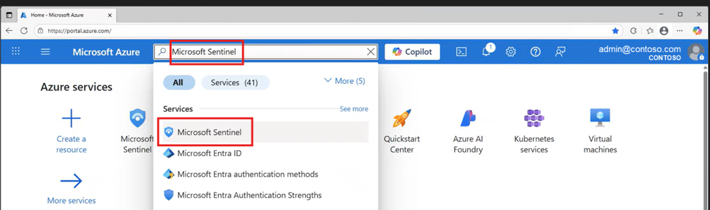
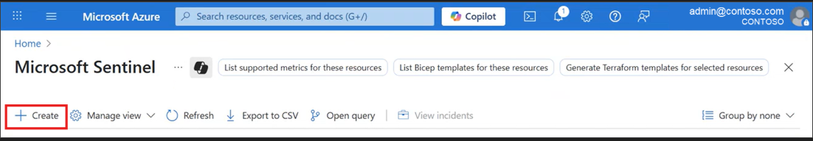
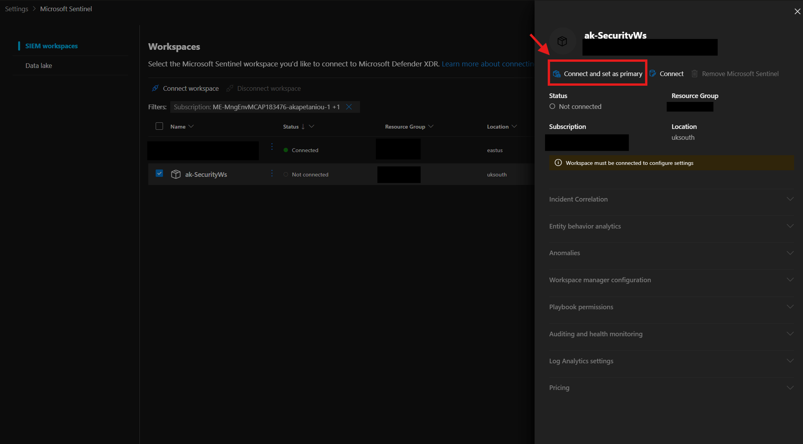

# Onboarding — Setting up the environment

#### 🎓 Level: 100 (Beginner)
#### ⌛ Estimated time to complete this lab: 20 minutes

## Objectives

Onboard Microsoft Sentinel and deploy the Training Lab solution used in all subsequent exercises.

## Prerequisites

Complete the [Prerequisites](../README.md#prerequisites) and [Custom Detection Rules Setup](../README.md#custom-detection-rules-setup) sections in the README before starting.

---

## Exercise 1: Create a Log Analytics workspace

If you already have a workspace, skip to [Exercise 2](#exercise-2-add-microsoft-sentinel-to-your-workspace).

1. In the [Azure portal](https://portal.azure.com/), search for **Sentinel** and select **Microsoft Sentinel**.
2. Select **Create** → **Create a new workspace**.
3. Choose your **Subscription**, **Resource Group**, **Workspace Name**, and **Region**.
4. Select **Review + Create**, then **Create**.

---

## Exercise 2: Add Microsoft Sentinel to your workspace

1. From the [Azure portal](https://portal.azure.com/), search for and select **Microsoft Sentinel**.

2. Select **Create**.

3. Select the workspace you created in Exercise 1 and select **Add**.

---

## Exercise 3: Access Microsoft Sentinel in the Defender portal

1. Sign in to the [Microsoft Defender portal](https://security.microsoft.com/).
2. You'll see **Microsoft Sentinel** in the navigation pane.

3. Go to **Settings > Microsoft Sentinel > Workspaces**, verify your workspace is listed, and click **Connect**.

---

## Exercise 4: Deploy the Microsoft Sentinel Training Lab Solution

This deploys pre-recorded telemetry (~20 MB) and creates analytics rules, workbooks, watchlists, and playbooks used in the subsequent exercises.

Make sure you have completed the **Custom Detection Rules Setup** from the [README](../README.md) (either Option A — UAMI or Option B — Service Principal). You will need the credentials during deployment.

1. Select the **Subscription**, **Resource Group**, and **Workspace** from the previous exercises.
2. Under **Detection Rules Auth Method**, choose your preferred option:
   - **User-Assigned Managed Identity** — paste the UAMI's full resource ID.
   - **Service Principal (App Registration)** — enter the Tenant ID, Client ID, and Client Secret.
   - **None** — skip custom detection rules deployment.
3. Select **Review + create**, then **Create**.

> **Note:** The deployment takes approximately **15 minutes**.

4. Once complete, go back to Microsoft Sentinel — you should see ingested data and recent incidents on the home page.

> **⚠️ Playbook Permissions:** The deployment creates a Logic App with a **System-Assigned Managed Identity**. Grant this identity the **Microsoft Sentinel Contributor** role on the resource group for the playbook to run automatically:
> 1. **Resource Group** → **Access control (IAM)** → **Add role assignment**.
> 2. Select **Microsoft Sentinel Contributor**, assign to **Managed identity**, select the Logic App's identity, and **Save**.

---

## Next steps

Continue to **[Exercise 1 — Exploration: Hunting Across Your Data](./E01_exploration.md)**
