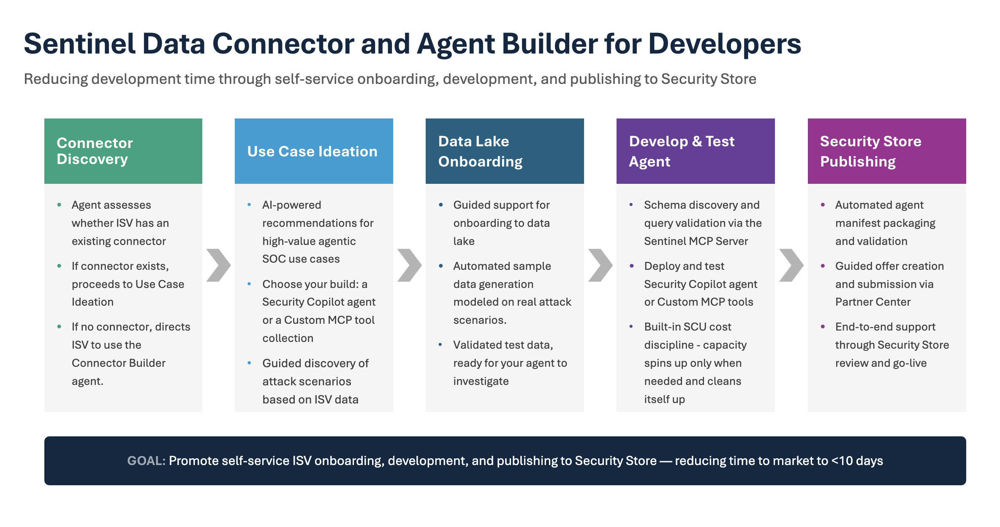

# Sentinel Data Connector and Agent Builder

A workspace-level VS Code Copilot Chat agent that walks an ISV / partner developer through onboarding to **Microsoft Sentinel Data Lake** and shipping a **Security Copilot agent** (or a **Custom MCP tool collection**) on top of it — end-to-end, in a single chat.

It guides you through seven phases — connector discovery, use-case ideation, data lake provisioning, sample-data ingestion, MCP schema verification, agent instruction authoring + validation, and Partner Center packaging — automating everything that can be automated and giving you copy-pasteable click-by-click steps for everything that can't (Defender portal, Security Copilot Build tab, Partner Center).



---

## Get just this folder (sparse checkout)

This tool lives inside the [Azure-Sentinel](https://github.com/Azure/Azure-Sentinel) repository under `Tools/Sentinel-Data-Connector-and-Agent-Builder/`. You do **not** need to download the whole repo — use a sparse checkout to pull only this folder, then open it in VS Code as the workspace root.

```bash
# 1. Clone with no files materialized yet (fast — skips the rest of the repo body)
git clone --filter=blob:none --no-checkout --depth 1 \
  https://github.com/Azure/Azure-Sentinel.git
cd Azure-Sentinel

# 2. Limit the checkout to just this tool's folder
git sparse-checkout init --cone
git sparse-checkout set Tools/Sentinel-Data-Connector-and-Agent-Builder
git checkout

# 3. Open the folder in VS Code AS THE WORKSPACE ROOT (required — see note below).
#    In VS Code: File → Open Folder… → select Tools/Sentinel-Data-Connector-and-Agent-Builder
#    (Or, if the `code` CLI is on your PATH, run the line below instead.)
code Tools/Sentinel-Data-Connector-and-Agent-Builder
```

> **Why open the folder as the workspace root?** The agent is delivered as GitHub Copilot **custom instructions + skills** (`.github/copilot-instructions.md` and `.github/skills/`). GitHub Copilot Chat only loads these when they sit at the **root of the open workspace**. If you open the Azure-Sentinel repo root instead, the agent will not load.

> **The `code` command is optional.** It may not be on your `PATH`. The reliable way to open the folder is from the VS Code UI: **File → Open Folder…** and select `Tools/Sentinel-Data-Connector-and-Agent-Builder`.

Once VS Code opens, install the prerequisites below, then start a GitHub Copilot Chat session — the agent's instructions load automatically.

---

## What you get

```mermaid
flowchart LR
    User([Developer]) --> Agent[Sentinel Data Connector and Agent Builder]
    Agent --> P0[Phase 0: Connector discovery]
    P0 --> P1[Phase 1: Use-case ideation]
    P1 --> P2[Phase 2: Data Lake onboarding]
    P2 --> P3[Phase 3: Sample-data ingestion]
    P3 --> P4[Phase 4: MCP verification]
    P4 --> P5[Phase 5: Agent instruction authoring]
    P5 --> P6[Phase 6: Partner Center packaging]
```



Session state is persisted to `config/progress.json` so you can stop, close VS Code, and resume any time.

---

## Prerequisites

| Tool | Minimum version | Used by |
|---|---|---|
| **VS Code** | 1.93+ | Host editor |
| **GitHub Copilot Chat** extension | latest | Loads the agent's workspace instructions |
| **Microsoft Sentinel** VS Code extension (`ms-security.ms-sentinel`) | 1.2.0+ | Phase 0 step 3a (custom connector builder) + Phase 4 MCP server |
| **Azure CLI** (`az`) | 2.60+ | All `az` calls in Phase 2/3/6 |
| **PowerShell 7+** (`pwsh`) | 7.4+ | All `*.ps1` scripts (cross-platform) |
| **Python** | 3.10+ | `scripts/Build-AgentPackage.py` (Phase 6) |
| **jq** | any | Phase 0 connector discovery search |

Python packages required by the Phase 6 packager:

```bash
python3 -m pip install --user ruamel.yaml python-docx
```

**Azure permissions required** (in the target tenant):
- **Subscription Owner** or **Contributor** on the subscription hosting the Sentinel workspace
- **Microsoft Sentinel Contributor** on the workspace
- **Security Administrator** in Entra (for data lake onboarding)
- Ability to create app registrations (Phase 6 webhook setup)

A tenant onboarded to the Sentinel Data Lake (or willingness to onboard one in Phase 2) is required. The recommended region is **Central US**.

---

## One-time setup

```bash
# 1. Get this folder via sparse checkout (see "Get just this folder" above), then:
cd Azure-Sentinel/Tools/Sentinel-Data-Connector-and-Agent-Builder

# 2. Install Python deps for the Phase 6 packager
python3 -m pip install --user ruamel.yaml python-docx

# 3. Verify Azure CLI login + permissions
az login --tenant <your-tenant-id>
pwsh ./scripts/Validate-Prerequisites.ps1
```

`Validate-Prerequisites.ps1` checks `az` is installed, you're signed in, your roles cover the required scopes, and the resource providers needed by Sentinel are registered.

---

## Starting a session

1. Open the cloned repo as a folder in VS Code (`File → Open Folder…`).
2. VS Code Copilot Chat auto-loads `.github/copilot-instructions.md` as workspace instructions. **You do not install an extension** — the agent is a workspace-level skill, not a marketplace extension.
3. Open Copilot Chat (`Ctrl+Alt+I` / `Cmd+Ctrl+I`), switch to **Agent mode**, and pick **Claude Sonnet 4.5+** (or GPT-5) as the model.
4. Send your first message — for example:

   ```
   I'm a developer at <ISV name> and want to publish a Security Copilot agent on the Sentinel platform.
   My tenant ID is <guid>. Where do I start?
   ```

The agent will reply with Phase 0 — asking your company name and looking up your existing connector in [`Azure/Azure-Sentinel/Solutions/`](https://github.com/Azure/Azure-Sentinel/tree/master/Solutions). From there it drives you through every phase one question at a time.

---

## Example prompts

**Phase 0 — kickoff**
- `I'm a developer at <your-company> and want to integrate with Sentinel. Where do I start?`
- `My tenant ID is ca68c0e4-…; build a Security Copilot agent for our backup-failure data.`

**Mid-flow nudges**
- `Start Phase 2`
- `Validate my ingestion`
- `Validate my agent instructions`
- `Re-run the test cases against my agent`
- `Package my agent for Partner Center`

**Custom MCP tools track**
- `I want to publish a custom MCP tool collection, not a Security Copilot agent`
- `Add a tool that returns the 24h sign-in summary for a UPN`

---

## Phase cheat sheet

| Phase | What it does | Who does what |
|---|---|---|
| **0 — Connector discovery** | Looks up your published connector in `Azure-Sentinel/Solutions/` (or kicks off `@sentinel /create-connector` if none exists). Classifies as `custom-table` / `native-cef-syslog` / `native-builtin`. | Agent automates; you confirm company name + connector choice. |
| **1 — Use-case ideation** | Picks a security framework (Identity Intelligence, EDR, Network Access Control, …), turns your product features into a concrete agent investigation scenario, drafts a use-case brief. | Agent asks 6 questions; you answer in chat. |
| **2 — Data Lake onboarding** | Pre-flight checks if your tenant is already onboarded. If not, walks you through Defender portal onboarding click-by-click. | Agent automates `az` calls; you do the Defender portal clicks. |
| **3 — Sample-data ingestion** | Creates DCE + DCR + custom table (or skips for native connectors), POSTs realistic correlated sample rows that trigger your detection scenarios. | Agent fully automates. You wait ~5 min for ingestion. |
| **4 — MCP verification** | Live calls the Sentinel MCP server to confirm the columns are real, sample rows visible, candidate KQL returns rows. | Agent automates. You confirm "the columns + sample row look right". |
| **5 — Agent instructions** | Authors the SCC agent's instruction `.md` from the lab-05 10-section template, validates every KQL block against your live workspace, then gives you step-by-step Security Copilot Build-tab instructions + per-scenario test cases. | Agent authors + validates. You paste into Security Copilot, run the test cases, reply `agent works`. |
| **6 — Partner Center packaging** | One command builds the full submission package: linted manifest, agent-package.zip, offer/plan descriptions, editable Word user guide, architecture diagram, screenshot recipe, SCU measurement protocol, and click-by-click Partner Center checklist. | Agent runs `scripts/Build-AgentPackage.py`. You review the Word doc, capture screenshots, submit in Partner Center. |

Full phase rules live in [`.github/copilot-instructions.md`](.github/copilot-instructions.md).

---

## Session state and progress

Every phase writes to `config/progress.json`:

```json
{
  "schemaVersion": 2,
  "companyName": "<Your ISV Name>",
  "agentTrack": "security-copilot",
  "phases": {
    "0_connector_discovery": { "status": "completed", ... },
    "2_data_lake_onboarding": { "status": "completed", "workspace": { … } },
    "3_data_ingestion": { "status": "verified", "scenarios": [ … ] },
    ...
  }
}
```

If you close VS Code mid-flow and reopen the next day, the agent reads `progress.json` and resumes exactly where you left off. To start fresh for a different ISV, ask the agent: `move my current progress to a backup and start over`.

---

## Scripts the agent calls for you

You never run these by hand unless you want to — the agent invokes them at the right moment. Listing for transparency:

| Script | Phase | Purpose |
|---|---|---|
| `scripts/Validate-Prerequisites.ps1` | 0 | Verify `az` login, roles, resource providers |
| `scripts/Create-Workspace.ps1` | 2 | Create Log Analytics workspace + enable Sentinel |
| `scripts/Setup-DataIngestion.ps1` | 3 | Create DCE, custom table, DCR |
| `scripts/Invoke-SampleDataIngestion.ps1` | 3 | POST sample data via Logs Ingestion API |
| `scripts/Validate-Ingestion.ps1` | 3 | Confirm rows landed (24h lookback by default) |
| `scripts/Test-AgentInstructions.ps1` | 5 | Trial-run every fenced KQL block in agent instructions |
| `scripts/Test-McpToolsManifest.ps1` | 5B | Static lint of custom MCP tools `tools.json` |
| `scripts/Build-AgentPackage.py` | 6 | One-shot Partner Center package builder |

---

## Troubleshooting

| Symptom | Likely cause | Fix |
|---|---|---|
| Copilot Chat doesn't pick up the agent | Workspace instructions not loaded | Reopen the folder; confirm `.github/copilot-instructions.md` exists; restart VS Code. |
| `az` calls fail with `AuthorizationFailed` | Insufficient role | Re-run `Validate-Prerequisites.ps1`; ask your tenant admin for **Microsoft Sentinel Contributor** + **Security Administrator**. |
| Phase 3 ingestion validator shows 0 rows | Data not yet visible in data lake | Wait ~30 min and re-run `Validate-Ingestion.ps1` — replication can lag. |
| `Build-AgentPackage.py` fails with `ModuleNotFoundError: ruamel` | Python deps missing | `python3 -m pip install --user ruamel.yaml python-docx` |
| Phase 5 validator returns `auth_failed` | `az` token expired | `az login --tenant <id>` and rerun. |

---

## Learn more

- **Agent personality, phase rules, lint rules:** [`.github/copilot-instructions.md`](.github/copilot-instructions.md)
- **Skill manifest:** [`.github/skills/sentinel-data-connector-agent-builder/SKILL.md`](.github/skills/sentinel-data-connector-agent-builder/SKILL.md)
- **Knowledge base** (referenced by the agent at runtime):
  - [`knowledge/use-case-frameworks.md`](knowledge/use-case-frameworks.md)
  - [`knowledge/data-lake-onboarding-guide.md`](knowledge/data-lake-onboarding-guide.md)
  - [`knowledge/data-ingestion-guide.md`](knowledge/data-ingestion-guide.md)
  - [`knowledge/mcp-verification-guide.md`](knowledge/mcp-verification-guide.md)
  - [`knowledge/agent-authoring-guide.md`](knowledge/agent-authoring-guide.md)
  - [`knowledge/security-copilot-agent-guide.md`](knowledge/security-copilot-agent-guide.md)
  - [`knowledge/publishing-guide.md`](knowledge/publishing-guide.md)
  - [`knowledge/custom-mcp-tools-guide.md`](knowledge/custom-mcp-tools-guide.md)
- **Reference agent instructions** (already-built examples): [`config/agent-instructions/`](config/agent-instructions/) *(empty in a fresh clone — populated by the agent during Phase 5)*


## Contact

Sai Suchandan Reddy Marapareddy — **smarapareddy@microsoft.com**

