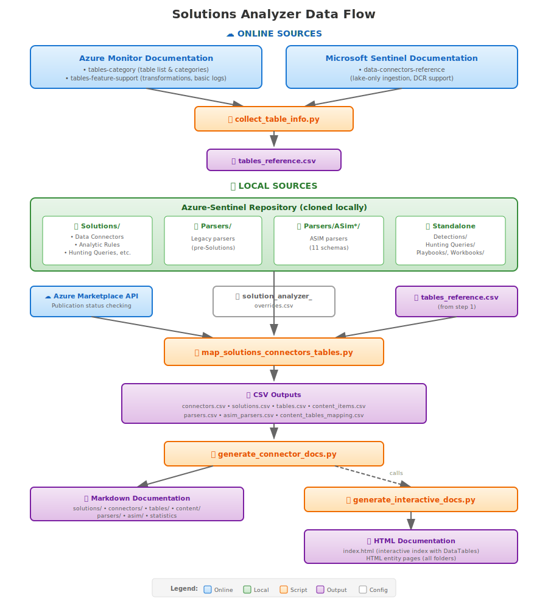

# Azure Sentinel Solutions Analyzer

This directory contains five complementary tools for analyzing Microsoft Sentinel Solutions:

| Script | Purpose | Key Output |
|--------|---------|------------|
| [`collect_table_info.py`](script-docs/collect_table_info.md) | Fetch table metadata from Azure Monitor docs | `tables_reference.csv` |
| [`map_solutions_connectors_tables.py`](script-docs/map_solutions_connectors_tables.md) | Map connectors and content items to tables | `connectors.csv`, `tables.csv`, `solutions.csv`, `content_items.csv`, `content_tables_mapping.csv`, `parsers.csv`, `asim_parsers.csv` |
| [`generate_connector_docs.py`](script-docs/generate_connector_docs.md) | Generate markdown documentation | `connector-docs/` directory (including `asim/` and `parsers/` subdirectories) |
| [`generate_solutions_with_connectors_report.py`](script-docs/generate_solutions_with_connectors_report.md) | Generate solutions summary report | `solutions_with_connectors_report.md`, `solutions_with_connectors.csv` |
| [`upload_to_kusto.py`](script-docs/upload_to_kusto.md) | Upload CSV files to Azure Data Explorer (Kusto) | *(uploads to Kusto cluster)* |

## Prerequisites

### Clone the Azure-Sentinel Repository

The mapper and documentation generator scripts require the [Azure-Sentinel GitHub repository](https://github.com/Azure/Azure-Sentinel) to be cloned locally:

```bash
# Clone the repository
git clone https://github.com/Azure/Azure-Sentinel.git

# Navigate to the Tools directory
cd Azure-Sentinel/Tools/Solutions\ Analyzer

# Keep the repository updated
git pull origin master
```

### Python Environment

- Python 3.7 or higher
- Required packages vary by script (see individual documentation)

**Quick install for all scripts:**
```bash
pip install requests json5 pyyaml
```

**Additional packages for Kusto upload:**
```bash
pip install azure-kusto-data azure-kusto-ingest azure-identity
```

## Quick Start

**Pre-generated CSV files are already available in this directory:**
- The information:
  - [`connectors.csv`](connectors.csv) - All connectors with metadata
  - [`solutions.csv`](solutions.csv) - All solutions with metadata
  - [`tables.csv`](tables.csv) - All tables with solution/connector references
  - [`content_items.csv`](content_items.csv) - All content items (analytics rules, hunting queries, playbooks, etc.) with metadata
  - [`parsers.csv`](parsers.csv) - All non-ASIM parsers with source tables, solution references, and discovered status
  - [`asim_parsers.csv`](asim_parsers.csv) - ASIM parsers with metadata, source tables, selection criteria, and sub-parser references
  - [`tables_reference.csv`](tables_reference.csv) - Comprehensive table metadata from Azure Monitor and Sentinel documentation
- Relationships:
  - [`content_tables_mapping.csv`](content_tables_mapping.csv) - Mapping of content items (analytics rules, playbooks, etc.) to tables with read/write indicators
  - [`solutions_connectors_tables_mapping_simplified.csv`](solutions_connectors_tables_mapping_simplified.csv) - Simplified mapping with key fields only
- The rest:
  - [`solutions_connectors_tables_issues_and_exceptions_report.csv`](solutions_connectors_tables_issues_and_exceptions_report.csv) - Issues and exceptions report
  - [`solutions_connectors_tables_mapping.csv`](solutions_connectors_tables_mapping.csv) - Mapping of connectors to tables to solutions with full metadata. Generated for backward compatibility.


**Pre-generated Reference Documentation (External Repository):**

> **Note:** The generated documentation has been moved to a separate repository to reduce the size of the Azure-Sentinel repo.
> 
> 🔗 **Full documentation:** [https://github.com/oshezaf/sentinelninja/blob/main/Solutions%20Docs/README.md](https://github.com/oshezaf/sentinelninja/blob/main/Solutions%20Docs/README.md)

| Documentation | Direct Link |
|:--------------|:------------|
| **Solutions Index** | [View Solutions](https://github.com/oshezaf/sentinelninja/blob/main/Solutions%20Docs/solutions-index.md) |
| **Connectors Index** | [View Connectors](https://github.com/oshezaf/sentinelninja/blob/main/Solutions%20Docs/connectors-index.md) |
| **Tables Index** | [View Tables](https://github.com/oshezaf/sentinelninja/blob/main/Solutions%20Docs/tables-index.md) |
| **Content Index** | [View Content Items](https://github.com/oshezaf/sentinelninja/blob/main/Solutions%20Docs/content/content-index.md) |
| **Parsers Index** | [View Parsers](https://github.com/oshezaf/sentinelninja/blob/main/Solutions%20Docs/parsers/parsers-index.md) |
| **ASIM Parsers Index** | [View ASIM Parsers](https://github.com/oshezaf/sentinelninja/blob/main/Solutions%20Docs/asim/asim-index.md) |
| **ASIM Products Index** | [View ASIM supported products](https://github.com/oshezaf/sentinelninja/blob/main/Solutions%20Docs/asim/asim-products-index.md) |

## Running the Scripts

### Recommended Order

For a complete refresh of all data:

```bash
# 1. Collect table metadata from Azure Monitor docs
python collect_table_info.py

# 2. Generate connector/solution/table mappings (uses tables_reference.csv)
python map_solutions_connectors_tables.py

# 3. Generate documentation to a specific location
python generate_connector_docs.py --skip-input-generation --output-dir "path/to/output"
```

Or let the documentation generator handle everything:

```bash
# This automatically runs steps 1-2 before generating docs
python generate_connector_docs.py --output-dir "path/to/output"
```

## Data Flow



The diagram shows how data flows through the Solutions Analyzer:

1. **Online Sources** (blue) - External documentation and APIs:
   - Azure Monitor docs provide table metadata (categories, transformation support, basic logs eligibility)
   - Microsoft Sentinel docs provide lake-only ingestion and DCR support status
   - Azure Marketplace API checks solution publication status

2. **Local Sources** (green) - Azure-Sentinel repository:
   - `Solutions/` folder with connectors, content items, and parsers
   - `Parsers/` folder with legacy (pre-Solutions) parsers
   - `Parsers/ASim*/` folders with ASIM normalization parsers
   - Top-level standalone content directories

3. **Scripts** (orange) - Python processing:
   - `collect_table_info.py` fetches and caches online table metadata
   - `map_solutions_connectors_tables.py` analyzes local sources and generates CSVs
   - `generate_connector_docs.py` produces markdown documentation

4. **Outputs** (purple) - Generated artifacts:
   - CSV files with structured data for analysis
   - Markdown documentation for browsing

## Override System

All three scripts support an override system that allows you to modify field values based on pattern matching. The override file (`solution_analyzer_overrides.csv`) uses regex patterns to match entities and set field values.

**Data-related overrides** (used by `map_solutions_connectors_tables.py` and `collect_table_info.py`):
- Set `collection_method` to AMA for specific tables (e.g., Syslog, CommonSecurityLog)
- Assign `category` to tables based on naming patterns (e.g., all AWS* tables → AWS)
- Set `support_tier` for tables based on their associated solutions

**Documentation-related overrides** (used by `generate_connector_docs.py`):
- Add `additional_information` sections with curated documentation links to table, connector, or solution pages

See the script documentation for details:
- [Override System - data fields](script-docs/map_solutions_connectors_tables.md#override-system) (canonical reference)
- [Override System - table info](script-docs/collect_table_info.md#override-system)
- [Documentation Overrides - additional_information](script-docs/generate_connector_docs.md#documentation-overrides-and-additional-information)

---

## Version History

### v7.9.2 - CCF Legacy, Capabilities Statistics, and ASIM Parser Fixes

**CCF (Legacy) Collection Method:**
- New `CCF (Legacy)` collection method for connectors with embedded `pollingConfig` in their primary ARM template and no separate CCF config file
- Capabilities (auth type, paging, POST) extracted from embedded `pollingConfig` for legacy CCF connectors
- Improved `find_ccf_config_file()` detection: now finds `connectors.json` (Bitwarden-style) and searches sibling `*_ccp/` subdirectories (GCP-style)

**CCF Capabilities Statistics:**
- New **CCF Capabilities** subsection on the statistics page with breakdown of connector kind, authentication methods, and request features across all CCF/CCF Push/CCF Legacy connectors
- New `Nested` capability: detects `stepType: Nested` in CCF config files
- Improved `MvExpand` detection: now uses `nestedTransformName` containing `MvExpandTransformer` instead of text-based search

**Bug Fixes:**
- Fixed empty Product column in ASIM union parser pages (e.g., `imDns`): sub-parsers listed with `_Im_` prefix now correctly resolve product names and page links from `_ASim_` source parser data
- Excluded empty parsers (e.g., `_Im_Dns_Empty`, `_Im_AlertEvent_Empty`) from the Products table on union parser pages
- Fixed broken links to sub-parser pages on union parser pages: `_Im_` prefixed sub-parsers now correctly link to their `_ASim_` parser page files

### v7.9.1 - CCF Push and CCF Capabilities

**CCF Push Collection Method:**
- New collection method `CCF Push` for connectors using CCF in push mode (partner pushes data via DCR/DCE)
- `DeployPushConnectorButton` + `HasDataConnectors` pattern now classified as "CCF Push" instead of "CCF"
- Separate documentation page and metadata for CCF Push in generated docs

**CCF Configuration and Capabilities:**
- New `ccf_config_file` column in `connectors.csv`: GitHub URL to the CCF configuration file (polling/poller/push config)
- New `ccf_capabilities` column in `connectors.csv`: semicolon-separated capabilities extracted from the config JSON
- Capabilities include: connector kind (GCP, Push, etc.), auth type (APIKey, OAuth2, Basic, JwtToken), Paging, POST, MvExpand
- Connector detail pages in generated docs now display **CCF Configuration** link and **CCF Capabilities** for CCF/CCF Push connectors

### v7.9 - Kusto Uploader

**New Tool: `upload_to_kusto.py`**
- Upload CSV files to Azure Data Explorer (Kusto) clusters
- **Solution Analyzer mode** (`--solution-analyzer`): uploads all 10 Solution Analyzer CSVs with predefined table names
- **Custom CSV mode**: upload any CSV files with automatic schema detection
- **Local source directory** (`--source-dir`): read Solution Analyzer CSVs from a local folder instead of downloading from GitHub
- **Dry run mode** (`--dry-run`): preview operations before executing
- Uses Azure CLI authentication and Kusto queued ingestion
- All columns created as `string` type with automatic CSV mapping

### v7.8 - Lake-Only Ingestion, Collection Methods Index, and Enhanced Documentation

**Lake-Only Ingestion Support:**
- New data source: [Sentinel Tables/Connectors Reference](https://learn.microsoft.com/azure/sentinel/data-connectors-reference) provides lake-only ingestion status for ~474 tables
- New `lake_only_supported` field in `tables_reference.csv` and `tables.csv`
- New `source_sentinel_tables` field tracks data source for each table
- **Tables Ingested** sections on connector pages now include **Lake-Only** column
- Individual table pages display **Lake-Only Ingestion** property in attributes table

**Transformation Support Enrichment:**
- `supports_transformations` is now enriched from Sentinel reference when feature-support page has no data
- Mismatch validation generates `transformation_support_mismatch_report.md` when sources disagree
- Removed redundant `supports_dcr` field (consolidated into `supports_transformations`)

**Collection Methods Index:**
- New `methods-index.md` page with all collection methods organized by category
- Individual method pages with descriptions, documentation links, and connector lists
- Collection method column in connector indexes now links to method detail pages
- Method metadata includes official Microsoft documentation references

**Connector Documentation Overrides:**
- Connector pages now support `additional_information` overrides (previously only tables)
- Added 20+ curated documentation links for major vendors (Palo Alto, Fortinet, Cisco, Zscaler, AWS, F5, etc.)
- Solution pages also support `additional_information` overrides

**Device Configuration Overrides:**
- Added 19 new device configuration overrides for Custom Logs via AMA products
- Covers Apache, Tomcat, Cisco Meraki, JBoss, Juniper, MarkLogic, MongoDB, NGINX, Oracle WebLogic, PostgreSQL, SecurityBridge, Squid Proxy, Ubiquiti, VMware vCenter, Zscaler Private Access

**Cache and Performance:**
- New `--force-refresh` parameter for mapper script with selective refresh by analysis type
- Supported types: `asim`, `parsers`, `solutions`, `standalone`, `marketplace`, `tables`
- Use `all` for full refresh or `all-offline` for offline-only types
- Logging added in `.logs/` folder

**Documentation Improvements:**
- Script docs updated with Data Source column showing where each field is derived
- Updated examples and command-line options documentation
- Added `content_items.csv` to pre-generated files list in README

### v7.7 - Connector Association for ASIM Parsers and Standalone Content

**Connector Association:**
- ASIM parsers and standalone/GitHub Only content items are now associated with connectors based on:
  1. **Shared tables**: The connector and parser/content must use the same table(s)
  2. **Filter field matching**: Connector filter values must be a subset of (or equal to) the parser/content filter values

**New CSV Fields:**
- `asim_parsers.csv`: Added `associated_connectors`, `associated_solutions` - Connectors providing data for each parser
- `content_items.csv`: Added `associated_connectors`, `associated_solutions` - Connectors for standalone/GitHub Only items

**Documentation Enhancements:**
- **ASIM Parser Pages**: New "Associated Connectors" section showing connectors that provide relevant data
- **Standalone Content Pages**: New "Associated Connectors" section for items not part of a solution
- Links to connector pages and related solution pages for easy navigation


### v7.6 - Extended Filter Fields

**New Filter Fields Added:**
- `EventType` (ASIM tables) - ASIM normalized event type
- `ResourceProvider` (AzureActivity) - Azure resource provider
- `ActionType` (DeviceEvents, DeviceFileEvents, DeviceProcessEvents, etc.) - Microsoft Defender XDR action type
- `OperationName` (AuditLogs, AzureActivity, OfficeActivity, SigninLogs) - Azure/M365 operation name
- `OfficeWorkload` (OfficeActivity) - Office 365 workload type (Exchange, SharePoint, etc.)
- `RecordType` (OfficeActivity) - Office 365 record type (numeric)

- **RecordType** supports numeric matching like EventID (equality and in operators only)
- **ActionType** covers MDE/XDR tables for Defender content detection
- **OperationName** captures Azure Activity, Audit Logs, and Office Activity operations
- Total supported filter fields increased from 15 to 22

### v7.5 - Statistics Page and Filter Fields Enhancements

**Unified Statistics Page:**
- New `statistics.md` page consolidates statistics from all index pages
- Accessible via 📊 icon in navigation bar on all pages
- Detailed breakdowns by content type, solution, and source

**Filter Fields Detection:**
- Analyzes KQL queries to extract filter field conditions that identify data sources
- Generates `filter_fields` column in CSV outputs with structured format: `Table.Field operator "value"`

*Supported Filter Fields:*
- `DeviceVendor` (CommonSecurityLog) - CEF vendor identifier
- `DeviceProduct` (CommonSecurityLog) - CEF product identifier
- `DeviceEventClassID` (CommonSecurityLog) - CEF event class
- `EventVendor` (ASIM tables) - Normalized vendor field
- `EventProduct` (ASIM tables) - Normalized product field
- `EventType` (ASIM tables) - Normalized event type
- `ResourceType` (AzureDiagnostics) - Azure resource type
- `Category` (AzureDiagnostics) - Diagnostic category
- `ResourceProvider` (AzureActivity) - Azure resource provider
- `EventID` (WindowsEvent/SecurityEvent/Event) - Windows event ID
- `Source` (Event) - Windows Event Log source
- `Provider` (WindowsEvent) - Windows event provider
- `Facility` (Syslog) - Syslog facility
- `ProcessName` (Syslog) - Syslog process name
- `ProcessID` (Syslog) - Syslog process ID
- `SyslogMessage` (Syslog) - Syslog message content
- `EventName` (AWSCloudTrail) - AWS API event name
- `ActionType` (DeviceEvents/DeviceFileEvents/etc.) - MDE/XDR action type
- `OperationName` (AuditLogs/AzureActivity/OfficeActivity/SigninLogs) - Operation name
- `OfficeWorkload` (OfficeActivity) - Office 365 workload
- `RecordType` (OfficeActivity) - Office 365 record type

*Supported Operators:*
- **Equality**: `==`, `=~` (case-insensitive), `!=`
- **In operators**: `in`, `in~` (case-insensitive), `!in`
- **String operators**: `has`, `has_any`, `has_all`, `contains`, `startswith`, `endswith`
- **Negative string operators**: `!has`, `!contains`, `!startswith`, `!endswith`
- **Case-sensitive variants**: `has_cs`, `contains_cs`, `startswith_cs`, `endswith_cs`

*Detection Features:*
- Table-aware field mapping (e.g., `EventID` mapped to WindowsEvent/SecurityEvent based on query context)
- Skips fields in `extend`/`project` statements (computed values, not filters)
- Variable resolution for `let` statement lists (e.g., `let EventList = dynamic([...])`)
- Operator folding: multiple `==` values combined into single `in` operator
- Case-sensitivity deduplication: `=~` subsumes `==` for same value

*CSV Fields Generated:*
- `connectors.csv`: `filter_fields`, `event_vendor`, `event_product`, `event_vendor_product_by_table`
- `content_items.csv`: `content_filter_fields`, `content_event_vendor`, `content_event_product`
- `parsers.csv` / `asim_parsers.csv`: `filter_fields`

**Field-Specific Selection Criteria Tables:**
- Added breakdown tables in the Selection Criteria Summary section for each filter field
- Splits compound criteria (e.g., `field in ("a","b")`) into individual values for accurate counting
- Paired field tables for commonly used together fields:
  - **DeviceProduct / DeviceVendor**: Shows product-vendor combinations
  - **EventProduct / EventVendor**: Shows event product-vendor combinations
  - **Facility / ProcessName**: Shows facility-process combinations
- Individual field tables for all other fields (e.g., DeviceEventClassID, SyslogMessage, EventID)
- Displays just the value for `==` operators, operator + value for others (e.g., `has RPZ`, `!= health`)

**Selection Criteria Display Improvements:**
- Smart content items section: when all items share the same selection criteria, displayed in header instead of column
- Parser filter fields merged into content page tables for complete context
- Operator normalization in display: case-insensitive operators (`=~`, `in~`) consolidated with case-sensitive equivalents

### v7.4 - Field Standardization

**solution_folder Field Standardization:**
- `solution_folder` now consistently contains just the folder name (e.g., `1Password`) across all CSV files
- New `solution_github_url` field contains the full GitHub URL (e.g., `https://github.com/Azure/Azure-Sentinel/blob/master/Solutions/1Password`)
- This change ensures consistent cross-referencing between CSV files and enables reliable path construction in scripts

**Affected CSV Files:**
- `solutions_connectors_tables_mapping.csv` - Added `solution_github_url` field
- `solutions.csv` - Added `solution_github_url` field
- `content_items.csv` - Added `solution_github_url` field
- `content_tables_mapping.csv` - Added `solution_github_url` field
- `parsers.csv` - Added `solution_github_url` field
- Issues report - Added `solution_github_url` field

**Bug Fixes:**
- Fixed false positive table extraction from KQL string literals (e.g., `"USAGE"`, `"alert"` inside quoted strings are no longer extracted as tables)

### v7.3 - Standalone Content Items


**Standalone Content Collection:**
- Collects content items from top-level repository directories (not part of Solutions):
  - `Detections/` - Analytic rules (YAML)
  - `Hunting Queries/` - Hunting queries (YAML)
  - `Workbooks/` - Workbooks (JSON)
  - `Playbooks/` - Playbooks (folders with azuredeploy.json)
  - `Summary rules/` - Summary rules (YAML)
  - `Watchlists/` - Watchlists (folders with watchlist.json)
- Added 1,709 standalone content items to documentation

**Content Source Classification:**
- New `content_source` column classifies content items by origin:
  - **Solution**: Content from Solutions/ folder (74% of items)
  - **Standalone**: Top-level content with YAML metadata section (6.6% of items)
  - **GitHub Only**: Top-level content without metadata (19.3% of items)
- Statistics output now includes Content Source Distribution breakdown

**YAML Metadata Extraction:**
- Extracts `metadata` section from YAML files to determine Standalone vs GitHub Only classification
- New columns: `metadata_source_kind`, `metadata_author`, `metadata_support_tier`, `metadata_categories`
- `content_github_url`: Direct GitHub URL for standalone content items

**Stub File Detection:**
- Automatically skips stub files (content that has been moved to Solutions)
- Detects patterns like "moved to new location", "content migration", "file has been moved"

### v7.2 - Parser Documentation and Table Integration

**New Parser Documentation:**
- **Parser Index Page** (`parsers/parsers-index.md`): Browse all 570 parsers organized by solution with quick statistics
- **Individual Parser Pages**: Dedicated documentation pages for each parser with:
  - Source tables extracted from parser queries
  - GitHub source file links
  - Solution references and product information
  - Parser type (ASIM vs non-ASIM)
- **ASIM Products Index** (`asim/asim-products-index.md`): View ASIM parsers organized by product/vendor
- **Parsers CSV** (`parsers.csv`): Complete parser catalog with 570 entries including solution parsers and 35 legacy parsers
- Parsers marked as "discovered" when found in solution folders but not listed in Solution JSON

**Parser-Table Integration:**
- Table pages now include **Parsers** section showing all parsers using that table
- Both ASIM and non-ASIM parsers are listed on table pages
- Fixed GitHub URL encoding for paths containing spaces

**Improved Parser-to-Table Resolution:**
- Fixed table extraction from solution-specific parsers (not just ASIM parsers)
- Added support for legacy parsers in the top-level `/Parsers/*` directories (pre-Solutions parsers)
- Parser expansion now works for union parsers that reference sub-parsers
- Fixed parser name normalization to handle file extensions (.kql, .yaml, etc.)
- Added support for both "Parsers" and "Parser" folder naming conventions in solutions

**Coverage Improvements:**
- Analytic rules with detected tables: 99.7% (up from ~65%)
- Hunting queries with detected tables: 98.5%
- Content-table mappings nearly doubled through proper parser expansion

### v7.1 - Azure Marketplace Availability

**Marketplace Publication Status:**
- Added Azure Marketplace availability checking for all solutions
- Solutions not yet published on Azure Marketplace are marked with ⚠️ (unpublished) icon
- Deprecated connectors are marked with 🚫 icon
- Statistics now show published/unpublished breakdown
- Marketplace results are cached locally in `.cache/marketplace_availability.csv` for fast subsequent runs

**New CSV Fields:**
- `is_published`: Boolean indicating if solution is available on Azure Marketplace (in all CSVs)
- `marketplace_url`: Direct URL to Azure Marketplace listing (in solutions.csv)

**New/Changed Command Line Arguments for map_solutions_connectors_tables.py:**
- Marketplace checking is now **enabled by default** (uses cached results for speed)
- `--skip-marketplace`: Skip marketplace availability checking
- `--refresh-marketplace`: Force refresh of marketplace cache, ignoring cached results

**Documentation Improvements:**
- Unpublished solutions show ⚠️ icon in titles and table cells with explanatory footnote
- Deprecated connectors show 🚫 icon in titles and table cells with explanatory footnote
- Quick Statistics table now shows published/unpublished counts separately

### v7.0 - ASIM Parser Documentation

**New ASIM Parser Analysis and Documentation:**
- Added comprehensive ASIM parser extraction from `/Parsers/ASim*/Parsers` directories
- New `asim_parsers.csv` file containing all parser metadata:
  - Parser name, equivalent built-in name, schema, version
  - Parser type (union, source, empty), product name, description
  - Source tables extracted from parser queries
  - Sub-parser references for union parsers
  - Parser parameters, references, and source file links

**ASIM Documentation Generation:**
- New **ASIM Index** page (`asim/asim-index.md`) grouped by schema (Dns, NetworkSession, Authentication, etc.)
- Individual parser documentation pages with:
  - Parser metadata (name, built-in alias, schema, version)
  - Parser type indicators (📦 Union, 🔌 Source, ⬜ Empty)
  - Source tables with links to table documentation
  - Sub-parser references with navigation links
  - Parameter documentation
  - GitHub source file links

**New Command Line Arguments:**
- `--asim-parsers-csv` for map_solutions_connectors_tables.py
- `--asim-parsers-csv` for generate_connector_docs.py

### v6.0 - Solution Logos, Descriptions, and Enhanced Metadata

**The solution documentation now includes information from the `Data/Solution_*.json` files in addition to `SolutionMetadata.json`:**
- **Solution logos** now appear on solution pages and in the solutions index for visual identification
- **Solution descriptions**, **Dependencies** and **Author Information** are included in each solution page.
- **Official solution names** from Solution JSON are used (may differ from folder names)
- **Summary rules** now supported as a new content type

Items found by scanning but not listed in Solution JSON are marked with ⚠️ in documentation

**New CSV Fields in solutions.csv:**
- `solution_logo_url`: URL to the solution's logo image
- `solution_description`: Full solution description
- `solution_version`: Version from Solution JSON
- `solution_author_name`: Author name from Solution JSON
- `solution_dependencies`: Semicolon-separated list of dependent solution IDs 

**Bug Fixes:**
- Content item filenames use hash-based uniqueness to prevent collisions
- Fixed Solution JSON key variant handling (e.g., `AnalyticsRules` vs `Analytic Rules`)
- Excluded Images, Templates, and Training folders from content scanning

### v5.2 - Bug Fixes and Improvements

- Fixed `sanitize_filename()` to handle Windows-invalid characters (`: * ? " < > |`), enabling ~20 previously-missing content files
- Fixed content item filename collisions by including solution name and adding collision detection
- Fixed table page case-insensitive filename collisions on Windows
- Improved index page statistics with accurate table counts and content item metrics

### v5.1 - Documentation Overrides and Additional Information

**Documentation-Only Overrides:**
- Added support for `additional_information` field in override CSV for curated documentation links
- Tables, connectors, and solution pages now display Additional Information sections with links to Microsoft Learn documentation
- DOC_OVERRIDES dictionary supports table, connector, and solution entity types with regex pattern matching

### v5.0

**Content Item Documentation:**
- Added individual documentation pages for each content item (analytics rules, hunting queries, playbooks, workbooks, etc.)
- Each content item page includes: description, type, solution link, severity, tactics, techniques, tables used, and source file link
- New Content Index page (`content-index.md`) provides overview with links to type-specific indexes
- Type-specific index pages: `analytic-rules.md`, `hunting-queries.md`, `playbooks.md`, `workbooks.md`, `parsers.md`, `watchlists.md`
- Analytic rules (2000+ items) have letter-based sub-pages (`analytic-rules-a.md`, etc.) for better navigation
- Other content types use per-letter sections within a single page with proper anchor links
- All content item references across solution and table pages now link to their dedicated documentation pages

**Content Item Table Extraction:**
- Added table extraction from solution content items (analytics rules, hunting queries, playbooks, workbooks, watchlists, summary rules)
- Extracts tables from KQL queries in YAML files (Detections, Hunting Queries) and JSON files (Playbooks, Workbooks)
- Solution pages now show tables used by each content item type
- Playbook tables show read/write usage indicators: `(read)`, `(write)`, `(read/write)`
- Solution README.md files are now included in solution documentation pages
- **Internal Use Tables**: Custom tables (_CL suffix) that are written by playbooks AND read by non-playbook content (analytics, hunting, workbooks) are marked as "Internal Use Tables"

**Table Index Improvements:**
- Tables index now includes ALL tables from Azure Monitor reference (`tables_reference.csv`), even if not used by any solution or connector
- Index shows 1900+ tables (800+ ingested by connectors, 1000+ referenced by content only)
- Tables can have empty solutions/connectors columns if they exist in Azure Monitor but aren't used by any Sentinel solution

**Documentation Formatting:**
- Content item table lists now use line breaks (`<br>`) instead of commas for better readability
- Solutions/connectors lists in table documentation pages now use bullet points
- Playbook tables display usage indicators showing if tables are read from, written to, or both
- Navigation on all pages now includes Content Index link

### v4.2

- Added **override system** for customizing output field values
  - Override file uses CSV format with Entity, Pattern, Field, Value columns
  - Supports regex pattern matching (case insensitive, full match) including negative lookbehind
  - Can override fields in tables, connectors, or solutions data
  - Example use cases: set collection_method to AMA for specific tables, categorize tables by naming pattern
  - Added `--overrides-csv` command line argument to both `map_solutions_connectors_tables.py` and `collect_table_info.py`
  - Both scripts share the same override file (`solution_analyzer_overrides.csv`) for consistent categorization
- Added `support_tier` and `collection_method` columns to `tables.csv` and `tables_reference.csv`
  - `support_tier` derived from associated solutions
  - `collection_method` determined from resource_types (virtualmachines → AMA) and overrides
- Changed `--fetch-details` to `--skip-details` in `collect_table_info.py` (details fetched by default)
- Split documentation into separate files per script in `script-docs/` directory
- Added detailed prerequisites section with repository cloning instructions

### v4.1

- Added additional documentation sources for generated documentation:
  - Solution pages now include Release Notes from `ReleaseNotes.md` files in solution directories
  - Connector pages now include associated markdown documentation (any `.md` file) when available
- Improved connector documentation file association with multiple strategies:
  - Dedicated subfolder: Any `.md` file in connector's subfolder (prefers README.md)
  - Filename match: `.md` files containing connector name in the filename
  - Single-connector fallback: Any `.md` file when solution has only one connector
- Added `--solutions-dir` command line argument for configurable solution directory path
- Improved collection method detection priority:
  - Fixed WindowsFirewall to correctly detect as MMA (special case)
  - Fixed OktaSSOv2 to correctly detect as CCF (content patterns now higher priority)
  - Fixed Azure `_CCP` connectors to correctly detect as Azure Diagnostics
  - Separated CCF detection into content patterns (high priority) and name patterns (lower)
  - Azure Diagnostics patterns now checked before CCF name-based patterns

### v4.0

- Added comprehensive collection method detection for connectors
  - Analyzes connector ID, title, description, JSON content, and filename patterns
  - Detects: Codeless Connector Framework (CCF/CCP), Azure Function, Azure Monitor Agent (AMA), Log Analytics Agent (MMA), Azure Diagnostics, REST API, Native integrations
  - Includes detection reason explaining how method was determined
- Added new CSV outputs for better data organization:
  - `connectors.csv` - All connectors keyed by connector_id with collection method
  - `solutions.csv` - All solutions keyed by solution_name with metadata
  - `tables.csv` - All tables keyed by table_name with solution/connector counts
  - `solutions_connectors_tables_mapping_simplified.csv` - Simplified mapping with key fields only
- Collection method information available in `connectors.csv` and connector documentation
- Enhanced `generate_connector_docs.py` to display collection method in connector index and pages
- Added support for multiple Data Connectors folder naming conventions:
  - `Data Connectors` (standard, with space)
  - `DataConnectors` (no space) - adds solutions such as Alibaba Cloud, CyberArkEPM, IronNet IronDefense, MarkLogicAudit, Open Systems, PDNS Block Data Connector, SlashNext
  - `Data Connector` (singular) - adds IoTOTThreatMonitoringwithDefenderforIoT
- Added handling for ARM template variable references in connector `id` field
  - Connectors with `[variables(...)]` in id now generate ID from title
  - Adds connectors such as 1Password, CiscoMeraki, Cortex XDR, CustomLogsAma, GCP Audit Logs, Okta SSO
- Added `connector_id_generated` column to track when connector ID was auto-generated from title
- Added connectors with `no_table_definitions` to output with empty table field (previously excluded)
  - Adds connectors such as Azure Resource Graph, Microsoft 365 Assets, Microsoft Entra ID Assets
- Added `collect_table_info.py` script to collect comprehensive table metadata from Azure Monitor documentation
  - Fetches from Azure Monitor Logs reference, Defender XDR schema, feature support, and ingestion API pages
  - Includes transformation support, basic logs eligibility, retention info, and documentation links
  - Uses file-based caching with configurable TTL (default: 1 week)
- Enhanced `generate_connector_docs.py` with table reference integration:
  - Now automatically calls input generation scripts before documentation generation
  - Added `--tables-csv` argument for tables reference CSV path
  - Added `--connectors-csv` argument for connectors CSV path (collection method)
  - Added `--skip-input-generation` flag to use existing CSV files
  - Tables index now shows transformation and ingestion API support columns
  - Individual table pages generated for ALL tables (not just multi-solution tables)
  - Table pages include enriched metadata: description, category, basic logs eligibility, transformation support, ingestion API support, retention info, and documentation links
  - Connector pages now show transformation and ingestion API support for each table

### v3.0

- Added `connector_instruction_steps` and `connector_permissions` fields to CSV output
- Added AI-rendered connector setup instructions from UI definitions
- Added individual table detail pages for tables with multiple solutions or connectors
- Improved tables index with limited inline display and clickable "+X more" links

### v2.0

- Added parser resolution and context-aware table detection
- Enhanced JSON parsing tolerance for malformed connector definitions
- Flattened metadata extraction from nested solution structures
- Added GitHub URLs for all file references
- Improved error handling and validation

### v1.0

- Initial release with basic table detection from connector JSON files
- CSV output with solution, connector, and table mappings
- Issues and exceptions reporting
