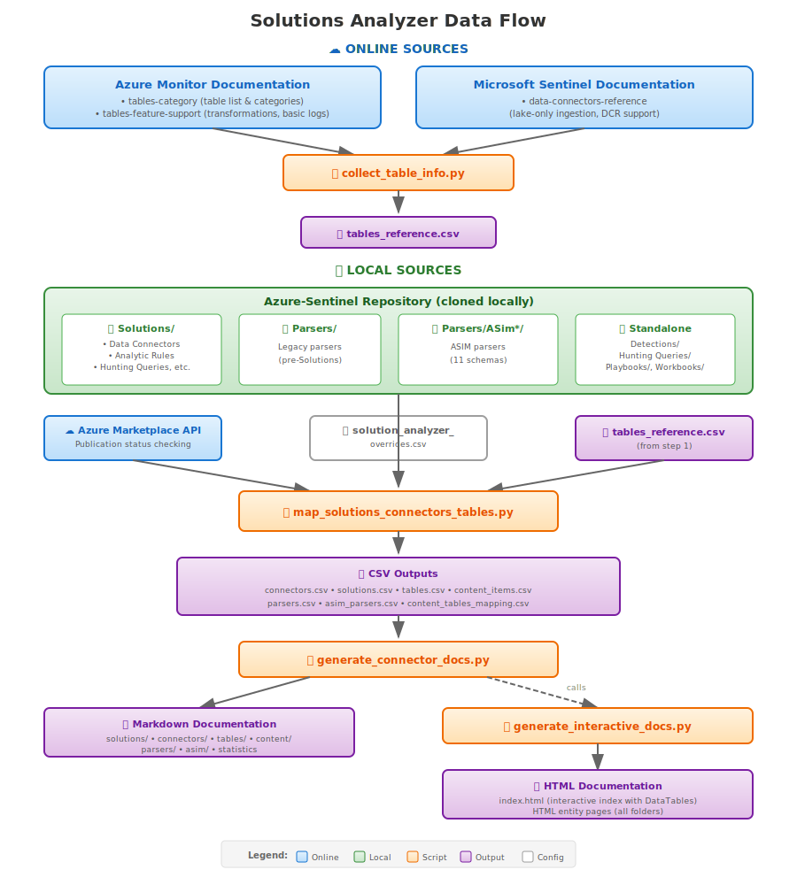

# Azure Sentinel Solutions Analyzer

This directory contains seven complementary tools for analyzing Microsoft Sentinel Solutions:

| Script | Purpose | Key Output |
|--------|---------|------------|
| [`collect_table_info.py`](script-docs/collect_table_info.md) | Fetch table metadata from Azure Monitor docs | `tables_reference.csv`, `la_table_schemas.csv` |
| [`collect_asim_fields.py`](script-docs/collect_asim_fields.md) | Collect ASIM field definitions from docs, tester, and physical tables | `asim_fields.csv`, `asim_entity_fields.csv`, `asim_logical_types.csv` |
| [`map_solutions_connectors_tables.py`](script-docs/map_solutions_connectors_tables.md) | Map connectors and content items to tables | `connectors.csv`, `tables.csv`, `solutions.csv`, `content_items.csv`, `content_tables_mapping.csv`, `parsers.csv`, `asim_parsers.csv`, `solution_dependencies.csv`, `table_schemas.csv` |
| [`generate_connector_docs.py`](script-docs/generate_connector_docs.md) | Generate markdown and HTML documentation | Markdown docs directory + `index.html`, HTML entity pages, `artifact_doc_links.csv` |
| [`generate_interactive_docs.py`](script-docs/generate_interactive_docs.md) | Generate interactive HTML index and HTML entity pages | `index.html`, `css/`, `js/`, HTML entity pages |
| [`generate_asim_browser.py`](script-docs/generate_asim_browser.md) | Generate interactive ASIM Schema Browser | `asim-browser.html` |
| [`upload_to_kusto.py`](script-docs/upload_to_kusto.md) | Upload CSV files to Azure Data Explorer (Kusto) | *(uploads to Kusto cluster)* |

## Prerequisites

### Clone the Azure-Sentinel Repository

The mapper and documentation generator scripts require the [Azure-Sentinel GitHub repository](https://github.com/Azure/Azure-Sentinel) to be cloned locally:

```bash
# Clone the repository
git clone https://github.com/Azure/Azure-Sentinel.git

# Navigate to the Tools directory
cd Azure-Sentinel/Tools/Solutions\ Analyzer

# Keep the repository updated
git pull origin master
```

### Python Environment

- Python 3.7 or higher
- Required packages vary by script (see individual documentation)

**Quick install for all scripts:**
```bash
pip install requests json5 pyyaml mistune
```

**Additional packages for Kusto upload:**
```bash
pip install azure-kusto-data azure-kusto-ingest azure-identity
```

## Quick Start

**Pre-generated CSV files are already available in this directory:**
- The information:
  - [`connectors.csv`](connectors.csv) - All connectors with metadata
  - [`solutions.csv`](solutions.csv) - All solutions with metadata
  - [`tables.csv`](tables.csv) - All tables with solution/connector references
  - [`content_items.csv`](content_items.csv) - All content items (analytics rules, hunting queries, playbooks, etc.) with metadata
  - [`parsers.csv`](parsers.csv) - All non-ASIM parsers with source tables, solution references, and discovered status
  - [`asim_parsers.csv`](asim_parsers.csv) - ASIM parsers with metadata, source tables, selection criteria, and sub-parser references
  - [`tables_reference.csv`](tables_reference.csv) - Comprehensive table metadata from Azure Monitor and Sentinel documentation
- ASIM fields:
  - [`asim_fields.csv`](asim_fields.csv) - ASIM schema field definitions merged from documentation, tester, and physical table schemas
  - [`asim_entity_fields.csv`](asim_entity_fields.csv) - ASIM entity (User, Device, Application) field definitions
  - [`asim_logical_types.csv`](asim_logical_types.csv) - ASIM logical type definitions with allowed values
  - [`asim_vendors_products.csv`](asim_vendors_products.csv) - Allowed EventVendor and EventProduct values
- Relationships:
  - [`content_tables_mapping.csv`](content_tables_mapping.csv) - Mapping of content items (analytics rules, playbooks, etc.) to tables with read/write indicators
  - [`solution_dependencies.csv`](solution_dependencies.csv) - Mapping of solutions to their dependencies (explicit and optional ASIM-based)
  - [`table_schemas.csv`](table_schemas.csv) - Table column schemas from DCR definition files, Azure Monitor documentation, and KQL validation tables
  - [`solutions_connectors_tables_mapping_simplified.csv`](solutions_connectors_tables_mapping_simplified.csv) - Simplified mapping with key fields only
  - [`artifact_doc_links.csv`](artifact_doc_links.csv) - Relative markdown and HTML links for generated documentation artifacts (for deep-link integrations)
- The rest:
  - [`solutions_connectors_tables_issues_and_exceptions_report.csv`](solutions_connectors_tables_issues_and_exceptions_report.csv) - Issues and exceptions report
  - [`solutions_connectors_tables_mapping.csv`](solutions_connectors_tables_mapping.csv) - Mapping of connectors to tables to solutions with full metadata. Generated for backward compatibility.


**Pre-generated Reference Documentation (External Repository):**

> **Note:** The generated documentation has been moved to a separate repository to reduce the size of the Azure-Sentinel repo.
> 
> 🔗 **Interactive index (GitHub Pages):** [https://oshezaf.github.io/sentinelninja/](https://oshezaf.github.io/sentinelninja/)
>
> 🔗 **Markdown source:** [https://github.com/oshezaf/sentinelninja/blob/main/Solutions%20Docs/README.md](https://github.com/oshezaf/sentinelninja/blob/main/Solutions%20Docs/README.md)

| Documentation | GitHub Pages (HTML) | GitHub (Markdown) |
|:--------------|:--------------------|:------------------|
| **Interactive Index** | [Browse All](https://oshezaf.github.io/sentinelninja/) | — |
| **Solutions Index** | [View Solutions](https://oshezaf.github.io/sentinelninja/Solutions%20Docs/solutions-index.html) | [Markdown](https://github.com/oshezaf/sentinelninja/blob/main/Solutions%20Docs/solutions-index.md) |
| **Connectors Index** | [View Connectors](https://oshezaf.github.io/sentinelninja/Solutions%20Docs/connectors-index.html) | [Markdown](https://github.com/oshezaf/sentinelninja/blob/main/Solutions%20Docs/connectors-index.md) |
| **Tables Index** | [View Tables](https://oshezaf.github.io/sentinelninja/Solutions%20Docs/tables-index.html) | [Markdown](https://github.com/oshezaf/sentinelninja/blob/main/Solutions%20Docs/tables-index.md) |
| **Content Index** | [View Content Items](https://oshezaf.github.io/sentinelninja/Solutions%20Docs/content/content-index.html) | [Markdown](https://github.com/oshezaf/sentinelninja/blob/main/Solutions%20Docs/content/content-index.md) |
| **Parsers Index** | [View Parsers](https://oshezaf.github.io/sentinelninja/Solutions%20Docs/parsers/parsers-index.html) | [Markdown](https://github.com/oshezaf/sentinelninja/blob/main/Solutions%20Docs/parsers/parsers-index.md) |
| **ASIM Parsers Index** | [View ASIM Parsers](https://oshezaf.github.io/sentinelninja/Solutions%20Docs/asim/asim-index.html) | [Markdown](https://github.com/oshezaf/sentinelninja/blob/main/Solutions%20Docs/asim/asim-index.md) |
| **ASIM Products Index** | [View ASIM supported products](https://oshezaf.github.io/sentinelninja/Solutions%20Docs/asim/asim-products-index.html) | [Markdown](https://github.com/oshezaf/sentinelninja/blob/main/Solutions%20Docs/asim/asim-products-index.md) |
| **Statistics** | [View Statistics](https://oshezaf.github.io/sentinelninja/Solutions%20Docs/statistics.html) | [Markdown](https://github.com/oshezaf/sentinelninja/blob/main/Solutions%20Docs/statistics.md) |
| **ASIM Schema Browser** | [Browse ASIM Schemas](https://oshezaf.github.io/sentinelninja/asim-browser.html) | — |

## Running the Scripts

### Recommended Order

For a complete refresh of all data:

```bash
# 1. Collect table metadata from Azure Monitor docs
python collect_table_info.py

# 2. Generate connector/solution/table mappings (uses tables_reference.csv)
python map_solutions_connectors_tables.py

# 3. Generate documentation (markdown + interactive HTML + HTML entity pages)
python generate_connector_docs.py --skip-input-generation \
    --output-dir "path/to/docs" \
    --html-output-dir "path/to/site-root" \
    --html-docs-path "Solutions Docs/" \
    --html-index-url "https://your-site.github.io/repo/index.html"
```

Or let the documentation generator handle everything (runs steps 1-2 automatically):

```bash
python generate_connector_docs.py \
    --output-dir "path/to/docs" \
    --html-output-dir "path/to/site-root" \
    --html-docs-path "Solutions Docs/" \
    --html-index-url "https://your-site.github.io/repo/index.html"
```

For markdown-only output (no HTML):

```bash
python generate_connector_docs.py --skip-input-generation --output-dir "path/to/output"
```

To refresh and publish ASIM field data and the ASIM Schema Browser:

```bash
# Collect/refresh ASIM field definitions (depends on tables_reference.csv and table_schemas.csv)
python collect_asim_fields.py --refresh-cache

# Generate the interactive ASIM Schema Browser (asim-browser.html)
python generate_asim_browser.py --output-dir "path/to/site-root"
```

Alternatively, `python map_solutions_connectors_tables.py --force-refresh asim` will automatically re-run `collect_asim_fields.py` with `--refresh-cache`.

## Data Flow



The diagram shows how data flows through the Solutions Analyzer:

1. **Online Sources** (blue) - External documentation and APIs:
   - Azure Monitor docs provide table metadata (categories, transformation support, basic logs eligibility)
   - Microsoft Sentinel docs provide lake-only ingestion and DCR support status
   - Azure Marketplace API checks solution publication status

2. **Local Sources** (green) - Azure-Sentinel repository:
   - `Solutions/` folder with connectors, content items, and parsers
   - `Parsers/` folder with legacy (pre-Solutions) parsers
   - `Parsers/ASim*/` folders with ASIM normalization parsers
   - Top-level standalone content directories

3. **Scripts** (orange) - Python processing:
   - `collect_table_info.py` fetches and caches online table metadata
   - `collect_asim_fields.py` collects ASIM field definitions from documentation, tester, and physical table schemas
   - `map_solutions_connectors_tables.py` analyzes local sources and generates CSVs
   - `generate_connector_docs.py` produces markdown documentation
   - `generate_interactive_docs.py` produces interactive HTML index (`index.html`) and converts markdown pages to styled HTML entity pages
   - `generate_asim_browser.py` produces the interactive ASIM Schema Browser (`asim-browser.html`)

4. **Outputs** (purple) - Generated artifacts:
   - CSV files with structured data for analysis
   - Markdown documentation for browsing
   - Interactive HTML index with filterable, sortable DataTables.js tables
   - ASIM Schema Browser with per-schema field and parser tables
   - HTML entity pages served via GitHub Pages (also works locally via `file://`)

## Override System

All three scripts support an override system that allows you to modify field values based on pattern matching. The override file (`solution_analyzer_overrides.csv`) uses regex patterns to match entities and set field values.

**Data-related overrides** (used by `map_solutions_connectors_tables.py` and `collect_table_info.py`):
- Set `collection_method` to AMA for specific tables (e.g., Syslog, CommonSecurityLog)
- Assign `category` to tables based on naming patterns (e.g., all AWS* tables → AWS)
- Set `support_tier` for tables based on their associated solutions

**Synthetic connector overrides** (used by `map_solutions_connectors_tables.py`):
- Define connectors that have no discoverable definition files in the repository (e.g., SAP Docker agent)
- See [Synthetic Connector Overrides](script-docs/map_solutions_connectors_tables.md#synthetic-connector-overrides) for details

**Documentation-related overrides** (used by `generate_connector_docs.py`):
- Add `additional_information` sections with curated documentation links to table, connector, or solution pages

See the script documentation for details:
- [Override System - data fields](script-docs/map_solutions_connectors_tables.md#override-system) (canonical reference)
- [Override System - table info](script-docs/collect_table_info.md#override-system)
- [Documentation Overrides - additional_information](script-docs/generate_connector_docs.md#documentation-overrides-and-additional-information)
- [Filter-field attribution rules (`filter_field_resolution.yaml`)](script-docs/filter_field_resolution.md) — companion user-editable config that decides which table a shared-name KQL predicate is attributed to.

---

## Version History

### v9.10 - Artifact deep-link mapping CSV, uploader integration, Okta-class connector/table fixes, and discovered-connector accuracy

**Documentation generator - artifact link export:**
- `generate_connector_docs.py` now generates `artifact_doc_links.csv` (default path: `Tools/Solutions Analyzer/artifact_doc_links.csv`) with one row per generated markdown artifact page and both markdown/html relative link paths. The file also includes site-relative variants that prepend `--html-docs-path` when it is a relative docs prefix, enabling direct deep-linking into rendered HTML from external systems.

**Kusto uploader - new Solution Analyzer table:**
- `upload_to_kusto.py` now includes `artifact_doc_links.csv` in `SOLUTION_ANALYZER_FILES`, uploading it to `solution_analyzer_artifact_doc_links` in `--solution-analyzer` mode.

**Mapper - skip full solution-package templates in connector discovery:**
- Connector discovery now detects and skips full *solution-package* ARM templates (e.g. `azuredeploy_*.json` that bundle analytic rules, hunting queries, playbooks, parsers and a `contentPackages` resource) when they happen to live in a solution's `Data Connectors` folder. Detection (`is_solution_package_template`) is name-agnostic and keys solely on a resource whose `type` ends with `contentPackages`, which never appears in a genuine standalone connector template. Previously such a package template was mined as if it were a connector definition, producing a **phantom connector** with the wrong (embedded legacy) title and a merged/incorrect table list — e.g. a spurious `OktaSingleSignOn(usingAzureFunctions)` connector in the Okta Single Sign-On solution. Each skipped file is recorded in the issues report with reason `solution_package_template_skipped`. Genuine standalone `azuredeploy_*.json` files that contain only a single `dataConnectors` resource (no `contentPackages`) are still discovered normally.

**Mapper - DCR/Table companion files now trump query analysis:**
- When a connector ships authoritative companion `*_Table.json` / `*_DCR.json` files, the analyzer now treats them as ground truth for the tables the connector ingests and **skips query analysis (priority 3)** for that connector. Connector status queries (e.g. `lastDataReceivedQuery`) frequently run through a shared parser that `union`s legacy tables; mining them previously attached non-ingested tables to the connector. For example, the Okta `OktaSSOv2` CCF connector — whose DCR output stream is `Custom-OktaV2_CL` and whose `*_Tables.json` defines only `OktaV2_CL` — was incorrectly mapped to both `OktaV2_CL` and the legacy `Okta_CL` (the shared `OktaSSO` parser unions both). It now maps only to `OktaV2_CL`. Connectors without companion DCR/Table files continue to rely on query analysis as before.

**Mapper - flag connectors not referenced by the solution definition file as unpublished:**
- The solution definition file (`Solution_*.json`) is treated as authoritative for which connectors ship to the content hub. For each solution, if **at least one** of its connectors is referenced by the definition file (proving the definition mechanism resolves correctly), any *additional* connectors found only by scanning the solution's `Data Connectors` folder — i.e. not referenced by the definition — are **retained but marked `is_published=false`** (they were discovered, they just are not on the content hub). They are no longer dropped. Folder-only mapping rows are kept and carry `is_published=false` for that solution association; the canonical `connectors.csv` record is marked `is_published=false` only when the connector is folder-only in **every** solution it appears in (a connector documented by at least one solution stays published through that solution). When **no** connector matches the definition (no `Solution_*.json`, or it references none of the discovered connectors), the folder is the sole discovery source and a definition miss cannot be reliably distinguished from genuine absence, so those connectors are left at their solution-level marketplace status. This restores the full discovered-connector inventory (nothing is deleted) while removing orphaned/superseded leftovers — such as the Okta `OktaSSO_Polling` legacy APIPolling template in `OktaNativePollerConnector/` — from the published count. Each folder-only `(solution, connector)` association is recorded in the issues report with reason `connector_not_in_solution_definition`.
- **Fix (URL-encoded filename match):** the documented-vs-folder-only determination compares a connector's `Data Connectors` file against the file names listed in the definition. The status map is keyed by the raw on-disk file name, but the lookup previously used the URL-encoded file name taken from the generated GitHub URL. As a result, any connector whose file name contains a space or parenthesis — e.g. `CEF AMA.json` (`CefAma`), `Windows Firewall.json` (`WindowsFirewall`), `template_ExtraHopReveal(x)AMA.json`, `WireXsystemsNFP(1b).json`, `illusive Attack Management System.json` — failed the match and was wrongly marked unpublished even though it **is** referenced by the definition. The lookup now decodes (`unquote`) the file name first, so these connectors are correctly recognised as published.

**Mapper - fix issues-report crash on unparseable connector JSON:**
- The `json_parse_error` issue record (emitted when a connector `*.json` in a solution's `Data Connectors` folder fails to parse) populated a `connector_file` key, but the issues-and-exceptions report writer's field list uses `relevant_file`. With `csv.DictWriter`'s default `extrasaction='raise'`, the run aborted with `ValueError: dict contains fields not in fieldnames: 'connector_file'` whenever any connector definition was malformed (surfaced by a malformed `Pathlock_TDnR_connectorDefinition.json`). The key is now `relevant_file`, matching every other issue record, so the offending file's path is reported correctly and the run completes.

**Mapper - read solution definition files with non-standard names:**
- `find_solution_json` previously located the solution definition only by the `Data/Solution_*.json` glob. A few solutions use a non-standard name — `Solutions_AzureDataLake.json` (plural), `CTM360.json` (no prefix), `OpenSystems_Solution_Input.json`, `Solutions_PrancerLogIntegration.json` — so their definition (which *does* reference their connectors) was never read. The solution looked definition-less, and its connectors fell into the folder-only fallback and were wrongly surfaced as "discovered active" (`not_in_solution_json=true`) on the statistics page. A shape-based fallback now scans the `Data/` folder for a definition-shaped JSON (top-level `Name` plus at least one content array such as `Data Connectors`/`Analytic Rules`/`Workbooks`), excluding generated side-cars (`system_generated_metadata.json`, `SolutionMetadata.json`), and adopts it only when **exactly one** candidate is found. The affected connectors (`AzureDataLakeStorageGen1_CCP`, the two CTM360 CCF connectors, `OpenSystems`, `PrancerLogData`) are now correctly recognised as In-Solution. Genuinely definition-less solutions (no `Data` folder at all — e.g. MailGuard 365, Red Canary) are unaffected.

**Mapper - canonical connector record honours documentation from any source file:**
- The per-connector `connectors.csv` record took its `not_in_solution_json` flag from the first mapping row processed for that connector id. A connector can legitimately appear in several rows sourced from different files — e.g. `1Password` is mapped from both the definition-referenced `1Password_API_FunctionApp.json` (documented) and a non-referenced `deployment/1Password_data_connector.json` wrapper. When the undocumented row sorted first, the canonical record was wrongly flagged `not_in_solution_json=true` ("discovered") even though the connector **is** referenced by the definition through another file. The canonical flag is now re-asserted to `false` whenever the connector id is documented in **any** `(solution, connector)` association. This clears the false "discovered" label on `1Password`, `Onapsis`, `SAPLogServ`, `Pathlock_TDnR`, and `ThreatIntelligenceUploadIndicatorsAPI`.

**Mapper - deduplicate intra-file azuredeploy phantom connectors:**
- The CCP v2 azuredeploy deduplication only registered literal-id titles from **non-azuredeploy** definition files, so it missed wrappers that emit *both* the literal and the title-generated connector from the **same** `azuredeploy_*.json` file. Cisco Meraki's `azuredeploy_Cisco_Meraki_native_poller_connector.json` produced two rows for one logical connector — the literal `CiscoMerakiNativePoller` (`id_generated=false`) and the synthetic `CiscoMeraki(usingRESTAPI)` (`id_generated=true`), both titled "Cisco Meraki (using REST API)". The dedup now also collapses generated-id entries against literal-id entries **within the same file** (reason `azuredeploy_duplicate_skipped`), so the single published REST API connector is represented once (as `CiscoMerakiNativePoller`).

**ASIM/table collectors - fix 404 after Sentinel docs repo migration:**
- `collect_asim_fields.py` and `collect_table_info.py` fetched the Microsoft Sentinel documentation markdown (ASIM schema/entity/common-field pages and the `sentinel-tables-connectors.md` include) from `raw.githubusercontent.com/MicrosoftDocs/azure-docs/main/articles/sentinel`. The Sentinel docs have moved to the `MicrosoftDocs/defender-docs` repo (`sentinel/` folder on the `public` branch), so every fetch returned **404** and the collectors silently produced empty/stale ASIM and table-reference data. The base URLs (`GITHUB_DOCS_RAW_URL` in `collect_asim_fields.py`, `SENTINEL_TABLES_CONNECTORS_RAW` in `collect_table_info.py`) now point at `raw.githubusercontent.com/MicrosoftDocs/defender-docs/public/sentinel` (the `includes/` subfolder is preserved). The Learn display URLs are unchanged. A verified refresh now collects 2045 schema fields, 53 entity fields, 22 logical types, and 18 vendors / 46 products.

**Script documentation updates:**
- Updated script docs and per-CSV reference pages to document the new CSV output, uploader table mapping, the solution-package-template skip (including the new `solution_package_template_skipped` report reason), the DCR/Table-companion-files table-source priority, and the definition-file-authoritative connector publishing rule (connectors absent from the definition are retained but marked `is_published=false`; reported with reason `connector_not_in_solution_definition`; file-name matching decodes URL-encoded names so spaced/parenthesised connector files are not misflagged). Also documented the non-standard definition-file shape-based fallback, the canonical "documented in any source file" attribution rule, and intra-file azuredeploy phantom-connector deduplication.

### v9.9 - Learn deep-link heuristics expanded; new "potential matches" audit finding

**Mapper – additional Learn-anchor heuristics:**
- `[Deprecated]` is now stripped (alongside `[Recommended]` and `[Preview]`) when normalising a connector title for Learn-anchor matching, on both sides. The Learn anchor lookup is also keyed by dash-collapsed and `recommended-`/`preview-`/`deprecated-`-prefix-stripped variants of every raw anchor, so an analyzer slug like `mimecast-audit-authentication-using-azure-functions` resolves to the Learn anchor `mimecast-audit--authentication-using-azure-functions` (which the Learn anchor flavour produces because `&` between two spaces collapses to `--`).
- Title variant generation now iteratively peels trailing `(…)` clauses, so multi-suffix titles like `Cloudflare (Preview) (using Azure Functions)`, `Abnormal Security (Push)`, and `Auth0 Logs (via Codeless Connector Framework)` reach a bare base from which all qualifier suffixes are then tried.
- The internal "base slug" (used to detach a qualifier suffix and re-attach a different one) now also strips trailing `-v\d+`, so `Dynatrace Attacks` matches `Dynatrace Attacks V1` / `V2`.
- Together these lift the Learn match rate on the current corpus from 330/615 (54%) to 360/615 (59%).

**Audit – new "potential matches" finding:**
- The same heuristics are mirrored in `reports/learn_docs_audit.py`. Combined with the renormalised anchor lookup, the audit's coverage-gap count drops from 117 to 94 (82 active connectors missing from Learn, down from 92; 12 Learn entries with no active analyzer connector, down from 25 — with 5 additional Learn entries covered only by a deprecated connector now suppressed from the gap report rather than reported as missing).
- New report `connector_potential_matches.csv` (and a section 3 in the audit README) pairs each "missing from Learn" row with each "missing from analyzer" row and surfaces those whose content tokens overlap by ≥ 50% (Jaccard, after stripping stopwords like `using`, `via`, `function`, `v1`, `v2`). These are typically V1/V2 splits, `Audit` vs `Events`, or one-word renames — surfaced for human review without auto-matching.

### v9.8 - TI Upload supersession, ASIM badge sizing, Learn deep-links, and faster HTML generation

**Connector collection-method classification fix:**
- Generic `Azure Function` is now dropped from a connector's `collection_method` whenever the same connector is also reclassified as `Azure Function (TI Upload API)`. TI Upload IS a specific Azure Function variant, so keeping the unrefined parent alongside it produced noisy composite labels like `Azure Function (TI Upload API)|Azure Function` (13 affected connectors in the current data set) which showed up as their own line in the Statistics page's Collection Methods breakdown. `_TI_UPLOAD_SUPERSEDES` now contains `{"REST Pull API", "REST Push API", "Azure Function"}`; the existing REST-supersession behaviour is unchanged.

**ASIM badge sizing on HTML entity pages:**
- `ASIM_BADGE_LARGE`, `ASIM_ICON`, and `ASIM_ICON_ROOT` now embed sizing via inline `style="height:…px;width:auto;vertical-align:middle"` instead of the legacy `height="…"` HTML attribute. The published interactive site's stylesheet sets `img { max-width: 100%; height: auto; }`, which overrode the HTML `height` attribute and let the badge PNGs render at their native (page-filling) pixel size on every ASIM parser / ASIM index page. Inline `style` wins over the CSS rule, restoring the intended 32 px heading badge and 16 px inline icon. Other generated `` tags (solution logos) already set both `width` and `height` attributes so they were unaffected.

**Microsoft Learn deep-links on connector pages:**
- The mapper now fetches the canonical Microsoft Learn page [`data-connectors-reference`](https://learn.microsoft.com/azure/sentinel/data-connectors-reference) once per run (cached), extracts every `<a name="…">` anchor, and matches each connector by slug of its display name. When a match is found, a new `learn_doc_url` column on `connectors.csv` carries the deep-link (e.g. `https://learn.microsoft.com/azure/sentinel/data-connectors-reference#cisco-secure-endpoint-via-codeless-connector-framework`). The documentation generator renders this as a new "Microsoft Learn" row in the connector header info table on each connector page.
- The Learn fetch is split across two cache files: `data_connectors_reference.html` holds the raw page (shared with the out-of-band audit at `reports/learn_docs_audit.py`) and `data_connectors_reference_anchors.json` holds the extracted anchor index. Both refresh together when `--force-refresh=learn_docs` is passed.
- Slug matching now also tries a Learn-anchor flavour of slugify (which drops `&`, `/`, `()`, `:` etc. without producing a dash and preserves consecutive dashes — e.g. `Cortex XDR - Incidents` → `cortex-xdr---incidents`, `GCP Pub/Sub` → `gcp-pubsub`) alongside the standard slug, and iterates the known Learn qualifier suffixes (`using-azure-functions`, `via-codeless-connector-framework`, `via-legacy-agent`, `via-ama`, `polling-ccf`, `polling-ccp`, `ccf`, `ccp`, `preview`) against the stripped base of the connector title. Together these lift the match rate on the current corpus from 266/615 (43%) to 330/615 (54%) and shrink the reciprocal "missing from Learn" / "missing from analyzer" buckets in the audit report by ~40% / ~77%.
- New audit report at `reports/learn_docs_audit.py` writes three CSVs plus a markdown summary into `reports/learn_docs_audit/`: connectors active in published solutions that are missing from the Learn page; Learn entries that aren't recognised by the analyzer; and connectors where the Learn `Log Analytics tables` list disagrees with the analyzer's `tables_used`.

**Connector detail pages now show companion DCR files:**
- The mapper writes a new `dcr_definition_files` column into `connectors.csv`, populated from companion DCR files found alongside connector definitions (including both `*_DCR.json` and `dcr.json` naming patterns). The documentation generator renders these as a dedicated **DCR Definition Files** row on connector detail pages, keeping DCR-definition links distinct from existing CCF poller/config links.
- DCR URL association now accepts connector entries that expose the identifier as `id` (not only `connector_id`), which fixes missing DCR links for CCF connectors such as Dragos that are emitted from `connectorDefinition` structures.

**Markdown → HTML conversion is ~8× faster:**
- `_generate_html_pages` in `generate_interactive_docs.py` now parallelises per-file conversion across CPU cores using `concurrent.futures.ProcessPoolExecutor` and uses [`mistune`](https://pypi.org/project/mistune/) (v3) as the preferred markdown engine, falling back to Python-Markdown if mistune isn't installed. On the current corpus (10,616 entity pages) this cuts the HTML stage from ~520 s to ~64 s on an 8-core laptop (167 pages/s vs ~20 pages/s previously) while producing visually identical output.
- All per-file regexes, the slugify / heading-id helpers, and the directory-to-tab maps are now module-level so workers don't re-create them on every file. The worker function lives at module scope so Windows spawn works correctly.
- Worker count defaults to `min(cpu_count, 8)` and can be overridden with the `SA_HTML_WORKERS` environment variable (set to `1` for serial debugging).
- New install requirement: `pip install mistune` (optional — the code falls back to the existing `markdown` dependency if mistune is absent, with the older performance characteristics).

### v9.7 - Logic Apps Index, Filter-Field Coverage, and Collection-Method Refinements

**Logic Apps connector index:**
- New top-level Logic Apps section (`logic-apps/logic-apps-index.md` plus per-connector pages) listing every managed connector, custom connector, and built-in action type referenced by playbooks across all solutions, with playbook count, solution count, and links to the corresponding Microsoft Learn page when one exists.
- Each per-connector page lists every playbook using the connector and the solution it belongs to.
- Connector / action names rendered on playbook content pages and on the Statistics page link to the corresponding Logic Apps page. A "🔌 Logic Apps" entry is added to the markdown navigation strip and the interactive `index.html` navbar.
- Microsoft Learn URLs for managed connectors are resolved dynamically and cached in `.cache/connector_learn_urls.json`.

**Built-in Logic App action telemetry:**
- The mapper now records `Http`, `Function`, `Workflow`, and `ApiManagement` actions as `api_kind=builtin` rows in `playbook_connectors.csv`, alongside the existing managed/custom rows. A new `parameters` column captures each action's parameter block (method, uri, body, path, headers, queries).

**Schema-driven filter-field extraction:**
- The `filter_fields` / `content_filter_fields` columns now capture selection-criteria predicates well beyond the original whitelist of column names. A schema-driven pass extracts any where-predicate whose field is either a documented column of a referenced table (looked up against the Azure Monitor / Defender XDR docs and ASIM field catalogs) or a column defined earlier in the same query via `| extend`. Applies uniformly to connectors, parsers, ASIM parsers, and content items.
- When a connector's query is just a vendor parser-function call (e.g. `ClarotyEvent`, `CiscoSEGEvent`, `IllumioCoreEvent`), the connector now inherits the parser's selection-criteria predicates onto its own `filter_fields` instead of appearing as unfiltered.
- CCF v3 (`connectorDefinition` envelopes and ARM templates) and both `connectivityCriteria` / `connectivityCriterias` spellings are now read by the query extractor, so CCF v3 connectors produce `filter_fields` like other generations.
- Deprecated connectors are no longer dropped from `associate_connectors_to_items`; they still appear in `associated_connectors` of any parser or content item whose selection criteria they satisfy.

**Per-CSV reference documentation:**
- New `script-docs/csv/` folder with one reference page per CSV file — what each file contains, how it's produced, use cases, full column reference, and links to related CSVs. See [`script-docs/csv/README.md`](script-docs/csv/README.md).

**Table-level `collection_method` resolution:**
- Tables now inherit a `collection_method` from their feeding connectors when there is exactly one distinct informative method across all connectors that ingest the table. Intrinsic values from `tables_reference.csv`, the `source_defender_xdr=Yes` flag (→ `Defender`), and the `Azure Resources` category (→ `Azure Diagnostics`) still take precedence.
- ASIM tables (any table whose name starts with `ASim`) short-circuit to `Various`, since ASIM is a normalization layer that aggregates events from many heterogeneous sources.
- When a table is fed by both published (marketplace) and unpublished connectors with different methods, only the published connectors' methods are considered for inference.
- Connector `collection_method` values are split on `|` before set comparison, so a connector that declares e.g. `CCF|Azure Function` no longer blocks back-propagation.
- When feeding connectors disagree but the disagreement is a known generation overlap, ordered precedence rules collapse to a single winner: `{AMA, MMA} → AMA`, `{CCF, CCF (Legacy)} → CCF`, `{Azure Function, CCF} → CCF`.
- Tables in the Entra / Intune / Graph categories, or whose `resource_types` indicate a tenant-scoped diagnostic setting, are now classified as `Azure Diagnostics` and override any connector-inferred `Native` — fixing tables fed by `AzureActiveDirectory` / Entra connectors that were previously misclassified `Native`.
- `SecurityAlert` and `SecurityIncident` are now explicitly classified as `Internal` (they are populated by Sentinel itself; the `MicrosoftThreatProtection` connector's ARM `dataTypes` block erroneously claims them).

**New diagnostic columns in `tables.csv`:**
- `collection_method_source` — how the value was resolved (`asim_table`, `tables_reference`, `source_defender_xdr`, `category=Azure Resources`, `connector`, `connector_published_only`, `connector_precedence(...)`, `tenant_diagnostics(...)`).
- `collection_method_candidates` — the distinct atomized methods seen across feeding connectors.
- `feeding_connector_ids` — every connector that ingests the table, for traceability.

**Diagnostic CSVs consolidated:**
- The standalone `table_method_conflicts.csv` and `table_method_ambiguities.csv` outputs (and their CLI flags) have been removed. Both classes of finding now appear as rows in `solutions_connectors_tables_issues_and_exceptions_report.csv` with `reason=table_method_conflict` or `reason=table_method_ambiguity`; the `details` column carries the per-method connector breakdown.

**Connector collection-method classification fixes:**
- The pattern previously labelled `REST Pull API` is renamed to `REST Push API`. The connectors it identifies push into Sentinel via the Azure Monitor HTTP Data Collector API or the Logs Ingestion API (DCR/DCE), not pull. CCF `RestApiPoller` (genuinely pull) remains classified as `CCF`.
- The sibling-ARM-template scan no longer adds `Azure Function` to a connector that already classifies as `CCF` / `CCF Push` / `CCF (Legacy)`. CCF v2's ARM-template Function App is the codeless-platform poller runner — internal orchestration, not a customer-facing collection mechanism. API and per-table attribution from the ARM scan are still recorded.

**User-editable filter-field attribution (`filter_field_resolution.yaml`):**
- The dispatch table that decides which Sentinel table a KQL where-predicate is attributed to (when a column name is shared across multiple tables — e.g. `EventID` on `Event` / `SecurityEvent` / `WindowsEvent`, `ResourceProvider` on `AzureActivity` / `AzureDiagnostics`) is now an external YAML config instead of being hard-coded in Python.
- Supports five rule types — `direct`, `gated`, `priority`, `any_of` (with optional `prefer_local`), and `prefix` (via named `prefix_groups`) — plus an optional `skip_flag` for context-dependent suppression (e.g. skipping `EventVendor` / `EventProduct` inside ASIM parsers).
- Editing the YAML changes filter-field attribution on the next mapper run with no code changes and no cache invalidation needed. Full reference: [`script-docs/filter_field_resolution.md`](script-docs/filter_field_resolution.md).
- Connector and table `collection_method` overrides previously hard-coded in Python have been migrated to `solution_analyzer_overrides.csv`, giving a single editable source of truth alongside the existing per-entity overrides.

### v9.6 - ASIM Field Collection & Schema Browser

**ASIM Field Collection:**
- New `collect_asim_fields.py` script collecting ASIM field definitions from three sources: Microsoft Learn documentation, ASimTester.csv, and physical table schemas (`table_schemas.csv`)
- Merges fields by `(schema, field_name)` key with deduplication — tester/physical columns only populated when values differ from documentation
- New output CSVs: `asim_fields.csv` (2445 fields across 13 schemas), `asim_entity_fields.csv`, `asim_logical_types.csv`, `asim_vendors_products.csv`
- `--force-refresh=asim` (or `all`) now automatically re-runs `collect_asim_fields.py` with `--refresh-cache`, mirroring the existing `tables` → `collect_table_info.py` pattern

**ASIM Schema Browser:**
- New `generate_asim_browser.py` script producing an interactive ASIM Schema Browser (`asim-browser.html`)
- Browser has primary tabs for each ASIM schema, with sub-tabs for Fields (interactive DataTable) and Parsers
- Visual style matches the main `index.html` interactive index, with links to entity documentation pages

### v9.5 - Extended Marketplace Data & Content Count Split

**Extended Marketplace Data Collection:**
- Expanded Azure Marketplace API integration from 2 fields (`is_published`, `marketplace_url`) to 19 `mp_*` fields in `solutions.csv`
- New fields include: display name, summary, publisher name, preview/stop-sell status, creation/modification dates, categories, keywords, popularity score, user ratings, pricing model, and Microsoft product flag
- Cache format changed from CSV (`marketplace_availability.csv`) to JSON (`marketplace_data.json`) with automatic migration of old cache
- Added marketplace URL row to solution documentation pages
- Combined marketplace row in connector and solution property tables uses "Rating:" and "Popularity:" labels for clarity

**Content Item Count Splitting:**
- Solution pages, statistics page, and interactive index now show separate counts for "in solution" vs "discovered" content items
- CLv1 identification footnote includes accuracy caveat (CLv1 prefixes are allowed for CLv2)
- Standardized discovered connector footnote format across all pages

### v9.4 - Interactive HTML Index

**Interactive HTML Index:**
- New `index.html` with DataTables.js providing filterable, sortable, searchable tables
- Six tabs: Solutions, Connectors, Tables, Content, Parsers, ASIM Parsers
- Per-column dropdown filters, click-to-filter, global search, and "Clear All Filters" notification bar
- Summary cards showing active/total counts for each entity type
- Entity names link to their individual documentation pages
- Collection method names link to method index pages
- Solution logos displayed in Solutions and Connectors tabs
- Navigation bar with links to static docs and statistics page
- Status badges (Active/Deprecated/Unpublished), icons for CLv1 (🔶), schema (📖), discovered (🔍)
- Content source indicators: 📦 Solution, 📄 Standalone, 🔗 GitHub Only
- Standalone content sources show solution name as plain text (not linked), matching static indexes
- Connectors tab includes all connectors (in-solution + discovered), matching connectors-index.md
- Per-tab icon legends explaining all visual indicators
- Can be run standalone or as part of `generate_connector_docs.py`
- Supports `--html-output-dir` and `--html-docs-path` for placing index.html separately from docs (e.g. repo root for GitHub Pages)
- Static markdown navigation bar (`write_browse_section`) automatically adjusts 🔍 Interactive link based on `--html-docs-path` or `--html-index-url`
- Generates `.nojekyll` alongside `index.html` to prevent GitHub Pages from running Jekyll (which breaks on `{{` in Azure deployment templates)

**HTML Entity Pages:**
- When `--html-output-dir` is set with a relative `--html-docs-path`, the generator converts every markdown entity page to a styled HTML page alongside the `.md` file
- Uses Python `markdown` library with tables, fenced code, sane lists, and toc extensions
- The `toc` extension automatically generates `id` attributes on all headings, enabling in-page anchor links (e.g. `statistics.html#connectors`)
- HTML pages share a consistent visual style (navbar, typography, responsive layout) via a shared `page.css` stylesheet
- Internal `.md` links within pages are automatically rewritten to `.html`
- Each HTML page includes a navbar linking back to the interactive index using relative paths (works both locally via `file://` and on GitHub Pages)
- Browse-bar links to static index pages (e.g. `solutions-index.html`) are rewritten to `index.html#tab` links
- `index.html` links automatically use `.html` extension when HTML entity pages are generated
- Eliminates dependency on GitHub blob view for reading entity pages — everything is served from GitHub Pages

### v9.3 - Solution Deprecation & Deprecation Dates

**Solution-Level Deprecation Detection:**
- New `is_deprecated` column in `solutions.csv` detecting solution-level deprecation from the Solution JSON `Description` field
- Detection patterns: "this integration/solution is (considered) deprecated", "this integration/solution has been deprecated"
- Deprecated solutions shown with 🚫 icon on solution pages and solutions index, with deprecation footnote
- Currently detects 4 deprecated Mimecast legacy solutions (MimecastAudit, MimecastSEG, MimecastTIRegional, MimecastTTP), all replaced by the unified Mimecast solution

**Deprecation Dates:**
- New `deprecation_date` column in both `connectors.csv` and `solutions.csv`
- Dates extracted from artifact descriptions near deprecation/retirement keywords (supports "Aug 31, 2024", "2024-08-31", markdown bold `**date**` formats)
- Deprecation date shown in connector and solution property tables in generated docs
- Both fields are overridable via the override CSV for artifacts without publicly-extractable dates

**Enhanced Connector Deprecation Detection:**
- Connector `is_deprecated` now also checks `availability.status` in the connector JSON definition (status 0 = deprecated), in addition to the existing `[DEPRECATED]` title check
- Connectors belonging to deprecated solutions now inherit the solution's deprecated status


### v9.2 - Ingestion API & Custom Log V1 Detection

**Ingestion API Detection:**
- New `ingestion_api` and `ingestion_api_reason` columns in `connectors.csv` identifying whether API-based connectors use the Log Ingestion API or HTTP Data Collector API
- Detection rules:
  1. CCF Push connectors → always Log Ingestion API (DCR-based, solution code pushes data)
  2. Azure Function connectors → Python code scanning for API-specific patterns (e.g., `LogsIngestionClient` vs `SharedKey`/`build_signature`)
  3. REST API / Custom Log connectors → JSON definition scanning for workspace key patterns (`sharedKeys`, `WorkspaceId`, `PrimaryKey`)
  4. Fallback → table column suffix heuristic (>40% type-suffix columns `_s`/`_d`/`_b` indicates HTTP Data Collector API)
  - CCF and CCF (Legacy) are excluded — their ingestion is platform-managed (Sentinel PaaS), not configurable by the connector author
- Doc generator:
  - Connector properties table includes "Ingestion API" row with link to API page
  - New "Ingestion API by Collection Method" table on methods-index.md
  - New per-API index pages (Log Ingestion API, HTTP Data Collector API, Undetermined) under methods/ with description, documentation links, statistics, and connector listings
  - New "Ingestion API" subsection on statistics page with summary and by-collection-method breakdown

**Custom Log V1 (CLv1) Detection:**
- New `is_clv1` column in both `tables.csv` and `connectors.csv` identifying tables using the legacy Custom Log V1 schema format
- Two detection rules:
  1. Column suffix heuristic — tables where >40% of non-standard columns end with type suffixes (`_s`, `_d`, `_b`, `_t`, `_g`)
  2. Connector-based inference — `_CL` tables from connectors using HTTP Data Collector API
- A connector is marked CLv1 if any of its tables are CLv1
- Doc generator:
  - 🔶 icon shown next to CLv1 tables and connectors in all index pages, solution pages, and method pages
  - CLv1 attribute shown in table and connector properties pages
  - Footnote legend explaining the CLv1 icon added to relevant pages

**Connector Association Improvements:**
- Added `Resource` filter field for AzureDiagnostics/AzureMetrics/AzureActivity tables (identifies specific Azure resource instances, similar to `ResourceProvider`)
- Added cross-field override: `CATEGORY_TO_RESOURCE_TYPE` mapping for AzureDiagnostics, allowing Category-only parsers to match ResourceType-filtered connectors (e.g., `ASimNetworkSessionAzureFirewall` now correctly associates with Azure Firewall)
- Fixed `Table(Qualifier)` pattern in `dataTypes.name` extraction: connectors with names like `Event(ThreatIntelligenceIndicator)` now correctly extract the inner qualifier as the table name when no query is available

**Table Detection Improvements:**
- Added `project-keep` and `project-reorder` to pipe block commands, preventing false table detections from wildcard field patterns like `Event*` in `project-keep` statements

### v9.1 - Connector Discovery

**Connector Discovery - mainTemplate Fallback and Synthetic Connectors:**
- New mainTemplate.json fallback: discovers connectors defined only as ARM `dataConnectorDefinitions` resources (not as standalone JSON files), resolving ARM variable references in ID/publisher fields
- New synthetic connector override system: allows manually defining connectors with no discoverable definition files (e.g., SAP Docker agent) via `synthetic_connector` entries in the override CSV
- Title-based deduplication prevents duplicates when the same connector appears in both Data Connectors files and mainTemplate.json
- Both mainTemplate and synthetic connectors are classified as "In Solutions" (not "Discovered"), since they are formally part of their solution's package
- Discovers 4 new connectors: Microsoft Dataverse, Microsoft Power Automate, Microsoft Power Platform Admin Activity (from mainTemplate), and Microsoft Sentinel for SAP (synthetic override)

### v9.0 - Discovery Source Prioritization and Table Schema Discovery

**Tables Index - Single Discovery Source:**
- "Discovered Via" column now shows a single primary discovery source per table instead of all sources
- Priority order: Connector > Content > Docs > Schema
- "Docs" combines all documentation-based sources (Azure Monitor, Defender XDR, Sentinel Tables Doc, Feature Support Doc, Ingestion API Doc)
- Tables index includes an explanation of the discovery sources and their priority hierarchy
- Tables from standalone content items (e.g., GitHub-only playbooks without a solution) now correctly discovered as "Content"
- Tables discovered only via `table_schemas.csv` now included in the index with "Schema" as discovery source
- 📖 icon on tables index for tables with schema information

**Table Pages - Documentation References:**
- Table pages now show all applicable documentation references with specific names and links:
  - Azure Monitor Tables Reference, Defender XDR Advanced Hunting Schema, Sentinel Tables and Connectors Reference, Azure Monitor Tables Feature Support, Azure Monitor Logs Ingestion API
- Replaces the previous generic "Azure Monitor Docs" / "Defender XDR Docs" labels
- Tables discovered via docs-only sources (e.g., Feature Support) now show the relevant doc link

**Statistics Page - Detailed Discovery Breakdowns:**
- Tables section with unified Discovery Sources table:
  - **Discovered Via** column: single primary discovery source per table by priority (Connector > Content > per-doc-source > Schema)
  - **Total** column: how many tables have each source regardless of priority, since a table can appear in multiple sources
  - Doc sources shown individually with links: Azure Monitor Tables Reference, Defender XDR Advanced Hunting Schema, Sentinel Tables and Connectors Reference, Azure Monitor Tables Feature Support, Azure Monitor Logs Ingestion API
  - **Schema Sources** subsection: breakdown by origin (Azure Monitor docs, DCR, connector definitions, KQL validation)

### v8.0 - Solution Dependencies, CCF Legacy, Capabilities Statistics, and Table Schemas

**Table Schemas from DCR Definitions, ARM Table Definitions, and Azure Monitor Documentation:**
- New `table_schemas.csv` output file combining column schemas from four sources:
  - **DCR files** (`*_DCR.json`): stream declarations for CCP/CCF connectors with column name, type, stream name, transform KQL, connector ID, solution name. Only passthrough streams (no transform, or trivial `source` transform) emit schema rows so vendor-specific input columns are not attributed to ASIM output tables.
  - **Azure Monitor docs**: column schemas from rendered learn.microsoft.com table reference pages with column name, type, description
  - **ARM table definition files** in `Solutions/*/Data Connectors/` directories (`type: Microsoft.OperationalInsights/workspaces/tables`): extracts `properties.schema.columns` (name, type, description). Source labeled as "Connector definition" with GitHub URL.
  - **KQL validation tables** (`.script/tests/KqlvalidationsTests/CustomTables/`): table schemas used for CI query validation, only for `_CL` custom log tables not already covered by the other sources
- New `la_table_schemas.csv` intermediate file generated by `collect_table_info.py` containing documentation-sourced column schemas
- New `source` and `description` columns in `table_schemas.csv` to distinguish data origin
- New `source_url` column in `table_schemas.csv` with link to the source file (GitHub for DCR/KQL validation, learn.microsoft.com for docs)
- Doc generator: new **Schema** section on table pages showing column definitions (name, type, description, source) from `table_schemas.csv`
- Doc generator: schema source attribution with clickable links shown at top of Schema section
- Doc generator: table names in tables index no longer wrapped in backticks for cleaner display
- Doc generator: tables that exist only in `table_schemas.csv` now get their own documentation pages with schema information

**Solution Dependencies:**
- New `solution_dependencies.csv` mapping file tracking both explicit and ASIM-based dependencies between solutions
- Explicit dependencies extracted from `dependentDomainSolutionIds` in solution definitions
- ASIM-based dependencies (optional): solutions using ASIM parsers list all solutions whose connectors can feed those parsers as potential dependencies
- Doc generator: new **Dependencies** section on solution pages listing dependency solutions with type and details
- Doc generator: dependency connectors appended to the connectors list with "(dependency on solution X)" suffix
- Doc generator: dependency tables included in the tables section with "(dependency)" suffix on connector names
- Uploader: new CSV included in `--solution-analyzer` mode

**CCF (Legacy) Collection Method:**
- New `CCF (Legacy)` collection method for connectors with embedded `pollingConfig` in their primary ARM template and no separate CCF config file
- Capabilities (auth type, paging, POST) extracted from embedded `pollingConfig` for legacy CCF connectors
- Improved `find_ccf_config_file()` detection: now finds `connectors.json` (Bitwarden-style) and searches sibling `*_ccp/` subdirectories (GCP-style)

**CCF Capabilities Statistics:**
- New **CCF Capabilities** subsection on the statistics page with breakdown of connector kind, authentication methods, and request features across all CCF/CCF Push/CCF Legacy connectors
- New `Nested` capability: detects `stepType: Nested` in CCF config files
- Improved `MvExpand` detection: now uses `nestedTransformName` containing `MvExpandTransformer` instead of text-based search

**Custom Log Table Rules (collect_table_info.py):**
- All `_CL` tables now correctly marked as supporting Ingestion API
- `_CL` tables with lake-only support now also marked as supporting transformations

**Bug Fixes:**
- Fixed empty Product column in ASIM union parser pages (e.g., `imDns`): sub-parsers listed with `_Im_` prefix now correctly resolve product names and page links from `_ASim_` source parser data
- Excluded empty parsers (e.g., `_Im_Dns_Empty`, `_Im_AlertEvent_Empty`) from the Products table on union parser pages
- Fixed broken links to sub-parser pages on union parser pages: `_Im_` prefixed sub-parsers now correctly link to their `_ASim_` parser page files

### v7.9.1 - CCF Push and CCF Capabilities

**CCF Push Collection Method:**
- New collection method `CCF Push` for connectors using CCF in push mode (partner pushes data via DCR/DCE)
- `DeployPushConnectorButton` + `HasDataConnectors` pattern now classified as "CCF Push" instead of "CCF"
- Separate documentation page and metadata for CCF Push in generated docs

**CCF Configuration and Capabilities:**
- New `ccf_config_file` column in `connectors.csv`: GitHub URL to the CCF configuration file (polling/poller/push config)
- New `ccf_capabilities` column in `connectors.csv`: semicolon-separated capabilities extracted from the config JSON
- Capabilities include: connector kind (GCP, Push, etc.), auth type (APIKey, OAuth2, Basic, JwtToken), Paging, POST, MvExpand
- Connector detail pages in generated docs now display **CCF Configuration** link and **CCF Capabilities** for CCF/CCF Push connectors

### v7.9 - Kusto Uploader

**New Tool: `upload_to_kusto.py`**
- Upload CSV files to Azure Data Explorer (Kusto) clusters
- **Solution Analyzer mode** (`--solution-analyzer`): uploads all 12 Solution Analyzer CSVs with predefined table names
- **Custom CSV mode**: upload any CSV files with automatic schema detection
- **Local source directory** (`--source-dir`): read Solution Analyzer CSVs from a local folder instead of downloading from GitHub
- **Dry run mode** (`--dry-run`): preview operations before executing
- Uses Azure CLI authentication and Kusto queued ingestion
- All columns created as `string` type with automatic CSV mapping

### v7.8 - Lake-Only Ingestion, Collection Methods Index, and Enhanced Documentation

**Lake-Only Ingestion Support:**
- New data source: [Sentinel Tables/Connectors Reference](https://learn.microsoft.com/azure/sentinel/data-connectors-reference) provides lake-only ingestion status for ~474 tables
- New `lake_only_supported` field in `tables_reference.csv` and `tables.csv`
- New `source_sentinel_tables` field tracks data source for each table
- **Tables Ingested** sections on connector pages now include **Lake-Only** column
- Individual table pages display **Lake-Only Ingestion** property in attributes table

**Transformation Support Enrichment:**
- `supports_transformations` is now enriched from Sentinel reference when feature-support page has no data
- Mismatch validation generates `transformation_support_mismatch_report.md` when sources disagree
- Removed redundant `supports_dcr` field (consolidated into `supports_transformations`)

**Collection Methods Index:**
- New `methods-index.md` page with all collection methods organized by category
- Individual method pages with descriptions, documentation links, and connector lists
- Collection method column in connector indexes now links to method detail pages
- Method metadata includes official Microsoft documentation references

**Connector Documentation Overrides:**
- Connector pages now support `additional_information` overrides (previously only tables)
- Added 20+ curated documentation links for major vendors (Palo Alto, Fortinet, Cisco, Zscaler, AWS, F5, etc.)
- Solution pages also support `additional_information` overrides

**Device Configuration Overrides:**
- Added 19 new device configuration overrides for Custom Logs via AMA products
- Covers Apache, Tomcat, Cisco Meraki, JBoss, Juniper, MarkLogic, MongoDB, NGINX, Oracle WebLogic, PostgreSQL, SecurityBridge, Squid Proxy, Ubiquiti, VMware vCenter, Zscaler Private Access

**Cache and Performance:**
- New `--force-refresh` parameter for mapper script with selective refresh by analysis type
- Supported types: `asim`, `parsers`, `solutions`, `standalone`, `marketplace`, `tables`
- Use `all` for full refresh or `all-offline` for offline-only types
- Logging added in `.logs/` folder

**Documentation Improvements:**
- Script docs updated with Data Source column showing where each field is derived
- Updated examples and command-line options documentation
- Added `content_items.csv` to pre-generated files list in README

### v7.7 - Connector Association for ASIM Parsers and Standalone Content

**Connector Association:**
- ASIM parsers and standalone/GitHub Only content items are now associated with connectors based on:
  1. **Shared tables**: The connector and parser/content must use the same table(s)
  2. **Filter field matching**: Connector filter values must be a subset of (or equal to) the parser/content filter values

**New CSV Fields:**
- `asim_parsers.csv`: Added `associated_connectors`, `associated_solutions` - Connectors providing data for each parser
- `content_items.csv`: Added `associated_connectors`, `associated_solutions` - Connectors for standalone/GitHub Only items

**Documentation Enhancements:**
- **ASIM Parser Pages**: New "Associated Connectors" section showing connectors that provide relevant data
- **Standalone Content Pages**: New "Associated Connectors" section for items not part of a solution
- Links to connector pages and related solution pages for easy navigation


### v7.6 - Extended Filter Fields

**New Filter Fields Added:**
- `EventType` (ASIM tables) - ASIM normalized event type
- `ResourceProvider` (AzureActivity) - Azure resource provider
- `ActionType` (DeviceEvents, DeviceFileEvents, DeviceProcessEvents, etc.) - Microsoft Defender XDR action type
- `OperationName` (AuditLogs, AzureActivity, OfficeActivity, SigninLogs) - Azure/M365 operation name
- `OfficeWorkload` (OfficeActivity) - Office 365 workload type (Exchange, SharePoint, etc.)
- `RecordType` (OfficeActivity) - Office 365 record type (numeric)

- **RecordType** supports numeric matching like EventID (equality and in operators only)
- **ActionType** covers MDE/XDR tables for Defender content detection
- **OperationName** captures Azure Activity, Audit Logs, and Office Activity operations
- Total supported filter fields increased from 15 to 22

### v7.5 - Statistics Page and Filter Fields Enhancements

**Unified Statistics Page:**
- New `statistics.md` page consolidates statistics from all index pages
- Accessible via 📊 icon in navigation bar on all pages
- Detailed breakdowns by content type, solution, and source

**Filter Fields Detection:**
- Analyzes KQL queries to extract filter field conditions that identify data sources
- Generates `filter_fields` column in CSV outputs with structured format: `Table.Field operator "value"`

*Supported Filter Fields:*
- `DeviceVendor` (CommonSecurityLog) - CEF vendor identifier
- `DeviceProduct` (CommonSecurityLog) - CEF product identifier
- `DeviceEventClassID` (CommonSecurityLog) - CEF event class
- `EventVendor` (ASIM tables) - Normalized vendor field
- `EventProduct` (ASIM tables) - Normalized product field
- `EventType` (ASIM tables) - Normalized event type
- `ResourceType` (AzureDiagnostics) - Azure resource type
- `Category` (AzureDiagnostics) - Diagnostic category
- `ResourceProvider` (AzureActivity) - Azure resource provider
- `EventID` (WindowsEvent/SecurityEvent/Event) - Windows event ID
- `Source` (Event) - Windows Event Log source
- `Provider` (WindowsEvent) - Windows event provider
- `Facility` (Syslog) - Syslog facility
- `ProcessName` (Syslog) - Syslog process name
- `ProcessID` (Syslog) - Syslog process ID
- `SyslogMessage` (Syslog) - Syslog message content
- `EventName` (AWSCloudTrail) - AWS API event name
- `ActionType` (DeviceEvents/DeviceFileEvents/etc.) - MDE/XDR action type
- `OperationName` (AuditLogs/AzureActivity/OfficeActivity/SigninLogs) - Operation name
- `OfficeWorkload` (OfficeActivity) - Office 365 workload
- `RecordType` (OfficeActivity) - Office 365 record type

*Supported Operators:*
- **Equality**: `==`, `=~` (case-insensitive), `!=`
- **In operators**: `in`, `in~` (case-insensitive), `!in`
- **String operators**: `has`, `has_any`, `has_all`, `contains`, `startswith`, `endswith`
- **Negative string operators**: `!has`, `!contains`, `!startswith`, `!endswith`
- **Case-sensitive variants**: `has_cs`, `contains_cs`, `startswith_cs`, `endswith_cs`

*Detection Features:*
- Table-aware field mapping (e.g., `EventID` mapped to WindowsEvent/SecurityEvent based on query context)
- Skips fields in `extend`/`project` statements (computed values, not filters)
- Variable resolution for `let` statement lists (e.g., `let EventList = dynamic([...])`)
- Operator folding: multiple `==` values combined into single `in` operator
- Case-sensitivity deduplication: `=~` subsumes `==` for same value

*CSV Fields Generated:*
- `connectors.csv`: `filter_fields`, `event_vendor`, `event_product`, `event_vendor_product_by_table`
- `content_items.csv`: `content_filter_fields`, `content_event_vendor`, `content_event_product`
- `parsers.csv` / `asim_parsers.csv`: `filter_fields`

**Field-Specific Selection Criteria Tables:**
- Added breakdown tables in the Selection Criteria Summary section for each filter field
- Splits compound criteria (e.g., `field in ("a","b")`) into individual values for accurate counting
- Paired field tables for commonly used together fields:
  - **DeviceProduct / DeviceVendor**: Shows product-vendor combinations
  - **EventProduct / EventVendor**: Shows event product-vendor combinations
  - **Facility / ProcessName**: Shows facility-process combinations
- Individual field tables for all other fields (e.g., DeviceEventClassID, SyslogMessage, EventID)
- Displays just the value for `==` operators, operator + value for others (e.g., `has RPZ`, `!= health`)

**Selection Criteria Display Improvements:**
- Smart content items section: when all items share the same selection criteria, displayed in header instead of column
- Parser filter fields merged into content page tables for complete context
- Operator normalization in display: case-insensitive operators (`=~`, `in~`) consolidated with case-sensitive equivalents

### v7.4 - Field Standardization

**solution_folder Field Standardization:**
- `solution_folder` now consistently contains just the folder name (e.g., `1Password`) across all CSV files
- New `solution_github_url` field contains the full GitHub URL (e.g., `https://github.com/Azure/Azure-Sentinel/blob/master/Solutions/1Password`)
- This change ensures consistent cross-referencing between CSV files and enables reliable path construction in scripts

**Affected CSV Files:**
- `solutions_connectors_tables_mapping.csv` - Added `solution_github_url` field
- `solutions.csv` - Added `solution_github_url` field
- `content_items.csv` - Added `solution_github_url` field
- `content_tables_mapping.csv` - Added `solution_github_url` field
- `parsers.csv` - Added `solution_github_url` field
- Issues report - Added `solution_github_url` field

**Bug Fixes:**
- Fixed false positive table extraction from KQL string literals (e.g., `"USAGE"`, `"alert"` inside quoted strings are no longer extracted as tables)

### v7.3 - Standalone Content Items


**Standalone Content Collection:**
- Collects content items from top-level repository directories (not part of Solutions):
  - `Detections/` - Analytic rules (YAML)
  - `Hunting Queries/` - Hunting queries (YAML)
  - `Workbooks/` - Workbooks (JSON)
  - `Playbooks/` - Playbooks (folders with azuredeploy.json)
  - `Summary rules/` - Summary rules (YAML)
  - `Watchlists/` - Watchlists (folders with watchlist.json)
- Added 1,709 standalone content items to documentation

**Content Source Classification:**
- New `content_source` column classifies content items by origin:
  - **Solution**: Content from Solutions/ folder (74% of items)
  - **Standalone**: Top-level content with YAML metadata section (6.6% of items)
  - **GitHub Only**: Top-level content without metadata (19.3% of items)
- Statistics output now includes Content Source Distribution breakdown

**YAML Metadata Extraction:**
- Extracts `metadata` section from YAML files to determine Standalone vs GitHub Only classification
- New columns: `metadata_source_kind`, `metadata_author`, `metadata_support_tier`, `metadata_categories`
- `content_github_url`: Direct GitHub URL for standalone content items

**Stub File Detection:**
- Automatically skips stub files (content that has been moved to Solutions)
- Detects patterns like "moved to new location", "content migration", "file has been moved"

### v7.2 - Parser Documentation and Table Integration

**New Parser Documentation:**
- **Parser Index Page** (`parsers/parsers-index.md`): Browse all 570 parsers organized by solution with quick statistics
- **Individual Parser Pages**: Dedicated documentation pages for each parser with:
  - Source tables extracted from parser queries
  - GitHub source file links
  - Solution references and product information
  - Parser type (ASIM vs non-ASIM)
- **ASIM Products Index** (`asim/asim-products-index.md`): View ASIM parsers organized by product/vendor
- **Parsers CSV** (`parsers.csv`): Complete parser catalog with 570 entries including solution parsers and 35 legacy parsers
- Parsers marked as "discovered" when found in solution folders but not listed in Solution JSON

**Parser-Table Integration:**
- Table pages now include **Parsers** section showing all parsers using that table
- Both ASIM and non-ASIM parsers are listed on table pages
- Fixed GitHub URL encoding for paths containing spaces

**Improved Parser-to-Table Resolution:**
- Fixed table extraction from solution-specific parsers (not just ASIM parsers)
- Added support for legacy parsers in the top-level `/Parsers/*` directories (pre-Solutions parsers)
- Parser expansion now works for union parsers that reference sub-parsers
- Fixed parser name normalization to handle file extensions (.kql, .yaml, etc.)
- Added support for both "Parsers" and "Parser" folder naming conventions in solutions

**Coverage Improvements:**
- Analytic rules with detected tables: 99.7% (up from ~65%)
- Hunting queries with detected tables: 98.5%
- Content-table mappings nearly doubled through proper parser expansion

### v7.1 - Azure Marketplace Availability

**Marketplace Publication Status:**
- Added Azure Marketplace availability checking for all solutions
- Solutions not yet published on Azure Marketplace are marked with ⚠️ (unpublished) icon
- Deprecated connectors are marked with 🚫 icon
- Statistics now show published/unpublished breakdown
- Marketplace results are cached locally in `.cache/marketplace_availability.csv` for fast subsequent runs

**New CSV Fields:**
- `is_published`: Boolean indicating if solution is available on Azure Marketplace (in all CSVs)
- `marketplace_url`: Direct URL to Azure Marketplace listing (in solutions.csv)

**New/Changed Command Line Arguments for map_solutions_connectors_tables.py:**
- Marketplace checking is now **enabled by default** (uses cached results for speed)
- `--skip-marketplace`: Skip marketplace availability checking
- `--refresh-marketplace`: Force refresh of marketplace cache, ignoring cached results

**Documentation Improvements:**
- Unpublished solutions show ⚠️ icon in titles and table cells with explanatory footnote
- Deprecated connectors show 🚫 icon in titles and table cells with explanatory footnote
- Quick Statistics table now shows published/unpublished counts separately

### v7.0 - ASIM Parser Documentation

**New ASIM Parser Analysis and Documentation:**
- Added comprehensive ASIM parser extraction from `/Parsers/ASim*/Parsers` directories
- New `asim_parsers.csv` file containing all parser metadata:
  - Parser name, equivalent built-in name, schema, version
  - Parser type (union, source, empty), product name, description
  - Source tables extracted from parser queries
  - Sub-parser references for union parsers
  - Parser parameters, references, and source file links

**ASIM Documentation Generation:**
- New **ASIM Index** page (`asim/asim-index.md`) grouped by schema (Dns, NetworkSession, Authentication, etc.)
- Individual parser documentation pages with:
  - Parser metadata (name, built-in alias, schema, version)
  - Parser type indicators (📦 Union, 🔌 Source, ⬜ Empty)
  - Source tables with links to table documentation
  - Sub-parser references with navigation links
  - Parameter documentation
  - GitHub source file links

**New Command Line Arguments:**
- `--asim-parsers-csv` for map_solutions_connectors_tables.py
- `--asim-parsers-csv` for generate_connector_docs.py

### v6.0 - Solution Logos, Descriptions, and Enhanced Metadata

**The solution documentation now includes information from the `Data/Solution_*.json` files in addition to `SolutionMetadata.json`:**
- **Solution logos** now appear on solution pages and in the solutions index for visual identification
- **Solution descriptions**, **Dependencies** and **Author Information** are included in each solution page.
- **Official solution names** from Solution JSON are used (may differ from folder names)
- **Summary rules** now supported as a new content type

Items found by scanning but not listed in Solution JSON are marked with ⚠️ in documentation

**New CSV Fields in solutions.csv:**
- `solution_logo_url`: URL to the solution's logo image
- `solution_description`: Full solution description
- `solution_version`: Version from Solution JSON
- `solution_author_name`: Author name from Solution JSON
- `solution_dependencies`: Semicolon-separated list of dependent solution IDs 

**Bug Fixes:**
- Content item filenames use hash-based uniqueness to prevent collisions
- Fixed Solution JSON key variant handling (e.g., `AnalyticsRules` vs `Analytic Rules`)
- Excluded Images, Templates, and Training folders from content scanning

### v5.2 - Bug Fixes and Improvements

- Fixed `sanitize_filename()` to handle Windows-invalid characters (`: * ? " < > |`), enabling ~20 previously-missing content files
- Fixed content item filename collisions by including solution name and adding collision detection
- Fixed table page case-insensitive filename collisions on Windows
- Improved index page statistics with accurate table counts and content item metrics

### v5.1 - Documentation Overrides and Additional Information

**Documentation-Only Overrides:**
- Added support for `additional_information` field in override CSV for curated documentation links
- Tables, connectors, and solution pages now display Additional Information sections with links to Microsoft Learn documentation
- DOC_OVERRIDES dictionary supports table, connector, and solution entity types with regex pattern matching

### v5.0

**Content Item Documentation:**
- Added individual documentation pages for each content item (analytics rules, hunting queries, playbooks, workbooks, etc.)
- Each content item page includes: description, type, solution link, severity, tactics, techniques, tables used, and source file link
- New Content Index page (`content-index.md`) provides overview with links to type-specific indexes
- Type-specific index pages: `analytic-rules.md`, `hunting-queries.md`, `playbooks.md`, `workbooks.md`, `parsers.md`, `watchlists.md`
- Analytic rules (2000+ items) have letter-based sub-pages (`analytic-rules-a.md`, etc.) for better navigation
- Other content types use per-letter sections within a single page with proper anchor links
- All content item references across solution and table pages now link to their dedicated documentation pages

**Content Item Table Extraction:**
- Added table extraction from solution content items (analytics rules, hunting queries, playbooks, workbooks, watchlists, summary rules)
- Extracts tables from KQL queries in YAML files (Detections, Hunting Queries) and JSON files (Playbooks, Workbooks)
- Solution pages now show tables used by each content item type
- Playbook tables show read/write usage indicators: `(read)`, `(write)`, `(read/write)`
- Solution README.md files are now included in solution documentation pages
- **Internal Use Tables**: Custom tables (_CL suffix) that are written by playbooks AND read by non-playbook content (analytics, hunting, workbooks) are marked as "Internal Use Tables"

**Table Index Improvements:**
- Tables index now includes ALL tables from Azure Monitor reference (`tables_reference.csv`), even if not used by any solution or connector
- Index shows 1900+ tables (800+ ingested by connectors, 1000+ referenced by content only)
- Tables can have empty solutions/connectors columns if they exist in Azure Monitor but aren't used by any Sentinel solution

**Documentation Formatting:**
- Content item table lists now use line breaks (`<br>`) instead of commas for better readability
- Solutions/connectors lists in table documentation pages now use bullet points
- Playbook tables display usage indicators showing if tables are read from, written to, or both
- Navigation on all pages now includes Content Index link

### v4.2

- Added **override system** for customizing output field values
  - Override file uses CSV format with Entity, Pattern, Field, Value columns
  - Supports regex pattern matching (case insensitive, full match) including negative lookbehind
  - Can override fields in tables, connectors, or solutions data
  - Example use cases: set collection_method to AMA for specific tables, categorize tables by naming pattern
  - Added `--overrides-csv` command line argument to both `map_solutions_connectors_tables.py` and `collect_table_info.py`
  - Both scripts share the same override file (`solution_analyzer_overrides.csv`) for consistent categorization
- Added `support_tier` and `collection_method` columns to `tables.csv` and `tables_reference.csv`
  - `support_tier` derived from associated solutions
  - `collection_method` determined from resource_types (virtualmachines → AMA) and overrides
- Changed `--fetch-details` to `--skip-details` in `collect_table_info.py` (details fetched by default)
- Split documentation into separate files per script in `script-docs/` directory
- Added detailed prerequisites section with repository cloning instructions

### v4.1

- Added additional documentation sources for generated documentation:
  - Solution pages now include Release Notes from `ReleaseNotes.md` files in solution directories
  - Connector pages now include associated markdown documentation (any `.md` file) when available
- Improved connector documentation file association with multiple strategies:
  - Dedicated subfolder: Any `.md` file in connector's subfolder (prefers README.md)
  - Filename match: `.md` files containing connector name in the filename
  - Single-connector fallback: Any `.md` file when solution has only one connector
- Added `--solutions-dir` command line argument for configurable solution directory path
- Improved collection method detection priority:
  - Fixed WindowsFirewall to correctly detect as MMA (special case)
  - Fixed OktaSSOv2 to correctly detect as CCF (content patterns now higher priority)
  - Fixed Azure `_CCP` connectors to correctly detect as Azure Diagnostics
  - Separated CCF detection into content patterns (high priority) and name patterns (lower)
  - Azure Diagnostics patterns now checked before CCF name-based patterns

### v4.0

- Added comprehensive collection method detection for connectors
  - Analyzes connector ID, title, description, JSON content, and filename patterns
  - Detects: Codeless Connector Framework (CCF/CCP), Azure Function, Azure Monitor Agent (AMA), Log Analytics Agent (MMA), Azure Diagnostics, REST API, Native integrations
  - Includes detection reason explaining how method was determined
- Added new CSV outputs for better data organization:
  - `connectors.csv` - All connectors keyed by connector_id with collection method
  - `solutions.csv` - All solutions keyed by solution_name with metadata
  - `tables.csv` - All tables keyed by table_name with solution/connector counts
  - `solutions_connectors_tables_mapping_simplified.csv` - Simplified mapping with key fields only
- Collection method information available in `connectors.csv` and connector documentation
- Enhanced `generate_connector_docs.py` to display collection method in connector index and pages
- Added support for multiple Data Connectors folder naming conventions:
  - `Data Connectors` (standard, with space)
  - `DataConnectors` (no space) - adds solutions such as Alibaba Cloud, CyberArkEPM, IronNet IronDefense, MarkLogicAudit, Open Systems, PDNS Block Data Connector, SlashNext
  - `Data Connector` (singular) - adds IoTOTThreatMonitoringwithDefenderforIoT
- Added handling for ARM template variable references in connector `id` field
  - Connectors with `[variables(...)]` in id now generate ID from title
  - Adds connectors such as 1Password, CiscoMeraki, Cortex XDR, CustomLogsAma, GCP Audit Logs, Okta SSO
- Added `connector_id_generated` column to track when connector ID was auto-generated from title
- Added connectors with `no_table_definitions` to output with empty table field (previously excluded)
  - Adds connectors such as Azure Resource Graph, Microsoft 365 Assets, Microsoft Entra ID Assets
- Added `collect_table_info.py` script to collect comprehensive table metadata from Azure Monitor documentation
  - Fetches from Azure Monitor Logs reference, Defender XDR schema, feature support, and ingestion API pages
  - Includes transformation support, basic logs eligibility, retention info, and documentation links
  - Uses file-based caching with configurable TTL (default: 1 week)
- Enhanced `generate_connector_docs.py` with table reference integration:
  - Now automatically calls input generation scripts before documentation generation
  - Added `--tables-csv` argument for tables reference CSV path
  - Added `--connectors-csv` argument for connectors CSV path (collection method)
  - Added `--skip-input-generation` flag to use existing CSV files
  - Tables index now shows transformation and ingestion API support columns
  - Individual table pages generated for ALL tables (not just multi-solution tables)
  - Table pages include enriched metadata: description, category, basic logs eligibility, transformation support, ingestion API support, retention info, and documentation links
  - Connector pages now show transformation and ingestion API support for each table

### v3.0

- Added `connector_instruction_steps` and `connector_permissions` fields to CSV output
- Added AI-rendered connector setup instructions from UI definitions
- Added individual table detail pages for tables with multiple solutions or connectors
- Improved tables index with limited inline display and clickable "+X more" links

### v2.0

- Added parser resolution and context-aware table detection
- Enhanced JSON parsing tolerance for malformed connector definitions
- Flattened metadata extraction from nested solution structures
- Added GitHub URLs for all file references
- Improved error handling and validation

### v1.0

- Initial release with basic table detection from connector JSON files
- CSV output with solution, connector, and table mappings
- Issues and exceptions reporting
